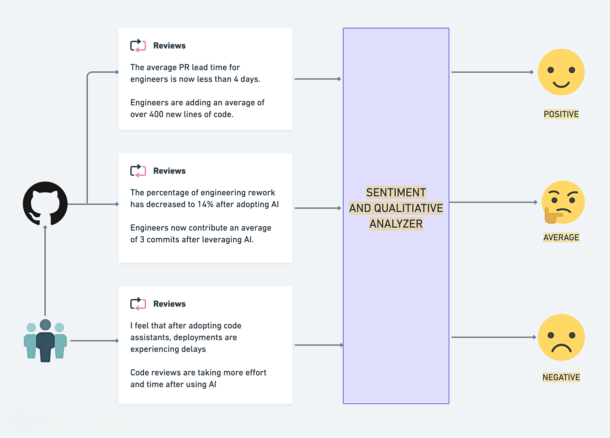
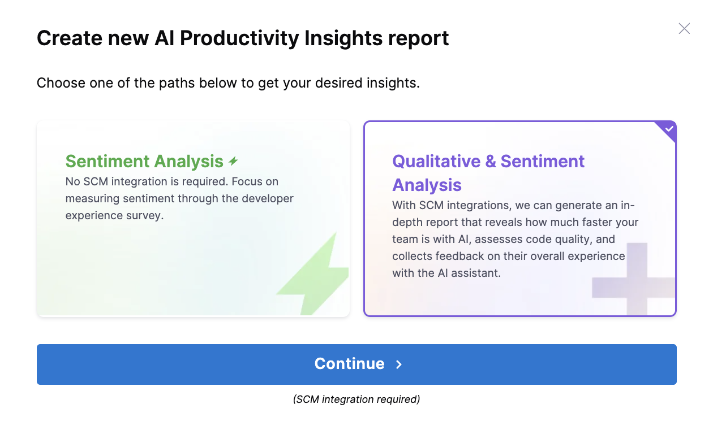
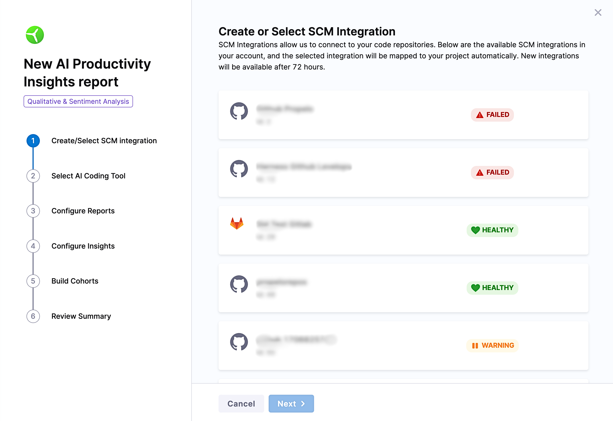
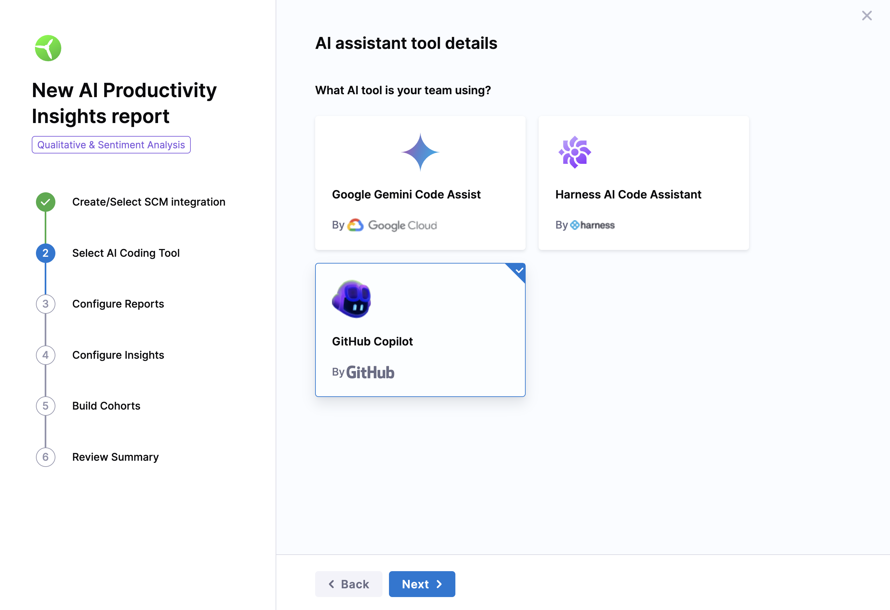
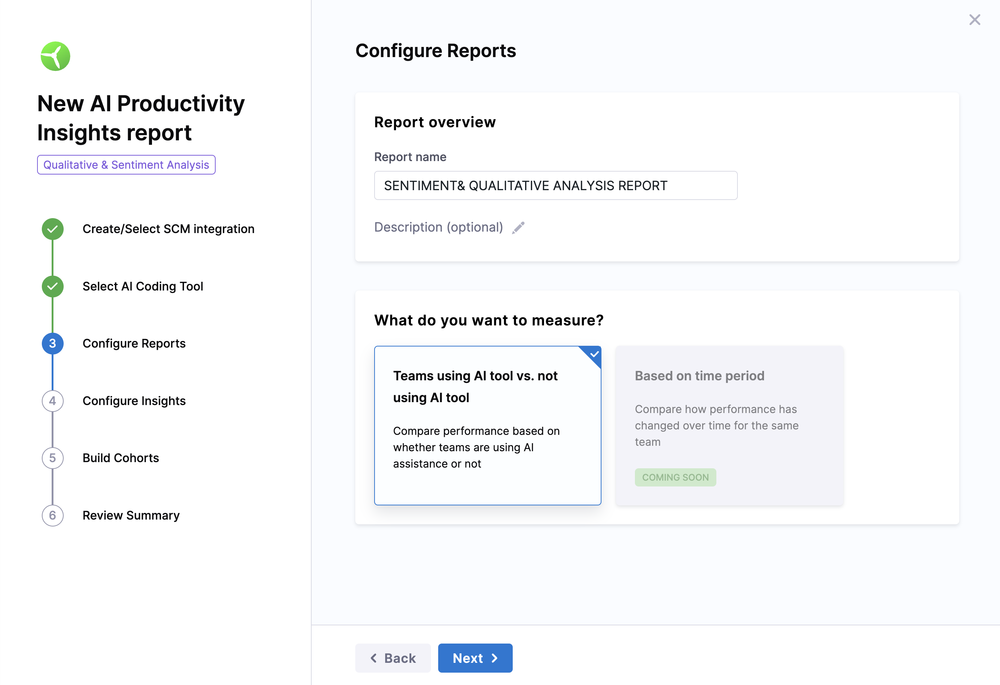
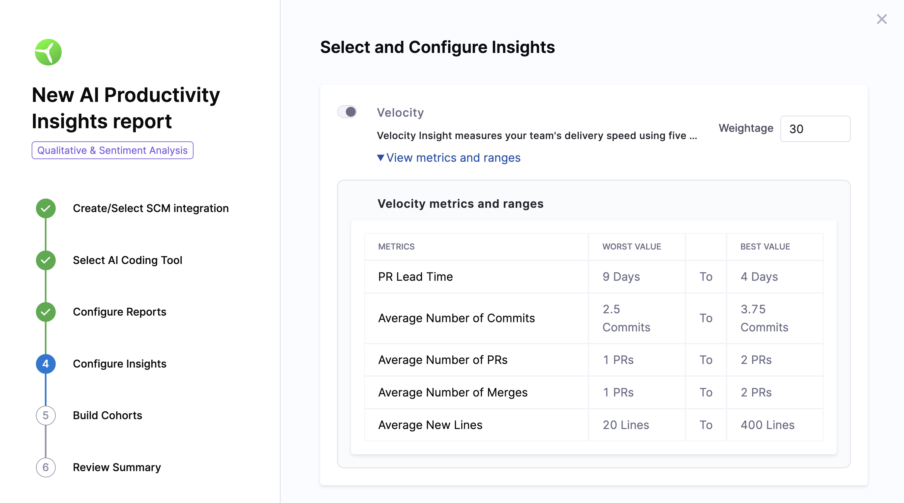
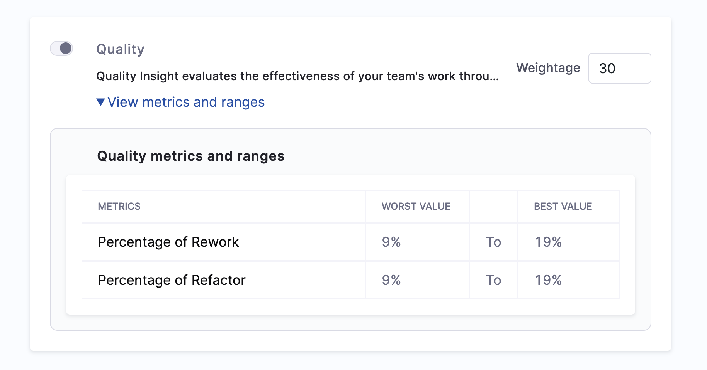
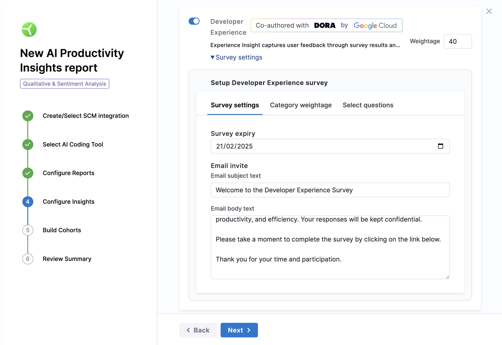
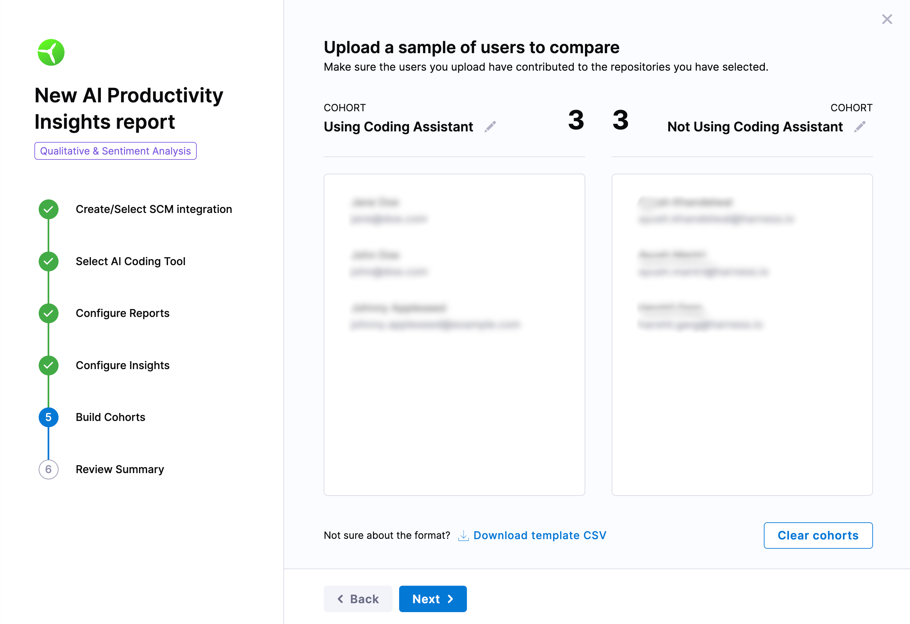
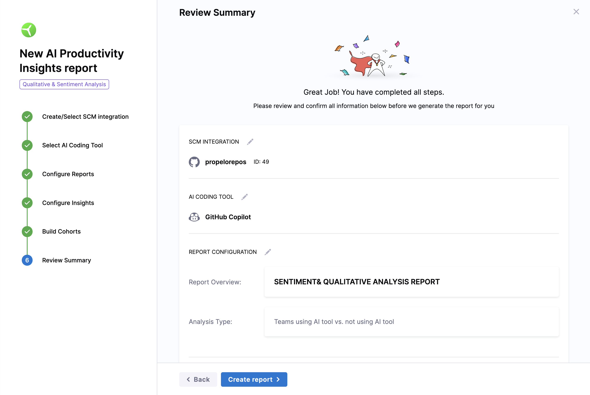

With SCM integrations, you can generate an in-depth report that reveals how much faster your team is with AI, assesses code quality, and collects feedback on their overall experience with the AI assistant.

This report provides both qualitative and sentiment analysis of your team's interactions with AI tools, helping you understand productivity and satisfaction improvements.

## When to use

This report is ideal for teams that want to:

* **Quantify AI’s impact:** Utilize SCM data to understand tangible improvements in metrics like delivery speed, code quality, and collaboration efficiency.
* **Compare AI adoption:** Analyze the performance differences between teams using AI tools and those relying on traditional workflows.
* **Understand developer experience:** Gather qualitative feedback and sentiment data to evaluate how AI tools enhance or hinder satisfaction and innovation.
* **Drive data-driven decisions:** Use measurable SCM-based factors like pull request metrics and commit history to pinpoint areas of success or improvement when adopting AI tools.

## Generate the report

* Go to the **AI Productivity Insights** section in the left menu of your Harness project.

* Select the type of report as **Qualitative & Sentiment Analysis** and click on **Continue**

### Step 1: Create or select SCM integrations

Select the **SCM integration** from the available list and click on **Next**.

### Step 2: Choose your AI Tool

Choose the AI coding tool that your team is using.

* Google Gemini Code Assist
* Harness AI Code Assistant
* GitHub Copilot

### Step 3: Configure the report settings

* Add a name for the report
* Define the objective as in what you want to measure out of this report
  * **Teams Using AI Tools vs. Teams Not Using AI:** Compare performance between teams that use AI tools and those that do not. This analysis helps identify the tangible benefits AI tools bring to the development process.
  * Note that the support for assessing how the performance of the same team changes over a specified time period, such as before and after implementing an AI tool is currently not available but will be added in the future.

### Step 4: Select and configure insights

You can configure the following insights to track team velocity and quality:

import Tabs from '@theme/Tabs';
import TabItem from '@theme/TabItem';

<Tabs>
   <TabItem value = "velocity" label = "Velocity" default>

Velocity measures the team's delivery speed by tracking key performance indicators such as PR Lead Time, Number of Commits, Number of PRs Created, and Number of PRs Merged.

* **PR lead time:** The time taken from code being committed to running successfully in production.
* **Number of commits:** The average number of code commits made per developer during a specific period.
* **Number of PRs created:** The average number of pull requests created by developers within a given time frame.
* **Number of PRs merged:** The average number of pull requests successfully merged across all developers within the given time frame.

#### Velocity metrics & ranges

| Metric             | Worst Value  | Best Value  |
|-------------------|--------------|-------------|
| PR Lead Time      | 9 days        | 4 days      |
| Average Commits   | 2.5 commits   | 3.75 commits |
| Average PRs Created | 1 PR         | 2 PRs       |
| Average PRs Merged | 1 PR         | 2 PRs       |
| Average New Lines | 20 lines      | 400 lines   |

</TabItem>

<TabItem value="quality" label="Quality">

Analyze code quality by measuring rework and refactor percentages.

* **Percentage of rework:** The amount of changes made to code that is less than 30 days old.
* **Percentage of refactor:** Refactor work represents changes to legacy code. Harness Software Engineering Insights considers code "legacy" 
if it has been in your codebase for over 30 days.

#### Quality metrics & ranges

| Metric              | Worst Value  | Best Value  |
|--------------------|--------------|-------------|
| Percentage of rework | 9%           | 19%         |
| Percentage of refactor | 9%          | 19%         |

</TabItem>

<TabItem value="dev-ex" label="Developer Experience">

Set up the survey to collect feedback based on selected categories.  

* **Survey Expiry:** Set a deadline (e.g., January 12, 2025) for participants to complete the survey.  
* **Customize the email header and body or keep it as is.**  

> **Email Invite Subject:**  
> *"Welcome to the Developer Experience Survey."*  
>  
> **Email Invite Body:**  
> *We are dedicated to providing you with the best possible development experience. Your feedback is extremely valuable to us. This survey focuses on innovation, satisfaction, productivity, and efficiency. Your responses are confidential and will guide improvements. Please take a moment to complete the survey. Thank you!*  

#### Select categories for analysis

Categories are various aspects of sentiment analysis such as Impact, Efficiency, Productivity etc. Each category has a set of default questions that will be sent out as part of the survey.

Configure categories to reflect your priorities. Assign a total weight of 100% across all categories. The assigned weight will be considered while calculating the category scores as well as the overall productivity boost.

| **Category**   | **Weightage** | **Purpose**                                             |
|---------------|--------------|---------------------------------------------------------|
| Efficiency    | e.g., 20%     | Measures the impact of AI on task streamlining.         |
| Innovation    | e.g., 20%     | Evaluates how AI fosters creativity and solutions.      |
| Productivity  | e.g., 20%     | Assesses overall work output with AI tools.             |
| Quality       | e.g., 20%     | Examines code and workflow quality improvements.        |
| Satisfaction  | e.g., 20%     | Measures developer happiness with AI tools.             |

For detailed instructions on setting up the survey, refer to the **Developer Experience Survey** guide.  

</TabItem>
</Tabs>

### Step 5: Add Participants and build cohorts

Group participants into the following categories:  

* **Using AI Tools:** Developers actively using AI tools like GitHub Copilot or Harness AI Code Assistant.
* **Not Using AI Tools:** Developers not using any AI assistance tools.

#### Upload cohort details

Use a CSV to upload participant information such as name and email. Use the provided template if you are unsure about formatting.
Note that email is optional and if provided the email will be used to send out the survey in the respective emails.

### Step 6: Review and confirm the configuration

Before proceeding, check the following:  

* Ensure the selected categories and questions are correct.  
* Participants can be distributed across groups without strict requirements.  

Click **Create Report** once ready.  

### Step 7: Send the survey

Distribute the survey using the following methods:  

* **Send Now:** Email the survey to participants immediately.  
* **Send Later:** Save the survey link for manual distribution at another time.  