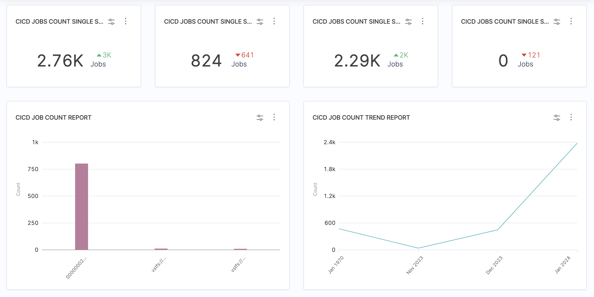
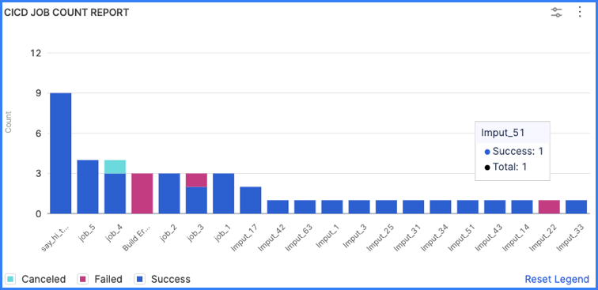

Use CI/CD job reports to analyze metrics and trends related to CI/CD job runs. This data helps you achieve a comprehensive understanding of how CI/CD practices have been adopted and utilized within your organization, including:

* **Growth analysis:** Discover the overall growth rate of CI/CD job counts, which indicates increasing adoption of automated software development practices.
* **Seasonal patterns:** Identify any cyclical or seasonal patterns in CI/CD job counts, which enables you to anticipate resource allocation and workload fluctuations.
* **Adoption rates:** Gain a deeper understanding of the adoption rate of CI/CD practices across different teams or departments, which helps identify areas of success and potential improvement.
* **Pipeline performance analysis:** By tracking job counts over time, you can analyze a pipeline's performance. Changes in the job count, such as an increase in queued jobs or a decrease in completed jobs, can provide insights into the pipeline's efficiency, resource utilization, or potential issues affecting its execution.

These widgets can be configured based on various CI/CD attributes, such as pipelines, projects, and statuses, depending on your CI/CD [integrations](/docs/software-engineering-insights/setup-sei/configure-integrations/sei-integrations-overview).

## What is a Pipeline?

**Pipelines** are used to automate and orchestrate the entire software delivery process. We usually have multiple stages in a pipeline where each stage can contain one or more steps. Stages are typically organized logically such as build, test, deploy, and can be customized to suit the specific needs of a project.

## What is a Job?

A **Job** in SEI is defined as a single run or execution of the pipeline which includes one or more stages such as building artifacts, executing test cases, deploy.

## Job or Pipeline Count reports

Use the CI/CD Job Count reports to understand how often your CI/CD jobs run and whether they succeed or fail. You can analyze CI/CD job counts over a specific period, and shed light on the trends and patterns observed during that time.

* [CICD Job Count report](/docs/software-engineering-insights/analytics-and-reporting/efficiency/cicd-insights#cicd-job-count-report)
* [CICD Pipeline Jobs Count report](/docs/software-engineering-insights/analytics-and-reporting/efficiency/cicd-insights#cicd-pipeline-jobs-count-report)
* [CICD Job Count Trend report](/docs/software-engineering-insights/analytics-and-reporting/efficiency/cicd-insights#cicd-job-count-trend-report)
* [CICD Jobs Count Single Stat](/docs/software-engineering-insights/analytics-and-reporting/efficiency/cicd-insights#cicd-jobs-count-single-stat)

### CICD Job Count Report

This provides information on the total number of jobs executed. The job count information is represented as a bar chart visualizing the number of CI/CD jobs run in a given time frame. The widgets supports drill-down for in-depth analysis.

### CICD Pipeline Jobs Count report

This report provides information on the **Total Number of Jobs** executed. The data is represented as a heatmap visualizing the number of CI/CD jobs run in a given time frame. The support for drill down functionality is not available for this report.

:::info
Note: For both the **Job Count report** and **Pipeline Jobs Count report** the data captured is the same but the representation of the data is different. Also, the Pipeline Jobs Count report does not support the drilldown functionality.
:::

### CICD Job Count Trend Report

This report displays the Daily, weekly, and monthly trends for CI/CD job runs. The data representation is in the Line chart format and does not support drill-down.

### CICD Jobs Count Single Stat

This widget displays the **Job Count** as a **numeric value** but does not support drill-down. The data is represented as a **Single stat**.

When you add a CI/CD Job Count report to an Insight, the **Job End Date** filter is set to a relative time frame by default. The widget is ready to use with the default configuration or you can modify it. For some useful configuration options, go to [CI/CD Reports Use Cases](#configure-cicd-job-reports).

## Job or Pipeline Duration reports

Job duration reports can help you optimize build times by analyzing the total time it takes for jobs to run.

### CI/CD Job Duration Report

This report provides an overview of elapsed time for job runs. It displays information regarding the duration of job execution, including maximum, median, and minimum values. The data is represented as Bar charts and supports drill-down for detailed analysis.

### CI/CD Job Duration Single Stat

This report displays a single job duration stat. It displays the median or average job execution duration as a numeric value but does not support drill-down.

### CI/CD Job Duration Trend Report

This report provides information regarding the trend of job execution duration over time (Daily, weekly, and monthly trends in job duration) including minimum, median, and maximum values. The data is represented as a Line graph.

## Job or Pipeline Config Change reports

Use the CI/CD job configuration change reports to understand how often job configuration updates happen, and which users maintain or make the most job configuration changes.

* CICD Job Config Change Count report
* CICD Job Config Change Single Stat
* CICD Job Config Change Trend report

### CICD Job Config Change Count Report

This report provides an overview of job config changes. The data is represented as a Bar chart and is only supported for Jenkins instances. This report supports drilldown view for detailed analysis.

### CICD Job Config Change Single Stat

This widget displays a single stat related to job config changes. The report does not support drilldown and it is only supported for jenkins instances.

### CICD Job Config Change Trend Report

This report displays the trend of job configuration changes over time (Daily, weekly, and monthly trends for job config changes). It does not support drill down functionality. The data is represented as a Line chart and is only supported for Jenkins instances.

:::info

Pipeline job reports are functionally identical to [job count reports](#job-count-reports) and [job duration reports](#job-duration-reports). However, pipeline job reports present heatmap visualizations by default, whereas job count and duration reports present bar charts.

<!--  -->

<DocImage path={require('../static/velocity-cicd-job-count-comparison.png')} />

:::

## SCM to CI/CD jobs reports

For information about SCM to CI/CD jobs reports, such as the **SCM Commit to CI/CD Job Lead Time Trend Report**, go to [SCM reports](/docs/software-engineering-insights/sei-metrics-and-reports/velocity-metrics-reports/scm-reports).

## Configure CI/CD job reports

These are some popular or useful ways to configure your CI/CD job report widgets.

:::tip Single stat widgets

Single stats are often used as key visual elements on Insights. For example, the **CI/CD Job Count Single Stat** widget provides a concise and easily understood representation of a CI/CD pipeline's job count, which enables stakeholders and team members to quickly assess the pipeline's status and progress.

:::

### Report all jobs in Insight time

_Insight time_ is the time range selected by the user when viewing Insights. If you want a more interactive widget that reports all jobs run in the user-selected Insight time, set **Job End Date** to **Insight time**.

If you want the widget to report the status (success or failure) of all jobs in Insight time, configure the widget as follows:

* Job End Date: `Insight time`
* Metrics: Job Status
* Aggregations: Job Name

<figure>

<figcaption>A CI/CD Job Count Report set to all jobs in Insight time.</figcaption>
</figure>

### Filter by failed jobs

If you want the widget to highlight failed jobs, add a **Job Status** filter and set it to **Failed**. You can use this configuration in combination with Insight time, such as:

* Job End Date: `Insight time`
* Metrics: Job Status
* Aggregations: Job Name
* Filter, Job Status: Failed

<figure>

<figcaption>A CI/CD Job Count Report showing only failed jobs.</figcaption>
</figure>
