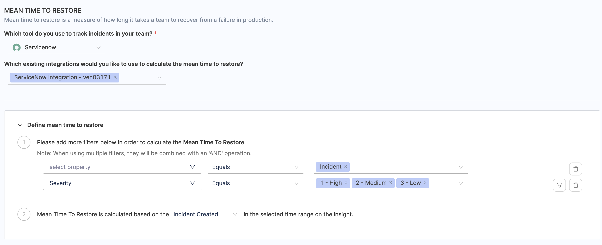

import Tabs from '@theme/Tabs';
import TabItem from '@theme/TabItem';

The DORA Mean Time To Restore metric indicates how long it takes an organization to recover from a failure in production. MTTR is a good metric for assessing the speed of your recovery process across several areas of technology.

You can configure the **DORA profile (DORA type Workflow Profile)** to measure your incident recovery time using the MTTR report. This report measures the duration between when an incident was created to when the service was restored. In other words, it tracks the time from when the incident was created to the time the incident was closed.


## Define the DORA Profile for measuring incident recovery time

To use the DORA Mean Time to Restore (MTTR) report and measure incident recovery time, you need to configure the DORA profile definition for MTTR with your incident management platform integration.

SEI currently supports the following incident management platforms for MTTR measurement:

* [ServiceNow](/docs/software-engineering-insights/sei-integrations/beta-integrations/servicenow/sei-servicenow)
* [PagerDuty](/docs/software-engineering-insights/sei-integrations/beta-integrations/sei-integration-pagerduty)

<Tabs>
<TabItem value="Pagerduty">

<DocVideo src="https://www.youtube.com/embed/cKZF4SFxgIE?si=9U7SuECmWTVxxTqz" />

<br /> <br /> 


To use the DORA MTTR widget for measuring incident recovery time in Pagerduty follow the steps below:

1. Under the **DORA profile** definition, select the **Mean Time to Restore** section.
2. Choose **PagerDuty** as the tool for measuring MTTR.
3. Select the associated **Pagerduty integration**. To learn about how to configure the integration, go to [PagerDuty integration](/docs/software-engineering-insights/sei-integrations/beta-integrations/sei-integration-pagerduty).
4. Define incident criteria for calculating MTTR by selecting various filters that define incidents you want to track or measure for MTTR calculations.
5. The DORA profile definition supports several PagerDuty fields including **PD Service**, **Incident Priority**, **Incident Urgency**, **Alert Severity**, **Status** and **User ID**.
6. This definition can also be configured using additional time-based filters such as `created at`, `updated at`, and `resolved at` in order to calculate MTTR based on your preferences.

Once you have configured the DORA profile to measure incident recovery time using Pagerduty you can add the MTTR widget to the Insight.

</TabItem>
<TabItem value="ServiceNow">

To use the DORA MTTR widget for measuring incident recovery time in the ServiceNow platform follow the steps below:

1. Under the **DORA profile** definition, select the **Mean Time to Restore** section.
2. Choose **ServiceNow** as the tool for measuring MTTR.
3. Select the associated **ServiceNow integration**. To learn about how to configure the integration, go to [ServiceNow integration](/docs/software-engineering-insights/sei-integrations/beta-integrations/servicenow/sei-servicenow).
4. Define incident criteria for calculating MTTR by selecting various filters that define incidents you want to track or measure for MTTR calculations.
5. The DORA profile definition supports all the ServiceNow fields including **Priority**, **Urgency**, **Status** etc to be configured as filters. When configuring the filters, the custom fields available dynamically changes based on the selected ticket type.
6. This definition can also be configured using additional time-based filters such as **Incident Created**, **Incident Resolved**, and **Incident Updated** in order to calculate MTTR based on your preferences.

Once you have configured the DORA profile to measure incident recovery time using ServiceNow you can add the MTTR widget to the Insight.



</TabItem>
</Tabs>

## Calculation Example using Pagerduty

The DORA MTTR is calculated by summing up the difference between the time it took to resolve an incident and the time the incident was created for all incidents that occurred within a specific time period. This total sum is then divided by the total number of incidents that occurred during that time period.

Consider the following DORA MTTR configuration:

* SEI integration: PagerDuty
* Filter for Mean Time to Restore: User ID Equals PD-DEMO
* Calculation parameter: Incident Resolved in Insight time range
* Time Range selected on the dashboard: First week of January 2024 i.e. 1st Jan 2024 to 7th Jan 2024

With this configuration, the DORA MTTR widget shows the total number of incidents that were resolved divided by the total number of incidents that occurred in the last one month.

DORA MTTR performance is ranked on the following grading scale:

* **Elite:** MTTR score less than an Hour
* **High:** MTTR score less than a Day
* **Medium:** MTTR score less than a Week
* **Low:** MTTR score more than a Week

| Incidents | Incident Created | Incident Resolved | Time duration |
| - | - | - | - |
| Incident 1 | 1st Jan 2024 at 12:00:00 | 1st Jan 2024 at 01:00:00 | 60 mins |
| Incident 2 | 2nd Jan 2024 at 04:30:00 | 2nd Jan 2024 at 05:00:00 | 30 mins |
| Incident 3 | 5th Jan 2024 at 06:00:00 | 5th Jan 2024 at 09:00:00 | 3 hours (180 mins) |

For the above example, for the week of 1st Jan 2024 to 7th Jan 2024, the value for the MTTR metric is calculated as below.

```bash
DORA Mean Time to Restore = (60 + 30 + 180) / 3 = 90 mins or 1.5 hours (High)
```