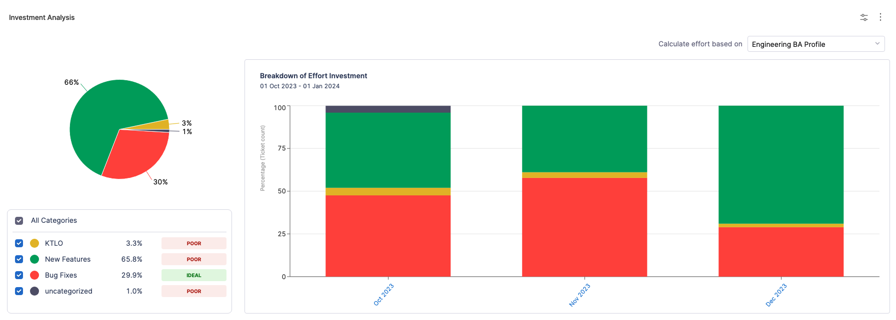
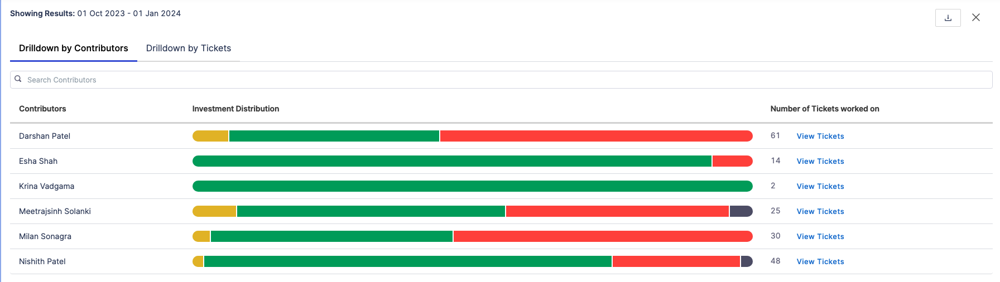
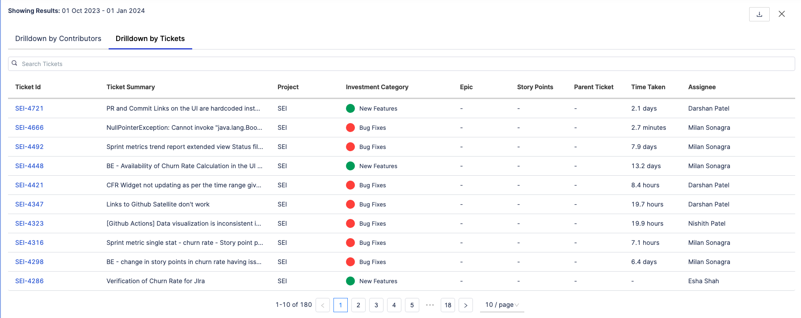

The Business Alignment Report helps you visualize where your teams are investing the majority of their effort and assist them in prioritizing their time effectively. This report displays your investment efforts across the categories outlined in the corresponding Business Alignment Profile.

The Business Alignment profile feature is currently in **BETA** and is behind the entitlement `<SEI_NEW_BA_REPORT>.`
Contact [Harness Support](mailto:support@harness.io) to enable this feature.

<DocVideo src="https://www.youtube.com/embed/f3fLqermTGo?si=qFF0PVof8Q36kkr3" />

 

The report shows the metric value for each category as a percentage value along with an assigned target label (**Ideal**, **Poor**, **Acceptable**) on the **Pie Chart**.

The **Trend Chart** displays the detailed breakdown of the score in the **Stacked Bar Chart** format. It displays the trend of effort investment over time, based on predefined category allocations in the associated [Business Alignment profile](/docs/software-engineering-insights/early-access/profiles/sei-business-alignment-profile).

The Bar Chart breaks down the metric value into time intervals as configured in the widget settings.

## Calculation Parameters

* **Effort Allocation:** This is the calculated percentage of effort allocated to a specific contributor and investment category within the chosen effort unit. It indicates how the effort is distributed.
* Users may choose the desired effort unit at the widget level, such as **Ticket Count**, **Story Points**, or **Ticket Time Spent**. These units represent different ways of quantifying workload:
  * **Ticket count:** Represents the total number of tickets worked on.
  * **Story points:** Refers to the sum of all assigned story points.
  * **Ticket time spent:** Indicates the amount of time spent on tickets while they remain in the `In Progress` status category.

This report supports two types of drill-down views:

1. Drill down by Contributors
2. Drill down by Tickets

## Drill down by Contributors

By selecting a category from the **Stacked Bar Chart**, users can access the drill-down report displaying data on the total completed effort, including the distribution of effort among individual contributors across all categories or just the selected one.

## Drill down by Tickets

It also displays the drill down for tickets. When viewing the selected category on the **Bar Chart**, the widget will show data for all the relevant tickets included in this category. Alternatively, when choosing an interval from the bar chart, the widget will present data for items across all categories during the specified period.

The data is represented in tabular format. Additionally, both drill-down options offer search functionality, enabling users to look up specific contributors or tickets directly.

:::info
Please note that the **Drilldown by Contributor** option is available only if the widget utilizes **FTE (By Engineer)** for calculating effort.
:::

## Calculation Example

In this example, we have a User X who is part of a team responsible for completing tasks in two different categories: Category A and Category B. These categories represent different types of work or projects within the team's scope.

* **Category A:** Tasks encompassing significant effort, potentially critical features, or complex technical issues. These tasks demand substantial resources and attention from the team.
* **Category B:** Tasks requiring comparatively lower effort, such as routine maintenance or minor enhancements. They may have a lower priority compared to Category A tasks.

### Absolute Effort Calculation

In this scenario, we're analyzing the contributions of 3 contributors within two categories, Category A and Category B, based on the effort metric of Ticket Counts. The Ticket Counts represent the number of tasks assigned to each developer.

**For Category A:**

* Total effort by User X: 3 (Ticket Counts)
* Total effort by User Y: 2 (Ticket Counts)
* Total effort by User Z: 1 (Ticket Counts)

Total effort for Category A = 3 + 2 + 1 = 6

The total number of tasks assigned to all team members in Category A provides an understanding of the workload distribution.

**For Category B:**

* Total effort by User X: 2 (Ticket Counts)
* Total effort by User Y: 2 (Ticket Counts)
* Total effort by User Z: 1 (Ticket Counts)

Total effort for Category B = 2+2+1 = 5

This calculation offers insights into the distribution of tasks in Category B among team members.

Effort metric for Category A = Total effort for Category A/Total effort across all categories * 100

6/6+5 * 100 = 54.55%

Effort metric for Category B = Total effort for Category B/Total effort across all categories * 100

5/6+5 * 100 = 45.45\%

### FTE Effort Calculation

FTE effort allows for a standardized assessment of individual contributions by considering the proportion of each developer's workload.

**For Category A:**

* Total FTE effort by User X: 0.6
* Total FTE effort by User Y: 0.5
* Total FTE effort by User Z: 0.5

Total FTE Effort for Category A = 0.6 + 0.5 + 0.5 = 1.6

**For Category B:**

* Total FTE effort by User X: 0.4
* Total FTE effort by User Y: 0.5
* Total FTE effort by User Z: 0.5

Total FTE Effort for Category B = 0.4 + 0.5 + 0.5 = 1.4

Here we convert the **Absolute Effort (Ticket Counts)** into FTE effort by considering the proportion of each developer's workload. This helps in understanding the relative contribution of each developer in terms of full-time work.

### Calculation of User X's Contribution

User contribution represents the percentage of tasks handled by each contributor within specific categories, aiding in assessing their involvement and impact.

**For Category A:**

* User X's contribution = Total effort by User X in Category A / Total effort by User X * 100
* User X's total effort in Category A = 3 (Ticket Counts)

User X's contribution to Category A = 3/5 * 100 = 60%

**For Category B:**

* User X's contribution = Total effort by User X in Category B / Total effort by User X * 100
* User X's total effort in Category B = 2 (Ticket Counts)

User X's contribution to Category B = 2/5 * 100 = 40%

To summarize the effort calculation for User X:

* **User X's contribution to Category A: 60%**
* **User X's contribution to Category B: 40%**

User X's contribution percentage is determined by dividing their total effort (Ticket Counts) within each category by the total effort by User X across all categories. This percentage showcases User X's share of tasks within the total workload of each category.

These insights help in understanding User X's workload distribution and their impact on different categories based on the chosen effort metric (Ticket Counts).