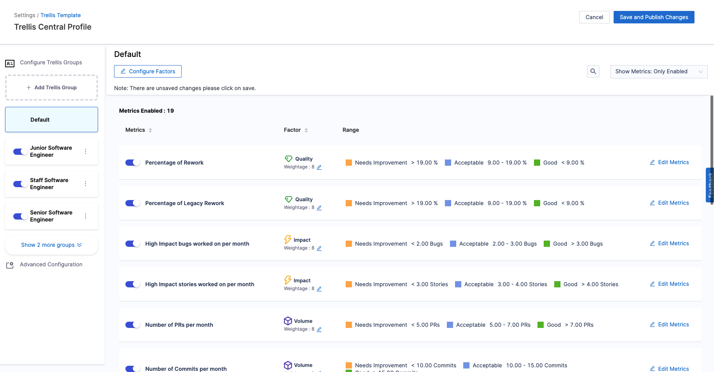
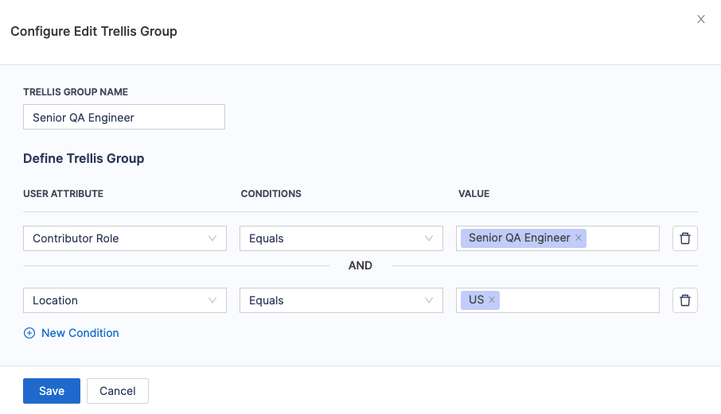

:::info
The Trellis Factors feature is currently in BETA and is behind the Feature Flag SEI_SHOW_TRELIS_NEW_INTERVAL and SEI_TRELLIS_BY_JOB_ROLES. Contact [Harness Support](mailto:support@harness.io) to enable this feature.
:::

Trellis Factors are used to define the threshold for Trellis Metrics calculations in Harness SEI. 
The Trellis Scores feature provides a proprietary scoring mechanism to evaluate and understand your engineering team's productivity based on factors such as code quality, code volume, speed, impact, proficiency, and collaboration.

In the Trellis Factors settings, you can adjust the weight assigned to each factor when calculating the overall Trellis Scores.

:::info CRITERIA TO CONFIGURE THE TRELLIS FACTORS

The following permissions are needed to customize the Trellis Factors at the Account Level:

1. To perform **Admin Level** operations on the **Trellis Factors at the Account Level**, you need to have **Edit & Manage** access to **SEI Configuration Settings**
2. To configure **Trellis Factors at the Collection Level** i.e. **Collection** specific Trellis settings, one must have **Collection Edit/Create** access to the SEI project
3. At least one **Contributor** with an associated **Email ID** must be present in the newly created account. For more information, go to [Contributors](/docs/software-engineering-insights/sei-projects-and-collections/manage-contributors).

:::

## Key concepts

### Trellis Factors at Account Level

**Trellis Factors at the Account Level** serve as the primary configuration for measuring Trellis Scores in your Harness account. It acts as the default template for all collections defined across all projects within your account. It provides a centralized location for defining shared standards and thresholds and allows the account administrators to set baseline expectations for Trellis Scores. 

This ensures consistency for measuring Trellis Scores across the organization while still allowing for collection-specific customizations

### Trellis Factors at Collection Level

Trellis Factors at Collection Level are customized versions of the account-level factors, defined for specific collections. These collection-level factors:

* Inherit the initial configuration from the Account Level Trellis Factors
* Can be adjusted to reflect the unique needs and goals of individual teams or projects
* Allow for more granular control over Trellis Score calculations within a particular collection
* Provide flexibility without compromising the overall organizational standards

### Trellis Groups

**Trellis Groups** represent categories based on **Custom Attributes** within the Trellis Factor settings. Trellis Groups allow you to customize the Trellis calculation settings and thresholds for specific attributes. This provides a more granular and personalized way to calculate Trellis Scores.

With Trellis Groups, you can fine-tune how factors like Code Quality, Volume, Speed, Impact, Proficiency, and Collaboration are evaluated. The customizations are based on the responsibilities and expectations associated with different custom attributes. For example, you could create separate calculation rules for different engineering roles.

The **Default Group** covers all items that don't belong to any other defined Trellis Group. You can also customize the **Factors and Weights** for the Default Group.

## Configure the Trellis Factors

To configure the Trellis Factors, please follow the steps below:

### Step 1: Enable Trellis Score Calculation

:::info
You can skip this step if you already have Trellis Score Calculation enabled in your Collection definition
:::

Go to the Collection where you want to calculate Trellis Score and enable the Trellis Score option. Note that every newly created Collection is automatically associated with the Account Level Trellis Factors by default.

### Step 2: Customize the Trellis Factors at the Account Level

* In your Harness Account, select the **Trellis Factors** under Profiles.
* You will land on the **Trellis Factors** settings. This is where you can add, edit, delete Trellis Groups and enable/disable the Factors impacting the Trellis Calculations.

### Step 3: Add Trellis Groups

* Click on **Add Trellis Groups** to create a unique group and define matching criteria for identifying users based on custom contributor attributes like **Role** and **Location**.
* You can configure multiple conditions to define the matching criteria for the Trellis Groups.

:::info
To prevent contributors from being included in multiple Trellis groups, ensure that both the Trellis Group name and matching criteria are unique for each group.
:::

### Step 4: Add Filters

**Filters** define the conditions that determine which contributors are included in each Trellis Group.

To set up these Filters:

* Define specific conditions by selecting attributes from the **USER ATTRIBUTES** dropdown, choosing a condition from the **CONDITIONS** dropdown, and specifying the **VALUE** for that condition.
* You can add multiple conditions to refine the definition of each Trellis Group more accurately.
* Keep in mind that filters must be unique across Trellis Groups. Conflicting or identical conditions across groups are not allowed, as each contributor should ideally belong to only one group.

### Step 5: Define the Factors and Weights

**Factors** are the items (Quality, Impact, Volume, Speed, Proficiency, and Leadership and Collaboration) that contribute to your Trellis Score.

* Enable and disable individual factors to include or exclude them from your Trellis Score calculation.
* Adjust the weight of each factor. Assign a low weight (1-5) to make less important factors have a lower impact on your score. Assign a higher weight (5-10) to make more important factors have a higher impact on your score.
* Weights are relative. For example, if all factors are weighted 5, then all factors are still equal.

In the sub sections for the individual Factors, you can:

* Adjust the metrics that are included in each factor's calculation.
* Define target performance ranges for each metric. These ranges will be considered for the rating calculation.

### Step 6: Save the settings

Once you've completed configuring the settings for the Trellis Factors, click on Save and Publish Changes to save the default settings based on which Trellis Scores will be calculated.

## Configure the Trellis Factors for a specific Collection

When a new Collection is created, it is automatically associated with the Trellis Factors at the Account Level by default. However, you can customize the Trellis factors for a specific Collection:

* In your **Harnesss Account**, select your **Project**.
* Select **Collections** in the left-navigation menu.
* Select the **Collection** where you want to customize the **Trellis Factors** contributing to the **Trellis Metric** calculations.
* Enable the **Trellis Contributor Scoring** option (if disabled).
* Customize the **Factors** or **Trellis Groups** as needed. 
* Save the **Collection settings**.

This creates a new configuration for Trellis Factors at the Collection level that is derived from the existing Trellis Factors at the Account level.

In the Collection-level settings for Trellis, any Trellis Groups added by Admins at the Account scope are automatically included but remain disabled by default. This allows the Collection Admin to select which Groups are relevant for calculating Scores in their Collection.

If Trellis Groups are removed from the Account-level Trellis Factors by the SEI Admin, they will also be automatically removed from all Collection-level settings.

Changes made by the Collection Admin to Trellis Factors at the Collection level can be applied across all Collections they have access to, including child Collections.

:::info
Users with the **SEI Collection Admin** role cannot create new Trellis Groups or make changes directly to the **Trellis Factors**. They can only customize the Trellis Score Calculation settings for their specific Collections.
:::
