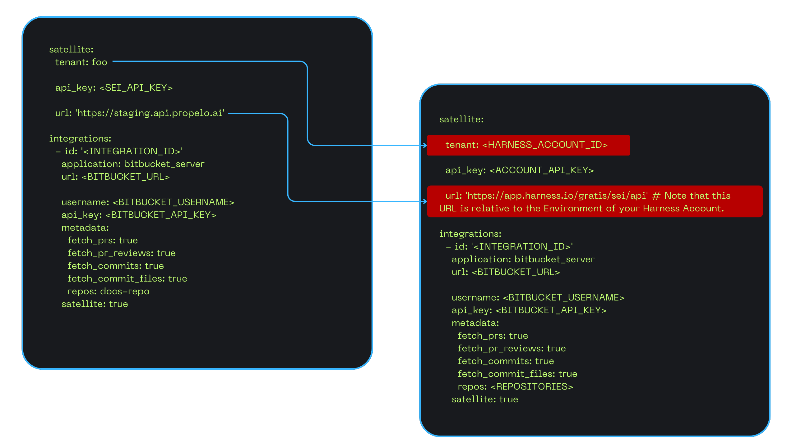
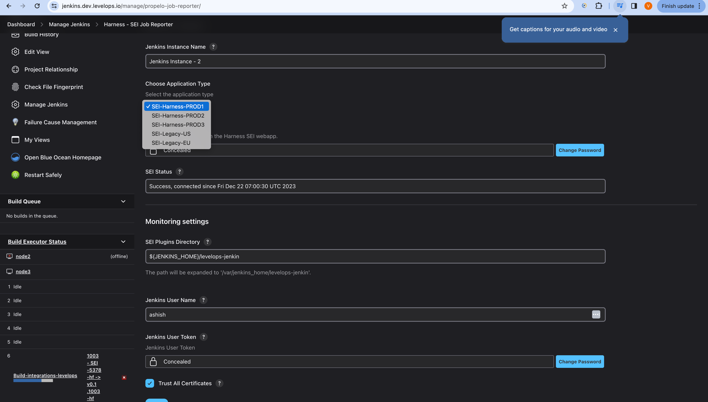
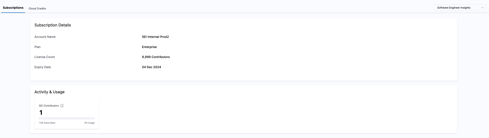

In 2023, Harness acquired Propelo, and as part of our ongoing efforts to refine our strategy, we are migrating existing Propelo platform users to Harness Software Engineering Insights (SEI). This move will enable us to better meet customer needs as the product continues to mature and advance.

<!-- ## Watch It In Action

Watch the video below to understand the step-by-step process involved in the migration and how you can quickly get started using Harness SEI after the migration is completed.

<MIGRATION-STEPS-DEMO-VIDEO>

-->

## Why you should migrate to Harness SEI

Moving forward most important updates and improvements will be added to the SEI module in the Harness platform and we are planning for the deprecation of the Propelo platform. Importantly, nothing will change in terms of product functionality in the Harness platform or how you access the product itself. 

The documentation will now be hosted at [Harness Developer Hub](/docs/software-engineering-insights/)  

Product support will not change either.

## Important dates

## What’s new

We're excited to introduce several new features and improvements to the SEI module in the Harness platform. These updates will help you use SEI more effectively and gain better insights into your software delivery processes.

### Business Alignment

Business Alignment metrics will help you understand where engineers are allocating their time through effort investment metrics. A business Alignment profile allows you to define a more granular level definition to measure effort investment metrics using dynamic filter sets and conditions, multiple categories and associated allocation goals.

The new profile also introduces a Business Alignment report, which consolidates all existing effort investment reports within the Propelo application into a single, comprehensive view. This report supports advanced features such as search, multiple drill-down views, and more.

For detailed information, refer to the Business Alignment documentation.

### Simplified Navigation

We’re excited to share a new simplified navigation experience for SEI on the Harness platform.

Making things simpler,  this update will allow you to focus on your intent and goals. At the same time, manage SEI resources more effectively as you navigate through the module.

Watch the feature demo to learn more.

<DocVideo src="https://www.youtube.com/embed/cE6hHK3Gieg?si=7KO1xZ_9PoT4o26Q" /> 

### Improved RBAC capabilities

The Role-Based Access Control (RBAC) system in Harness SEI has been improved to give you more granular control over access to SEI resources, ensuring that users have the appropriate permissions based on their roles.

Harness RBAC includes Roles and Permissions that allow you to regulate access to SEI module resources within your Harness account. The Harness platform operates on a three-level hierarchical structure: Account, Organization (Org), and Project. An Account contains Organizations and Projects, and an Organization contains Projects.

SEI supports RBAC at both the Account and Project levels.

The three default roles available for the SEI module on the Harness platform are:

#### SEI Admin​

This role has the highest level of access and is responsible for administrative functions within the SEI module. It exists at the Account level and grants write permissions to all SEI resources, such as Configuration Settings, Insights, and Collections. 

However, this access level is only granted when the role is associated with a resource group that includes permissions for all SEI resources.

#### SEI Collection Admin​

This role allows users to manage and view collections but does not provide access to administrative functions.

It operates at both the Project and Account levels, enabling management of collections within specific projects or across all projects, depending on the user’s role and resource group bindings.

#### SEI Viewer​

This role provides read-only access and is designed for users who need to view Collections or Insights without requiring administrative or management capabilities. Users with this role can view insights and Collections within projects.

Users can be granted these roles individually or as part of user groups.

To learn more, go to [Access Control in Harness SEI](/docs/software-engineering-insights/access-control/sei-roles-and-permissions)

The users from the Propelo platform will be automatically associated with the roles and resource groups based on their level of access. Refer to the below table to learn more about this.

<table>
  <thead>
    <tr>
      <th width="300px">Role in Propelo</th>
      <th width="300px">Role in Harness</th>
      <th width="300px">Scope</th>
      <th width="300px">Resource Group</th>

    </tr>
  </thead>
  <tbody>
    <tr>
      <td width="300px">ADMIN</td>
      <td width="300px">SEI ADMIN</td>
      <td width="300px">Account</td>
      <td width="300px">All Resources Including Child Scopes</td>

    </tr>
    <tr>
      <td width="300px">ORG_ADMIN_USER</td>
      <td width="300px">SEI COLLECTION ADMIN</td>
      <td width="300px">Project</td>
      <td width="300px">One or more Resource groups each containing a specific collection and all insights in the project.</td>

    </tr>

    <tr>
      <td width="300px">PUBLIC_DASHBOARD</td>
      <td width="300px">SEI VIEWER</td>
      <td width="300px">Project</td>
      <td width="300px">One or more Resource groups each containing a specific collection and all insights in the project.</td>

    </tr>

    <tr>
      <td width="300px">LIMITED_USER</td>
      <td width="300px">SEI VIEWER</td>
      <td width="300px">Account</td>
      <td width="300px">All Resources Including Child Scopes</td>

    </tr>

    <tr>
      <td width="300px">RESTRICTED_USER</td>
      <td width="300px">SEI VIEWER</td>
      <td width="300px">Account</td>
      <td width="300px">All Resources Including Child Scopes</td>

    </tr>

    <tr>
      <td width="300px">ASSIGNED_ISSUES_USER</td>
      <td width="300px">SEI VIEWER</td>
      <td width="300px">Account</td>
      <td width="300px">All Resources Including Child Scopes</td>

    </tr>

    <tr>
      <td width="300px">AUDITOR</td>
      <td width="300px">SEI VIEWER</td>
      <td width="300px">Account</td>
      <td width="300px">All Resources Including Child Scopes</td>

    </tr>
  </tbody>
</table>

## API Changes

The Base URL for all SEI services is updated based on the specific production environment. 

* **Base URL (PROD2):** `https://app.harness.io/gratis/sei/api/`
* **Base URL (PROD1):** `https://app.harness.io/prod1/sei/api/`   

For steps on using these APIs, go to [Harness SEI API Guide](/docs/software-engineering-insights/sei-technical-reference/sei-api-reference/sei-api-guide).

## Deprecated Features

The following features are currently not supported in the SEI module of Harness: 

* Issues
* Reports
* Templates
* SLA
* Triage
* Deeplinks​⁠ 
* Assessments​⁠ 
* Dashboard-level permissions​⁠ (This includes the option for configuring access control when creating new Insights)
* Private dashboards at the Admin scope

The following Harness platform features are currently not supported in the SEI module of Harness:

* Delegates (Alternative: Ingestion Satellites)
* Connectors (Alternative: Integrations)

## Migration methodology

Users can be migrated to Harness SEI using the following phases, which are expanded upon the sections below:

* [Preparation phase](#preparation-phase)
* [Testing phase](#testing-phase)
* [Migration phase](#migration-phase)

### Preparation phase

If you’ve decided to migrate, it’s crucial to plan and complete the necessary prerequisites to ensure a smooth transition. Start by socializing the migration details with stakeholders and teams who will be impacted. This will help minimize disruption to their work and ensure that users are well-prepared.

To get started, familiarize yourself with the Harness platform and its capabilities. Below is a list of resources to help you prepare:

* [Harness SEI Documentation](/docs/software-engineering-insights/)
* [Harness SEI FAQs and Knowledge Base](/kb/software-engineering-insights/)
* [Harness SEI Release Notes](/release-notes/software-engineering-insights)
* [Harness Blogs](https://www.harness.io/blog)
* [Harness API Docs](https://apidocs.harness.io/)
* [Harness YouTube](https://www.youtube.com/@Harnessio)

### Migration phase

To begin the migration process, the approval of the user is needed by the Support Executive.  Upon approval, a dedicated customer success account will be created to manage and test the migration activities.

#### Existing Harness Platform User

If you are an existing Harness platform user, your Propelo account will be mapped to your existing Harness account during the migration. The SEI license will be provisioned for your Harness account in addition to any existing module licenses.
If you were using SSO-based authentication to access the Propelo platform, you would need to set up SSO for your Harness account. Please note that SSO configuration in the Harness platform is consistently applied across all modules.

If you previously used both username/password and SSO for authentication, you’ll need to choose one method. The Harness platform no longer supports using both.

#### New to the Harness Platform

If you are new to the Harness platform, a new Harness account will be created with the SEI license provisioned. All your data, including secrets, will be migrated to the newly created Harness account.

As part of the migration, all secrets and resources—such as Insights, Collection settings, Integrations, Propels, and Contributor records—will be automatically migrated to the Harness SEI module.

:::info
Note that all actions will be disabled on the Propelo platform during the migration process.
:::

### Testing phase

Once the migration is completed, you’ll automatically receive the user invites to access the SEI module in the Harness platform. The next step is to verify that all data has been migrated correctly, including monitoring integration activity (health), insights, contributor records, and more.

The integration status will remain Unknown until the Harness Support team triggers the ingestion process. The Harness Support team in the mean time will be validating the existing data related to reports and account configuration and once you provide the approval the ingestion will be triggered for all the integrations.

If you notice any inconsistencies in the migrated data, please create a support ticket immediately. This will allow the Harness team to address the issue promptly.

:::info
Note that all secrets associated with your existing Propelo account will be securely transferred from Propelo's Google KMS infrastructure to Harness's Google KMS infrastructure.
:::

## Manual steps to be performed

### SSO Configuration

Harness supports multiple identity providers (IdPs) for user authentication using SAML. You can configure a mix of various SAML providers and enable or disable them for user authentication.

Harness supports Single Sign-On (SSO) with SAML, LDAP (including Active Directory and OpenLDAP), and OAuth integrating with your SSO provider to enable you to log your users into Harness as part of your SSO infrastructure.

* [Authentication overview](/docs/platform/authentication/authentication-overview)
* [Single Sign-On (SSO) with SAML](/docs/platform/authentication/single-sign-on-saml)
* [Single Sign-On (SSO) with LDAP](/docs/platform/authentication/single-sign-on-sso-with-ldap)
* [Single Sign-On (SSO) with OAuth](/docs/platform/authentication/single-sign-on-sso-with-oauth)
* [Two-factor authentication](/docs/platform/authentication/two-factor-authentication)
* [Provision users and groups with Okta (SCIM)](/docs/platform/role-based-access-control/provision-users-with-okta-scim)
* [Provision users and groups using Microsoft Entra ID (SCIM)](/docs/platform/role-based-access-control/provision-users-and-groups-using-azure-ad-scim)
* [Provision users and groups with OneLogin (SCIM)](/docs/platform/role-based-access-control/provision-users-and-groups-with-one-login-scim)
* [Just-in-time user provisioning](/docs/platform/role-based-access-control/provision-use-jit)

### Ingestion Satellite

If you were using an Ingestion Satellite for on-premise integrations, follow these steps to update the satellite.yml file and re-run the container:

* In the satellite.yml file, replace the existing Account ID in the tenant field with the new Account ID of your Harness account. You can find this ID in the Harness account URL.
* Update the Base URL to match the appropriate environment:
  * **Base URL (PROD2):** `https://app.harness.io/gratis/sei/api/`
  * **Base URL (PROD1):** `https://app.harness.io/prod1/sei/api/`   

If you’re unsure which environment to use, contact the Support Executive assigned to your Harness account.

After updating the satellite.yml file, run the container to schedule the ingestion process for your integrations.

### Jenkins Plugin

After completing the migration, you’ll need to uninstall the existing Jenkins plugin and reinstall it by following the steps below:

* Sign-in to **Jenkins** and select **Manage Jenkins**
* Select **Manage Plugins**
* Select the **Available plugins** tab.
* In the **Search** plugin, type in **Harness - SEI Jenkins Plugin**
* Install the **Harness - SEI Job Reporter Plugin** and click on **Install without restart**
* Install the plugin called **SEI Job Reporter** by selecting it and clicking **Install without restart**
* Once the plugin installation is complete, the status will change to **Success**. If it doesn't change to Success, then a restart might be needed
* Set the **Instance Name** and use the **API KEY** you generated earlier as the value for the **Manage Jenkins >> Harness - SEI Job Reporter >> SEI API KEY** field.
* Set the **Application Type** to the environment where you are configuring the **Plugin**.

### IP Whitelisting

The ingestion satellite in SEI only needs outbound access to the Harness domain name (typically app.harness.io). You can allowlist the [following IPs](https://developer.harness.io/docs/platform/references/allowlist-harness-domains-and-ips/) if needed.

If you are using a Harness vanity URL, like **mycompany.harness.io**, you can allowlist it also.

Please note that IP whitelisting is essential if you’ve configured Propels that require access to third-party domains or specific IP addresses.

## Subscriptions & Licensing

Subscription and licensing details can be accessed in your Harness Account settings. All licenses for SEI are provisioned and enabled at the Account level. 

To view usage, billing, or manage your Harness subscription, follow these steps:

* Go to your new **Harness Account**
* Click on the **Account Settings**
* Click on the **Subscriptions** option
* Select **Subscriptions**
* Choose the **Software Engineering Insights** module

This will display your active subscription details, including the number of contributor licenses provisioned and current usage.

## Resources

You can use the following resources to learn more about the Harness platform.

* [Harness SEI Documentation](/docs/software-engineering-insights/)
* [Harness SEI FAQs and Knowledge Base](/kb/software-engineering-insights/)
* [Harness SEI Release Notes](/release-notes/software-engineering-insights)
* [Harness Blogs](https://www.harness.io/blog)
* [Harness API Docs](https://apidocs.harness.io/)
* [Harness YouTube](https://www.youtube.com/@Harnessio)

