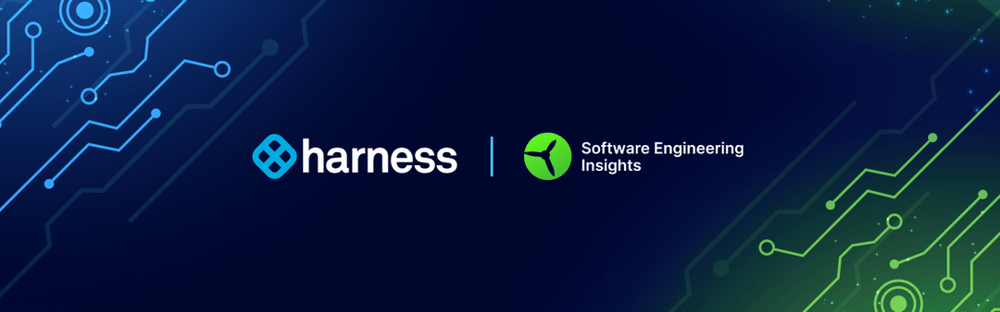
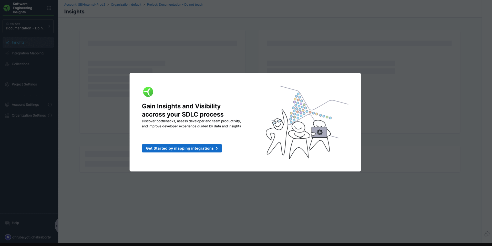

Harness Software Engineering Insights (SEI) helps you to increase developer productivity and improve developer experience through data-led insights and workflow automation. Harness SEI connects various DevOps tools to provide a single view of the software factory, enabling users to discover bottlenecks, assess team productivity, and enhance the overall developer experience.

Harness SEI analyzes data from over 40 DevOps tools to compute [DORA metrics and over 100 other insightful metrics](/docs/category/metrics-and-reports) that provide the missing insights to help you deliver software faster with better quality.

SEI [integrates](/docs/category/sei-integrations) seamlessly with the Harness platform, works with other common CI/CD tools (such as Jenkins, CircleCI, Gitlab, and Azure), and provides popular third-party integrations (such as Azure, Jira, and GitHub). Enterprise companies with heterogeneous environments are able to fetch data from disparate DevOps tools and receive centralized visibility into their software development lifecycle (SDLC) process.

SEI achieves this by looking at different facets of the SDLC process where bottlenecks are prevalent, such as:

* **Alignment:** SEI ensures engineering teams are aligned with business initiatives, improving resource allocation and reducing wasted efforts.
* **Planning:** SEI maximizes the agile program output by increasing predictability, reducing scope creep, and encouraging good process habits using an automated workflow engine.
* **Execution:** SEI benchmarks each team and organization by using an out of the box north star metric frameworks, such as DORA or SPACE, and Harness SEI provides actionable insights into how to improve those metrics by removing bottlenecks.

SEI also helps your teams drive continuous improvement by leveraging best practices and adopting a data-driven engineering mindset.

## Get started with SEI

To start using SEI, configure the following:

* [Integrations](/docs/software-engineering-insights/sei-integrations/sei-integrations-overview)
* [Contributors](/docs/software-engineering-insights/sei-projects-and-collections/manage-contributors)
* [Projects](/docs/platform/organizations-and-projects/projects-and-organizations)
* [Collections](/docs/software-engineering-insights/sei-projects-and-collections/project-and-collection-overview)
* [Profiles](/docs/category/profiles)
* [Insights](../insights/sei-insights.md)
* [Metrics and reports](/docs/category/metrics-and-reports)

:::tip

Use [Propels](/docs/category/propels-and-tables) to add human-in-the-loop automation to your SDLC.

:::

## See also

* [Get started with Harness](/docs/category/get-started-with-harness)
* [SEI Key Concepts](/docs/software-engineering-insights/get-started/sei-key-concepts)
* [SEI Onboarding Guide](/docs/software-engineering-insights/get-started/sei-onboarding-guide)
* [Supported platforms and technologies](/docs/platform/platform-whats-supported.md)
* [Propelo and Harness](/docs/software-engineering-insights/get-started/propelo-and-harness)
* [Troubleshooting and FAQs](/docs/software-engineering-insights/sei-troubleshooting-faqs)
