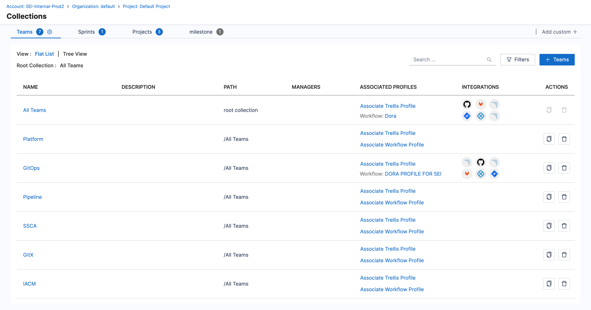
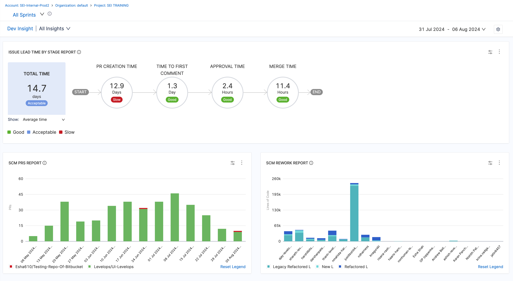
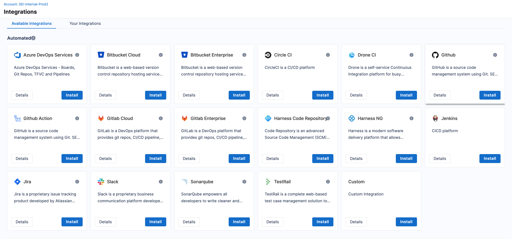

This page describes key concepts related to Harness SEI features and functionality, such as your Harness Projects, Collections, Insights, Integrations, Ingestion Satellite, Metrics & Reports, RBAC, and more.

## Projects

**Projects** are a centralized hub in Harness SEI enabling users to organize and navigate across Collection hierarchies, and easily access Insights associated with specific Collections.

By default, a **Project** consists of two top-level Collection categories: **Teams** and **Sprints**, each with options to customize. Each Collection category can have other Collections defined under them in parent-child relationships.

For more information, Go to [Projects and Collections](/docs/software-engineering-insights/sei-projects-and-collections/project-and-collection-overview)

## Collections & Collection Categories

Collection categories are broad classifications that serve as containers for Collections but are not, themselves, Collections. By default, each Collection category has one root, or All, Collection node. For example, the Teams category automatically has an All Teams Collection. Under the root node, you can create any number of Collections and Collection levels.

Under each Collection category are one or more levels of Collections. Collections are groupings, or focused classifications, that are subdivisions of Collection categories. Inheritance flows down the Collection levels.

To learn more about the Collection heirarchy refer the below resources.

* [Manage Collection Categories](/docs/software-engineering-insights/sei-projects-and-collections/manage-collection-cat)
* [Manage Collections](/docs/software-engineering-insights/sei-projects-and-collections/manage-collections)

  
## Insights

Insights in SEI provide a visual representation of key metrics and KPIs, enabling engineering teams to monitor their performance and identify areas for improvement. To create a Insight in SEI, users can utilize pre-built reports that are specifically designed to display relevant data points. These reports can be customized and arranged on the insight canvas to create a comprehensive view of team performance.

For more information, go to [Insights](../insights/sei-insights).

## Ingestion Satellite

Ingestion Satellite is used to integrate your on-premise tools and custom integrations into your SEI workspace. It enables data ingestion and integration with various third-party applications and services.

For more information, Go to [Ingestion Satellite](/docs/software-engineering-insights/sei-ingestion-satellite/satellite-overview)

## Integrations

To calculate meaningful metrics and optimize your software development lifecycle, it's essential to integrate your SDLC tools with the Software Engineering Intelligence (SEI) platform. SEI integrations provide a seamless way to connect your SDLC tools, such as Git providers, issue management systems, and communication tools, with the Harness Platform and its modules.

Harness SEI offers many types of integrations, including:

* [Code repo integrations](/docs/software-engineering-insights/sei-integrations/sei-integrations-overview#source-code-management-scm)
* [Ticketing system integrations](/docs/software-engineering-insights/sei-integrations/sei-integrations-overview#issue-management-platform)
* [CI/CD platform integrations](/docs/software-engineering-insights/sei-integrations/sei-integrations-overview#cicd)
* [Security tools integrations](/docs/software-engineering-insights/sei-integrations/sei-integrations-overview#security)
* [Communication & Collaboration tools integrations](/docs/software-engineering-insights/sei-integrations/sei-integrations-overview#communication--collaboration)
* [Incident monitoring system integrations](/docs/software-engineering-insights/sei-integrations/sei-integrations-overview#incident-monitoring)
* [Other integrations](/docs/software-engineering-insights/sei-integrations/sei-integrations-overview#others)
* [Custom CI/CD integrations](/docs/software-engineering-insights/sei-integrations/sei-integrations-overview#custom-cicd-integrations)

## Profiles

A **Profile** in SEI represents an entity where users define a specific set of metrics, criteria, and parameters that are used to assess and evaluate different aspects of software engineering processes, performance, and productivity.

SEI provides 3 different types of profiles:

1. **Investment Profile:** Investment profiles help you understand where engineers are allocating their time through effort investment metrics. For more information, Go to [Investment Profile](/docs/software-engineering-insights/sei-profiles/business-alignment-profile).

2. **Workflow Profile:** Workflow profile is an entity in SEI where users define the stages, events, and measurement criteria to assess the entire development process lifecycle. You can use these profiles to derive insights on time taken to ship changes or the time taken for bug fixes to reach production etc. For more information, Go to [Workflow Profile](/docs/software-engineering-insights/sei-profiles/workflow-profile).

3. **Trellis Profile:** Trellis Scores are a proprietary scoring mechanism from SEI. Your Trellis Score helps you understand your team's productivity. Trellis Scores are calculated from factors such as code quality, code volume, speed, impact, proficiency, and collaboration. For more information, Go to [Trellis Profile](/docs/software-engineering-insights/sei-profiles/trellis-profile).

## Metrics & Reports

Metrics and Reports in SEI refer to various key performance indicators and data-driven insights that are used to assess and improve a software development team's performance and productivity. Reports are predefined widgets which can be customized and used for generating insights on tracking, analyzing, and optimizing different aspects of the development process.

For more information, go to [Metrics & Reports](/docs/category/metrics-and-reports)