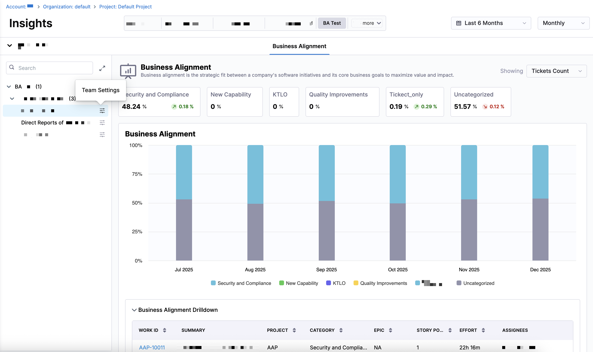

Business Alignment in SEI 2.0 focuses on understanding how engineering effort maps to business priorities, helping teams evaluate whether day-to-day work supports strategic goals. Unlike Business Alignment in SEI 1.0, Business Alignment uses team-level category definitions instead of global allocation goals, allowing each team to define alignment rules that best match their context.

## Business Alignment Insights

The **Business Alignment** tab on the **Insights** page in SEI 2.0 helps you understand how engineering effort is distributed across business-relevant categories, such as KTLO, Quality Improvements, and Security & Compliance. If your account has multiple Org Trees configured in SEI 2.0, the Org Trees are displayed as tiles at the top of the dashboard.

Selecting an Org Tree tile updates the dashboard to reflect data for that org tree and filters all Business Alignment metrics to include only the teams and repositories within the selected Org Tree. This allows you to compare how different organizations allocate engineering effort relative to business priorities.

Business Alignment reflects how closely software delivery work aligns with your organization's strategic priorities. It categorizes ticket-level work into pre-defined business categories, including:

* **Security and Compliance**
* **New Capability**
* **KTLO (Keep the Lights On)**
* **Quality Improvements**
* **Uncategorized** (work that does not match a defined rule)

:::info
Tickets that do no match any defined [Business Alignment rule](/docs/software-engineering-insights/harness-sei/setup-sei/setup-profiles/business-alignment-profile) appear as **Uncategorized**. A high percentage of uncategorized work may indicate that alignment rules can be refined.
:::

Each team defines its own [Business Alignment rules](/docs/software-engineering-insights/harness-sei/setup-sei/setup-profiles/business-alignment-profile#configure-team-level-settings) on the **Issue Management** tab in **Team Settings**. Teams configure the relevant projects or code areas, then define category-specific filter sets for each investment category to determine how tickets are mapped to business categories. To configure Business Alignment rules, select a team in the Org Tree and click the **Team Settings** icon next to the team name.

You can analyze the data by selecting a time range (for example, the last several weeks or months) and a time granularity (weekly, monthly, or quarterly), which determines how the data is grouped and displayed in the charts.

Use the `Showing` dropdown menu to control how effort is calculated across all Business Alignment metrics. Available options include **Ticket Count**, **Story Points**, and **Ticket Time Spent**. Changing this setting recalculates all values in the dashboard using the selected effort unit.

At the top of the dashboard, summary metrics show the percentage of work attributed to each business category for the selected time range. Each metric includes the percentage of total effort and the change compared to the previous time window, and help provide a  snapshot of where engineering effort is currently focused and how that focus is shifting over time.

Below the summary metrics is a stacked bar chart showing how engineering effort is distributed across business categories. Hover over a bar segment to view the exact value and percentage for that category for a given time period.

From the top of an Org Tree, click **View Breakdown** to see how Business Alignment is distributed across teams. This view highlights differences in effort allocation between teams. You can also select a specific team from the Org Tree to focus the dashboard on that team's data.

From a team-level view, you can drill down into the underlying ticket data to understand exactly which work contributed to each category. The drilldown table includes the work item ID, summary, project, business category, epic, story points, engineering effort, and assignees. 

To view a ticket in your issue management system, click the work ticket name in the **Business Alignment Drilldown**. This view helps explain why effort appears in a given category and supports further investigation into alignment decisions.