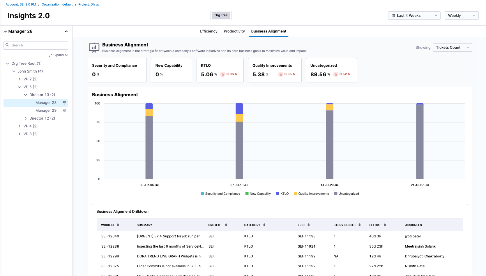

The Business Alignment Report in SEI 2.0 helps you understand how your teams are investing their time across business-relevant categories, such as KTLO, Quality Improvements, and Security & Compliance. Unlike the previous widget, this version uses team-level category definitions instead of global allocation goals, offering greater customization and contextual alignment per team.

## Overview

Business Alignment is the strategic fit between a company’s software delivery efforts and its core business priorities. This widget allows teams to analyze where their ticket work is going, broken down into predefined business categories, such as:

* KTLO (Keep the Lights On)
* Quality Improvements
* Security and Compliance
* New Capability
* Uncategorized (for unmatched work)

Each team defines their own Business Alignment rules, specifying what kinds of tickets should fall into which category.

## Key metrics

The top panel of the widget displays the percentage of work falling into each category during the selected time range. These percentages are calculated based on the selected Effort Unit, such as:

* Ticket Count
* Story Points
* Ticket Time Spent

Each metric shows the current value and the trend change compared to the previous time window.

## Visualization

### Stacked Bar Chart

The center graph is a stacked bar chart showing how ticket effort is distributed across business categories week-over-week (or by another time interval).

Each bar represents one time interval (e.g., a week) and is broken down by each category with color coding as per the profile definition.

Hovering over a bar segment shows the exact value and share.

:::note
Note that any ticket that does not match a defined rule appears as "Uncategorized". High levels of uncategorized work may suggest a need to refine Business Alignment rules.
:::

### Drilldown

The widget supports detailed exploration of data through the drill-down mode:

Clicking a category or time range opens a table showing the individual tickets included in that slice, with:

* Work ID
* Summary
* Project
* Category
* Epic (if any)
* Story Points
* Effort
* Assignees

This helps you understand what exact work went into each category and why.