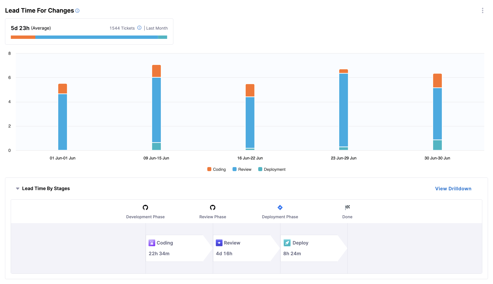
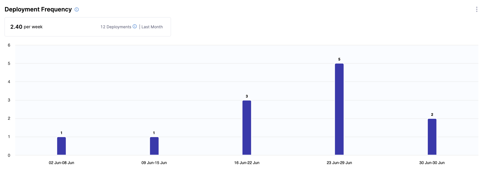
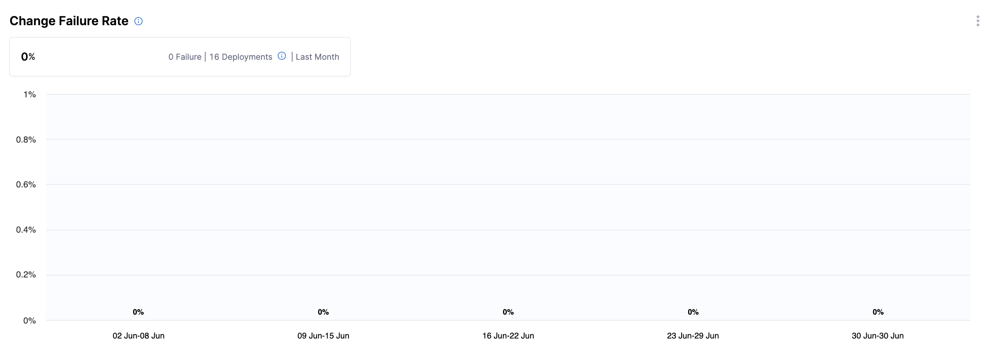
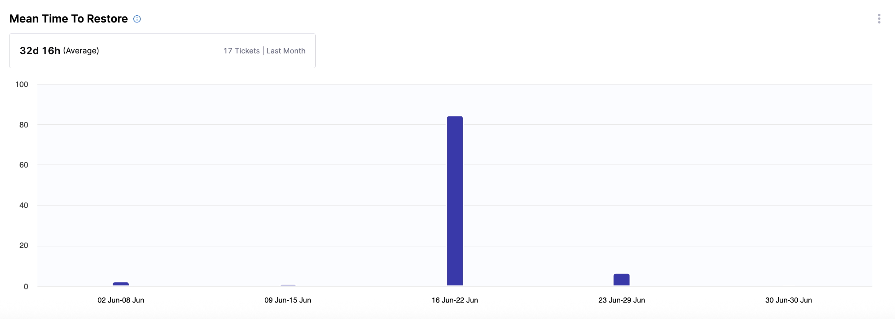
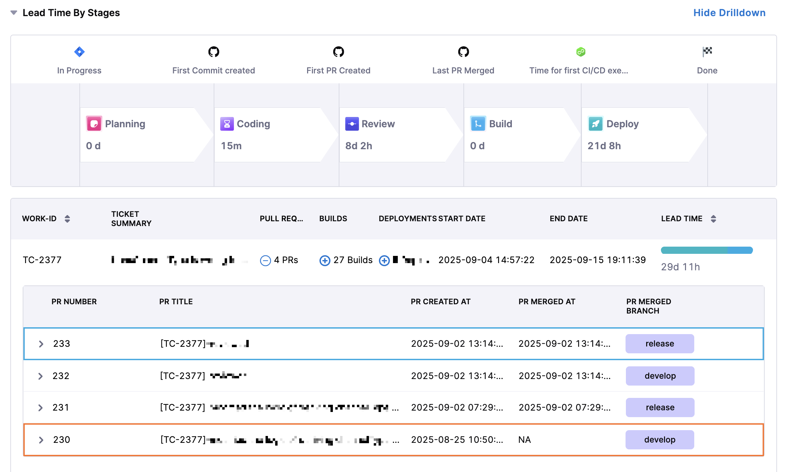

Efficiency in the context of SEI 2.0 refers to the measurement and analysis of how effectively an organization or team runs its software development processes. It focuses on key performance metrics that helps your organization or team understand and improve the speed and quality of software delivery. 

The primary metrics used to gauge efficiency are the following [DORA metrics](https://cloud.google.com/blog/products/devops-sre/announcing-the-2024-dora-report):

* **Lead Time for Changes:** The time it takes for a code change to go from commit to production.

* **Deployment Frequency:** How often an organization successfully releases to production.

* **Change Failure Rate:** The percentage of changes that fail in production.

* **Mean Time to Restore (MTTR):** The time it takes to recover from a failure in production.

These metrics are used to provide insights into the software delivery performance and help in identifying areas for improvement.

## Setup

Setting up an Efficiency Profile in SEI 2.0 involves the following steps to ensure that the right metrics are being tracked and analyzed:

1. Select the right profile: Choose from default profiles based on your integration setup. For example, if you have Issue Management and Source Code Management integrations configured, you can select the "Default IM, SCM Efficiency Profile."
1. Instantiate the profile: Customize the selected profile to fit your organization's specific needs. This involves defining the stages of the software development lifecycle you want to measure, such as Planning, Coding, Review, Build, and Deploy.
1. Assign the profile to an org tree: Map the instantiated profile to your organization's tree structure. This ensures that all teams within your organization adhere to the same efficiency metrics.
1. Configure team node definitions: Define the specific data scope for each team, including relevant projects, repositories, and issue types.
1. Activate insights: Once the profile is configured and mapped, activate the insights to start tracking and analyzing efficiency metrics.

### Configure an Efficiency Profile

Configuring an Efficiency Profile involves setting up the specific parameters and conditions under which metrics are tracked.

1. Define stages: Configure the start and end events for each stage of the software development lifecycle. 
For example, the Planning stage might start when a ticket is created and end when the first code commit is made.
1. Set up integrations: Ensure that all necessary integrations (e.g., Issue Management, SCM, and CI/CD) are configured to provide the data needed for each stage.
1. Apply team-specific configurations: Allow team managers to apply specific filters and settings relevant to their team's context, such as specific branches or issue types to track.

By following these steps, organizations can effectively set up and configure Efficiency Profile to gain valuable insights into their software delivery processes and drive continuous improvement.

## Efficiency Insight widgets

Our aim is to provide comprehensive, actionable insights into the efficiency of software delivery processes. By surfacing key DORA metrics, we help teams understand how effectively they ship code, identify opportunities to reduce bottlenecks, and drive continuous improvement. 

You can use the `Showing` dropdown menu to change the calculation method applied to all widgets. Available options include `mean`, `median`, `p90`, and `p95`.

Below is a brief overview of each widget on the **Efficiency** tab for SEI 2.0:

### Lead Time for Changes

This widget provides insights into how long it takes a code change to move from request to production, spanning all stages: development, review, testing, and deployment.

* **Metrics Displayed**: Average time from request to production, segmented by stage (e.g. coding, review, deployment) over the selected period.
* **Visualization**: A bar chart showing lead time, with bars segmented by stage of the lifecycle.

The following options are available for this widget:

* **View Breakdown**: Provides a detailed breakdown of lead time by team.

### Deployment Frequency

This widget provides insights into how often software is successfully released to production, highlighting the cadence of software delivery.

* **Metrics Displayed**: Number of deployments over the selected period.
* **Visualization**: A bar chart showing deployment counts for the selected period.

The following options are available for this widget:

  * **View Breakdown**: Provides a detailed breakdown of deployments by team.

### Change Failure Rate

This widget displays the percentage of deployments that result in a failure or incident in production.

* **Metrics Displayed**: Failure rate, calculated as `(Deployments that caused a failure or incident in production / Total deployments) × 100`.
* **Visualization**: A bar chart showing percentage of failures, alongside counts of failed and total deployments.

The following options are available for this widget:

  * **View Breakdown**: Provides a detailed breakdown of the percentage of deployments that caused a failure in production by team.

### Mean Time to Restore

This widget provides insights into how long it takes to recover from a failure or incident in production, helping teams assess responsiveness.

* **Metrics Displayed**: Average time to restore service after a failure.
* **Visualization**: A bar chart showing restoration time.

The following options are available for this widget:

  * **View Breakdown**: Provides a detailed breakdown of restoration time by team.

## Troubleshooting

### Lead Time for Changes

#### Why do some phases in the Lead Time widget show zero values even though we have correlated data across different systems?

This usually happens when the events defined in your Efficiency profile don’t align with the actual order of activities in your SDLC process. For example, if the profile is configured to measure Build Time as:

$$
\text{Build Time} = \text{First CI Build} - \text{Last PR Merged}
$$

then:

* Expected behavior: The first CI build should run after the last pull request is merged.
* Issue: If the first CI build happens before the last PR merge, the calculation results in a negative value. Negative values are reported as 0 in the widget.

**Common reasons you may see 0:**

* Process misalignment: For example in the above example a CI build triggers before the PR is merged.
* Profile definition conflict: The defined start and end events don’t reflect the real workflow.

**How to fix:**

* Set up the Destination Branch filter in your team settings so that only PRs merged into the correct branch are tracked.
* Review your SDLC workflow against the configured Efficiency profile to ensure event order matches reality.

In short: 0 values highlight workflow gaps or mismatches between how your process runs and how your Lead Time profile is defined.
