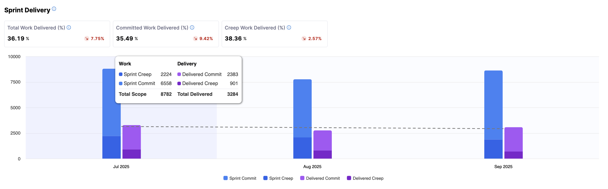
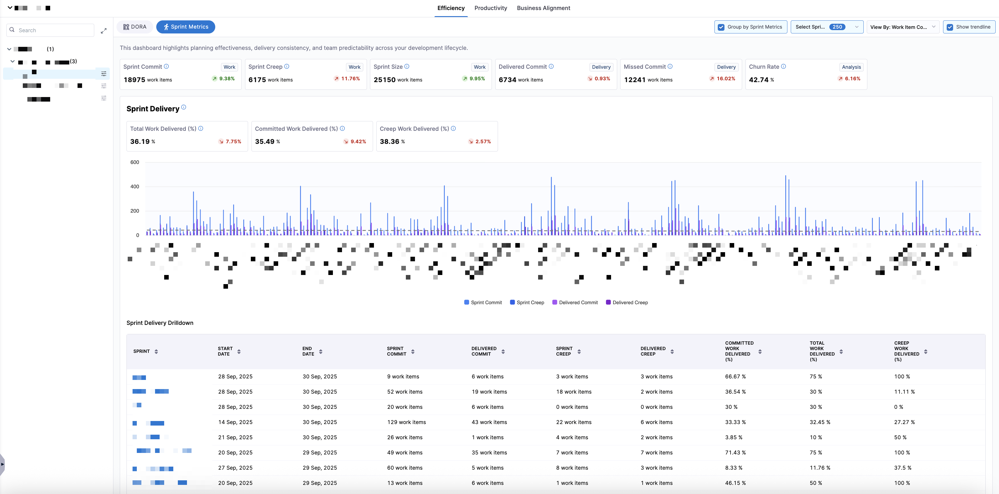
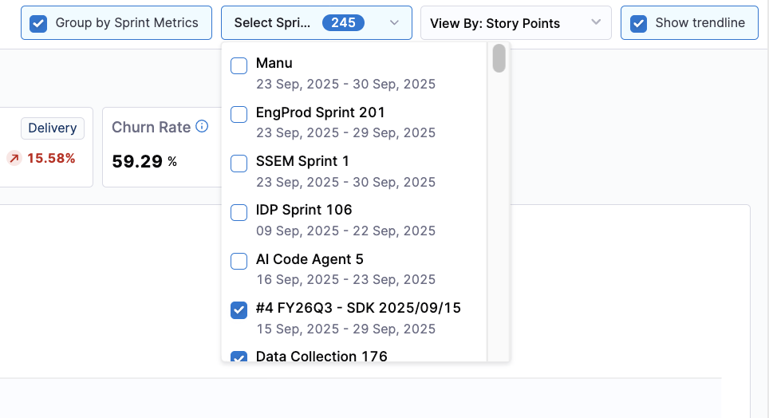
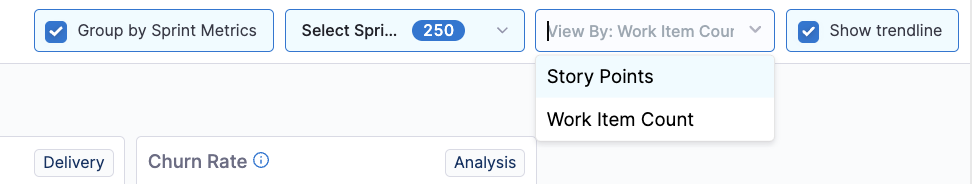
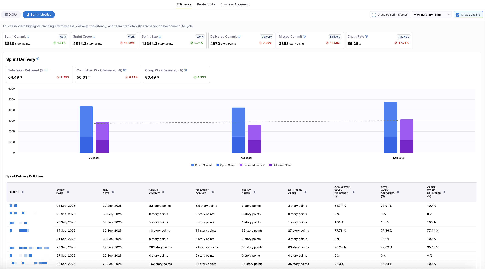
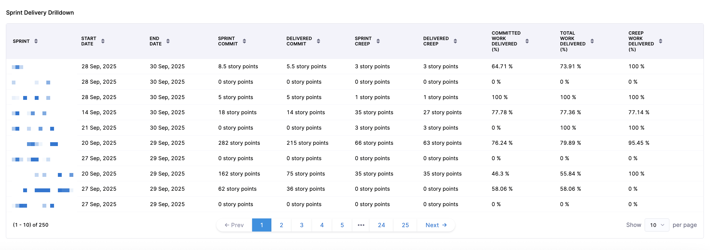
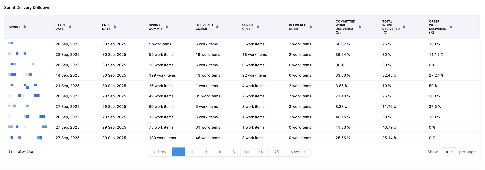
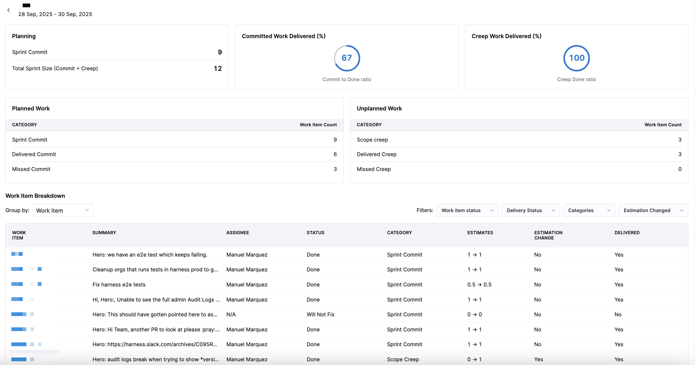
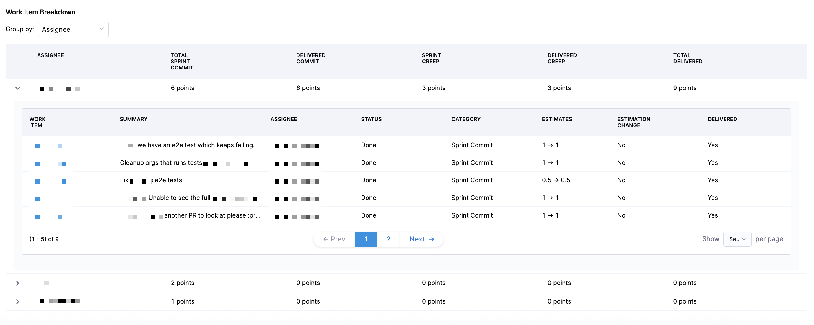

Efficiency in SEI 2.0 refers to the measurement and analysis of how effectively an organization or team runs its software development processes. It focuses on operational performance across deployment-based ([DORA](https://cloud.google.com/blog/products/devops-sre/announcing-the-2024-dora-report)) and sprint-based delivery metrics.

## Efficiency Insights

The **Efficiency** tab on the **Insights** page in SEI 2.0 helps you understand how effectively your organization delivers software. If your account has multiple Org Trees configured in SEI 2.0, the Org Trees are displayed as tiles at the top of the dashboard. 

Selecting an Org Tree tile updates the dashboard to reflect data for that org tree and filters all **DORA** or **Sprint** metrics to only include the teams and repositories within the selected Org Tree. This allows you to compare delivery performance across different organizations and teams.

* **DORA Metrics**: Measure software delivery speed, stability, and recovery.
* **Sprint Metrics**: Measure sprint planning effectiveness, delivery consistency, and team predictability.

By surfacing key DORA metrics, the **Efficiency Insights** dashboard helps teams:

- Understand how quickly and reliably they ship code
- Identify delivery bottlenecks across the development lifecycle
- Track improvements or regressions over time
- Support data-driven conversations around continuous improvement 

You can switch between the **DORA** or **Sprint Metrics** tabs to access delivery performance and reliability metrics or sprint planning and execution metrics, and analyze the data by selecting a time range (for example, the last several weeks or months) and a time granularity (weekly, monthly, or quarterly), which determines how the data is grouped and displayed in the charts. 

Use the `Showing` dropdown menu to control how values are calculated across all widgets. Available options include `mean`, `median`, `p90`, and `p95`. Click the **Show trendline** checkbox to overlay trendlines across all DORA and Sprint Metrics visualizations. Trendlines help you assess whether performance is improving, regressing, or remaining stable over time. 

:::info
Trendlines use the Ordinary Least Squares (OLS) regression method to identify patterns and direction in your data over the selected time range.
:::

To export the Efficiency Insights dashboard data, click the kebab menu (⋮) and select **Export as PDF** or **Export as CSV**. For more information, see [Exporting SEI 2.0 Insights](/docs/software-engineering-insights/harness-sei/analytics-and-reporting/export).

Below is a brief overview of each widget on the **DORA** tab in **Efficiency** on the **Insights** page:

### Lead Time for Changes

This widget provides insights into how long it takes a code change to move from request to production, spanning all stages: development, review, testing, and deployment.

* **Metrics Displayed**: Average time from request to production, segmented by stage (e.g. coding, review, deployment) over the selected period.
* **Visualization**: A bar chart showing lead time, with bars segmented by stage of the lifecycle.

The following options are available for this widget:

* **View Breakdown**: Provides a detailed breakdown of lead time by team.

### Deployment Frequency

This widget provides insights into how often software is successfully released to production, highlighting the cadence of software delivery.

* **Metrics Displayed**: Number of deployments over the selected period.
* **Visualization**: A bar chart showing deployment counts for the selected period.

The following options are available for this widget:

  * **View Breakdown**: Provides a detailed breakdown of deployments by team.

### Change Failure Rate

This widget displays the percentage of deployments that result in a failure or incident in production.

* **Metrics Displayed**: Failure rate, calculated as `(Deployments that caused a failure or incident in production / Total deployments) × 100`.
* **Visualization**: A bar chart showing percentage of failures, alongside counts of failed and total deployments.

The following options are available for this widget:

  * **View Breakdown**: Provides a detailed breakdown of the percentage of deployments that caused a failure in production by team.

### Mean Time to Restore

This widget provides insights into how long it takes to recover from a failure or incident in production, helping teams assess responsiveness.

* **Metrics Displayed**: Average time to restore service after a failure.
* **Visualization**: A bar chart showing restoration time.

The following options are available for this widget:

  * **View Breakdown**: Provides a detailed breakdown of restoration time by team.

## Sprint Metrics

:::tip
Sprint Metrics is in beta. To request access, contact [Harness Support](/docs/software-engineering-insights/sei-support).
:::

The Sprint Metrics dashboard provides sprint-based visibility into how well teams plan, execute, and deliver sprint work. While DORA focuses on deployment outcomes, sprint metrics focus on iteration-level execution and predictability. Sprint metrics are configured in the **Sprints** tab of the [Efficiency Profile](/docs/software-engineering-insights/harness-sei/setup-sei/setup-profiles/efficiency-profile#set-up-sprint-metrics).

Click the **View By** dropdown menu to choose whether sprint metrics are displayed in story points or work item count. 

* **Story Points**: Metrics reflect the estimated effort of work items based on story point values.
* **Work Item Count**: Metrics reflect the number of items regardless of point estimates.

You can also click the **Show trendline** checkbox to toggle a trend line overlay to visualize performance changes over time.

This dashboard highlights:

* Planning effectiveness (Sprint Commit, Sprint Creep, Sprint Size)
* Delivery performance (Delivered Commit, Missed Commit)
* Delivery efficiency (Total Work Delivered %, Committed Work Delivered %, Creep Work Delivered %)
* Team stability and predictability (Churn Rate, Predictability)

You can analyze the data by selecting a time range (for example, the last several weeks or months) and a time granularity (weekly, monthly, or quarterly), which determines how the data is grouped and displayed in the charts. Additional sprint-specific grouping is available to view performance at the individual sprint level. By default, the data is aggregated by month, with bar charts displaying columns for work and delivery.

To view data aggregated by individual sprint, navigate to the leaf team level of the org tree (for example, an engineering manager's team) and click **Group by Sprint Metrics** to aggregate all sprint metrics by individual sprint. 

This sprint-grouped view is ideal for sprint retrospectives, trend analysis across recent sprints, and comparing sprint-level execution consistency. You can use the **Select Sprints** dropdown menu to filter the dashboard to one or more specific sprints. 

To view the data by **Story Points** or **Work Item Count**, click the **View By** dropdown menu.

Selecting a different **View By** option updates all metrics and charts in the dashboard, allowing teams to analyze sprint outcomes either from an effort-based or item-count perspective. 

import Tabs from '@theme/Tabs';
import TabItem from '@theme/TabItem';

<Tabs queryString="point-or-work-item">
<TabItem value="point" label="Story Points">

</TabItem>
<TabItem value="work" label="Work Item Count">

</TabItem>
</Tabs>

Each sprint appears as a single aggregated performance record for high-level sprint comparison.

### Sprint delivery drilldown

Sprint metrics provide sprint-level and sprint-specific drilldowns for deeper analysis in the **Sprint Delivery Drilldown** section.

The default sprint view displays metrics across all selected sprints, including `Start Date`, `End Date`, `Sprint Commit`, `Delivered Commit`, `Sprint Creep`, `Delivered Creep`, `Committed Work Delivered`, `Total Work Delivered`, and `Creep Work Delivered`. 

<Tabs queryString="point-or-work-item">
<TabItem value="point" label="Story Points">

</TabItem>
<TabItem value="work" label="Work Item Count">

</TabItem>
</Tabs>

Each sprint appears as a single aggregated performance record for high-level sprint comparison. 

When you click into a sprint, you can access sprint-specific delivery performance and work item or story point-level drilldowns, allowing you to analyze which committed items were delivered, which creep items were added and delivered, which items were missed, and how individual work items contributed to sprint outcomes.

When viewing the **Work Item Breakdown** section for a specific sprint, you can filter the data using the following categories:

| Filter Category      | Options                                      | Description                                                                 |
|---------------------|---------------------------------------------|-----------------------------------------------------------------------------|
| **Work Item Status** | `Done`, `Will Not Fix`, `To Do`                    | Filter by the current state of the work item.                               |
| **Delivery Status**  | `Delivered`, `Missed`                            | Filter by whether the work item was delivered during the sprint.            |
| **Categories**       | `Sprint Commit`, `Scope Creep`                   | Filter by the type of work relative to the sprint plan.                     |
| **Estimation Changed** | `Estimation Changed`, `No Estimation Changed` | Filter by whether the story point or work item estimate changed during the sprint. |

These filters can be combined to narrow down the drilldown view to specific work items, helping teams identify patterns such as unplanned work, missed commitments, or estimation inconsistencies.

In addition to work item-level drilldown, you can also evaluate how work is distributed across the engineering team using assignee-based analysis. To see assignees displayed per sprint, select `Assignee` in the **Group by** dropdown menu. 

This view enables you to analyze how sprint workload is distributed across team members and assess whether work allocation supports intended sprint outcomes. 

When you click on an individual assignee, you can view assigned tickets, ticket status, ticket category, story point estimates, whether or not the estimation changed, and whether or not the ticket was delivered. You can analyze individual contribution patterns, bottlenecks at the person or role level, and load balancing across the team.

This view is useful for engineering managers, capacity planning, and identifying delivery risk from uneven workload distribution.

## Troubleshooting

### Lead Time for Changes

#### Why do some phases in the Lead Time widget show zero values even though we have correlated data across different systems?

This usually happens when the events defined in your Efficiency profile don’t align with the actual order of activities in your SDLC process. For example, if the profile is configured to measure Build Time as:

$$
\text{Build Time} = \text{First CI Build} - \text{Last PR Merged}
$$

then:

* Expected behavior: The first CI build should run after the last pull request is merged.
* Issue: If the first CI build happens before the last PR merge, the calculation results in a negative value. Negative values are reported as 0 in the widget.

**Common reasons you may see 0:**

* Process misalignment: For example in the above example a CI build triggers before the PR is merged.
* Profile definition conflict: The defined start and end events don’t reflect the real workflow.

**How to fix:**

* Set up the Destination Branch filter in your team settings so that only PRs merged into the correct branch are tracked.
* Review your SDLC workflow against the configured Efficiency profile to ensure event order matches reality.

In short: 0 values highlight workflow gaps or mismatches between how your process runs and how your Lead Time profile is defined.
