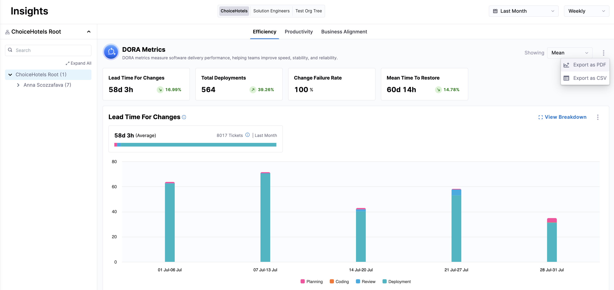
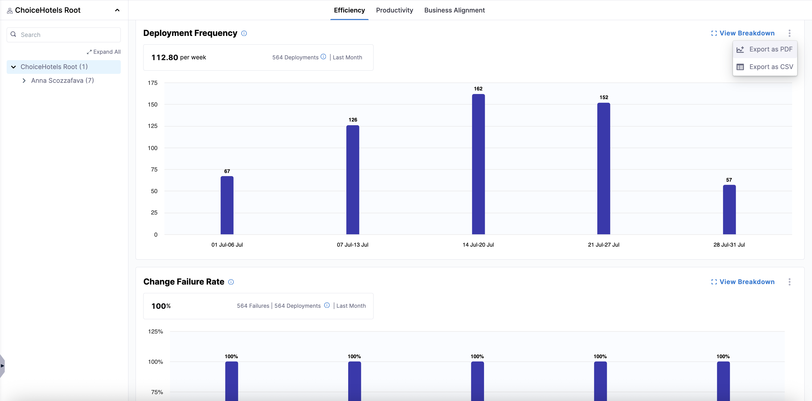

import Tabs from '@theme/Tabs';
import TabItem from '@theme/TabItem';

## Overview

Exporting SEI 2.0 Insights allows you to download and share insights from the SEI 2.0 platform in both PDF and CSV formats. This feature is designed to facilitate the sharing of key performance metrics and insights across teams and stakeholders, enabling better decision-making and performance tracking.

* **PDF Export**: Provides a snapshot of the dashboard view, including all widgets and the organizational hierarchy. This is ideal for presentations and sharing insights in a read-only format.
* **CSV Export**: Offers a detailed data export, capturing metrics at various levels of the organizational hierarchy. This format is suitable for further data analysis and integration with other tools.

## Insight categories and widgets

You can use the **Export** dropdown at the insight and widget level in Harness SEI 2.0. 

<Tabs queryString="export-options">
<TabItem value="insights" label="Insight Level">

Export data for entire insight categories, such as Efficiency, Productivity, and Business Alignment. This includes all widget metrics like Lead Time for Changes, Deployment Frequency, Change Failure Rate, and Mean Time to Restore.

</TabItem>

<TabItem value="widgets" label="Widget Level">

Export data specific to individual widgets within an insight view, such as Deployment Frequency within the Efficiency view or PR Velocity within the Productivity view. This is useful for focused analysis on specific metrics.

</TabItem>
</Tabs>

## File name and column format

When exporting insights from SEI 2.0, files follow a consistent naming and formatting structure to help you quickly identify their contents. The exported files are available in both PDF and CSV formats, with options for full dashboard or widget-specific reports.

### File naming conventions

When exporting a PDF of Efficiency Insights:

* PDF: `Efficiency-YYYY-MM-DD-HH-MM-SS.pdf`
* CSV: `Efficiency-YYYY-MM-DD-HH-MM-SS.csv`
* Widget-specific: `Efficiency-<widget name>-YYYY-MM-DD-HH-MM-SS.pdf/csv`

When exporting a PDF of Productivity Insights:

Similar naming conventions apply, with widget names replaced by PRV, BR, or FC for PR Velocity, Bugs Resolved, and Features Completed, respectively.

### Column format

When exporting a CSV for Efficiency Insights, the following columns are included:

- Org Node Name
- Lead Time for Changes
- Deployment Frequency
- Change Failure Rate
- Mean Time to Restore

When exporting a CSV for Productivity Insights, the file provides flexibility to select only the columns needed for reporting, with options to view data at the Team Manager level or by individual contributor.

## Customizable Productivity export options

Many teams require CSV exports that support specific reporting needs across organizational structures. The Productivity Insights export allows users to select only the columns they need and include data from all child team nodes, ensuring flexible and comprehensive coverage for internal reports and dashboards.