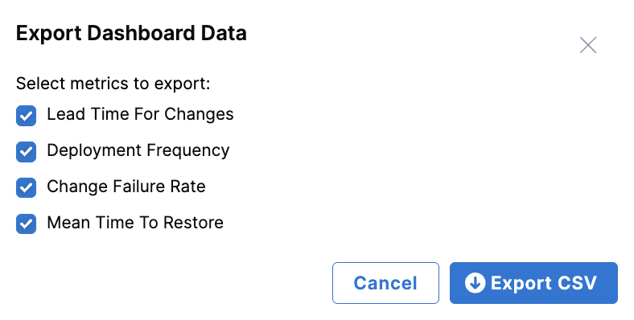
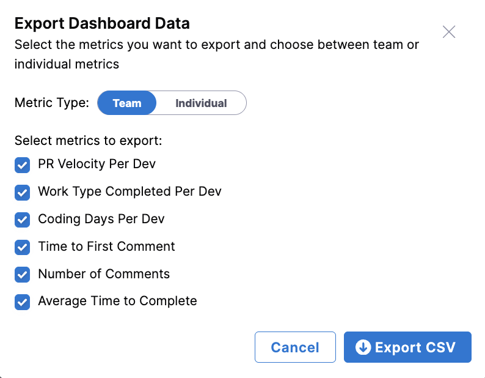
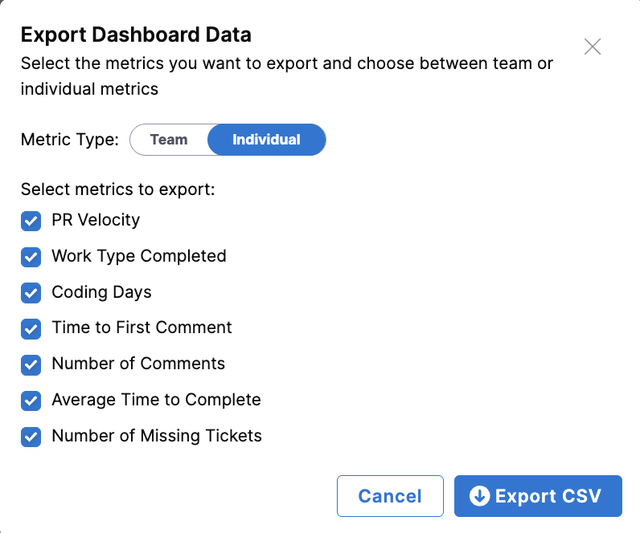

import Tabs from '@theme/Tabs';
import TabItem from '@theme/TabItem';

## Overview

Exporting SEI 2.0 Insights allows you to download and share insights from the SEI 2.0 platform in both PDF and CSV formats. This feature is designed to facilitate the sharing of key performance metrics and insights across teams and stakeholders, enabling better decision-making and performance tracking.

* **PDF Export**: Provides a snapshot of the dashboard view, including all widgets and the organizational hierarchy. This is ideal for presentations and sharing insights in a read-only format.
* **CSV Export**: Allows you to download org-level or contributor-level data. You can select which metrics to include and whether to export team-level or individual-level productivity data. This format is suitable for further data analysis and integration with other tools.

To programmatically export productivity and efficiency widgets, see [Add Export Productivity and Efficiency Metrics Using the Harness SEI API](/docs/software-engineering-insights/harness-sei/api/export-insights).

## Insight categories and widgets

You can use the **Export** dropdown at the insight and widget level in Harness SEI 2.0. 

<Tabs queryString="export-options">
<TabItem value="insights" label="Insight Level">

Export data for entire insight categories such as **Efficiency** and **Productivity**. This includes all widget metrics like **Lead Time for Changes**, **Deployment Frequency**, **Change Failure Rate**, and **Mean Time to Restore**.

</TabItem>

<TabItem value="widgets" label="Widget Level">

Export data specific to individual widgets within an insight view, such as **Deployment Frequency** within the **Efficiency** view or **PR Velocity** within the **Productivity** view. This is useful for focused analysis on specific metrics.

</TabItem>
</Tabs>

## Customize your CSV export

After selecting **Export as CSV**, you can customize the data included in your export by insight type.

* For Efficiency insights, you can select which rate-based metrics to include.
* For Productivity insights, you can choose between **Team** or **Individual** metrics. Team metrics are aggregated per developer within each org node, while individual metrics export one row per developer.

## File name and column format

CSV files exported from SEI 2.0 follow a consistent structure, with one row per organizational node and one column per metric selected during export. The columns included in the CSV file depend on the insight type and the metric you selected in the **Export Dashboard Data** modal.

<Tabs queryString="widget-options">
<TabItem value="efficiency" label="Efficiency">

When exporting Efficiency metrics, you can select which DORA metrics to include.

1. Select one (or all) of the following metrics:

    * **Lead Time for Changes**
    * **Deployment Frequency**
    * **Change Failure Rate**
    * **Mean Time to Restore**

1. Click **Export CSV**.

</TabItem>

<TabItem value="productivity" label="Productivity">

When exporting Productivity metrics, you can select which team-level or individual-level metrics to include.

At the team level, the following metrics are available:

- **PR Velocity Per Dev**
- **Work Type Completed Per Dev**
- **Coding Days Per Dev**
- **Time to First Comment**
- **Number of Comments**
- **Average Time to Complete**
- **Mean Time to Restore**

At the individual level, the following metrics are available:

- **PR Velocity**
- **Work Type Completed**
- **Coding Days**
- **Time to First Comment**
- **Number of Comments**
- **Average Time to Complete**
- **Number of Missing Tickets**

Once you've selected a metric type and the metrics to be included in your report, click **Export CSV**.

</TabItem>
</Tabs>

### File naming conventions

When exporting a PDF of Efficiency Insights:

* PDF: `Efficiency-YYYY-MM-DD-HH-MM-SS.pdf`
* CSV: `Efficiency-YYYY-MM-DD-HH-MM-SS.csv`
* Widget-specific: `Efficiency-<widget name>-YYYY-MM-DD-HH-MM-SS.pdf/csv`

When exporting a PDF of Productivity Insights:

Similar naming conventions apply, with widget names replaced by PRV, BR, or FC for PR Velocity, Bugs Resolved, and Features Completed, respectively.

### Column format

When exporting a CSV for Efficiency Insights, the following columns are included:

- Org Node Name
- Lead Time for Changes
- Deployment Frequency
- Change Failure Rate
- Mean Time to Restore

When exporting a CSV for Productivity Insights, the file provides flexibility to select only the columns needed for reporting, with options to view data at the team level or by individual contributor.
