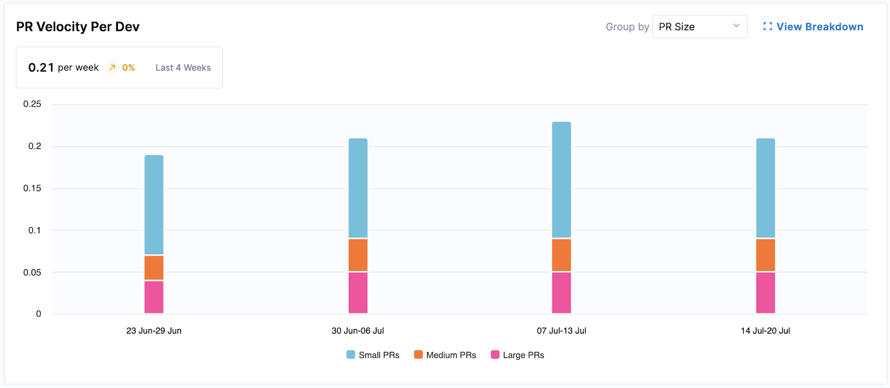
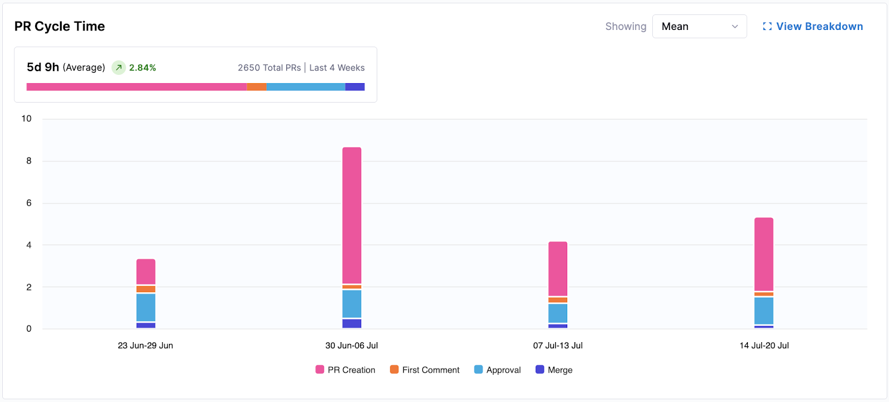
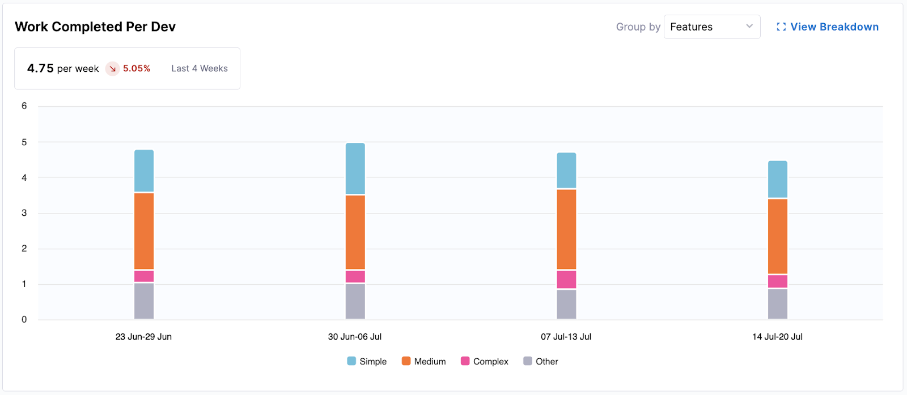
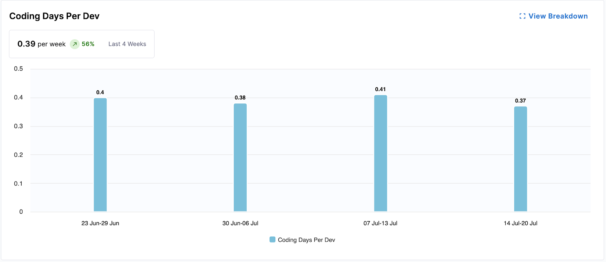
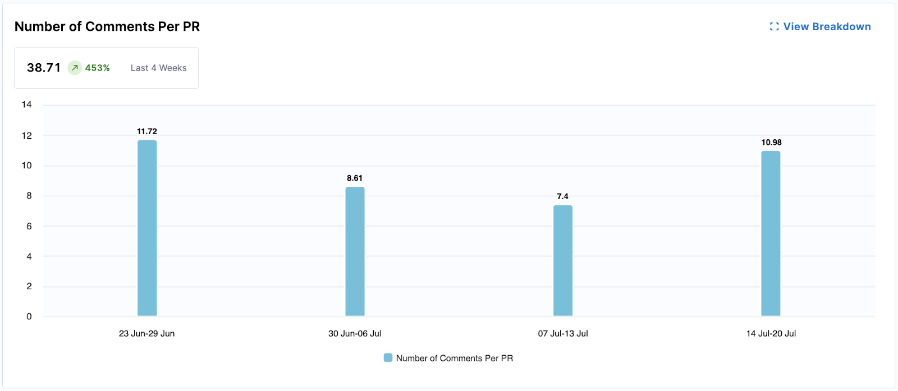
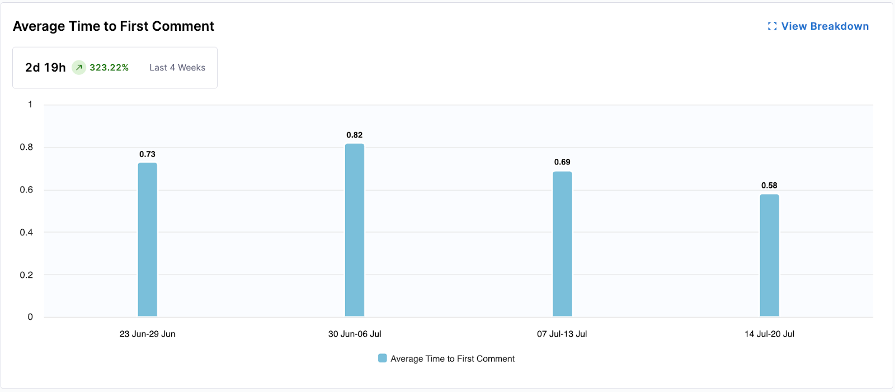

Productivity in SEI 2.0 focuses on understanding the actual work being delivered by developers, the quality of that work, and how effectively teams collaborate to get it done. Rather than measuring activity for its own sake, SEI surfaces signals that reflect meaningful engineering output, including work that drives value, improvements to existing code, and areas of potential rework.

We’ve designed this experience to focus on the quality, velocity, and collaboration behind the code. Whether you're tracking individual contributions or team-wide trends, SEI 2.0 helps you identify where work is flowing smoothly, where bottlenecks exist, and where additional effort may be spent refactoring or improving code.

We break productivity down into three core dimensions:

* **Volume:** How much work is getting done? This includes commits, pull requests, stories moved forward, and overall code activity.
* **Output:** What that work actually delivers—whether it’s shipping to production, creating customer value, or identifying rework through metrics like Code Rework.
* **Collaboration:** How effectively teams are working together? review quality, responsiveness, cross-functional interaction, and shared ownership.

## Productivity Insight widgets

Our aim is to provide comprehensive, actionable insights into what drives our engineering output. By visualizing key aspects of the development lifecycle, we empower teams to understand their performance, identify areas for improvement, and celebrate successes.

You can analyze the data using a calendar-based date selection or a pre-set time range (weekly, monthly, or quarterly).

Below is a brief overview of each widget in **Productivity** on the **Insights** page:

### PR Velocity Per Dev

This widget provides insights into the productivity of individual developers and teams by visualizing the rate at which pull requests (PRs) are completed over time.

* **Metrics Displayed**: Average PRs merged per developer per week (e.g., 0.13 per week).
* **Visualization**: A bar chart showing completed PRs per developer per week, segmented by "PR Size" (Small, Medium, Large) or "Work Type" (e.g., Features, Bugs).

The following options are available for this widget:

  * **Group by**: Allows switching the segmentation between "PR Size" and "Work Type."
  * **View Breakdown**: Provides a detailed breakdown of PR velocity by teams or individual developers, and offers a drill down to specific PRs.

### PR Cycle Time

This widget visualizes the average time it takes for pull requests (PRs) to move through various stages from creation to merge. It helps identify bottlenecks in the PR review and merge process.

* **Metrics Displayed**: Average time (e.g., 5d 11h) over the selected period.
* **Visualization**: A bar chart showing PRs per week, segmented by time spent in stages: "PR Creation," "First Comment," "Approval," and "Merge."

The following options are available for this widget:

* **Showing Mean**: Displays the average cycle time.
* **View Breakdown**: Provides a more granular view, typically by team or individual, and includes a table drill down of individual PRs.

### Work Completed Per Developer

This widget tracks the amount of completed work (e.g., features, bugs) per developer over time, offering insights into the output generation.

* **Metrics Displayed**: Average completed work units per developer per week (e.g., 0.23 per week).
* **Visualization**: A bar chart showing work completed per developer per week, segmented by complexity: "Simple," "Medium," "Complex," and "Other."

The following options are available for this widget:

* **Group by**: Allows you to change the segmentation, for example, by "Features."
* **View Breakdown**: Provides a more detailed view by team or individual developers, often with a table drill down of specific completed items.

### Coding Days Per Developer

This widget measures the average number of days developers actively contribute code, indicating consistent engagement and direct contribution volume.

* **Metrics Displayed**: Average coding days per developer per week (e.g., 0.23 per week).
* **Visualization**: A bar chart showing the average coding days per developer for each week.

The following options are available for this widget:

* **View Breakdown**: Provides a detailed breakdown of coding days by team.

### Number of Comments Per PR

This widget gauges the level of collaboration and communication within PRs by tracking the average number of comments per pull request. More comments can indicate active discussion and thorough reviews.

* **Metrics Displayed**: Average number of comments per PR (e.g., 2.5 comments).
* **Visualization**: A bar chart showing the average number of comments per PR for each week.

The following options are available for this widget:

* **View Breakdown**: Provides a detailed breakdown of comment activity by team.

### Average Time to First Comment

This widget measures the responsiveness of the team by calculating the average time it takes for a pull request to receive its first comment. Faster first comments can indicate efficient review processes.

* **Metrics Displayed**: Average time to first comment (e.g., 3d 8h).
* **Visualization**: A bar chart showing the average time to first comment for PRs each week.

The following options are available for this widget:

* **View Breakdown**: Provides a detailed breakdown of first comment times by team.

### Code Rework

:::tip
Code Rework is in beta. To request access, contact [Harness Support](/docs/software-engineering-insights/sei-support).
:::

Code Rework metrics provide insight into the portion of development effort spent rewriting or replacing existing code, and are configured in the [Productivity Profile](/docs/software-engineering-insights/harness-sei/setup-sei/setup-profiles/productivity-profile). These file-driven metrics show where rework is coming from, who is introducing it, and allow teams to balance delivering new work with maintaining code quality. 

The summary metric highlight trends in code rework and the bar chart displays rework percentages over time. You can hover over a bar for a specific week to see the split of **Recent Rework** versus **Legacy Rework**. 

* **Recent Code**: Code introduced within the past 30 days (configured in the Productivity Profile).
* **Legacy Code**: Code introduced before the recent-code window.
* **New Work**: Optional, can be displayed by clicking **Show total distribution**.

For parent nodes (e.g., directors or managers above leaf teams), the bar chart shows aggregated metrics. To view team-level details, click **View Breakdown** to see metrics aggregated per team (typically by engineering manager), including legacy, recent, and new work (if **Show total distribution** is enabled).

You can explore team-level and individual developer metrics by clicking on a team or a leaf node in the Org Tree. At the leaf team level (e.g., an engineering manager's team), you can access the **Code Rework Drilldown**, which displays metrics for individual developers.

This drilldown provides analysis of who is contributing rework and where it is coming from using the following metrics:

| Metric             | Description                                                                                     |
|-------------------|-------------------------------------------------------------------------------------------------|
| **% Rework**       | The percentage of work in the selected time window that involved rework (both recent and legacy). |
| **% Legacy Rework**| The percentage of rework that was performed on legacy code (older than the recent-code window).   |
| **% Recent Rework**| The percentage of rework performed on recent code (introduced within the recent-code window).     |
| **Lines Added**    | The number of lines added in the code changes during the selected period.                         |
| **Lines Deleted**  | The number of lines deleted in the code changes during the selected period.                       |
| **Lines Modified** | The number of lines modified (changed but not added or deleted).                                  |
| **Total Lines**    | The total lines affected (sum of added, deleted, and modified lines).                             |

