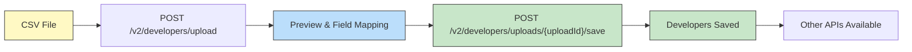
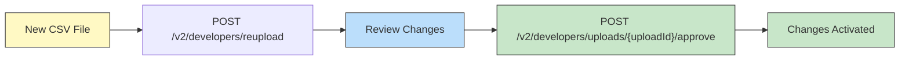

## Overview

This page explains how to create and update developer records programmatically, provides best practices for integrating with external systems, and includes troubleshooting information to validate developer data before applying changes. 

For a complete list of endpoints and schema definitions, see the [Harness API reference documentation](https://apidocs.harness.io/).

## Before you begin

To call the SEI API, you’ll need:

- A Harness API key
- A Harness account identifier 
- A base URL. All API URIs are relative to the SEI service endpoint for your region.
  
  - Prod 1: `https://app.harness.io/prod1/sei/api/`
  - Prod 2: `https://app.harness.io/gratis/sei/api/` 
  - EU: `https://accounts.eu.harness.io/sei/api/`

### Authentication

All Harness SEI APIs require authentication using a Harness API key.

To authenticate:

1. Create a [Harness API key](/docs/platform/automation/api/api-quickstart/).
1. Include the API key in your request header:

   ```json
   curl -X GET \
     "https://app.harness.io/gateway/sei/api/v2/developers/schema" \
     -H "x-api-key: <YOUR_API_KEY>" \
   ```

## Manage developer records

The Harness SEI API enables programmatic management of developer records. You can use the API to automate updates by writing scripts or jobs that trigger record changes whenever your source of truth (such as an HR system) changes. 

This reduces manual edits, lowers the risk of errors, and ensures developer data stays accurate and consistent for productivity and DORA metrics.

### Initial setup (Upload and save)

The developer schema and baseline data must first be established using the upload and save workflow.

:::danger
Reupload, approve, and upsert operations will return `412 Precondition Failed` if attempted before completing this initial setup.
:::

import Tabs from '@theme/Tabs';
import TabItem from '@theme/TabItem';

<Tabs> 
<TabItem value="new" label="Current (v2)">

- **Endpoint**: `POST /v2/developers` <br />
- **Authentication**: Requires an API key with `developer_records:write` scope. <br />
- **Content-Type**: multipart/form-data

Upload a CSV file containing developer data. Returns a preview with field mappings and validation errors. Response includes `versionId` for tracking.

For example:

```bash
curl -X POST \
  'https://app.harness.io/prod1/sei/api/v2/developers' \
  -H "accept: application/json" \
  -H "x-api-key: <YOUR_API_KEY>" \
  -F "file=@sample_file.csv;type=text/csv"
```

</TabItem> 
<TabItem value="old" label="Previous">



1. `POST /v2/developers/upload`: Upload a CSV file containing developer data (CSV only, cannot be JSON), which returns an upload preview with field mappings.
1. `POST /v2/developers/uploads/{uploadId}/save`: Configure field mappings (such as `NAME`, `EMAIL`, `MANAGER_EMAIL`) and save developers into the system. You must complete this step before using other developer management APIs.

</TabItem> 
</Tabs>

### Bulk update (Re-upload & approve)

<Tabs> 
<TabItem value="new" label="Current (v2)">

- **Re-upload Endpoint**: `PUT /v2/developers`
- **Approve Endpoint**: `PATCH /v2/developers/versions/{versionId}`
- **Authentication**: Requires an API key with `developer_records:write` scope.

Re-upload a new developer CSV file (auto-maps fields) and approve changes to activate. Returns review data.

For example:

```bash
# Re-upload
curl -X PUT \
  'https://app.harness.io/prod1/sei/api/v2/developers' \
  -H "accept: application/json" \
  -H "x-api-key: <YOUR_API_KEY>" \
  -F "file=@Updated_Developers.csv;type=text/csv"

# Approve
curl -X PATCH \
  'https://app.harness.io/prod1/sei/api/v2/developers/versions/<VERSION_ID>' \
  -H "accept: application/json" \
  -H "x-api-key: <YOUR_API_KEY>" \
  -H "Content-Type: application/json" \
  -d '{"active": true}'
```

</TabItem> 
<TabItem value="old" label="Previous">



To update existing developer data with a new CSV file, the initial upload/save must be completed first.

1. `POST /v2/developers/reupload`: Upload a new CSV file with updated developer data. This automatically uses existing field mappings and returns review data showing changes.
1. `POST /v2/developers/uploads/{uploadId}/approve`: Review and approve the changes, and activate the new developer dataset. 

</TabItem> 
</Tabs>

## List and download developers

<Tabs> 
<TabItem value="new" label="Current (v2)">

- **List Endpoint**: `GET /v2/developers`
- **Download Endpoint**: `GET /v2/developers` (Accept: text/csv)
- **Authentication**: Requires an API key with `developer_records:read` scope.

Retrieve filtered/sorted list of developers or download a full CSV file. Supports query parameters such as `emails`, `developerRefIds`, `searchKey`, `sortOrder`, `pageIndex`, and `pageSize`.

For example:

```bash
# List JSON
curl -X GET \
  'https://app.harness.io/prod1/sei/api/v2/developers?searchKey=department&searchValue=Engineering&pageIndex=0&pageSize=50' \
  -H "accept: application/json" \
  -H "x-api-key: <YOUR_API_KEY>"

# Download CSV
curl -X GET \
  'https://app.harness.io/prod1/sei/api/v2/developers' \
  -H "accept: text/csv" \
  -H "x-api-key: <YOUR_API_KEY>"
```

</TabItem> 
<TabItem value="old" label="Previous">

- **List Endpoint**: `POST /v2/developers/list`
- **Download Endpoint**: `GET /v2/developers/download`

</TabItem> 
</Tabs>


## Developer endpoints

<Tabs> 
<TabItem value="new" label="Current (v2)">
| Old Endpoint                                   | New Endpoint                                          | Method Change | Notes                 |
| ---------------------------------------------- | ----------------------------------------------------- | ------------- | --------------------- |
| `POST /v2/developers/upload`                     | `POST /v2/developers`                                   | None          | Multipart form data   |
| `POST /v2/developers/reupload`                   | `PUT /v2/developers`                                    | `POST` → `PUT`    | Multipart form data   |
| `POST /v2/developers/uploads/{uploadId}/save`    | `PUT /v2/developers/versions/{versionId}/fieldMappings` | `POST` → `PUT`    | Path parameter change |
| `POST /v2/developers/uploads/{uploadId}/approve` | `PATCH /v2/developers/versions/{versionId}`             | `POST` → `PATCH`  | Path parameter change |
| `POST /v2/developers/list`                       | `GET /v2/developers`                                    | `POST` → `GET`    | Query parameters      |
| `GET /v2/developers/download`                    | `GET /v2/developers`                                    | None          | Content negotiation   |

</TabItem> 
<TabItem value="old" label="Previous">

| Action | Endpoint | Usage |
|:---:|:---:|:---:|
| Reupload developer records | `POST /v2/developers/reupload` | Reupload a CSV file with review data for approval workflow. CSV file only. |
| Approve developer records | `POST /v2/developers/uploads/{uploadId}/approve` | Approve developers reupload and activate the changes.  |
| Upsert developers | `PATCH /v2/developers` | Add new developers or update existing ones. JSON only, no two-step approval process.  |
| Delete developers | `DELETE /v2/developers` | Delete developers by their email addresses.  |
| Search / list developers | `POST /v2/developers/list` | Search developers with filtering and sorting options. Search by attributes (key-value pair like "department":"Engineering", name). |
| Get developer schema | `GET /v2/developers/schema` | Get the latest developer field mappings (schema) for the account. Retrieve the schema for developer records and field mappings. |
| Download developer data | `GET /v2/developers/download` | Download a CSV file containing all developers currently in the system for auditing or sync back to third-party systems. |


### cURL commands

#### Reupload developer records (`POST /v2/developers/reupload`)

```json
curl -X 'POST' \
  'https://app.harness.io/prod1/sei/api/v2/developers/reupload?fileType=CSV' \
  -H "accept: application/json" \
  -H "Content-Type: multipart/form-data" \
  -F "file=@Sample_CSV_for_Importing_Developers.csv;type=text/csv"
```

#### Approve developer records (`POST /v2/developers/uploads/{uploadId}/approve`)

```json
curl -X 'POST' \
  'https://app.harness.io/prod1/sei/api/v2/developers/uploads/<YOUR_UPLOAD_ID>/approve' \
  -H 'accept: */*' \
  -d ''
```

#### Upsert developers (`PATCH /v2/developers`)

```json
curl -X 'PATCH' \
  'https://app.harness.io/prod1/sei/api/v2/developers' \
  -H 'accept: */*' \
  -H 'Content-Type: application/json' \
  -d '[
  {
    "<NEW_RECORD>": "string",
    "<NEW_RECORD>": "string",
    "<NEW_RECORD>": "string"
  }
```

#### Delete developers (`DELETE /v2/developers`)

```json
curl -X 'DELETE' \
  'https://app.harness.io/prod1/sei/api/v2/developers' \
  -H 'accept: */*' \
  -H 'Content-Type: application/json' \
  -d '{
  "emails": [
    "john.doe@example.com",
    "jane.smith@example.com"
  ]
```

#### Search/list developers (`POST /v2/developers/list`)

```json
curl -X 'POST' \
  'https://app.harness.io/prod1/sei/api/v2/developers/list
pageIndex=<INTEGER>&pageSize=<INTEGER>' \
  -H 'accept: application/json' \
  -H 'Content-Type: application/json' \
  -d '{
  "sortOrder": "asc",
  "searchKey": "string",
  "searchValue": "string",
  "sortKey": "string",
  "developerRefIds": [
    1073741824
  ]
```

#### Get developer schema (`GET /v2/developers/schema`)

```json
curl -X 'GET' \
  'https://app.harness.io/prod1/sei/api/v2/developers/schema' \
  -H 'accept: application/json' \
```

#### Download developer data (`GET /v2/developers/download`)

```json
curl -X 'GET' \
  'https://app.harness.io/prod1/sei/api/v2/developers/download' \
  -H 'accept: text/csv' \
```

## Sync developer records

You have two options for syncing developer records with Harness SEI APIs:

1. **Event-Driven Sync** (JSON, small updates): This is best for event-driven syncs, such as when a new hire webhook triggers an update. 
  
   :::danger
   Upsert will return `412 Precondition Failed` if the [initial setup](#initial-setup-upload-and-save) hasn’t been completed.
   :::

   - Fetch developer records from an external source such as an HR system.
   - Call `PATCH /v2/developers` to insert or update the records.
   - Validate using `POST /v2/developers/list`.

1. **Scheduled Sync** (CSV, bulk updates): This is best for nightly or weekly HR exports. CSV is required for upload and save, and JSON is not supported.

   - Upload a CSV file using `POST /v2/developers/reupload` and `POST /v2/developers/uploads/{uploadId}/approve` (response includes a preview and validation).
   - Review preview or validation errors. Correct upstream as needed.
   - Save developers using `POST /v2/developers/uploads/{uploadId}/save` to commit to the system.
   - Export the latest developer list using `GET /v2/developers/download` for auditing.

For automated syncs, Harness recommends running them daily in high-churn orgs and weekly in stable ones, with on-demand syncs when HR system changes occur. Always preview and audit changes, validate errors early, and apply business rules for invalid rows. 

## Example use case

A nightly job queries an HRIS system for all active employees in engineering.

```mermaid
graph LR
A["Query HRIS for active engineers"] --> B["Upload CSV: POST /v2/developers/upload"]
B --> C["Preview & Validation"]
C --> D["Save Developers: POST /v2/developers/uploads/{uploadId}/save"]
D --> E["Developers Saved / Ready for Other APIs"]
E --> F["Optional: Export CSV via GET /v2/developers/download"]

%% Define classes
class A hrisQuery;
class B csvFile;
class C preview;
class D csvFile;
class E developersSaved;
class F csvFile;

%% Styling
classDef hrisQuery fill:#ffebee,stroke:#e57373,stroke-width:1px; %% pale red
classDef csvFile fill:#fff9c4,stroke:#333,stroke-width:1px; %% pale yellow
classDef preview fill:#bbdefb,stroke:#333,stroke-width:1px; %% pale blue
classDef developersSaved fill:#c8e6c9,stroke:#333,stroke-width:1px; %% pale green
```



1. Upload a CSV file containing developer data using `POST /v2/developers/upload`. This returns a preview with field mappings and validation errors.
1. Check for validation errors in the preview (e.g. `REQUIRED_FIELD_MISSING` or `DUPLICATE_EMAIL`) and correct errors upstream in the CSV file if necessary.
1. Commit the uploaded developer data into the system using `POST /v2/developers/uploads/{uploadId}/save`. The initial setup must be completed before using other APIs, otherwise upsert, reupload, or approve operations will return `412 Precondition Failed`.
1. Optionally, export the current developer list using `GET /v2/developers/download` for auditing or syncing with external systems.

</TabItem> 
</Tabs>

## Troubleshooting

Developer operations (`save`, `upsert`, `delete`, and `reupload`) perform comprehensive validation and return structured error responses when validation fails.

Validation errors help identify and resolve issues with CSV uploads, field mappings, and developer record data before any changes are applied.

### Error types

| Error Type | When it Occurs | Details |
|:---:|:---:|:---:|
| `REQUIRED_FIELD_MISSING` | A required field is missing from the CSV upload or field mappings. | Required fields include `name`, `email`, and `manager_email` (if configured), as well as any fields used in org tree filters or group-by configurations. Triggered during file upload when mappings don’t include required fields. |
| `REQUIRED_VALUE_MISSING` | Required fields have empty or blank values in developer records. | Applies to `name` and `email` (always required). Triggered when any developer record has empty/null values for these fields. |
| `DUPLICATE_EMAIL` | Multiple developer records share the same email address. | Each developer must have a unique email. Applies to all developer operations (`save`, `upsert`, `delete`). |
| `CIRCULAR_REFERENCE` | Manager-employee relationships form circular references. | Example: A reports to B, and B reports to A. Detected through graph traversal of manager-employee relationships. Prevents infinite loops in the org hierarchy. |
| `MANAGER_EMAIL_MISSING_IN_DEVELOPER_EMAILS` | A developer’s `manager_email` value doesn’t exist in the dataset. | Manager email can be empty, but if provided, it must match an existing developer’s email. Ensures all managers are also developers. |
| `MISSING_NAME_OR_EMAIL_OR_MANAGER_EMAIL_FIELD_MAPPING` | Essential field mappings (`NAME`, `EMAIL`, or `MANAGER_EMAIL`) are missing from field configuration. | Triggered during save when required field types are not mapped to CSV columns. Prevents saving when core identification fields are undefined. |
| `INVALID_CSV` | The uploaded CSV file format is invalid or corrupted. | Triggered during upload when parsing fails. Causes include malformed structure, encoding issues, or file corruption. |
| `EMPTY_CSV` | The uploaded CSV file contains no data rows. | Triggered when the file has only headers or is entirely empty. Prevents processing of empty datasets. |
| `BLANK_CSV_COLUMN_NAME` | The CSV contains columns with blank or empty header names. | Triggered during upload when headers are missing or contain only whitespace. Ensures all columns have valid names for mapping. |

### Error response structure

All validation errors are returned in the following structure:

```json
{
  "status": "FAILURE",
  "errors": [
    {
      "errorType": "ERROR_TYPE_NAME",
      "fieldName": "field_name_or_null",
      "errorDeveloperCount": 10,
      "sampleErrorDevelopers": [
        {
          "field1": "value1",
          "field2": "value2"
        }
      ]
    }
  ]
}
```

 - `sampleErrorDevelopers` is limited to a partial list of records per error type.
 - `errorDeveloperCount` shows the total number of records affected.

Multiple error types can be returned simultaneously and validation occurs before any data is saved to prevent partial updates.
