import Tabs from '@theme/Tabs';
import TabItem from '@theme/TabItem';

<CTABanner
  buttonText="Request Access"
  title="Canvas in SEI 2.0 is in beta!"
  tagline="Create custom dashboards in SEI 2.0. Now available in beta!"
  link="https://developer.harness.io/docs/software-engineering-insights/sei-support"
  closable={true}
  target="_self"
/>

Navigate to the **Canvas** page to create and manage custom dashboards that appear on the **Insights** page in SEI 2.0. If the [out-of-the-box dashboards](/docs/software-engineering-insights/harness-sei/get-started/sei-key-concepts#dashboards-in-insights) on the **Insights** page does not provide the views your team needs, you can create <Tooltip id="sei.canvas.custom-dashboard">custom dashboards</Tooltip> on the **Canvas** page to publish, share, and collaborate with your team. 

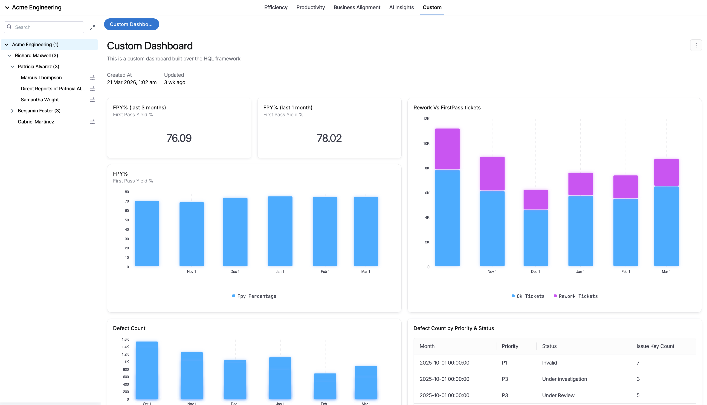

The **Canvas** page in SEI 2.0 displays all custom dashboards created by your team. You can search, view, and manage dashboards, including details such as the name, description, author, status, timestamps, and tags. 

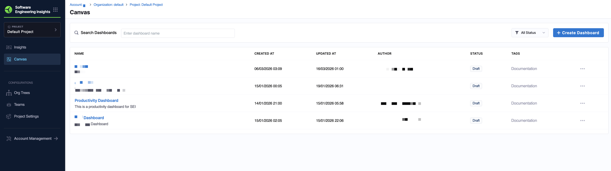

Each dashboard in the Canvas list includes the following metadata:

| Field | Description |
|------|-------------|
| Name | The name of the custom dashboard. |
| Created At | Timestamp when the dashboard was created. |
| Updated At | Timestamp of the most recent update. |
| Author | The user who created the dashboard. |
| Status | Current lifecycle state (`Draft` or `Published`). |
| Tags | Optional labels used for grouping and filtering dashboards. |

Canvas dashboards support [query-level variables](#use-query-variables-in-dashboards), including team-scoped filters and custom variables. This allows dashboards to dynamically adapt based on your configuration in **Team Settings**. 

To filter dashboards by status, click the `All Status` dropdown menu next to **+ Create Dashboard**.

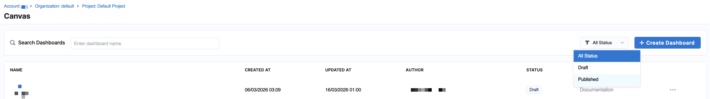

Canvas dashboards support the following statuses:

- **Draft**: The dashboard is still in progress and not yet shared broadly.
- **Published**: The dashboard is finalized and visible for wider consumption depending on permissions.

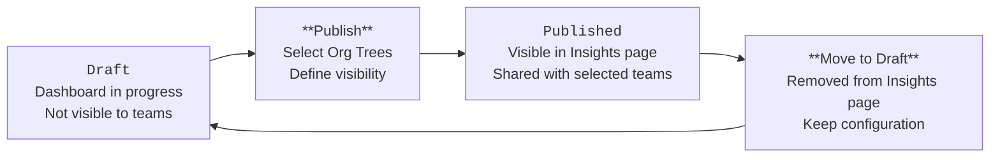

Published Canvas dashboards are read-only. To make changes, move the dashboard back to `Draft`, update it, and then publish it again. For more information, see [Managing dashboards in Canvas](#manage-dashboards-in-canvas).

### Prerequisites

Access to Canvas is governed by [Harness RBAC](/docs/software-engineering-insights/harness-sei/get-started/rbac). Permissions are managed using roles, resource groups, and role bindings.

To view and manage Canvas dashboards, ensure your role includes the following permissions:

- **View SEI Canvas** (`sei_seicanvas_view`)
- **Create/Edit SEI Canvas** (`sei_seicanvas_create` and `sei_seicanvas_edit`)
- **Delete SEI Canvas** (`sei_seicanvas_delete`)

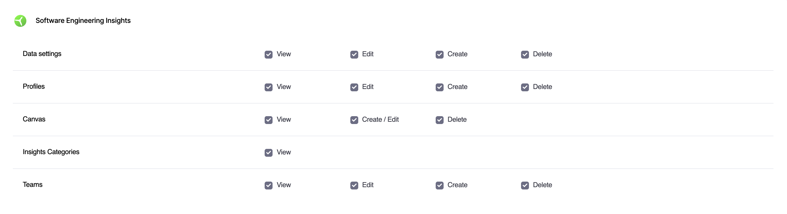

Access to Canvas dashboards is also scoped through [Harness resource groups](/docs/platform/role-based-access-control/add-resource-groups/). 

1. Navigate to **Project Settings** > **Resource Groups**.
1. Click **+ New Resource Group**.
1. Set the **Resource Scope** to `Project only` and under **Software Engineering Insights**, select one or both of the following resources, and configure access:

   - **Insights Categories**: Select **All** or **Specified**, and click **+ Add** to choose from `Efficiency`, `Productivity`, `Business` `Alignment`, `AI Insights`, `Security`, and `Custom`.
   - **Teams**: Select **All** or **Specified**, and click **+ Add** to choose one or more Org Tree teams.

   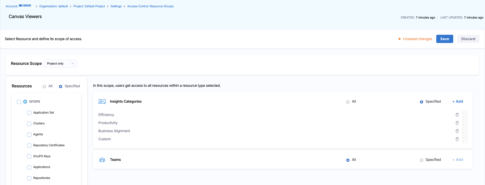

1. Click **Save**.

Next, associate the role with users or user groups by clicking **Manage Role Bindings**, selecting the role (such as `SEI Team Manager`), associating it with the appropriate resource group (such as all account-level resources), and clicking **Save**.

## Create a Canvas dashboard

1. From the Harness SEI navigation menu, navigate to the **Canvas** page and click **+ Create Dashboard**. 
1. In the **Create New Dashboard** modal, enter a name (for example, `[Team Name] Issue Dashboard`) and a description. 
1. Optionally, enter tags. 
1. Click **Create Dashboard** to save the dashboard.

## Edit a Canvas dashboard

Once you edit or create a dashboard, you enter a Dashboard Editor view where you can customize your dashboard layout and add widgets. To apply dashboard-level filters, click the **+ Add Filters** dropdown menu and select `Project`, `Repository`, or `Time Range`. 

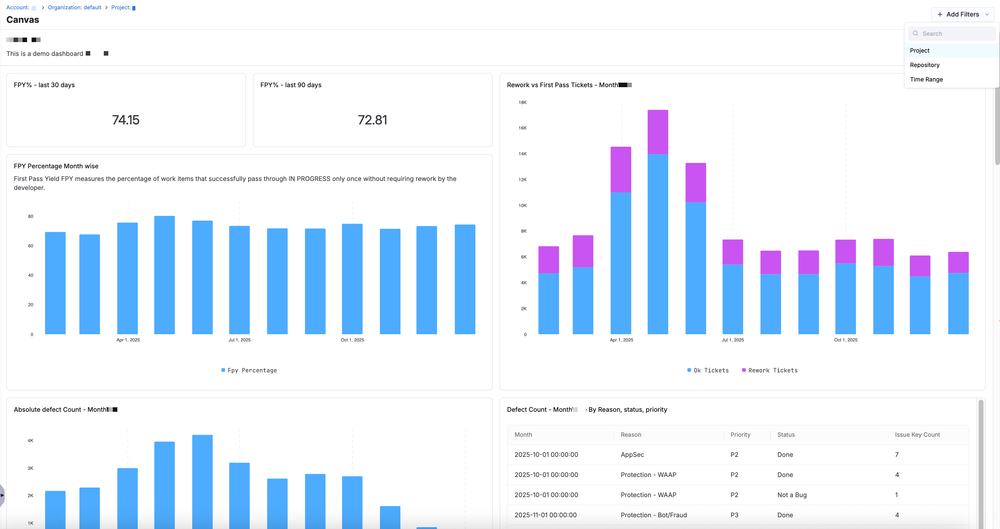

An additional **Project** filter appears for you to search and select the appropriate project(s) you want to filter the dashboard to.

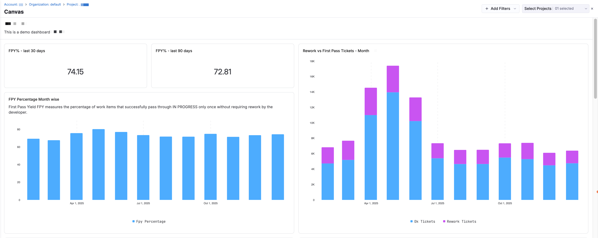

To add a <Tooltip id="sei.canvas.widget">widget</Tooltip>, click **+ Add Widget** to add a new visualization. Widgets are configured on top of dashboards and display the data defined in the query. You can customize the widget name/subtitle, visualization type (`Table`, `Metric Card`, `Line Chart`, `Bar Chart`, `Column Chart`, `Area Chart`, or `Scatter Chart`), and query configuration. 

<div style={{ textAlign: 'center' }}>
  
</div>

The **Query Configuration** section on the right side of the editor includes two tabs: **Builder** and **Code**.

<Tabs queryString="query-config">
<TabItem value="editor" label="Builder">

On the **Builder** tab:

1. Select a <Tooltip id="sei.canvas.data-source">data source</Tooltip> from the `Datasource` dropdown menu.
   
1. In the **Select** section, click **+ Select** to choose a column (for example, `Integration Type`). Optionally, apply an aggregation method (such as `Count` or `Distinct Count`). An alias is automatically generated (for example, `integration_type_count`), which can be used in sorting or visualization.

1. In the **Filter** section, click **+ Filter** to define conditions for your query.

   - Choose a field (for example, `Status`, `Job Name`, `Created At`).  
   - Select an operator (`Equals`, `Contains`, `Greater Than`, `In`, `Is Null`, etc.).  
   - Provide a value.  

   These filters determine which records are included in the widget.

1. In the **Sort** section, click **+ Sort** to define how results are ordered.

   - Select a field or aggregated value.  
   - Optionally apply an aggregation method (for example, `Count`, `Average`, `Max`).  
   - Select `Ascending` or `Descending`.

1. In the **Limit** section, define the maximum number of results returned (for example, `10`).

As you configure the query, results update in real time across the preview tabs:

   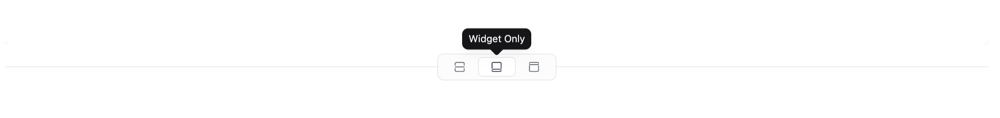

  - **Widget and Data**: Displays both the visualization and the underlying data.  
  - **Widget Only**: Displays the visualization only.  
  - **Data Only**: Displays the raw query results in table format.  

When you're ready to add the widget to a dashboard, click **Add Widget**.

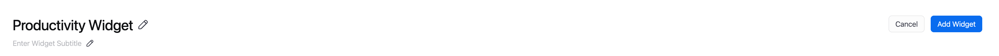

</TabItem>
<TabItem value="sql" label="Code">

On the **Code** tab:

The query is displayed in an editable HQL editor. 

1. Edit the query directly using HQL syntax. Click **{} Format** to automatically format and clean up the query for readability. 
1. Optionally, click the **Advanced** section and click **+ Add Variable** to define [query variables](#use-query-variables-in-dashboards).
   
   - Enter a variable name and a value.
   - You can reference variables in your query using `${variableName}`.

1. Click **Run Query** to run and validate the query. 
1. Optionally, click **Reset to last applied** to revert unsaved changes.

As the query runs, results are displayed in the preview tabs:


- **Widget and Data**: Displays both the visualization and query output.  
- **Widget Only**: Displays the rendered chart.  
- **Data Only**: Displays the raw data returned by the query.

When you're ready to add the widget to a dashboard, click **Add Widget**.


</TabItem>
</Tabs>

You can also select pre-defined time ranges above the widget visualization (such as `1W`, `1M`, `3M`, `6M`, or `12M`) or define a custom date range.

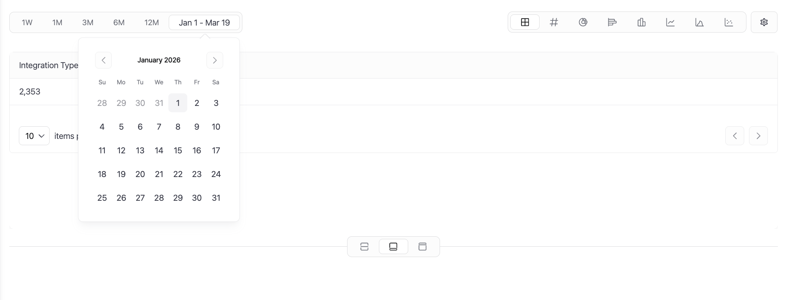

Click the **Settings** icon to configure how time is applied to your data. You can select a time field (such as `Created At`, `Start Time`, `End Time`, or `Updated At`) to control how the dashboard filters data.

<div style={{ textAlign: 'center' }}>
  
</div>

Additional options under **Content Formatting** allow you to customize how results are displayed, such as enabling pagination by clicking **Show Pagination** or formatting numeric columns based on selected aggregations. When you enable a column in the **Numeric Columns** section (for example, `Integration Type Count`), you can configure a style to control how values are displayed.

<div style={{ textAlign: 'center' }}>
  
</div>

- **US Format**: Formats numbers using US conventions (for example, `1,234.56`). 
- **Locale**: Adapts formatting based on the user's locale settings. 
- **Raw**: Displays the unformatted numeric value.

To save your widget to a Canvas dashboard: 

1. Once you've configured the widget, including selecting a time range and visualize type, click **Add Widget** to add it to the dashboard.
1. You are redirected to the dashboard view with the widget added. To create additional widgets, click **+ New Widget**. 

   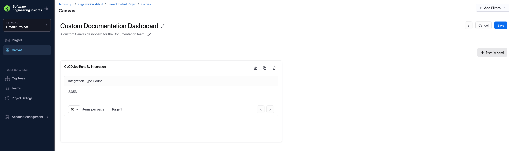

When you are done editing the dashboard, click **Save** to finalize your changes. Dashboards and their widgets can be edited or updated anytime from the **Canvas** page.

## Use query variables in dashboards

<Tooltip id="sei.canvas.query-variable">Query variables</Tooltip> allow you to create dynamic, reusable queries that automatically adapt based on team configuration and dashboard filters. In the Dashboard Editor, click **Query Variables** in the upper right corner to access variable options.

You can use these variables inside HQL queries to replace static values with team-specific or time-based values. Query variables are applied as dynamic filters in HQL and are not configurable through the **Builder** tab. To use query variables, switch to the **Code** tab and include them using the filter operation.

<Tabs queryString="query-variables"> 
<TabItem value="issue-management" label="Issue Management">

Use `${imHqlFilters}` to dynamically apply team-level Issue Management filters (such as project or integration) to your query. These values are automatically populated based on the configuration on the [**Issue Management** tab in Team Settings](/docs/software-engineering-insights/harness-sei/setup-sei/setup-teams/?team-settings=im-settings#configure-team-tool-settings).

The following data columns are exposed:

| Key            | Data Type | Description                                       |
| -------------- | --------- | ----------------------------------------------    |
| `project`        | string    | Jira or Azure DevOps project identifier.        |
| `integration_id` | string    | Unique identifier for the integration instance. |

For example, the following HQL query filters SEI issues based on the team's configured projects and integrations: 

```sql
find entity "sei:issues"
| select { project }
| filter ${imHqlFilters}
```

</TabItem>
<TabItem value="scm" label="Source Code Management">

Use `${scmHqlFilters}` to dynamically apply Source Code Management filters such as repositories or integrations. These values are derived from the configuration on the [**Source Code Management** tab in Team Settings](/docs/software-engineering-insights/harness-sei/setup-sei/setup-teams/?team-settings=scm-settings#configure-team-tool-settings).

The following data columns are exposed: 

| Key              | Data Type | Description                                     |
| ---------------- | --------- | ----------------------------------------------  |
| `repo_id`        | string    | Git repository identifier.                      |
| `integration_id` | string    | Unique identifier for the integration instance. |

For example, the following query filters data based on the SEI SCM pull request reviews configured for the team:

```sql
find entity "sei:scm_pullrequests_reviews"
| select { repo_id }
| filter ${scmHqlFilters}
```

</TabItem>
<TabItem value="cicd" label="CI/CD">

Use `${cicdHqlFilters}` to dynamically apply CI/CD filters such as job names or integrations. These values are based on the configuration on the [**CD Pipelines** tab in Team Settings](/docs/software-engineering-insights/harness-sei/setup-sei/setup-teams/?team-settings=cicd-settings#configure-team-tool-settings).

The following data columns are exposed:

| Key              | Data Type | Description                                    |
| ---------------- | --------- | ---------------------------------------------- |
| `job_name`       | string    | Name of the CI/CD job.                          |
| `integration_id` | string    | Unique identifier for the integration instance. |

For example, the following query filters CI/CD job runs based on team configuration:

```sql
find entity "sei:cicd_job_runs"
| filter cd = "true"
| filter ${cicdHqlFilters}
| select { job_name }
```

</TabItem>
<TabItem value="time" label="Time Filters">

Use time variables to make dashboards responsive to the global time picker.

The following variables are available:

| Variable             | Data Type | Description                               |
| -------------------- | --------- | ----------------------------------------- |
| `${startTimeFilter}` | string    | Filters data from the selected start time. |
| `${endTimeFilter}`   | string    | Filters data up to the selected end time.  |

For example, the following query applies the selected dashboard time range:

```sql
filter issue_created_at >= ${startTimeFilter}
| filter issue_created_at <= ${endTimeFilter}
```

</TabItem> 
<TabItem value="custom" label="Custom Variables">

<Tooltip id="sei.canvas.custom-variable">Custom variables</Tooltip> allow you to define reusable variables that can be overridden at the team level. You can create and manage these variables directly from the **Query Variables** panel in the Canvas dashboard editor.

To create a custom variable:

1. Navigate to the **Custom Variables** tab from the **Query Variables** menu.
1. Click **+ Add New Variable**.
   
1. Enter the following details for the custom variable:
   
   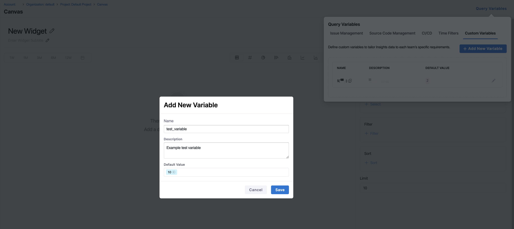

   - Name: A unique identifier used in queries (for example, `priority_issues`).
   - Description: Explains the purpose of the variable.
   - Default Value: A fallback value used when no team override is defined.

1. Click **Save**. 

Once created, the variable becomes available for use in your queries:

```sql
filter priority = ${priority_issues}
```

Custom Variables created in Canvas are available in the [**Custom Variables** tab in Team Settings](/docs/software-engineering-insights/harness-sei/setup-sei/setup-teams/?team-settings=custom-variable#configure-team-tool-settings), where teams can override the default value.

</TabItem> 
</Tabs>

## Manage dashboards in Canvas

Each custom dashboard in the list on the **Canvas** page includes an overflow menu (**...**) that contains additional management actions:

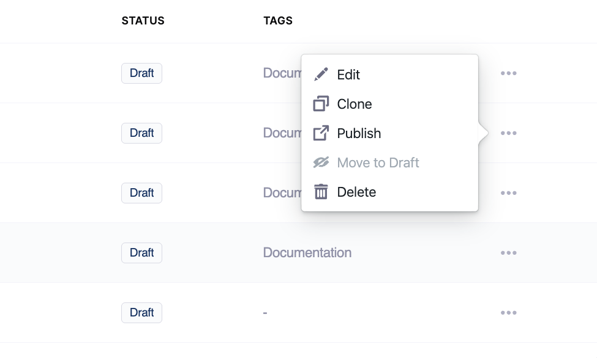

- **Edit**: Opens a modal where you can update the dashboard name, description, and tags. Click **Update** to save changes.
- **Clone**: Creates a duplicate of the dashboard. This is useful for iterating on an existing dashboard without modifying the original
- **Publish**: Marks the dashboard as `Published` and makes it available for selected [Org Trees](/docs/software-engineering-insights/harness-sei/get-started/sei-key-concepts#org-tree) on the **Insights** page. 
   
   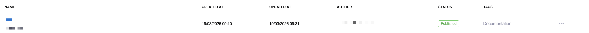

   When you click **Publish**, you are prompted to associate the dashboard with one or more configured Org Trees. You can select multiple Org Trees, then click **Publish** to confirm. This association controls how the dashboard is scoped and viewed across teams, rather than granting direct access permissions.

   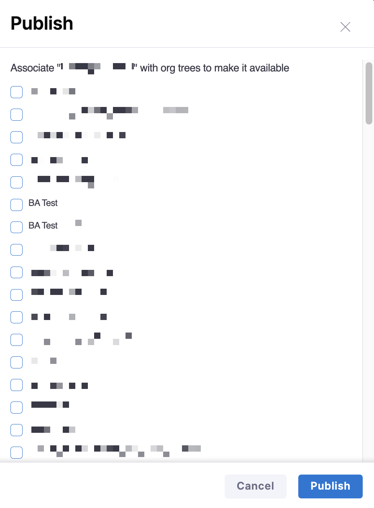

   Once published, the dashboard status changes to **Published**, the dashboard is available in the **Canvas** tab on the **Insights** page, and the selected Org Trees appear on the left-side panel, allowing you to view the dashboard in the context of each organizational hierarchy.
   
   

- **Move to Draft**: Reverts a `Published` dashboard back to `Draft` state for further editing. When selected, a confirmation modal displays the Org Trees the dashboard is currently associated with. 
  
  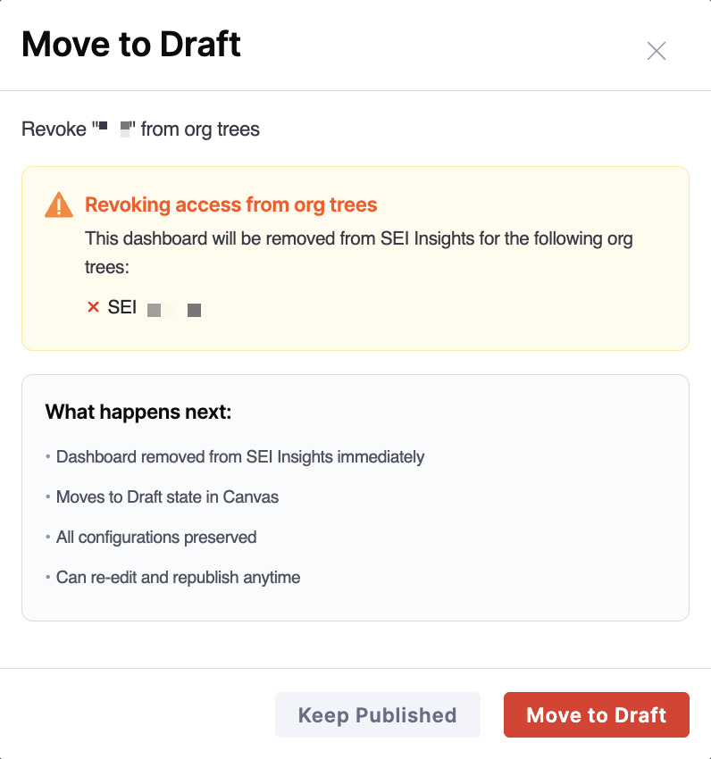

  When you click **Move to Draft**, the dashboard is removed from the **Insights** page, the status changes to `Draft` on the **Canvas** page, all dashboard configurations are preserved, and you can continue editing and republish the dashboard at any time.

- **Delete**: Permanently removes the dashboard. When you click **Delete**, a confirmation modal appears. Click **Delete** to confirm.

These actions allow teams to manage the lifecycle of custom dashboards and iterate before sharing them more broadly.