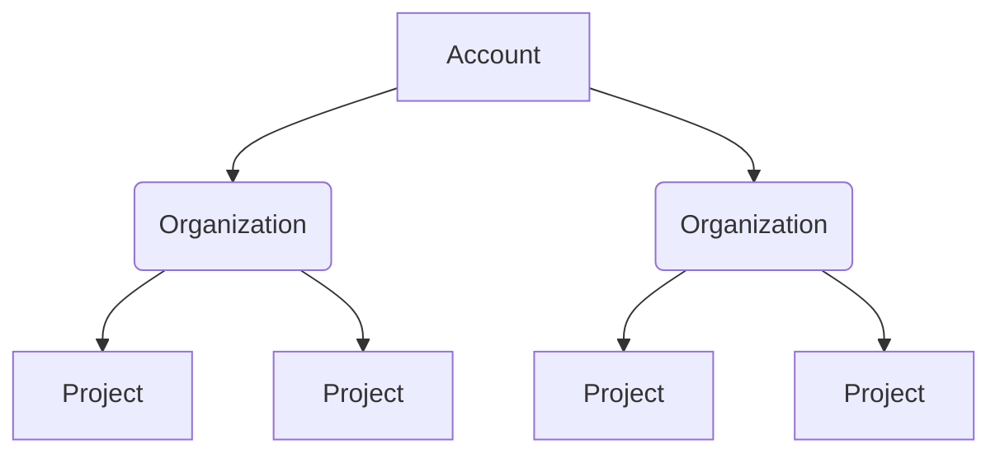
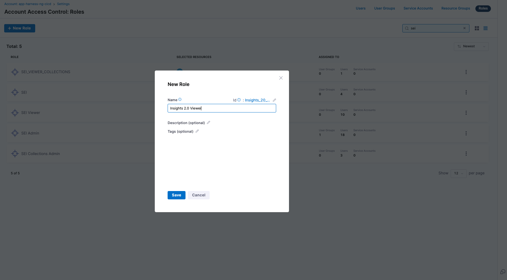
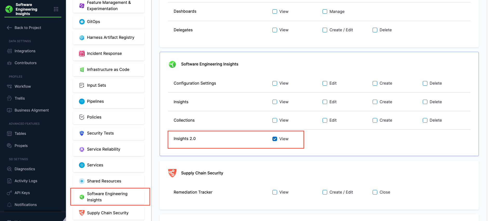
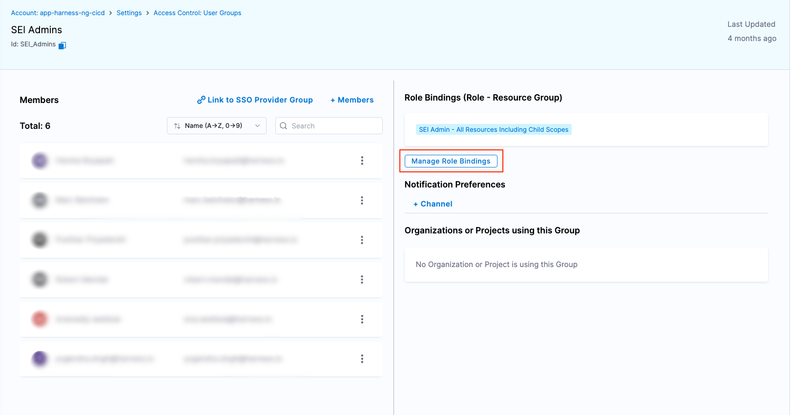

## Overview

Harness Role-based Access Control (RBAC) allows you to manage permissions for Harness SEI 2.0 resources and users. With SEI 2.0 integrated into the Harness RBAC framework, SEI permissions behave like any other Harness module—enabling consistent, scalable access control across your organization.

### Scopes in Harness RBAC

The Harness platform follows a three-level hierarchical structure. Each level (or scope) defines how permissions and resources are inherited and applied:

 

* **Account Scope**: Includes all organizations and projects within your Harness account. Resources created at the account level are available to all organizations and projects under that account.
* **Organization Scope**: Groups related projects, resources, and users. Resources created at the organization level are available to all projects within that organization but are not visible outside it.
* **Project Scope**: Contains resources specific to a project, such as SEI insights. Project-level resources are not shared with other projects or organizations.

Before configuring RBAC roles, ensure SEI 2.0 is enabled on your account. For more information about Harness RBAC, see the [Harness Platform documentation](/docs/platform/role-based-access-control/rbac-in-harness).

## Resources and scopes

Harness SEI enables you to control who can view, edit, and manage SEI data across account and project scopes.

| **Resource**              | **Scope(s)**     | **Notes**                                                                     |
| ------------------------- | ---------------- | ----------------------------------------------------------------------------- |
| Data settings             | Account, Project | Includes developer records (one per individual) and integrations (GitHub, Azure DevOps, Jira, Harness CI/CD, etc.). |
| Teams                     | Project          | Team and hierarchy definitions live at the project level.                      |
| Insights Categories       | Project          | Includes insight dashboards and data.                                                 |
| Profiles                  | Account          | Includes Efficiency, Productivity, and Business Alignment profiles.                                   |
| Goals / KPIs / Benchmarks | Project          | Targets, thresholds, and overrides for project-level metrics.                       |

## Out-of-the-box roles

Harness SEI provides out-of-the-box roles for setting up access in SEI 2.0: **SEI Admin**, **SEI Team Manager**, and **SEI Viewer**.

### SEI Admin (Account + Project Level)

The SEI Admin role enables users full control over SEI configurations and data.

| **Resource**              | **Scope(s)**      | **View** | **Edit** | **Create** | **Delete** | **Notes**                                 |
| ------------------------- | ----------------- | -------- | -------- | ---------- | ---------- | ----------------------------------------- |
| Data settings             | Account, Project  |    ✅   |    ✅   |    ✅     |    ✅     | Manage contributor data and integrations. |
| Teams                     | Project           |    ✅   |    ✅   |    ✅     |    ✅     | Manage team definitions in any project.                  |
| Insights                  | Project           |    ✅   |         |           |           | View insight dashboards.                          |
| Profiles                  | Account           |    ✅   |    ✅   |    ✅     |    ✅     | Manage org trees and profile assignments. |
| Goals / KPIs / Benchmarks | Project           |    ✅   |    ✅   |    ✅     |    ✅     | Set and edit KPIs,  thresholds, and overrides.         |

### SEI Team Manager (Project Level)

The SEI Team Manager role enables users to manage team configurations and developer records within a project.

| **Resource**                 | **Scope(s)**           | **View** | **Edit**            | **Create** | **Delete** | **Notes**                                 |
| ---------------------------- | ---------------------- | -------- | ------------------- | ---------- | ---------- | ----------------------------------------- |
| Data settings (Developers)   | Project                | ✅        | ✅                  |            |            | Can only update developer IDs.     |
| Teams                        | Project                | ✅        | ✅ (All teams in the project, unless restricted by resource group)                |            |            | Can manage team settings and memberships. |
| Insights                     | Project                | ✅        |                     |            |            | Read-only access.                         |
| Data settings (Integrations) | Account                | ✅        |                     |            |            | Read-only access.                     |
| Profiles                     | Project (read-through) | ✅        |                     |            |            | View relevant profile assignments at the project level.                   |
| Goals / KPIs / Benchmarks    | Project                | ✅        |                     |            |            | Read-only access to metric targets.                         |

### SEI Viewer (Project Level)

The SEI Viewer role enables users read-only access to SEI dashboards and data.

| **Resource**                 | **Scope(s)** | **View** | **Edit** | **Create** | **Delete** | **Notes**                  |
| ---------------------------- | ------------ | -------- | -------- | ---------- | ---------- | -------------------------- |
| Data settings (Developers)   | Project      | ✅        |          |            |            | View contributor activity and mappings. |
| Teams                        | Project      | ✅        |          |            |            | View team settings and org trees.     |
| Insights                     | Project      | ✅        |          |            |            | View dashboards.           |
| Data settings (Integrations) | Account      | ✅        |          |            |            | View-only access.                 |
| Profiles                     | Project      | ✅        |          |            |            | View-only access.                 |
| Goals / KPIs / Benchmarks    | Project      | ✅        |          |            |            | View-only access.                 |

## Create a role for SEI 2.0 access

If you're an **Account Admin**, follow these steps to create a role with SEI 2.0 access:

1. In **Harness**, go to **Account Settings** and then select **Access Control**.
1. Select **Roles** in the header, and then select **New Role**.
1. Give your role a **Name** (e.g. `SEI 2.0 Viewer`). **Description** and **Tags** are optional.

   

1. Select **Save**.
1. Scroll down to the **Software Engineering Insights** section.
1. Select the tab, check the box for **Insights 2.0**, and grant the **View** permission.

   

1. Click **Apply Changes**.

## Assign a role to users and groups

After creating the role, you’ll need to assign it to the users or user groups who require access to SEI 2.0. You can assign the role to individual users or to user groups, depending on your organization's access control preferences.

1. In **Harness**, go to **Account Settings**, and search for the user or user group where you want to assign the permissions.
1. Go to the **Role Bindings** tab, then select **Manage Role Bindings**.

   

1. Under **Role Bindings**, select **Add**.
1. Under **Roles**, click **Select** the role that you created earlier in [Step 2](#create-a-role-for-sei-20-access).
1. Under **Resource Groups**, select **All Resources Including Child Scopes**.

   

1. Select **Apply**. You will receive a notification stating Role Assignments updated successfully, and the role binding process is complete.

Once roles are assigned, users automatically gain access to SEI 2.0 within their existing projects.