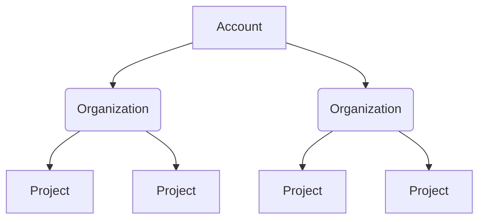
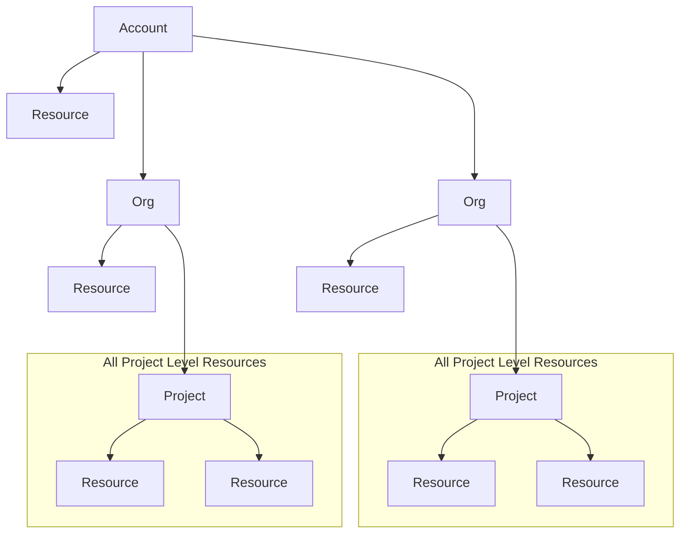

## Overview

Harness Role-based Access Control (RBAC) allows you to manage permissions for Harness SEI 2.0 resources and users. With SEI 2.0 integrated into the Harness RBAC framework, SEI permissions behave like any other Harness module—enabling consistent, scalable access control across your organization.

### Scopes in Harness RBAC

The Harness platform follows a three-level hierarchical structure. Each level (or scope) defines how permissions and resources are inherited and applied:



<br />

* **Account Scope**: Includes all organizations and projects within your Harness account. Resources created at the account level are available to all organizations and projects under that account.
* **Organization Scope**: Groups related projects, resources, and users. Resources created at the organization level are available to all projects within that organization but are not visible outside it.
* **Project Scope**: Contains resources specific to a project, such as SEI insights. Project-level resources are not shared with other projects or organizations.

Before configuring RBAC roles, ensure SEI 2.0 is enabled on your account. For more information about Harness RBAC, see the [Harness Platform documentation](/docs/platform/role-based-access-control/rbac-in-harness).

## Resources and scopes

Harness SEI enables you to control who can view, edit, and manage SEI data across account and project scopes.

| **Resource**              | **Scope(s)**     | **Notes**                                                                     |
| ------------------------- | ---------------- | ----------------------------------------------------------------------------- |
| Data settings             | Account, Project | Includes developer records (one per individual) and integrations (GitHub, Azure DevOps, Jira, Harness CI/CD, etc.). |
| Teams                     | Project          | Team and hierarchy definitions live at the project level.                      |
| Insights Categories       | Project          | Includes insight dashboards and data.                                                 |
| Profiles                  | Account          | Includes Efficiency, Productivity, and Business Alignment profiles.                                   |

## Out-of-the-box roles

Harness SEI provides out-of-the-box roles for setting up access in SEI 2.0: **SEI Admin**, **SEI Team Manager**, and **SEI Viewer**.

### SEI Admin (Account + Project Level)

The SEI Admin role enables users full control over SEI configurations and data.

| **Resource**              | **Scope(s)**      | **View** | **Edit** | **Create** | **Delete** | **Notes**                                 |
| ------------------------- | ----------------- | -------- | -------- | ---------- | ---------- | ----------------------------------------- |
| Data settings             | Account, Project  |    ✅   |    ✅   |    ✅     |    ✅     | Manage contributor data and integrations. |
| Teams                     | Project           |    ✅   |    ✅   |    ✅     |    ✅     | Manage team definitions in any project.                  |
| Insights                  | Project           |    ✅   |         |           |           | View insight dashboards.                          |
| Profiles                  | Account           |    ✅   |    ✅   |    ✅     |    ✅     | Manage org trees and profile assignments. |

### SEI Team Manager (Project Level)

The SEI Team Manager role enables users to manage team configurations and developer records within a project.

| **Resource**                 | **Scope(s)**           | **View** | **Edit**            | **Create** | **Delete** | **Notes**                                 |
| ---------------------------- | ---------------------- | -------- | ------------------- | ---------- | ---------- | ----------------------------------------- |
| Data settings (Developers)   | Project                | ✅        | ✅                  |            |            | Can only update developer IDs.     |
| Teams                        | Project                | ✅        | ✅ (All teams in the project, unless restricted by resource group)                |            |            | Can manage team settings and memberships. |
| Insights                     | Project                | ✅        |                     |            |            | Read-only access.                         |
| Data settings (Integrations) | Account                | ✅        |                     |            |            | Read-only access.                     |
| Profiles                     | Project (read-through) | ✅        |                     |            |            | View relevant profile assignments at the project level.                   |

### SEI Viewer (Project Level)

The SEI Viewer role enables users read-only access to SEI dashboards and data.

| **Resource**                 | **Scope(s)** | **View** | **Edit** | **Create** | **Delete** | **Notes**                  |
| ---------------------------- | ------------ | -------- | -------- | ---------- | ---------- | -------------------------- |
| Data settings (Developers)   | Project      | ✅        |          |            |            | View contributor activity and mappings. |
| Teams                        | Project      | ✅        |          |            |            | View team settings and org trees.     |
| Insights                     | Project      | ✅        |          |            |            | View dashboards.           |
| Data settings (Integrations) | Account      | ✅        |          |            |            | View-only access.                 |
| Profiles                     | Project      | ✅        |          |            |            | View-only access.                 |


## Create a role and assign users and groups

import Tabs from '@theme/Tabs';
import TabItem from '@theme/TabItem';

<Tabs queryString="rbac-walkthroughs">
<TabItem value="ootb" label="OOTB Role">

If you're an **Account Admin**, follow these steps to assign an out-of-the-box role (such as `SEI Admin`) with account and project level access to an existing user or group in SEI 2.0. 

<DocVideo src="https://app.tango.us/app/embed/b85251d7-006c-4a0a-8aa8-fbc63210ca86?skipCover=true&defaultListView=false&skipBranding=false&makeViewOnly=true&hideAuthorAndDetails=true" title="Assign an SEI Admin Role in Harness" />

</TabItem>
<TabItem value="custom" label="Custom Role">

If you're an **Account Admin**, follow these steps to create a custom role with view access in SEI 2.0. After creating the role, you’ll need to assign it to the users or user groups who require access to SEI 2.0. 

<DocVideo src="https://app.tango.us/app/embed/eafeddf9-0887-4c3a-9b48-b777d1d43b16?skipCover=true&defaultListView=false&skipBranding=false&makeViewOnly=true&hideAuthorAndDetails=true" title="Create and Assign Custom Roles in Harness SEI" />

You can assign the role to individual users or to user groups, depending on your organization's access control preferences. 

</TabItem>
</Tabs>

Once roles are assigned, users automatically gain access to SEI 2.0 within their existing projects.

## Create a resource group using the Harness API

You can programmatically create and manage [resource groups](/docs/platform/role-based-access-control/add-resource-groups) using the [Harness Platform API](https://apidocs.harness.io/project-resource-groups) when you need to set up SEI 2.0 access for multiple teams, each with its own resource group and user assignments.

If a resource group includes specified projects, it provides access to resources in one or more selected projects. This option is available for resource groups created at the org scope, and you can use it to provide multi-project access without granting access to all projects under an org.

**All Project Level Resources** includes all resources in the project's scope. This is set for each project. If you have multiple projects, you have an **All Project Level Resources** for each project.



### Prerequisites

- A valid [Harness API key](/docs/platform/automation/api/add-and-manage-api-keys/) with permissions to manage resource groups
- Your Harness Account ID, Org ID, and Project ID
- SEI 2.0 enabled in your project

### Create a resource group and role assignment

Create a project-level resource group to define which users or user groups have access to specific resources in SEI 2.0. Each resource group acts as a logical boundary (for example, one per engineering team) and includes both the resources it controls and the associated [role assignments](https://apidocs.harness.io/project-role-assignments).

1. List existing resource groups. Use the following request to confirm which resource groups already exist in your SEI project:

   ```bash
   curl -i -X GET \
     'https://app.harness.io/v1/orgs/{ORG_ID}/projects/{PROJECT_ID}/resource-groups?page=0&limit=30&search_term=string&sort=identifier&order=ASC' \
     -H 'Harness-Account: string' \
     -H 'x-api-key: <YOUR_API_KEY>'
   ```

1. Create a resource group (for example, `team-bravo`) and define its scope and resources.

   ```bash
   curl -i -X POST \
     'https://app.harness.io/v1/orgs/{org}/projects/{project}/resource-groups' \
     -H 'Content-Type: application/json' \
     -H 'Harness-Account: string' \
     -H 'x-api-key: <YOUR_API_KEY>' \
     -d '{
       "identifier": "team-bravo",
       "name": "Team Bravo",
       "color": "#0063F7",
       "tags": {
         "team": "bravo",
         "environment": "prod"
       },
       "description": "This is a resource group for Team Bravo, providing access to SEI 2.0.",
       "included_scope": [
         {
           "filter": "EXCLUDING_CHILD_SCOPES",
           "account": "<ACCOUNT_ID>",
           "org": "<ORG_ID>",
           "project": "<PROJECT_ID>"
         }
       ],
       "resource_filter": [
         {
           "resource_type": "SEI_PROFILE",
           "identifiers": [
             "team-bravo-profile"
           ],
           "attribute_name": "team",
           "attribute_values": [
             "bravo"
           ]
         }
       ],
       "include_all_resources": false
     }'
   ```

   Customize the following key fields in your request:

   | Field                   | Description                                                                     |
   | ----------------------- | ------------------------------------------------------------------------------- |
   | `identifier`            | Unique ID for the resource group.                                               |
   | `name`                  | Display name for the resource group.                                            |
   | `color`                 | (Optional) Custom color for visual identification.                              |
   | `tags`                  | Key-value pairs for metadata or categorization.                                 |
   | `included_scope`        | Defines the account, org, and project where the group applies.                  |
   | `resource_filter`       | Specifies which SEI resources (e.g., profiles, integrations) the group manages. |
   | `include_all_resources` | Set to `true` to include all resources in the scope.                            |

   This request creates a resource group scoped to the `Team Bravo` project.

1. Assign developers (as users or user groups) to the resource group by creating a [role assignment](https://apidocs.harness.io/project-role-assignments).

   ```bash
   curl -i -X POST \
     'https://app.harness.io/v1/orgs/{org}/projects/{project}/role-assignments' \
     -H 'Content-Type: application/json' \
     -H 'Harness-Account: string' \
     -H 'x-api-key: <YOUR_API_KEY>' \
     -d '{
       "identifier": "team_bravo_dev_assignment",
       "resource_group": "team_bravo_resource_group",
       "role": "Developer",
       "principal": {
         "scope": "ACCOUNT",
         "identifier": "team_bravo_user_group",
         "type": "USER_GROUP" // you can use "USER" or "SERVICE_ACCOUNT"
       },
       "disabled": false,
       "managed": false
     }'
   ```

   This request assigns the `Developer` role to the `Team Bravo` user group, granting access to the resources in the `team_bravo_resource_group`. 

1. Verify the role assignment was created successfully.

   ```bash
   curl -i -X GET \
    'https://app.harness.io/v1/orgs/{org}/projects/{project}/role-assignments/{role-assignment}' \
    -H 'Harness-Account: string' \
    -H 'x-api-key: <YOUR_API_KEY>'
   ```

For more information, see the [Harness Platform API documentation](https://apidocs.harness.io/project-resource-groups/delete-resource-group-project).