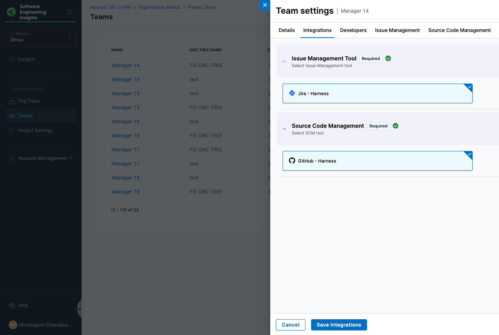

## Overview

Harness Software Engineering Insights (SEI) 2.0 is a complete re-imagination of how engineering organizations can understand, measure, and improve software delivery. It brings together signals across your software delivery lifecycle (SDLC), connects them with organizational context, and transforms them into actionable insights for teams, managers, and executives.

SEI 2.0 is built around a set of flexible building blocks that help you answer critical questions like:

* Are our engineering teams operating efficiently?
* How is work flowing from idea to production?
* Where are the bottlenecks in our delivery pipeline?
* Are we meeting our reliability and velocity goals?

## Core Concepts

To answer these questions, SEI 2.0 introduces a simplified and extensible data model. This data model diagram walks through how SEI handles organizational data and insights, including:

* [Developers](#developers): Imported from HR systems via CSV and managed at the account level.
* [Org Tree(s)](#org-tree): Developers are grouped based on attributes like `Manager`, `Location`, `Role`, `Employment Type`, or `Project`. Leaf nods of the Org Tree becomes Teams.
* [Team](#teams): Team Managers are assigned by the SEI Admin at the project level and configure team-specific settings (e.g. Jira projects, Git repos, production services, and pipelines) influenced by associated Profiles.
* [Profiles](#profiles): Define which insights to enable and how they are computed, and are associated with one or more Org Trees to guide all insights calculations.
* [Dashboards/Insights](#dashboards--insights): Generated using data filtered by Profiles, Teams, and Org Tree context.

:::tip
The foundation of Harness SEI is the account-level [Integrations setup](/docs/category/configure-integrations) by the SEI Admin. These integrations must be configured before importing developers or creating Org Trees.
:::

### Developers

Developers are the foundational unit in SEI 2.0. Every insight, metric, and trend in the platform starts with accurate identification and attribution of developer activity across your toolchain.
SEI automatically handles the complexity of identity mapping across systems like GitHub, GitLab, Jira, Bitbucket, PagerDuty, and more so you don’t have to based on developer email.
Developers can belong to multiple teams across different Org Trees and Projects, based on the grouping logic defined in your Org Tree.

### Org Tree

The Org Tree represents your organizational hierarchy and structure in SEI 2.0. It provides the foundation for grouping developers and replicating the org hierarchy into SEI 2.0.
At present, the Org Tree is powered by CSV-based imports from your HRIS system (e.g., Workday, BambooHR). The CSV must include a contributor attribute (such as ManagerEmail or ManagerID) that defines the reporting relationship between individuals.

Using this structure, SEI 2.0 automatically builds a manager and reportee tree, allowing you to view and analyze metrics in the context of real-world teams and reporting lines.

:::note Coming Soon
Multi-level groupings based on custom attributes (e.g., Department → Function → Team) will be supported in future iterations. This will allow organizations to model more complex hierarchies and operational structures, making it easier to analyze engineering performance across departments, locations, and lines of business.
:::

### Teams

Teams are the core unit of measurement in SEI 2.0. Every leaf node in the Org Tree is treated as a Team, making it the fundamental grouping for surfacing insights, applying goals, and driving accountability.

Each Team represents a group of developers working together within the organizational hierarchy and is automatically derived from the Org Tree structure.

#### Key Characteristics

* **Auto-derived:** Every leaf node in the Org Tree is automatically considered a Team.
* **Configurable:** Each Team has its own configuration to define how metrics are calculated and displayed.
* **Contextualized and metric specific settings:** Teams include metadata such as associated integrations, relevant services, repositories, destination branches, pipelines, environments, etc.

This configuration layer adds precision to how metrics like Deployment Frequency, Lead Time, MTTR, and others are calculated, which ensures each metric reflects the real scope, velocity, and complexity of the team's delivery lifecycle.

### Profiles

**Profiles** control **what SEI 2.0 measures** and **how it measures it** by enabling or disabling specific metrics and defining which event types power those metrics. They provide a flexible way to customize SEI 2.0 insights to your organization’s goals and workflows.

Each Profile includes which **metrics** are enabled or disabled (e.g., Deployment Frequency, Lead Time, Change Failure Rate) and the **events and signals** that power those metrics.

#### Types of Profiles

SEI 2.0 supports three main types of Profiles, each optimized for different measurement objectives:

| Type of profile      | Purpose                                  | Metrics                                                  |
|---------------------|---------------------------------------------|-----------------------------------------------------------------|
| Efficiency      | Delivery performance (DORA metrics) & sprint insights (coming soon) | Deployment Frequency, Lead Time for Changes, Change Failure Rate, MTTR |
| Productivity    | Developer productivity and collaboration     | PR Velocity per Dev, PR Cycle Time,  Work Completed Per Dev, Coding Days Per Dev, Number of Comments Per PR, Average Time to First Comment  |
| Business Alignment | Alignment of engineering output to business goals | Business Alignment  |

#### Relationship to Org Tree & Teams

- Teams define **where the data comes from** (repositories, pipelines, services, etc).
- Profiles define **what data is used and how** to calculate each metric.
- Each **Org Tree** can have **only one Profile of each type** (Efficiency, Productivity, Business Alignment).
- The assigned Profile applies to the **entire Org Tree and all Teams within it**.
- This ensures consistent measurement and reporting across all organizational units under that tree.

### Dashboards / Insights

SEI 2.0 gives you immediate visibility into what matters most—with powerful, out-of-the-box dashboards. Whether you're focused on shipping faster, improving collaboration, or aligning engineering with business goals, these dashboards are designed to deliver impact from day one.

#### Out-of-the-Box dashboards

* Efficiency: Get a complete picture of your engineering throughput and stability. This dashboard combines **DORA Metrics** and **Sprint Insights** to highlight how reliably and predictably your teams are delivering
  * Metrics included:
    * Deployment Frequency
    * Lead Time for Changes
    * MTTR
    * Change Failure Rate

* Productivity: Understand how developers are working across pull requests, reviews, commits, and collaboration. Built for visibility into the day-to-day collaboration and flow of your teams.
  * Metrics included:
    * PR Velocity per Dev
    * PR Cycle Time
    * Work Completed Per Dev
    * Coding Days Per Dev
    * Number of Comments Per PR
    * Average Time to First Comment

* Business Alignment (Coming Soon): The one dashboard that you need to track how engineering output maps to product and business goals.

:::note Built for Every Level of the Org

All dashboards are automatically scoped using your **Org Tree**, **Teams**, and **Profiles** so whether you’re a developer, team lead, or exec, you get the insights that matter most to you.
:::