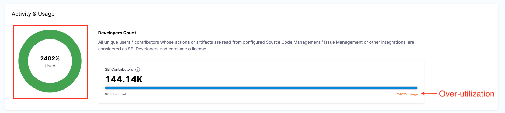
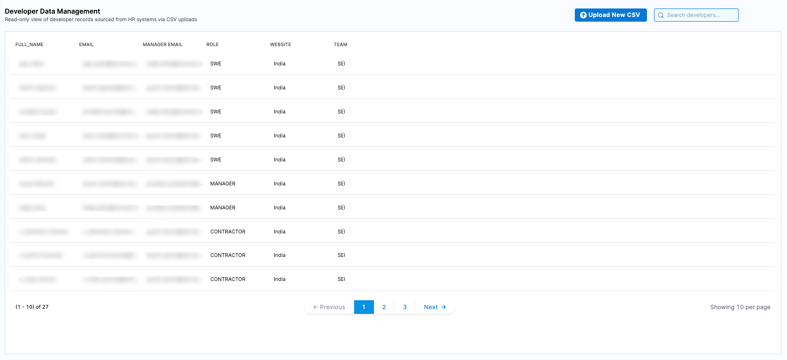

You can quickly and securely manage your SEI subscription directly through your account at any time. See clear details on your subscription, and associated usage details.
Note: This page details the new Developer Licensing model. The old Contributor model has been deprecated. The new model continues to be aligned with the goal of building analytics for Developers in your Engineering organization, and does so effectively.

## License overview

Your SEI subscription includes a specific number of **Developer licenses**, which track the number of **Developers** for which SEI is generating insights, and consuming a Developer license.

### Who is a Developer?

SEI Developer Licensing model allows SEI Admins to be in complete control of their license consumption. Developers represent any engineers in the organization that contribute to software development and for whom you explicitly choose to generate insights for. SEI allows SEI admins to import and manage the list of all developers for whom you care for receiving engineering insights. These developers then consume a developer license, irrespective of whether they access the Harness platform or not. Insights are commonly accessed / managed by engineering leaders and managers. There is unlimited access to Insights and no license is consumed simply by the act of logging into the Harness platform and accessing Insights.

### View license usage

You can view and manage your Harness SEI subscription in your **Harness Account Settings**.

In your Harness account, go to **Account Settings** to view which Harness modules you are currently subscribed to. Subscriptions are shown in the **Subscribed Modules** section on the **Overview** page. You can select Manage to go to the **Subscriptions** page.

### Activity & usage

On the Subscriptions page, you will find a detailed summary of your license activity and usage metrics.

* **Total licenses purchased:** Displays the number of contributor licenses included in your plan.
* **Subscription period:** Shows the start and end dates of your current plan.
* **Usage insights:** The **Activity & usage** section highlights the total number of Developer licenses consumed.

The **Activity & usage** section provides real-time data on how many Developer licenses are being utilized. An unexpectedly high number of active contributors compared to the allocated licenses might indicate issues like duplicate records. 

If your usage exceeds the purchased licenses, it is recommended to review the Developer records and assess if there are Developers you don't need Insights for. You can always update the Developer table to only have the right intended Developers, and hence control license consumption. Note that doing so, ensures that no Insights are generated for the Developers that are removed from the Developer table.

### See also

* [Manage developers](/docs/software-engineering-insights/harness-sei/setup-sei/upload-developer-records)
