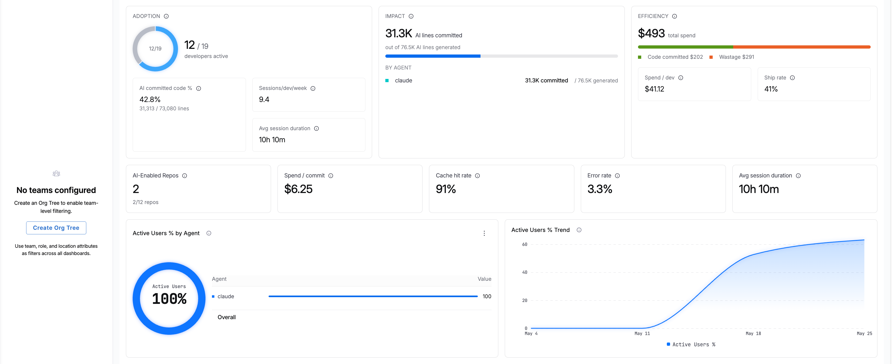
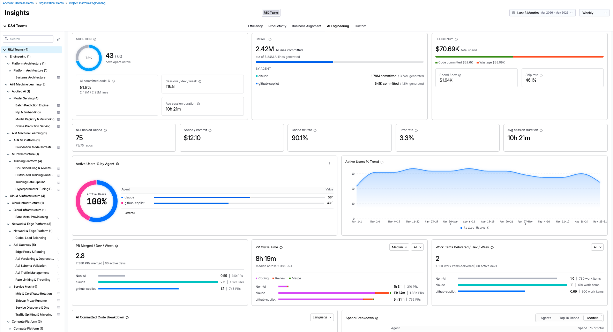
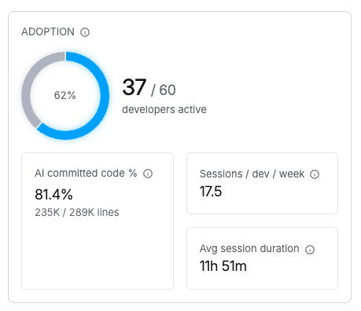
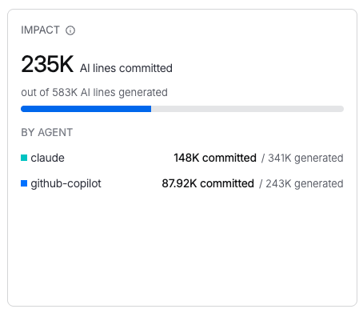
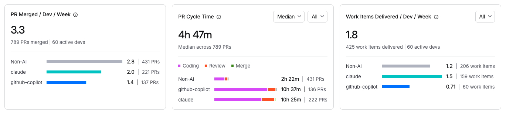
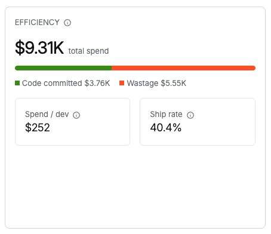
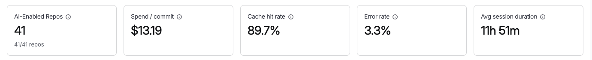
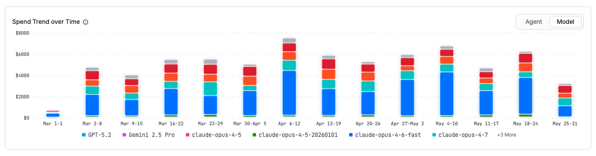
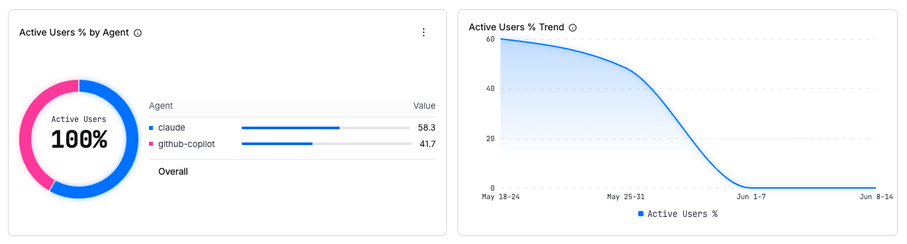
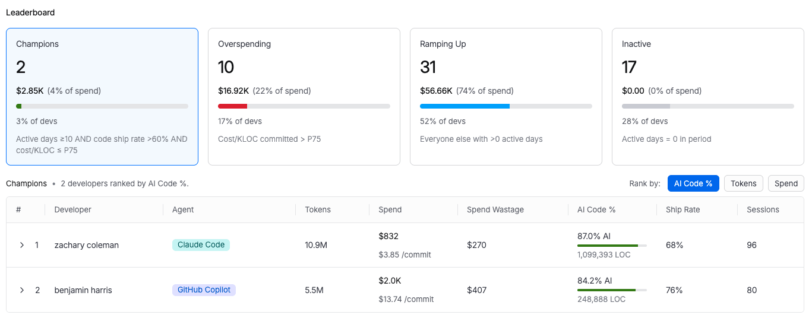

<CTABanner
  buttonText="Request Access"
  title="AI Engineering Insights is in beta!"
  tagline="Enable AI Engineering Insights to measure AI adoption and impact on productivity and quality across your teams. Available now in beta!"
  link="https://developer.harness.io/docs/software-engineering-insights/sei-support"
  closable={true}
  target="_self"
/>

AI Engineering Insights provides real-time visibility into how developers use AI coding tools across your organization. It surfaces agent-level signals alongside engineering outcomes so you can measure adoption, quantify code output, track cost efficiency, and compare AI-assisted development against unassisted work.

:::info
This dashboard is powered by the [Harness AI DLC Agent](/docs/software-engineering-insights/harness-sei/setup-sei/agent/). The agent must be deployed to developer machines before data appears here.
:::

## Before you begin

- **Harness AI DLC Agent:** Install the agent on developer machines to collect AI coding telemetry. Go to [Harness AI DLC Agent](/docs/software-engineering-insights/harness-sei/setup-sei/agent/) to set up the agent.
- **Insight access:** Contact [Harness Support](/docs/software-engineering-insights/sei-support) to enable AI Engineering Insights for your organization.
- **Org Tree (optional):** Create an [Org Tree](/docs/software-engineering-insights/harness-sei/setup-sei/setup-org-tree) to slice metrics by team or manager.

## Video walkthrough

The following video provides an overview of the AI Engineering Insights dashboard, including how to interpret key metrics and filter data by team.

<iframe width="900" height="500" src="https://www.youtube.com/embed/Np3ZNeFwdwY?si=T7s8Tk_rRlhaHF--" title="AI Engineering Insights walkthrough" frameborder="0" allow="accelerometer; autoplay; clipboard-write; encrypted-media; gyroscope; picture-in-picture; web-share" referrerpolicy="strict-origin-when-cross-origin" allowfullscreen></iframe>

## Dashboard overview

On first load, you see an organization-level view of all AI activity across all developers in your organization.

*Organization-level view showing AI activity across all developers with the Harness AI DLC Agent installed.*

If your account has multiple Org Trees configured, they appear as tiles at the top of the dashboard. Select an Org Tree tile to filter all metrics to the teams and developers within that tree.

You can adjust the time range (last several weeks, months, or a custom range) and granularity (weekly, monthly, or quarterly) to control how data is grouped in charts.

## Adoption

Measures how widely AI coding agents are adopted across your organization. The goal of adoption metrics is to help you measure not just access and utilization but actual usage and volume of work done using AI.

*Organization-level view showing AI adoption metrics all developers with the Harness AI DLC Agent installed.*

| Metric | Description |
| --- | --- |
| **Adoption %** | Percentage of total developers actively using an AI coding agent, shown as a donut chart. |
| **Active developers** | Number of developers with agent activity out of total developers (for example, 30/30). |
| **AI Committed Code %** | Percentage of committed lines generated by AI coding agents (AI lines committed / total lines committed). |
| **Sessions/dev/week** | Average number of AI coding sessions per developer per period. |
| **Avg session duration** | Average length of an AI coding session from start to finish. |

**What to look for:** A low adoption percentage with high session duration among active users suggests a small group is getting value but the tool has not spread. Investigate license distribution and onboarding gaps.

Metric calculations

**Adoption rate:**

$$
\text{Adoption Rate} = \frac{\text{Active Users}}{\text{Total Developers in Org or Team}} \times 100
$$

Active Users is the count of distinct developers with at least one recorded AI coding agent session in the selected period. Total Developers is all developer records imported into the system who have the AI DLC Agent installed in their workstations.

**AI Committed Code %:**

$$
\text{AI Committed Code \%} = \frac{\text{AI-generated lines in commits}}{\text{Total lines committed}} \times 100
$$

A line is considered AI-generated if the agent session that produced it is correlated to the commit via session-to-commit attribution.

**Sessions/dev/granularity:**

$$
\text{Sessions/Dev} = \frac{\text{Total AI Sessions in period}}{\text{Active Users} \times \text{Number of granularity units in period}}
$$

For example, for a monthly granularity over a 6-month range: Total Sessions / Active Users / 6.

**Avg session duration:**

$$
\text{Avg Session Duration} = \frac{\sum(\text{session\_end\_time} - \text{session\_start\_time})}{\text{COUNT(sessions)}}
$$

Session start is captured at the pre-hook and session end at the post-hook.

## Impact

Measures the tangible output generated by AI agents, including lines of code written, how much of that code was committed, and how AI-assisted development compares to unassisted development.

| Metric | Description |
| --- | --- |
| **AI Lines Generated** | Total lines of code produced by AI coding agents during sessions, counted at generation time regardless of whether the developer kept or discarded them. |
| **AI Lines Committed** | Lines of AI-generated code that were actually committed to a repository branch. |

The tile shows AI lines committed out of total AI lines generated (for example, 22.5k committed / 52.2k generated) as a bar chart broken down by agent type.

*Organization-level view showing AI impact metrics all developers with the Harness AI DLC Agent installed.*

**What to look for:** If the ratio of committed lines to generated lines is consistently low across a team or agent, it may indicate that AI output does not match project conventions, or that developers are using AI for exploration rather than production code. Go to [Usage efficiency](#usage-efficiency) to review Ship Rate by developer and identify where to invest in better context files (`CLAUDE.md`, `.cursorrules`) for those repositories.

## Correlate AI usage with engineering outcomes

The following charts compare engineering output between developers using AI coding agents and developers without AI (labeled **Non-AI**). Each chart plots both lines to provide a baseline comparison.

Hover over a data point to see the metric value, total count in parentheses (for example, number of PRs), and the number of developers included in that calculation.

### PR Merged/Dev

Average number of pull requests merged per active developer in the selected granularity, attributed by AI tool.

$$
\text{PRs/Dev} = \frac{\text{Merged PRs (AI or Non-AI)}}{\text{Developers in group}}
$$

PRs are included if their merge timestamp falls within the selected range. Requires an SCM connection.

Each data point shows the average PRs merged, total PR count, and number of developers. For example: **0.40 (10 PRs) | 5 devs** for Claude, compared to **1.5 (126 PRs) | 17 devs** for Non-AI.

### PR Cycle Time

Median time from PR open to merge, broken down into **Coding**, **Review**, and **Merge** phases per AI tool. Use the headline picker to switch between Median, Mean, p90, and p95. A second selector filters by work type: **All**, **Features**, **Bugs**, or **Others**.

$$
\text{Cycle Time} = \text{MEDIAN}(\text{merge\_timestamp} - \text{open\_timestamp})
$$

For AI-assisted PRs, only PRs containing at least one AI-attributed commit are included. For Non-AI PRs, only PRs with zero AI-attributed commits are included. When you switch the headline picker to Mean, p90, or p95, the aggregation function changes accordingly.

Each data point shows total cycle time, PR count, and number of developers. For example: **5.5h (10 PRs) | 5 devs** for Claude, compared to **19.6h (126 PRs) | 17 devs** for Non-AI.

### Work Items Delivered/Dev

Average number of work items delivered per active developer in the selected granularity, attributed by AI tool. Filter by **All**, **Features**, **Bugs**, or **Others**.

A work item is considered AI-assisted if any PR linked to it contains AI-attributed commits. Requires an issue tracker integration and SCM connection. One issue linked to multiple PRs counts once.

$$
\text{Work Items/Dev} = \frac{\text{COUNT(distinct issues resolved by group PRs)}}{\text{Developers in group}}
$$

Each data point shows average work items delivered, total count, and number of developers. For example: **0.40 (2 work items) | 1 dev** for Claude, compared to **0.91 (64 work items) | 14 devs** for Non-AI.

## Efficiency

Efficiency is measured through two lenses. **Spend efficiency** answers whether your organization is spending on AI in an optimized way (spend per commit, wastage etc). **Usage efficiency** answers whether developers are using AI models to their best capabilities (cache utilization, code retention, error rates etc).

### Spend efficiency

| Metric | Description |
| --- | --- |
| **Total spend** | Total AI agent spend for the selected period. |
| **Code committed spend** | Portion of spend attributed to sessions that produced committed code (shown in green). |
| **Wastage** | Spend on sessions where no code was committed (shown in orange). |
| **Spend/dev** | Average AI agent spend per active developer. |
| **Spend/commit** | Average AI agent cost per code commit. |

**What to look for:** High wastage relative to total spend indicates developers are running sessions that produce no committed code. Compare wastage trends against the AI-Enabled Repos count: repositories without context files tend to produce higher wastage. If spend/commit is rising while AI Committed Code % remains flat, investigate whether sessions are becoming longer without proportional output.

### Usage efficiency

| Metric | Description |
| --- | --- |
| **Cache hit rate** | Percentage of AI requests served from the model prompt cache. A higher rate indicates more efficient token reuse and lower cost. |
| **AI-Enabled Repos** | Repositories with AI-ready context files (for example, `CLAUDE.md`, `AGENTS.md`, `.cursorrules`) that provide agents with project conventions and guardrails. |
| **Ship Rate** | Percentage of AI-generated lines that were committed (AI Lines Committed / AI Lines Generated x 100). |
| **Error Rate** | Percentage of AI agent tool calls that ended in an error or failure. |

**What to look for:** A low Ship Rate combined with a high Error Rate suggests the agent is failing frequently and producing code that developers discard. Check whether affected repositories have context files and whether the error types point to misconfigured tools or network issues. A high Cache Hit Rate is a positive signal that prompts are well-structured and reusing context efficiently.

Metric calculations

**Total spend:**

$$
\text{Total Spend} = \sum(\text{input\_tokens} \times \text{model\_input\_price} + \text{output\_tokens} \times \text{model\_output\_price})
$$

Summed across all sessions, developers, agents, and models in the selected period. Token prices are per-model (for example, Claude Sonnet input = \$3/MTok, output = \$15/MTok). Cached tokens use the cached price tier.

**Spend/dev:**

$$
\text{Spend/Dev} = \frac{\text{Total Spend}}{\text{Active Users}}
$$

Only active users (developers with at least one session) are included, not total org headcount.

**Spend/commit:**

$$
\text{Spend/Commit} = \frac{\text{Total Spend}}{\text{COUNT(commits containing AI-attributed lines)}}
$$

Only commits containing at least one AI-attributed line are counted.

**Cache hit rate:**

$$
\text{Cache Hit Rate} = \frac{\text{Cached Prompt Tokens}}{\text{Total Prompt Tokens}} \times 100
$$

Cached Prompt Tokens are tokens served from context cache (not reprocessed). Total Prompt Tokens are all input tokens sent to models.

**Ship Rate:**

$$
\text{Ship Rate} = \frac{\text{AI Lines Committed}}{\text{AI Lines Generated}} \times 100
$$

**Error Rate:**

$$
\text{Error Rate} = \frac{\text{Failed Tool Calls} + \text{Failed Ops}}{\text{Total Tool Calls} + \text{Total Ops}} \times 100
$$

Failures include tool calls that returned an error, MCP generation errors, and file/command operation failures. Tracked per session then aggregated.

## Spend efficiency charts

### Spend Trend Over Time

Token spend over time, broken down by agent, model, or work type. Toggle the chart to view spend by **Agent** (for example, Claude Code) or **Model** (for example, `claude-sonnet-4-5-20250514`). The X-axis shows time intervals and the Y-axis shows spend in dollars.

For each time bucket $T$ and agent $A$:

$$
\text{Spend}(T, A) = \sum \text{token cost for sessions in bucket } T \text{ using agent } A
$$

### Spend Breakdown

Proportional breakdown of token spend displayed as a donut chart. Toggle between:

- **Agents:** Spend by agent type, showing each agent's dollar amount and percentage of total.
- **Top 10 Repos:** Spend by repository.
- **Models:** Spend by model identifier.

## Adoption charts

### Active Users % by Agent

Percentage of developers using each coding agent out of total developers with the Harness AI DLC Agent installed and active.

For each agent $A$:

$$
\text{Agent Share} = \frac{\text{COUNT(distinct devs using agent } A\text{)}}{\text{Active Users}} \times 100
$$

A developer using two agents counts fractionally toward each based on session split.

### Active Users % Trend

Tracks adoption growth over time. The chart plots the percentage of developers with active AI coding sessions across the selected time range and granularity (for example, weekly from May 4 through May 25).

### AI Committed Code Breakdown

Distribution of AI-authored code across categories, displayed as a donut chart. Each segment represents one category's share of all AI-written code for the selected period.

For each agent $A$:

$$
\text{Agent Share} = \frac{\text{SUM(committed lines attributed to sessions using agent } A\text{)}}{\text{Total AI Lines Committed}} \times 100
$$

Use the dropdown to switch between:

- **Language:** Breakdown by programming language (for example, Rust 39.28%, Other 43.57%).
- **Type:** Breakdown by code type: Code, Documentation, Script, Test, Configuration, Migration, or Other.

## Leaderboard

The Leaderboard ranks all developers in your organization by the selected metric. The default view ranks by **AI Committed Code %** and shows all developers with Harness Agent activity.

Use the **Rank by** selector to switch between **AI Committed Code %**, **Total Spend**, and **Spend Wastage**.

| Column | Description |
| --- | --- |
| **Rank** | Developer's position for the selected metric. |
| **Developer** | Developer name. |
| **Agent** | AI coding agent used by the developer. |
| **AI Committed Code %** | Percentage of the developer's committed lines generated by AI. |
| **AI Lines of Code** | Total AI-generated lines committed by the developer. |
| **Sessions** | Number of AI coding sessions in the selected period. |
| **Avg Session Duration** | Average length of the developer's AI coding sessions. |
| **Tokens Used** | Total token consumption for the selected period. |
| **Total Spend** | Total AI agent spend attributed to the developer. |
| **Spend/Commit** | Average cost per code commit. |
| **Spend Wastage** | Spend on sessions where no code was committed. |
| **Cache Hit Rate** | Percentage of this developer's AI requests served from cache. |
| **Error Rate** | Percentage of this developer's AI agent tool calls that ended in error. |
| **Ship Rate** | Percentage of AI-generated code that was committed by this developer. |

:::info Using the older AI Insights dashboard?
AI Engineering Insights replaces the earlier [AI Insights](/docs/software-engineering-insights/harness-sei/insights/ai) experience. The previous version used AI coding assistant APIs only. AI Engineering Insights uses a hybrid approach: a lightweight agent on developer machines combined with API data, enabling richer telemetry and more accurate commit attribution. The AI Insights experience will be deprecated and removed in a future release.
:::