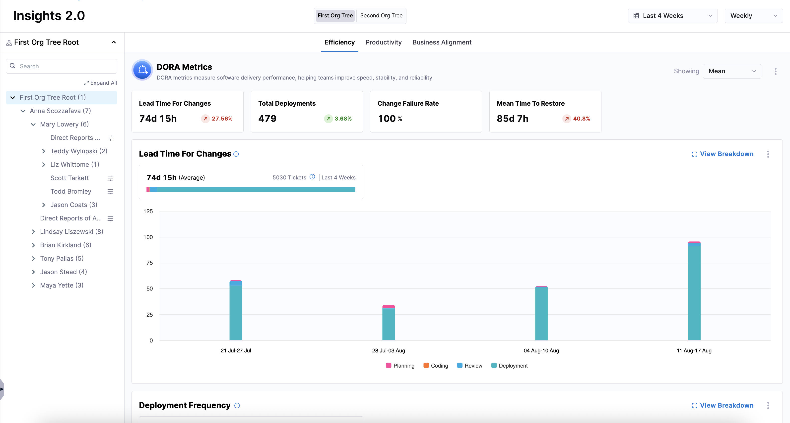
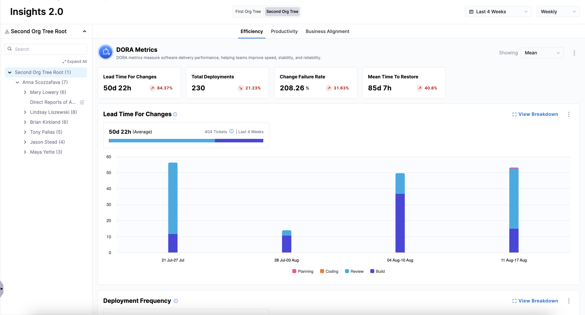
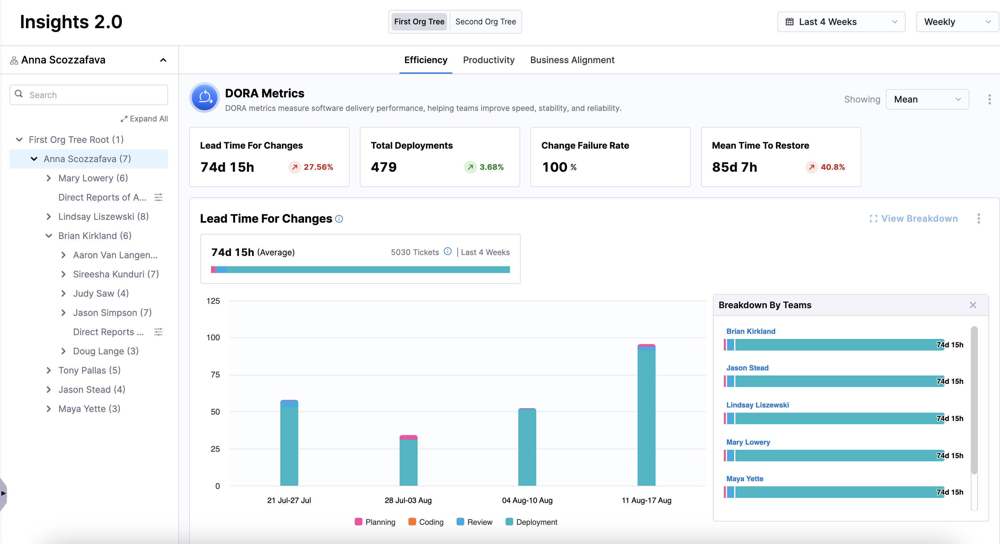
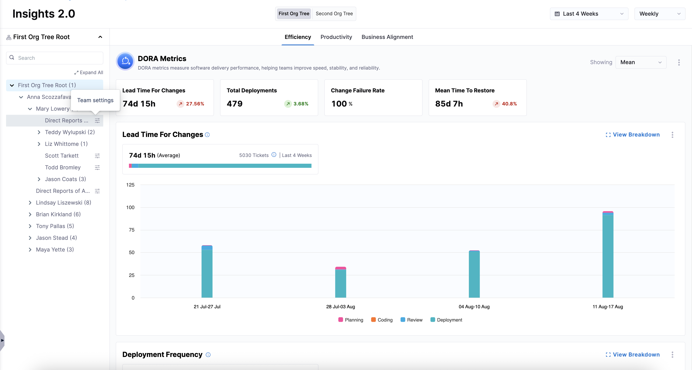
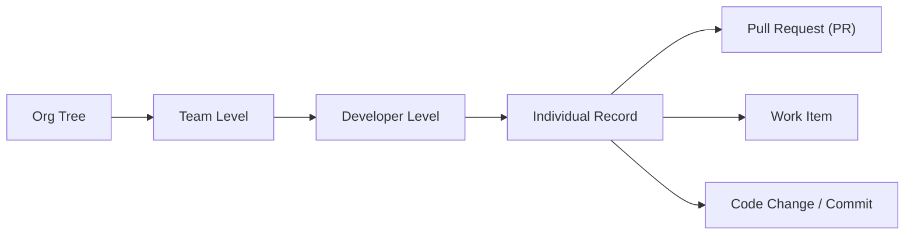

Once you’ve set up integrations, created profiles, uploaded your developer records, and created an [Org Tree](/docs/software-engineering-insights/harness-sei/setup-sei/setup-org-tree), AI DLC Insights enables you to explore high-level engineering insights across your organization, including [Efficiency](/docs/software-engineering-insights/harness-sei/insights/efficiency), [Productivity](/docs/software-engineering-insights/harness-sei/insights/productivity), and [Business Alignment](/docs/software-engineering-insights/harness-sei/insights/business-alignment) for the entire organization.

Insights are always scoped to the selected **Org Tree**, allowing you to analyze engineering performance across different organizational structures.

## Use the Insights dashboard

To access the Insights dashboard:

1. From the Harness AIDI navigation pane, click **Insights**.
1. Select an [**Org Tree**](/docs/software-engineering-insights/harness-sei/get-started/sei-key-concepts#org-tree) from the dropdown menu at the top of the dashboard. 

   

1. Explore organization-wide engineering metrics, including DORA metrics such as **Lead Time for Changes**, **Deployment Frequency**, **Change Failure Rate**, and **Mean Time to Restore**.

    

If your organization uses multiple Org Trees, you can switch between them to view insights by selecting a different Org Tree above the **Efficiency**, **Productivity**, and **Business Alignment** tabs. All metrics update automatically based on the selected Org Tree.

For more information on exporting insights, see [Exporting AI DLC Insights Insights](/docs/software-engineering-insights/harness-sei/insights/export).

## View team-level insights

Beyond organization-wide views, AI DLC Insights allows you to drill into specific [teams](/docs/software-engineering-insights/harness-sei/get-started/sei-key-concepts#teams) to analyze localized engineering performance on the **Insights** page.

To view team-level insights:

1. Select a specific team on the **Org Tree** in the left panel and click **View Breakdown**.

   

1. Configure [Team Settings](/docs/software-engineering-insights/harness-sei/setup-sei/setup-teams) (if not already done) by navigating to the **Teams** page in the left-hand navigation or clicking on the **Team Settings** icon next in the Org Tree.

   

Once team settings are applied, all Insights dashboards refresh to reflect metrics scoped specifically to that team, including repositories, contributors, and deployment signals.

This enables consistent comparison between organization-wide performance, team-level execution, and individual contributor activity.

## Explore drilldown-level insights

Beyond team-level breakdowns, AI DLC Insights provides drilldown views that allow you to inspect metrics at the developer and record level. Drilldowns help you understand *why* a metric behaves a certain way by exposing the underlying pull requests, work items, or code changes that contribute to the aggregated view.

Drilldowns are available at the leaf team level after selecting **View Breakdown**, and they provide the most granular level of insight in AI DLC Insights.

 

Drilldowns provide contextual detail behind aggregated metrics on the Insights dashboard by exposing the underlying engineering events that contribute to each data point. Not all insights support the same level of granularity; the following metrics support drilldowns:

### Efficiency Insights

| Metric                    | Drilldown Path                                | Description                                              |
| ------------------------- | --------------------------------------------- | -------------------------------------------------------- |
| [**Lead Time for Changes**](/docs/software-engineering-insights/harness-sei/insights/efficiency#lead-time-for-changes) | Team → PR lifecycle → commit-to-deploy flow   | Time from code commit to production deployment.          |
| [**Deployment Frequency**](/docs/software-engineering-insights/harness-sei/insights/efficiency#deployment-frequency)  | Team → Deployment events → release history    | How often code is deployed to production.                |
| [**Change Failure Rate**](/docs/software-engineering-insights/harness-sei/insights/efficiency#change-failure-rate)   | Team → Deployment events → incident tracking  | Percentage of deployments causing failures or rollbacks. |
| [**Mean Time to Restore**](/docs/software-engineering-insights/harness-sei/insights/efficiency#mean-time-to-restore)  | Team → Incident lifecycle → recovery timeline | Time required to restore service after a failure.        |

### Productivity Insights

| Metric                            | Drilldown Path                                                                    | Description                                                                                                                                                         |
| --------------------------------- | --------------------------------------------------------------------------------- | ------------------------------------------------------------------------------------------------------------------------------------------------------------------- |
| [**PR Velocity Per Developer**](/docs/software-engineering-insights/harness-sei/insights/productivity#pr-velocity-per-dev)     | Developer → PR list → SCM integration (GitHub, Bitbucket, GitLab, etc.)           | Pull request throughput and contribution volume per developer.                                                                                                      |
| [**PR Cycle Time**](/docs/software-engineering-insights/harness-sei/insights/productivity#pr-cycle-time)                 | Developer → PR timeline view → stage-level timing (First Review, Approval, Merge) | Time taken for pull requests to move from first commit to merge, including review stages.                                                                           |
| [**Work Completed Per Developer**](/docs/software-engineering-insights/harness-sei/insights/productivity#work-completed-per-developer)  | Developer → Work items → Issue management system (Jira, Azure DevOps, etc.)       | Completed work items and delivery throughput per developer.                                                                                                         |
| [**Code Rework**](/docs/software-engineering-insights/harness-sei/insights/productivity#code-rework)                   | Developer → PR / commit changes → line-level rework attribution                   | Portion of code rewritten or replaced based on additions vs deletions. Includes breakdown into: Recent Rework, Legacy Rework, and Lines Added / Deleted / Modified. |

### Business Alignment Insights

| Metric                        | Drilldown Path                                                   | Description                                                                          |
| ----------------------------- | ---------------------------------------------------------------- | ------------------------------------------------------------------------------------ |
| [**Security and Compliance**](/docs/software-engineering-insights/harness-sei/insights/business-alignment)   | Developer → PR / Work Item → classification + linked changes     | Work contributing to security fixes, compliance requirements, or regulatory updates. |
| [**New Capability**](/docs/software-engineering-insights/harness-sei/insights/business-alignment)            | Developer → Feature work items → PR / implementation mapping     | Work that delivers new product capabilities or customer-facing functionality.        |
| [**KTLO (Keep the Lights On)**](/docs/software-engineering-insights/harness-sei/insights/business-alignment) | Developer → Operational work items → maintenance activity        | Maintenance, operational support, and routine system upkeep work.                    |
| [**Quality Improvements**](/docs/software-engineering-insights/harness-sei/insights/business-alignment)      | Developer → PR / refactor activity → code change attribution     | Work focused on improving system quality, reliability, and maintainability.          |
| [**Uncategorized**](/docs/software-engineering-insights/harness-sei/insights/business-alignment)             | Developer → Work items without mapping → fallback classification | Work that cannot be mapped to a defined business alignment category.                 |

Each drilldown is scoped to the selected time range and inherits all filters applied at the Org Tree and team level.

## Engineering performance benchmarks and goals

AI DLC Insights provides engineering metrics across Org Trees, teams, and developers, but interpretation of these metrics depends on team maturity, workflow, and organizational context. This section provides recommended benchmarks and goals to help teams evaluate and improve their software delivery performance over time. 

These benchmarks are not strict requirements. High-performing teams focus on sustained improvement rather than meeting fixed thresholds. Use these benchmarks to interpret insights surfaced in AI DLC Insights.

Phase 1: The Basics

#### Productivity Insights

| Goal                             | Metric                     | SEI Widget                | Suggested Action                      |
| -------------------------------- | -------------------------- | ------------------------- | ------------------------------------- |
| All PRs reviewed by 2+ reviewers | PR Cycle Time              | PR Review metrics         | Enforce 2 approvals before merge      |
| ≥ 1/3 of PRs have comments       | Number of Comments per PR  | PR Engagement             | Encourage PR-based discussion vs chat |
| ≥ 2/3 PRs are small/medium       | PR Velocity per Developer  | PR Size distribution      | Break down large tickets              |
| PRs merged within 2 days         | PR Cycle Time              | PR Cycle Time             | Automate post-approval merge flow     |
| PRs reviewed within 2 days       | PR Cycle Time (Stage view) | SCM PR Lead Time by Stage | Add review reminders / SLAs           |

#### Efficiency (Sprint) Insights

| Goal                          | Metric                    | SEI Widget      | Suggested Action               |
| ----------------------------- | ------------------------- | --------------- | ------------------------------ |
| < 35% sprint scope creep       | Sprint Delivery           | Sprint Insights | Lock sprint scope before start |
| All stories have story points | Sprint Delivery Drilldown | Sprint Insights | Enforce estimation requirement |

Phase 2: Improving Consistency

#### Efficiency (DORA Metrics) Insights

| Goal                           | Metric                | SEI Widget          | Suggested Action           |
| ------------------------------ | --------------------- | ------------------- | -------------------------- |
| Work completed within 1 sprint | Lead Time for Changes | Lead Time           | Break down large stories   |
| P0/P1 resolved ≤ 7 days        | MTTR / Bugs Lead Time | Incident metrics    | Define hotfix SLA          |
| > 80% pipeline success          | Change Failure Rate   | CI/CD metrics       | Improve automated testing  |
| Merge builds within 1 hour     | CI Lead Time          | CI pipeline metrics | Automate post-merge builds |

#### Efficiency (Sprint) Insights

| Goal                | Metric                | SEI Widget      | Suggested Action        |
| ------------------- | --------------------- | --------------- | ----------------------- |
| < 25% scope creep    | Sprint Delivery       | Sprint Insights | Improve sprint planning |
| > 80% commit-to-done | Sprint Predictability | Sprint Reports  | Reduce sprint overload  |

#### Productivity Insights

| Goal                            | Metric                    | SEI Widget              | Suggested Action           |
| ------------------------------- | ------------------------- | ----------------------- | -------------------------- |
| All PRs linked to Jira          | PR Cycle Time             | PR Traceability         | Enforce ticket in PR title |
| All devs participate in reviews | PR Cycle Time             | PR Review participation | Auto-assign reviewers      |
| > 3.2 coding days/week           | Coding Days per Developer | Coding activity         | Encourage smaller commits  |
| ~2 PRs per dev/week             | PR Velocity per Developer | PR Velocity             | Reduce PR size             |

Phase 3: Advanced Performance

#### Efficiency (DORA Metrics) Insights

| Goal                     | Metric               | SEI Widget         | Suggested Action             |
| ------------------------ | -------------------- | ------------------ | ---------------------------- |
| < 10% change failure rate | Change Failure Rate  | DORA metrics       | Add canary + automated tests |
| Deploy weekly or more    | Deployment Frequency | Deployments        | Ship smaller changes         |

#### Efficiency (Sprint) Insights

| Goal                      | Metric                | SEI Widget      | Suggested Action            |
| ------------------------- | --------------------- | --------------- | --------------------------- |
| < 15% scope creep          | Sprint Insights       | Sprint Insights | Improve planning discipline |
| Predictability within 20% | Sprint Predictability | Sprint Insights | Reduce unplanned work       |

#### Productivity Insights

| Goal                   | Metric                  | SEI Widget    | Suggested Action           |
| ---------------------- | ----------------------- | ------------- | -------------------------- |
| Standard PR structure  | PR Metadata consistency | PR reports    | Enforce naming conventions |
| PR Cycle Time < 2 days | PR Cycle Time           | PR Cycle Time | Enforce small PRs          |

#### Business Alignment Insights

| Goal                   | Metric                  | SEI Widget    | Suggested Action           |
| ---------------------- | ----------------------- | ------------- | -------------------------- |
| < 15% production work     | Business Alignment   | Business Alignment | Reduce KTLO load      |

Phase 4: Continuous Improvement

At this stage, teams continuously improve across:

#### Efficiency (DORA Metrics) Insights

- Reduce **Lead Time for Changes**
- Reduce **MTTR**
- Reduce **Change Failure Rate**
- Increase **Deployment Frequency**

#### Efficiency (Sprint) Insights

- Achieve near 100% commit-to-done ratio
- Eliminate scope creep
- Improve sprint predictability

#### Productivity Insights

- Reduce **PR Cycle Time**
- Increase **PR Velocity** consistency
- Improve **Code Rework** efficiency
- Eliminate unapproved PRs

Start with **Phase 1** if your team is new to AI DLC Insights and progress through phases as maturity increases. Focus on trends, not single values and adapt benchmarks to your team structure and workflow.