Productivity in AI DLC Insights focuses on understanding the actual work being delivered by developers, the quality of that work, and how effectively teams collaborate to get it done. Rather than measuring activity for its own sake, AI DLC Insights surfaces signals that reflect meaningful engineering output, including work that drives value, improvements to existing code, and areas of potential rework.

## Use Productivity Insights

The **Productivity** tab on the **Insights** page in AI DLC Insights helps you understand how work flows through your engineering organization, focusing on the quality, velocity, and collaboration behind the code. If your account has multiple Org Trees configured in AI DLC Insights, the Org Trees are displayed as tiles at the top of the dashboard.

Selecting an Org Tree tile updates the dashboard to reflect data for that org tree and filters all productivity metrics to only include the teams and repositories within the selected Org Tree. This allows you to analyze productivity trends across different organizations and teams.

By surfacing key aspects of the development lifecycle, the **Productivity Insights** dashboard helps teams:

- Understand how engineering effort translates into delivered outcomes
- Identify bottlenecks, rework, or inefficient collaboration patterns
- Track productivity trends at the individual, team, or organizational level
- Focus improvement efforts on the areas with the highest impact

You can analyze the data by selecting a time range (for example, the last several weeks or months) and a time granularity (weekly, monthly, or quarterly), which determines how the data is grouped and displayed in the charts.

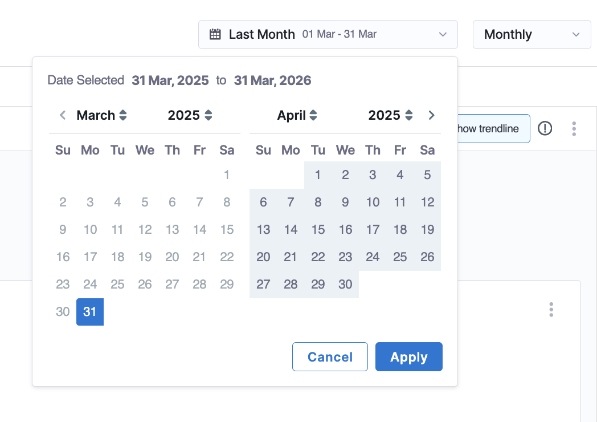

## AI summaries and recommendations
 
AI DLC Insights automatically generates a contextual **AI Summary** for the selected time range and granularity. AI Summaries are generated using the same metrics available in the Productivity Insights dashboard, including **PR Velocity Per Developer**, **PR Cycle Time**, **Work Completed Per Developer**, **Coding Days Per Developer**, **Number of Comments Per PR**, **Average Time to First Comment**, and **Code Rework**. This ensures recommendations remain grounded in measurable engineering outcomes instead of qualitative assessments alone.

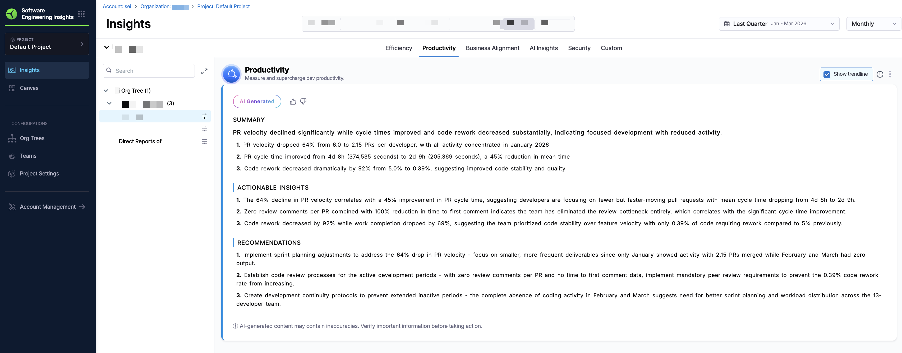

Each summary includes three sections:

- **Summary**: A narrative of key trends and performance changes for the selected time period.
- **Actionable Insights**: Data-driven observations explaining contributor behavior, adoption patterns, and productivity outcomes.
- **Recommendations**: Guidance on how to improve delivery performance and maintain or improve code quality based on observed signals.

By default, the AI Summary you see when you navigate to the Productivity Insights dashboard reflects an organization-wide view, aggregating metrics across all teams in the selected Org Tree on the **Productivity Insights** tab. 

## Explore Productivity Insight metrics

Use the `Showing` dropdown menu to control how values are calculated across all widgets. Available options include `mean`, `median`, `p90`, and `p95`. Click the **Show trendline** checkbox to overlay trendlines across all Productivity visualizations. Trendlines help you assess whether productivity metrics are improving, regressing, or remaining stable over time. 

:::info
Trendlines use the Ordinary Least Squares (OLS) regression method to identify patterns and direction in your data over the selected time range.
:::

To export the Productivity Insights dashboard data, click the kebab menu (⋮) and select **Export as PDF** or **Export as CSV**. For more information, see [Exporting AI DLC Insights Insights](/docs/software-engineering-insights/harness-sei/insights/export).

Below is a brief overview of each widget in **Productivity** on the **Insights** page:

### PR Velocity Per Dev

**PR Velocity per Dev** metrics provide insight into pull request throughput, merge efficiency, and contribution volume across teams and individual developers. These metrics help engineering organizations understand how quickly code changes move through the development lifecycle and identify trends in pull request size, review patterns, and merge activity.

$$
\text{PR Velocity per Developer} = \frac{\text{Total PRs Merged by all Developers in the team}}{\text{Number of Developers}}
$$

The summary metric highlights pull request throughput trends over time, while the bar chart visualizes the number and distribution of pull requests merged during the selected period.

")
*A bar chart showing completed PRs per developer per week, segmented by PR Size or Work Type.*

You can explore organization-level and team-level metrics by navigating the Org Tree. For parent nodes (for example, directors or managers above leaf teams), the dashboard displays aggregated pull request metrics across all descendant teams. Switch between **PR Size** (Small, Medium, or Large) and **Work Type** (e.g., Features, Bugs, Missing Tickets, etc.) visualizations in the `Group by` dropdown menu.

To view team-level metrics, click **View Breakdown**. The breakdown view displays pull request activity grouped by team, typically aligned to engineering managers or reporting structures.

At the leaf-team level, you can access the **PR Velocity Drilldown**, which provides developer-level metrics for pull request throughput, merge efficiency, and code contribution size within the selected time range.

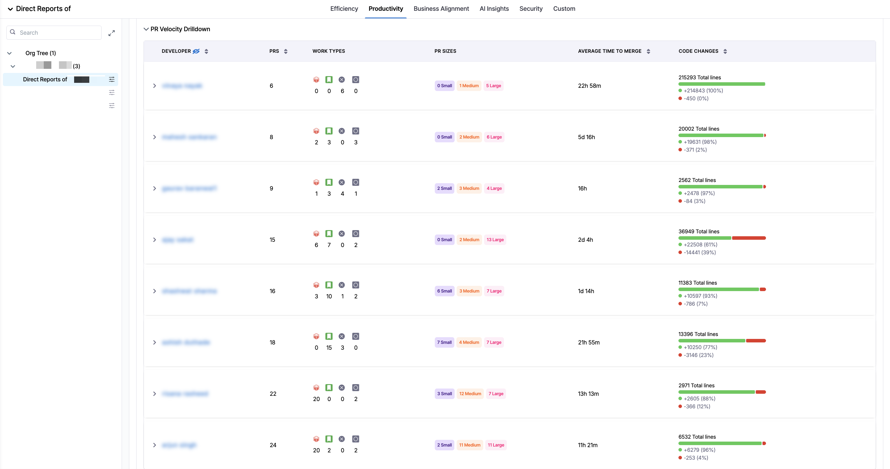

The drilldown includes the following metrics:

| Metric                    | Description                                                                             |
| ------------------------- | --------------------------------------------------------------------------------------- |
| **Developer**             | Name of the individual contributor or developer.                                        |
| **PRs**                   | Total number of pull requests merged by the developer during the selected period.       |
| **Work Types**            | Distribution of pull requests associated with Bugs, Features, or Other work categories. |
| **PR Sizes**              | Distribution of pull requests categorized as Small, Medium, or Large.                   |
| **Average Time to Merge** | Average duration between PR creation and merge.                                         |
| **Code Changes**          | Total lines added and removed across merged pull requests.                              |

Developer identities are obfuscated by default. Click the **Eye** icon next to the `Developer` column to toggle obfuscation on or off.

Selecting an individual developer opens a more granular drilldown view showing the pull requests associated with that developer during the selected time range and granularity.

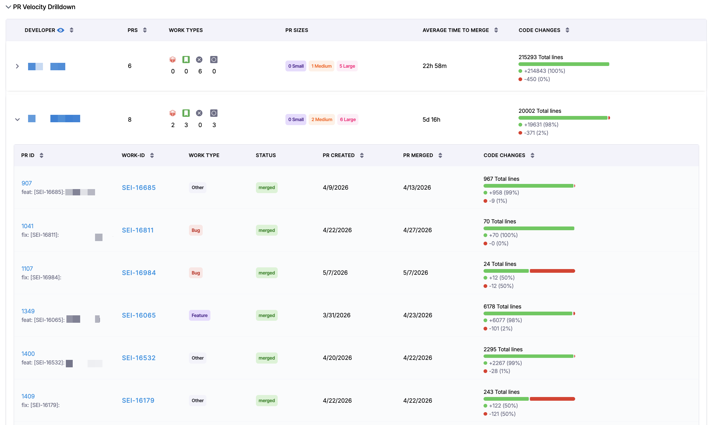

The drilldown includes the following metrics:

| Field                       | Description                                                                                        |
| --------------------------- | -------------------------------------------------------------------------------------------------- |
| **PR ID**                   | Pull request identifier. Clicking the PR ID opens the pull request in the integrated SCM provider. |
| **Title**                   | Pull request title.                                                                                |
| **Author**                  | Developer who created the pull request.                                                            |
| **Repository**              | Repository associated with the pull request.                                                       |
| **First Commit Created At** | Timestamp of the first commit associated with the PR.                                              |
| **Created At**              | Timestamp when the PR was opened.                                                                  |
| **Merged At**               | Timestamp when the PR was merged.                                                                  |
| **Cycle Time**              | Total PR cycle time from first commit to merge.                                                    |
| **Reviewers**               | Review participants and associated review timing metrics.                                          |
| **Code Changes**            | Total lines added and removed for the PR.                                                          |

<strong> Understanding PR Velocity</strong>

This visualization shows the rate at which pull requests (PRs) are merged over time. On the X-axis is the date (weekly, monthly, or quarterly); on the Y-axis is the number of PRs merged per developer.

PRs are grouped by size (`Small`, `Medium`, and `Large`) based on lines of code changed as defined in your [Productivity Profile](/docs/software-engineering-insights/harness-sei/setup-sei/setup-profiles/productivity-profile#pr-velocity).

High-performing teams typically average 1-5 PRs per developer per week. Focus on maintaining a steady, sustainable cadence rather than maximizing volume.

To improve **PR Velocity**, Harness recommends breaking work into smaller changes, reducing pull request sizes, and encouraging consistent delivery. Setting strict PR quotas may lead to artificial or low-quality contributions.

### PR Cycle Time

**PR Cycle Time** metrics provide visibility into how long pull requests take to move from initial development to merge. These metrics help teams identify review bottlenecks, optimize review workflows, and improve delivery efficiency across repositories and engineering teams.

$$
\text{PR Cycle Time} = \frac{\text{Sum of time spent in each stage (Commit → PR Creation → PR Merge)}}{\text{Number of merged PRs}}
$$

The summary metric highlights overall pull request cycle time trends, while the chart visualizes cycle duration across the selected time period.

 over the selected period.")
*A bar chart showing PRs per week, segmented by time spent in the following stages: `PR Creation`, `First Comment`, `Approval`, and `Merge`.*

You can explore organization-level and team-level metrics using the Org Tree. For parent nodes, the dashboard aggregates pull request cycle metrics across all child teams. Select **Mean**, **Median**, **P90**, **P95** from the `Showing` dropdown menu to update the visualizations.

To access a breakdown of PR cycle time by individual teams, click **View Breakdown**. The breakdown view displays average cycle time metrics grouped by team or reporting structure.

At the leaf-team level, you can access the **PR Cycle Time Drilldown**, which provides pull request-level visibility into review timelines, approval delays, and merge duration.

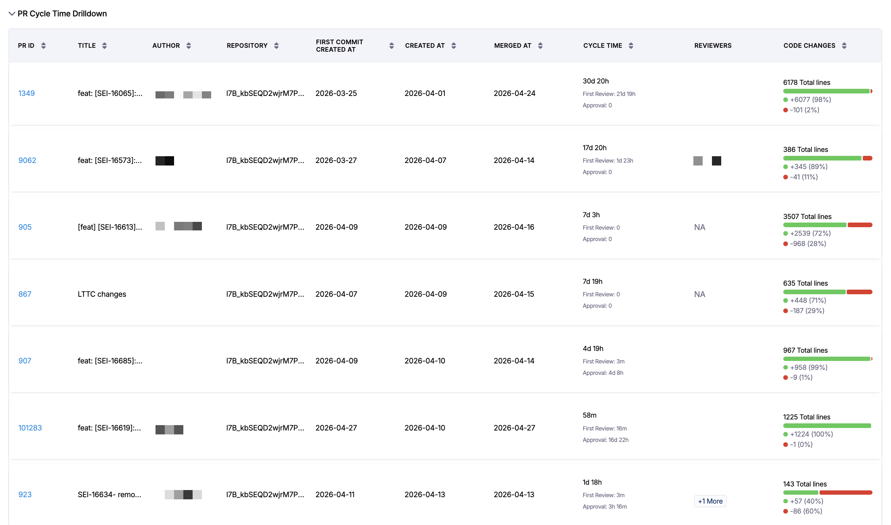

The drilldown includes the following metrics:

| Metric                      | Description                                               |
| --------------------------- | --------------------------------------------------------- |
| **PR ID**                   | Identifier associated with the pull request.              |
| **Title**                   | Pull request title.                                       |
| **Author**                  | Developer who created the pull request.                   |
| **Repository**              | Repository associated with the pull request.              |
| **First Commit Created At** | Timestamp of the first commit associated with the PR.     |
| **Created At**              | Timestamp when the PR was opened.                         |
| **Merged At**               | Timestamp when the PR was merged.                         |
| **Cycle Time** | Total duration between the first commit and PR merge. The **Cycle Time** metric provides additional visibility into review workflow efficiency, including:    - **First Review**: Time between PR creation and the first human review activity. Bot-generated comments are excluded from this calculation to ensure code review reflects actual human engagement.   - **Approval**: Time required to receive approval before merge.    |
| **Reviewers**               | Review participants and associated review timing metrics. |
| **Code Changes**            | Total lines added and removed in the PR.                  |

Clicking a PR ID opens the pull request in the integrated SCM provider for deeper investigation and repository-level context.

<strong>Understanding PR Cycle Time</strong>

This visualization measures how long it takes for a pull request to move from initial commit to merge. It includes stages such as PR creation, first comment, approval, and final merge. On the X-axis is the average cycle time; on the Y-axis is the date (weekly, monthly, or quarterly).

High-performing teams often average around two days, but trends matter more than exact values. Extremely low cycle times may indicate skipped steps such as missing code reviews.

To improve **PR Cycle Time**, Harness recommends keeping PRs small and focused, prioritizing timely code reviews, and implementing automated checks to reduce back-and-forth with reviewers.

### Work Completed Per Developer

**Work Completed per Developer** metrics provide visibility into completed work items across teams and developers. These metrics help organizations understand delivery throughput, work distribution, and completion efficiency across work categories.

$$
\text{Work Completed per Developer} = \frac{\text{Total Completed Work Items}}{\text{Number of Active Developers}}
$$

The summary metric highlights completed work trends over time, while the chart visualizes completed work distribution during the selected period.

.")
*A bar chart showing work completed per developer per week, grouped by work type (e.g. Features) and segmented by complexity: `Simple`, `Medium`, `Complex`, and `Other`.*

You can navigate the Org Tree to analyze completed work metrics across organizational hierarchies. Parent nodes display aggregated metrics across all descendant teams. Select **All**, **Features**, **Bugs**, or **Others** from the `Group by` dropdown menu to update the visualizations.

To analyze team-level metrics, click **View Breakdown**. The breakdown view displays completed work metrics grouped by team.

At the leaf-team level, you can access the **Work Completed Drilldown**, which provides developer-level metrics for completed work items during the selected time range.

The drilldown includes the following metrics:

| Metric                       | Description                                                          |
| ---------------------------- | -------------------------------------------------------------------- |
| **Developer**                | Name of the individual contributor or developer.                     |
| **Completed**                | Total number of completed work items.                                |
| **Work Types**               | Distribution of completed Bugs, Features, and Other work categories. |
| **Average Time to Complete** | Average duration between work creation and completion.               |

Developer identities are obfuscated by default. Click the **Eye** icon next to the `Developer` column to toggle obfuscation on or off.

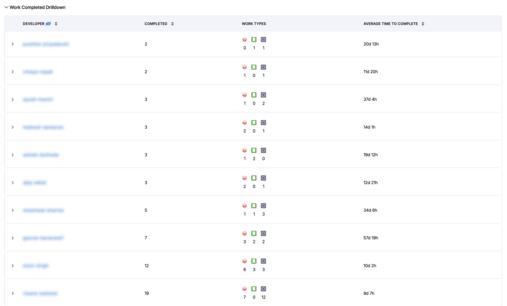

Selecting an individual developer opens a detailed work item view showing all completed work associated with that developer within the selected time range and granularity.

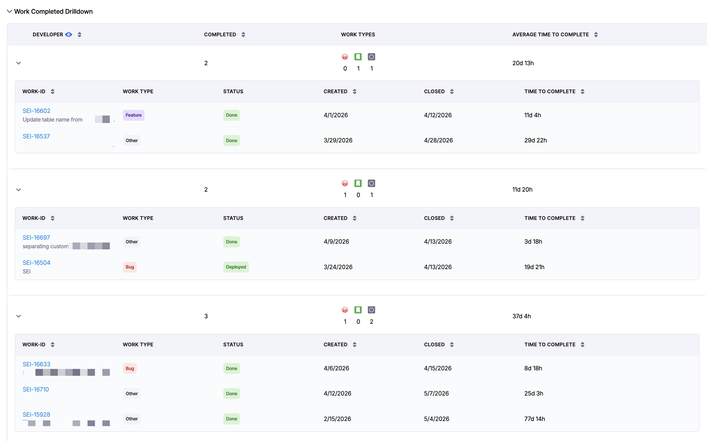

The drilldown includes the following metrics:

| Field                | Description                                     |
| -------------------- | ----------------------------------------------- |
| **Work ID**          | Identifier for the work item.                   |
| **Work Type**        | Category associated with the work item.         |
| **Status**           | Final workflow state of the work item.          |
| **Created**          | Date the work item was created.                 |
| **Closed**           | Date the work item was completed or closed.     |
| **Time to Complete** | Total duration between creation and completion. |

Clicking a work item opens the work item in the integrated Issue Management provider for deeper investigation and context.

<strong>Understanding Work Completed per Developer</strong>

This visualization shows the average number of tickets completed per developer over time. On the X-axis is the date (weekly, monthly, or quarterly); on the Y-axis is the number of completed tickets per developer.

Work is grouped by complexity (`Simple`, `Medium`, and `Complex`) based on story point definitions on the **Issue Management** tab in [Team Settings](/docs/software-engineering-insights/harness-sei/setup-sei/setup-teams/#work-type).

Most teams typically complete 3-5 tickets per developer per week, though this varies based on work type and complexity. Focus on improving trends relative to your team’s baseline rather than comparing across teams.

To improve **Work Completed Per Developer**, Harness recommends breaking down large tickets into smaller, manageable tasks and ensuring work is structured clearly (for example, by using epics with smaller child tickets).

### Coding Days Per Developer

**Coding Days per Developer** metrics provide visibility into active development participation across teams and individual developers. These metrics help organizations understand coding consistency, engineering engagement, and contribution patterns over time.

$$
\text{Coding Days per Developer} = \frac{\text{Sum of distinct commit days for all developers}}{\text{Number of Active Developers}}
$$

.")
*A bar chart showing the average coding days per developer for each week.*

The summary metric highlights coding activity trends, while the chart visualizes the number of active coding days during the selected period.

You can explore coding activity across organizational hierarchies using the Org Tree. Parent nodes display aggregated coding-day metrics across descendant teams.

To analyze team-level coding activity, click **View Breakdown**. The breakdown view displays coding-day metrics grouped by team.

<strong>Understanding Coding Days per Developer</strong>

This visualization measures the number of distinct days per week that a developer makes at least one code contribution. On the X-axis is the date (weekly, monthly, or quarterly); on the Y-axis is the average coding days per developer.

A typical benchmark is around 3-4 coding days per week. Lower values may indicate large, infrequent commits, while consistently high values (for example, 6-7 days) may signal overwork or burnout risk.

To improve **Coding Days Per Developer**, Harness recommends encouraging smaller, more frequent commits and looking out for signs of excessive workload across the team.

### Number of Comments Per PR

**Number of Comments per PR** metrics provide visibility into pull request discussion activity and collaboration patterns across development teams. These metrics help organizations understand review engagement, collaboration depth, and review communication trends.

$$
\text{Avg Comments per PR} = \frac{\text{Total Comments on PRs}}{\text{Number of PRs}}
$$

The summary metric highlights trends in pull request discussion activity, while the chart visualizes average comment volume during the selected period.

.")
*A bar chart showing the average number of comments per PR for each week.*

You can explore review collaboration metrics across organizational hierarchies using the Org Tree. Parent nodes display aggregated comment metrics across descendant teams.

To analyze review collaboration by team, click **View Breakdown**. The breakdown view displays average pull request comment metrics grouped by team.

<strong>Understanding Comments per PR</strong>

This visualization shows the average number of comments per pull request. On the X-axis is the date (weekly, monthly, or quarterly); on the Y-axis is the number of comments per PR.

This metric reflects review engagement rather than code quality. Most PRs should include at least one review comment or approval note.

To improve **Number of Comments Per PR**, Harness recommends encouraging teams to leave feedback directly on PRs to support knowledge sharing and maintaining a clear review history. PRs with no comments may indicate that reviews are happening outside the platform.

### Average Time to First Comment

**Average Time to First Comment** metrics provide visibility into pull request responsiveness and review engagement across teams. These metrics help organizations identify review delays, improve reviewer responsiveness, and optimize collaboration workflows.

$$
\text{Avg Time to First Comment} = \frac{\text{Sum of (Time to First Comment for each PR)}}{\text{Number of PRs}}
$$

The summary metric highlights trends in reviewer responsiveness, while the chart visualizes the average duration between pull request creation and the first review comment.

.")
*A bar chart showing the average time to first comment for PRs each week.*

You can analyze review responsiveness across organizational hierarchies using the Org Tree. Parent nodes display aggregated review responsiveness metrics across descendant teams.

To analyze responsiveness by team, click **View Breakdown**. The breakdown view displays average time-to-first-comment metrics grouped by team.

<strong>Understanding Average Time to First Comment</strong>

This visualization measures how long it takes for a pull request to receive its first comment. On the X-axis is the date (weekly, monthly, or quarterly); on the Y-axis is the time to first comment.

A common target is within one business day, which indicates that the review process has started promptly.

To improve **Average Time to First Comment**, Harness recommends prioritizing code reviews in team workflows and establishing review SLAs to ensure timely feedback.

### Code Rework

Code Rework metrics provide insight into the portion of development effort spent rewriting or replacing existing code. These file-driven metrics show where rework is coming from, who is introducing it, and allow teams to balance delivering new work with maintaining code quality. 

Code Rework metrics are configured in the [Productivity Profile](/docs/software-engineering-insights/harness-sei/setup-sei/setup-profiles/productivity-profile). 

$$
\text{Reworked Lines} = \text{min(Lines Added, Lines Deleted)}
$$

.")
*A bar chart showing the percentage of engineering effort spent on recent rework, legacy rework, and optional new work distribution.*

The summary metric highlights trends in code rework over time. Hover over a bar for a specific week to view the breakdown between **Recent Rework**, **Legacy Rework**, and **New Work**.

* **Recent Rework**: Code introduced within the past 30 days (configured in the Productivity Profile).
* **Legacy Rework**: Code introduced before the recent-code window.
* **New Work**: Net new code additions that are not classified as rework. Optional, can be displayed by clicking **Show total distribution**.

Select **Show total distribution** to include **New Work** alongside recent and legacy rework distributions.

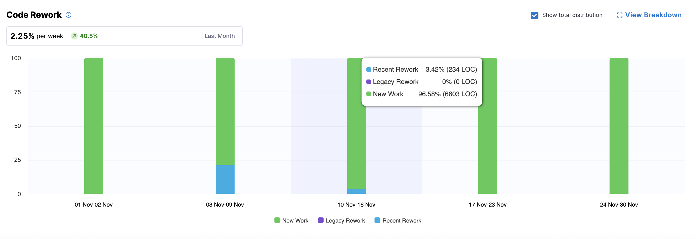

You can navigate the Org Tree to analyze code rework metrics across organizational hierarchies. Parent nodes display aggregated metrics across all descendant teams.

To analyze team-level metrics, click **View Breakdown**. The breakdown view displays rework metrics grouped by team, typically aligned to engineering managers or reporting structures.

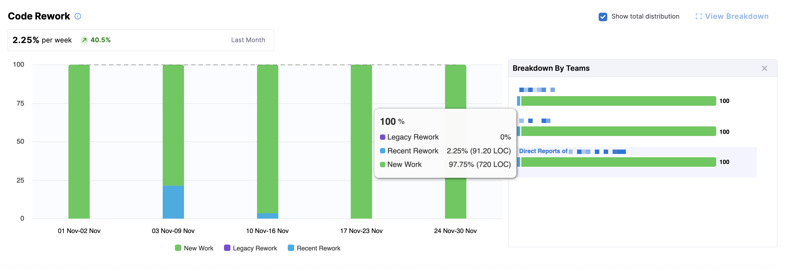
*Team-level visualization of recent rework, legacy rework, and optional new work distribution.*

At the leaf-team level, you can access the **Code Rework Drilldown**, which provides developer-level visibility into rework contribution patterns during the selected time range.

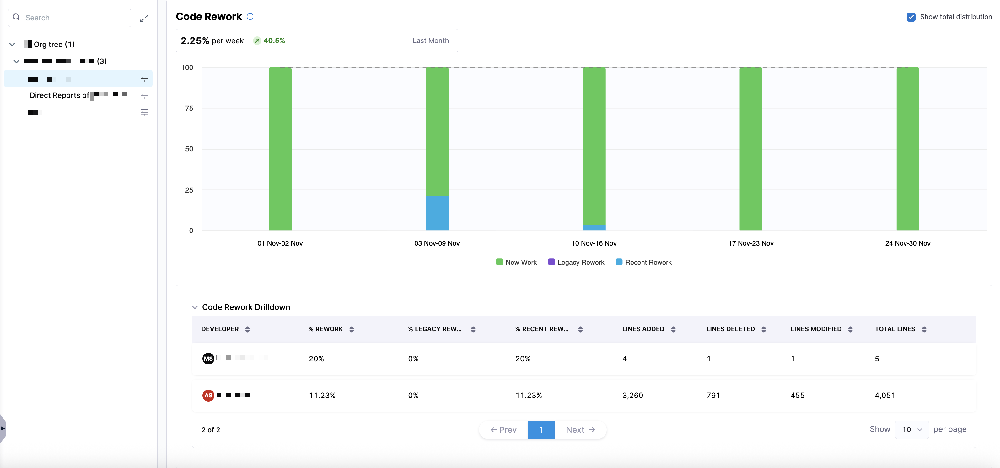
*Developer-level metrics showing contribution to recent and legacy code rework.*

The drilldown includes the following metrics:

| Metric                  | Description                                                                                  |
| ----------------------- | -------------------------------------------------------------------------------------------- |
| **Developer**           | Name of the individual contributor or developer.                                             |
| **Rework**              | Percentage of total code changes classified as rework during the selected period.            |
| **Legacy Rework**       | Percentage of rework associated with legacy code introduced before the recent-code window.   |
| **Recent Rework**       | Percentage of rework associated with recently introduced code within the recent-code window. |
| **Total Rework Lines**  | Total number of lines classified as reworked code.                                           |
| **Legacy Rework Lines** | Number of reworked lines associated with legacy code.                                        |
| **Recent Rework Lines** | Number of reworked lines associated with recently introduced code.                           |
| **Total Lines**         | Total number of lines affected during the selected period.                                   |
| **Lines Added**         | Total number of lines added during the selected period.                                      |
| **Lines Deleted**       | Total number of lines deleted during the selected period.                                    |

Developer identities are obfuscated by default. Click the **Eye** icon next to the `Developer` column to toggle obfuscation on or off.

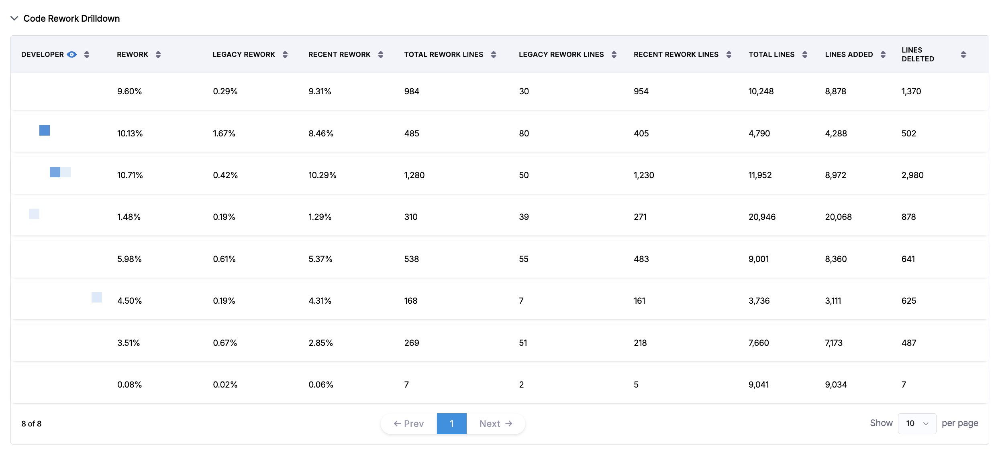

 

Understanding Code Rework

This visualization measures how much engineering effort is spent rewriting or replacing existing code versus introducing entirely new code. On the X-axis is the date (weekly, monthly, or quarterly); on the Y-axis is the percentage of work classified as code rework.

Lower levels of rework generally indicate that teams are spending more effort delivering new functionality rather than revisiting existing implementations. However, elevated rework may also reflect healthy refactoring, modernization efforts, or iterative development cycles.

High levels of **Recent Rework** can indicate requirement churn, unstable implementation patterns, or excessive iteration before completion. High levels of **Legacy Rework** often reflect technical debt reduction or large-scale maintenance initiatives.

To improve **Code Rework**, Harness recommends reducing unnecessary churn through clearer requirements, smaller pull requests, earlier review cycles, and incremental delivery practices.

