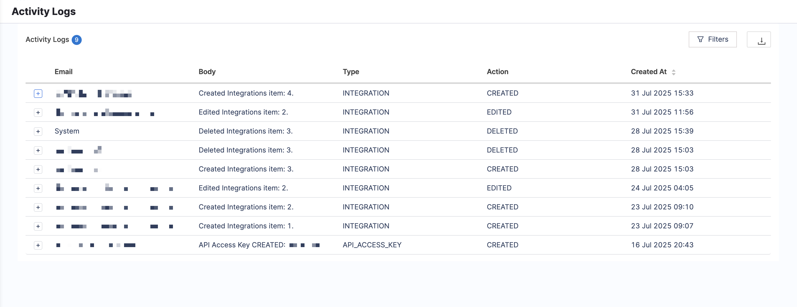

## Overview

Activity Logs in SEI 2.0 provide traceability and compliance coverage across critical operations. Every time a member updates, creates, or deletes a resource, Harness SEI captures a detailed log entry showing what changed, who made the change, and when it happened.

These logs provide admins and auditors a transparent, end-to-end view of key events, helping your teams maintain compliance, investigate issues, and manage engineering insights at scale.

:::info
Access to Activity Logs in SEI 2.0 depends on [your role](/docs/software-engineering-insights/propelo-sei/setup-sei/access-control/sei-roles-and-permissions/#permissions). SEI Admins and Account Admins can view and manage logs, while SEI Collection Admins and Account Viewers have limited or no access. 

Users need at least **View** permission to open Activity Logs and apply filters.
:::

## Accessing Activity Logs

To access Activity Logs in Harness SEI:

1. In your SEI project, navigate to **Account Management**.
1. Under **SEI Settings**, click **Activity Logs**.
1. Click on an individual log from the list for additional details on what changed.
   
   

## Tracked objects

Activity Logs record changes across the following objects, ensuring CRUD coverage and historical visibility for essential operations.

| Object | Activity Log |
|---|---|
| [Org Trees](/docs/software-engineering-insights/harness-sei/setup-sei/setup-org-tree) | Created, update, and delete trees, plus profile and integration updates.  |
| [Teams](/docs/software-engineering-insights/harness-sei/setup-sei/setup-teams) | Create, update, and generate historical versions for tracking changes over time. |
| [Developers](/docs/software-engineering-insights/harness-sei/setup-sei/manage-developers) | Batch save (bulk import/updates), field mapping, and cloud ID sync activities. |
| [Efficiency Profiles](/docs/software-engineering-insights/harness-sei/setup-sei/setup-profiles/efficiency-profile) | Create, update, and delete profile configurations. |
| [Productivity Profiles](/docs/software-engineering-insights/harness-sei/setup-sei/setup-profiles/productivity-profile) | Create, update, and delete productivity measurement configurations. |
| [Business Alignment Profiles](/docs/software-engineering-insights/harness-sei/setup-sei/setup-profiles/business-alignment-profile) | Create, update, and delete profiles and investment categories. |

## Filtering and searching logs

Each log entry includes fields you can use to filter and drill into specific events. 

### Available filters

To add a search filter to drill into specific events, click the **Filters** icon.

| Field | Description |
|---|---|
| **Email** | Filter logs by the email address of the member who performed the action. Click **Add Value** to include one or more email addresses in your search. |
| **Type** | Indicates the resource or object affected, such as: `USER_LOGIN`, `USER`, `DASHBOARD`, `PRODUCT`, `API_ACCESS_KEY`, `INTEGRATION`, `CONFIG_TABLE`, `BA_PROFILE`, `STATE`, `KB`, `TICKET_TEMPLATE`, `PLAYBOOK`, `SECTION`, `TICKET`, `ASSESSMENT_TEMPLATE`, `TAG`, `WORKFLOW`, `WORK_ITEM`, `SSO_CONFIG`, `ASSESSMENT`. |
| **Action** | Describes the activity performed, including: `CREATED`, `EDITED`, `DELETED`, `SUBMITTED`, `ANSWERED`, `SUCCESS`, `FAIL`, `SENT`, `PASSWORD_RESET_STARTED`, `PASSWORD_RESET_FINISHED`. |

## Exporting Activity Logs

To export the full list or only the filtered logs, click the **Download** icon next to the **Filters** icon. Harness SEI saves the selected logs as a CSV file for your records.

Use Activity Logs to keep your organization audit-ready and ensure that all critical changes are fully tracked. 