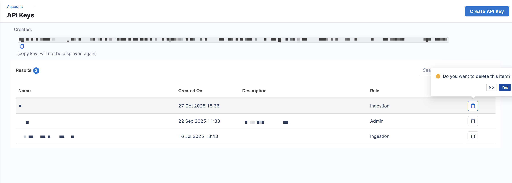

API Keys in SEI 2.0 enable programmatic access to SEI resources. You can create these keys to automate developer identity management, integrate external systems, and ingest engineering data into SEI 2.0.

## SEI API key roles

API keys are created and managed at the **project level** within your Harness account. Each key can be assigned an SEI role to control its access scope and capabilities.

| Role | Description | Recommended Use |
|---|---|---|
| **SEI Admin** | Grants full control over SEI configurations and data at both the account and project levels. Includes permissions to manage data settings, teams, profiles, and KPIs. | Use for administrative automation or integrations that configure Harness SEI or sync metadata. |
| **SEI Ingestion** | Grants limited access to submit or update engineering data (such as developer identities or metric events) without allowing configuration changes. | Use for continuous data ingestion or integration pipelines. |

Each SEI API key is scoped to a specific project and inherits the permissions of its assigned role. For more information, see [Harness RBAC in SEI 2.0](/docs/software-engineering-insights/harness-sei/get-started/rbac).

## Create an SEI API key

To create an API key in SEI 2.0:

1. From the Harness SEI navigation menu, click **Account Management** > **API Keys** under **SEI Settings**.
1. Click **Create API Key**.
1. Enter a name and description for the API key.
1. Select a role to assign to the API key (`Admin` or `Ingestion`). 
1. Click **Create**.
1. Copy the generated key. Store this securely; it won't appear again.

You can use this key to authenticate SEI API requests by including it in the `Authorization` header. 

For example:

```bash
curl -X GET \
  "https://app.harness.io/gateway/sei/api/v2/developers/schema" \
  -H "x-api-key: <YOUR_API_KEY>"
```

## Manage SEI API keys

Manage your API keys to ensure your SEI integrations remain secure and maintain least-privilege access. 

Follow these best practices when managing your SEI API keys:

- Use least privilege: Assign the **Ingestion** role for data ingestion use cases whenever possible.
- Rotate regularly: Recreate keys periodically or when a team member leaves.
- Avoid sharing keys: Each integration or automation should use its own dedicated key.
- Revoke unused keys: Delete keys that are no longer needed to reduce exposure risk.

You can view and delete keys from the **API Keys** page in **SEI Settings** when they are no longer needed or have been compromised. 



Click the **Delete** icon next to the key you want to remove. Once deleted, the key is invalidated and cannot be recovered.