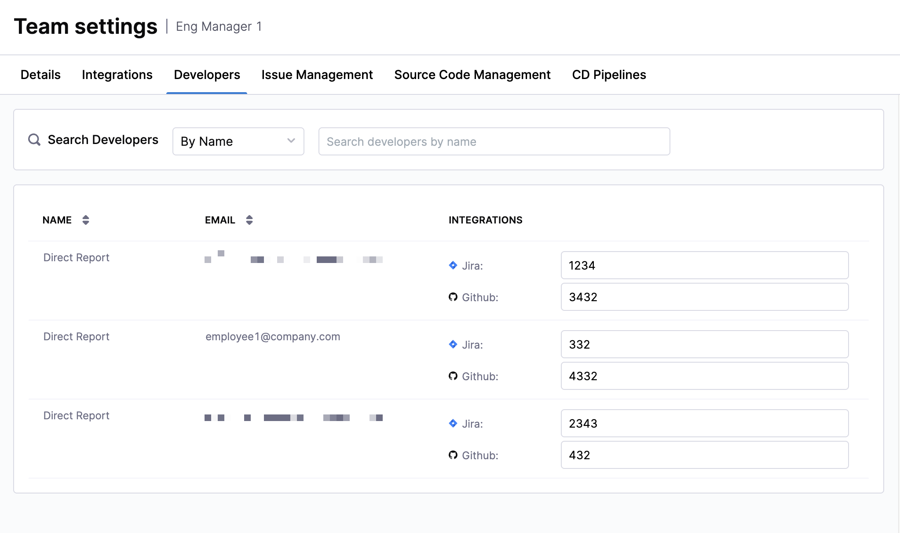

## Overview

Auto Identity Discovery in Harness SEI helps you automatically identify and unify developer identities across all supported integrations. Instead of manually mapping developer identifiers (emails, usernames, or account IDs) from different tools, SEI intelligently correlates and creates a single unified developer identity.

This eliminates manual effort, reduces onboarding bottlenecks, and ensures that metrics are attributed correctly to each developer. In modern engineering organizations, developers work across multiple systems such as Jira, GitHub, GitLab, Azure DevOps, Bitbucket, and more. Each system may store developer information differently (email, account ID, username). 

Without unification:

* The same developer may appear as multiple contributors in SEI 2.0
* Metrics can become inaccurate or fragmented
* Onboarding new teams requires manual reconciliation

Auto Identity Discovery solves this by using a correlation model (email-driven, contribution-driven, and API-driven, depending on the integration) to automatically unify these identities into a single record in SEI 2.0. For more information, see [Upload Developer Cloud IDs](/docs/software-engineering-insights/harness-sei/api/cloud-ids).

### How It Works

1. Email-based correlation: SEI fetches developer details (i.e. usernames, account IDs, and emails where available) from source systems and automatically consolidates them so each developer has a single unified profile across all integrations.

1. Contribution-driven correlation: For integrations that do not allow direct identity fetch, SEI analyzes commit and pull request activity to intelligently infer developer identities.

1. Unification model: Once identities are detected, SEI maps all associated records into a single unified developer identity. This ensures that contributions made by the same person across different tools are consistently attributed.

This model runs automatically during data ingestion. Team managers can review and adjust mappings if mismatches occur, ensuring the highest level of accuracy.

### Supported integrations

Auto Identity Discovery relies on fetching developer emails from the source systems. Due to security restrictions, Harness SEI cannot fetch user details for some integrations. In such scenarios, Harness provide an API that you can use to update the developer identities in SEI 2.0 by pulling the user details in your environment without having to give Harness SEI access to retrieve user details. 

The required permissions vary by integration. 

| Integration | Auto-matching Supported | Identifier Type Used | Example Values | Notes |
|------------|--------------------------|-----------------------|----------------|-------|
| [Jira Cloud (Connect App)](/docs/software-engineering-insights/harness-sei/setup-sei/configure-integrations/jira/) | No | — | — | The Connect App is scheduled to be deprecated. |
| [Jira Cloud (API Token)](/docs/software-engineering-insights/harness-sei/setup-sei/configure-integrations/jira/) | Yes | Account ID | `081de7ae-0631-4474-befe-40064cc640ff`, `JIRAUSER208441` | If you are using a fine-grained access token, the token requires: • `Read:user`:jira • `Read:jira-user` • `Read:account-id:jira`  If you are using a classic token, the Atlassian user must have: • `Atlassian Browse Users` • `User Picker` |
| [Jira Satellite / Data Center](/docs/software-engineering-insights/harness-sei/setup-sei/configure-integrations/jira/jira-data-center) | Yes | Account ID | Same as above | Same fine-grained and classic token requirements as Jira Cloud (API Token). |
| [GitHub (App)](/docs/software-engineering-insights/harness-sei/setup-sei/configure-integrations/github/) | Yes | Username | `Aaron-Phillips_ver`, `dp1_mca` | App installation automatically grants access to developer identities if installed by an org owner/admin.  If admin approval is pending, SEI may not receive all identity data until approval completes. |
| [GitHub Access Token (PAT)](/docs/software-engineering-insights/harness-sei/setup-sei/configure-integrations/github/) | Yes | Username | Same as above | PAT (Classic) requires: • `Read:org` • `Repo:all` • `Read:user` • `User:email`  If your GitHub organization uses SAML SSO, you must [enable SSO on the PAT](https://docs.github.com/en/enterprise-cloud@latest/authentication/authenticating-with-single-sign-on/authorizing-a-personal-access-token-for-use-with-single-sign-on). |
| [GitHub (Satellite / Cloud Connect)](/docs/software-engineering-insights/harness-sei/setup-sei/configure-integrations/github/enterprise-server) | Yes | Username | Same as above | Same PAT (Classic) permission requirements as GitHub Cloud. |
| [Azure DevOps (OAuth / PAT)](/docs/software-engineering-insights/harness-sei/setup-sei/configure-integrations/azure-devops/) | Yes, partial | Email | `Anh.McFeely@gmfinancial.com`, `alex.chorosevic@gmfinancial.com` | The Azure DevOps integration does not expose identity details. SEI infers identity from commit and PR data.  Mapping only occurs if contribution data exists. Team validation recommended. |
| [Bitbucket Server](/docs/software-engineering-insights/harness-sei/setup-sei/configure-integrations/bitbucket/bitbucket-data-center) | Yes, partial | Email | `steve.madden@crowdstrike.com` | Bitbucket Server does not expose identity data directly. SEI infers identity from commit and PR activity.  Accuracy depends on contribution availability. Team validation recommended. |
| [Bitbucket Cloud](/docs/software-engineering-insights/harness-sei/setup-sei/configure-integrations/bitbucket/) | Yes, partial | Account ID | `0026fd8b-03fd-47ef-9eb9-13c11c27385f`, `5fdbd1c3208dbf0107ebd62b` | Bitbucket Cloud does not expose identity data directly. SEI infers identity from commit and PR activity.  Accuracy may vary. Team validation recommended. |
| [GitLab (OAuth / PAT)](/docs/software-engineering-insights/harness-sei/setup-sei/configure-integrations/gitlab/) | Yes, partial | Name | `adithya r`, `aidevops` | GitLab does not expose identity data directly. SEI infers identity from contributions such as commits and merge requests.  Accuracy depends on contribution data availability. Team validation recommended. |
| [GitLab (Self-Managed / Satellite)](/docs/software-engineering-insights/harness-sei/setup-sei/configure-integrations/gitlab/on-prem) | Yes, partial | Name | Same as above | Same identity detection limitations as GitLab Cloud. |
| [Harness Code (Cloud / Satellite)](/docs/software-engineering-insights/harness-sei/setup-sei/configure-integrations/harness/) | Yes | Email | `lebron.james@harness.io`, `noreply@harness.io` | SEI infers identity from commit and PR data. Accuracy may vary; team validation recommended. |

### Limitations

Due to security restrictions and integration-specific API capabilities, SEI cannot always fetch user details directly. 

In such cases:

1. SEI relies on contribution data (commits, pull requests) to infer identity.
1. This may not be 100% accurate & coverage depends on data availability.
1. Team managers should review developer identity mappings periodically to ensure accuracy.

## Update developer identities

For integrations where SEI cannot fetch user details, we provide APIs that let you securely pull user information in your environment and update developer identities in SEI without granting SEI direct access. For more information, see [Upload Developer Cloud IDs](/docs/software-engineering-insights/harness-sei/api/cloud-ids).

Once records are matched, they are reflected in your teams across all org tree(s). 

To view these developer identities: 

1. Click on the **Insights** tab in the Harness navigation. In the Org Tree on the left-hand side, go to your Team and click on the **Team Settings** icon next to a leaf node.
1. You'll see the developer records that have been auto-populated for that team on the **Developers** tab.

This ensures identity mappings are visible in context and remain consistent with your team's resource (the system the specific team uses to generate insights). 