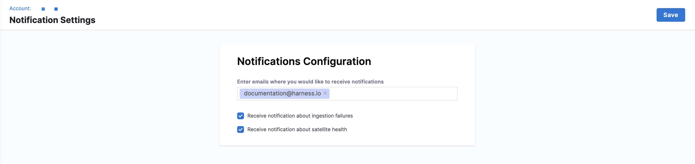

SEI 2.0 allows you to configure email notifications for key system events, such as data ingestion failures or satellite health issues. You can specify which team members should receive these alerts to ensure organizational awareness and resolution.

## Configure notifications

To set up notifications in SEI 2.0:

1. From the Harness SEI navigation menu, click **Account Management** > **Notifications** under **SEI Settings**.
1. Enter the email address(es) where you want to receive notifications. Enter one email at a time and press **Enter** to add it to the list.
1. Enable one or both checkboxes, depending on your organization's needs:
   
   * **Receive notifications about ingestion failures**
   * **Receive notifications about satellite health**

1. Click **Save** to apply your changes.

    