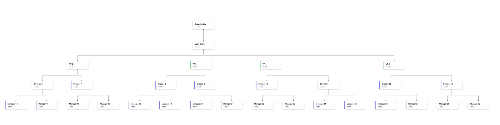

Welcome to AI DLC Insights, the next generation of engineering insights at Harness. We've reimagined how organizations understand developer productivity, delivery health, and business impact. Built from the ground up on a modern, high-performance architecture, AI DLC Insights brings flexibility, scale, and trust to your software engineering data.

Whether you're a 50-person startup or a global engineering org with 5,000+ developers, AI DLC Insights is built to meet you where you are and grow as you grow.

## What’s New in AI DLC Insights

### Built on a Modern, Scalable Architecture

AI DLC Insights is architected to handle massive scale without compromising speed or reliability. From initial setup to generating insights, the new system is developed to scale and essentially give you insights you can trust.

### Pre-Built Dashboards: Ready Out of the Box

Get started instantly with pre-built dashboards designed around industry-proven metrics:

* Delivery Efficiency
  * DORA
  * Sprint Insights
* Developer Productivity
* Business Alignment

### Org Trees & Team Structures That Reflect Reality

AI DLC Insights introduces Org Trees: a flexible, scalable way to model your organization as it actually operates. You can build org structures that reflect reporting lines, business units, regions, or any combination of the above by uploading a CSV that defines your organization structure.

### Integrations 2.0: Easier. Smarter. More Resilient.

AI DLC Insights introduces a redesigned integrations framework focused on reliability, observability, and ease of maintenance.

* Built-in diagnostics enable faster troubleshooting with clear visibility into integration errors and data flow issues.
* Proactive health monitoring provides continuous feedback on the operational status of your data sources.
* Advanced retry mechanisms ensure that transient failures or API limits don’t disrupt your insights pipeline.

These enhancements significantly reduce integration maintenance overhead, giving teams confidence in the accuracy and completeness of their engineering data.

### Decentralized Administration

AI DLC Insights supports scalable, role-based access controls that allow organizations to manage developer and team configurations in a distributed yet governed manner.

* Assign ownership of specific teams, org trees, or projects to designated admins.
* Reduce dependency on central administrators while maintaining enterprise-grade oversight.
* Empower functional teams to manage their own setup and insights — without compromising security or consistency.