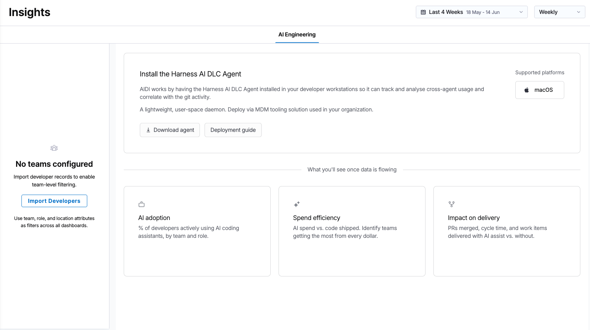
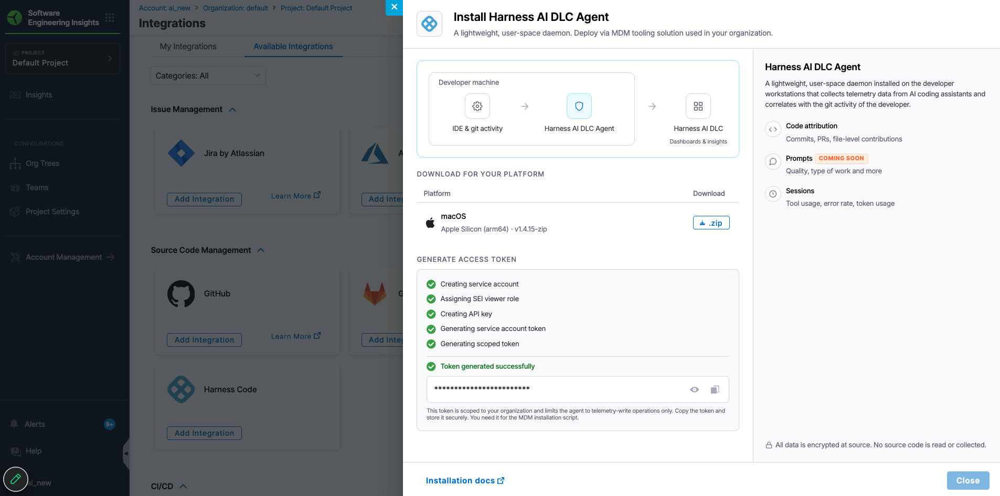

<CTABanner
  buttonText="Request Access"
  title="AI Engineering Insights is in beta!"
  tagline="Enable AI Engineering Insights to measure AI adoption and impact on productivity and quality across your teams. Available now in beta!"
  link="https://developer.harness.io/docs/software-engineering-insights/sei-support"
  closable={true}
  target="_self"
/>

The Harness AI DLC Agent is a lightweight, user-space daemon installed on developer workstations to collect telemetry data from AI coding tools such as Claude Code, Cursor, and GitHub Copilot. It correlates this telemetry with git activity and transmits it to the [AI Engineering Insights](/docs/software-engineering-insights/harness-sei/insights/ai-engineering) dashboard, where engineering leaders can measure AI coding tool adoption, optimize token spend, and quantify the impact of AI on software delivery.


*The AI Engineering dashboard displaying metrics such as session tracking, token spend, commit attribution, ship rate, and error rate.*

## Supported coding agents

The following coding agents/tools are supported for the Harness AI DLC Agent to capture usage and session level telemetry data.

* Claude Code
  * Claude Code via Bedrock/Vertex/other Cloud vendors
  * Claude Code CLI
* GitHub Copilot
  * Copilot CLI
  * Copilot on any IDE (Agent mode only)

## Scope of data collection

| Always collected (metadata) | Configurable (off by default) | Never collected |
| --- | --- | --- |
| Token counts (input, output, cache) | Prompt content | Code content or file contents |
| Tool usage events and session durations | AI response content | Credentials or secrets |
| AI vs. human line attribution counts | | |
| Cost estimates | | |
| Session details (tool, duration, timestamps) | | |

:::info
Prompt and AI response collection is disabled by default. An administrator can enable it during MDM deployment. When disabled, only metadata (token counts, tool usage, attribution) is transmitted.
:::

## Security

Individual developers do not need to take action beyond having the agent installed and running, which is handled via MDM deployment (IT/EngOps owned). The agent runs in the background and captures signals from AI coding tool activity.

Go to [Data Security](/docs/software-engineering-insights/harness-sei/setup-sei/agent/data-security#data-collected) to review the full list of collected data types and security controls.

## Prerequisites

- **Operating system:** macOS 12+ (Monterey or later), Intel or Apple Silicon. Windows support is coming soon.
- **Privileges:** Standard user account. No admin or root required for operation.
- **Network:** Outbound HTTPS to `*.harness.io` on port 443.
- **Harness account:** Active Harness account with the AI Engineering Insights module enabled.

## Install the agent

### Step 1: Generate an API token

1. Sign in to your Harness account and navigate to the **AI Engineering Insights** module.
2. On the Insights page, select **Download Agent** to open the setup panel.
3. In the setup panel, select **Generate Token**. This token is scoped to your organization and limits the agent to telemetry-write operations only.
4. Copy the token and store it securely. You need it for the MDM installation script.



### Step 2: Download the agent binary

In the setup panel, select the download option for the operating system used by developers in your organization. The agent is distributed as a signed, versioned binary for macOS (arm64 and x64).

### Step 3: Install the agent

import Tabs from '@theme/Tabs';
import TabItem from '@theme/TabItem';

<Tabs>
<TabItem value="mdm" label="Deploy via MDM" default>

Organization administrators distribute the agent to developer machines using MDM (Mobile Device Management). The installation script performs the following steps:

| Step | Action | Details |
| ---: | --- | --- |
| 1 | Distribute install script and binary | MDM deploys `harness-aidlc-agent-macos-arm64-install.sh` and the signed binary package to the target device. |
| 2 | Inject configuration parameters | MDM passes the endpoint, integration ID, and token to the installer as script arguments. |
| 3 | Verify binary integrity | The script verifies the SHA-256 checksum before proceeding. |
| 4 | Store token in Keychain | The script stores the API token in the macOS System Keychain. Tokens are never written to disk. |
| 5 | Write configuration | The script creates `~/.harness-aidlc-agent/config.json` containing the endpoint and integration ID. |
| 6 | Install binary | The agent binary is placed at `/usr/local/bin/harness-aidlc-agent`. |
| 7 | Register LaunchAgent | The script creates a LaunchAgent plist at `~/Library/LaunchAgents/com.harness.aidlc-agent.plist`. |
| 8 | Start daemon | The LaunchAgent starts the daemon automatically, initiating telemetry collection. |

**Required parameters:**

- `--endpoint`: The Harness telemetry endpoint URL.
- `--integration-id`: Your organization's integration identifier.
- `--token`: The scoped API token generated in Step 1.

**Optional parameters:**

- `--checksum`: SHA-256 hash for binary verification.
- `--disable-metrics`: Comma-separated list of metric types to disable.

</TabItem>
<TabItem value="manual" label="Manual installation">

Use manual installation for individual developer machines or to test the agent before a broader MDM rollout.

1. Extract the binary package downloaded in Step 2.
2. Open the `harness-aidlc-agent-macos-arm64-install.sh` script and update the API token field with the token generated in Step 1.
3. Run the install script. It automatically installs the Harness AI DLC Agent on the developer workstation, configures the LaunchAgent, and starts the daemon.

```bash
sudo bash harness-aidlc-agent-macos-arm64-install.sh
```

Once the script completes, the agent begins collecting telemetry in the background.

</TabItem>
</Tabs>

## Deployment artifacts

| Artifact | Location | Purpose |
| --- | --- | --- |
| Binary | `/usr/local/bin/harness-aidlc-agent` | Daemon executable. |
| LaunchAgent | `~/Library/LaunchAgents/com.harness.aidlc-agent.plist` | Starts the agent automatically on user login. |
| Configuration | `~/.harness-aidlc-agent/config.json` | Stores the endpoint and integration ID. |
| Telemetry cache | `~/.harness-aidlc-agent/telemetry/` | Local queue for telemetry data before upload. |
| Audit log | `~/.harness-aidlc-agent/send.log` | Records telemetry transmission activity. |
| IPC socket | `~/.harness-aidlc-agent/socket` | Inter-process communication with `0600` permissions. |
| Git hooks | `.git/hooks/post-commit` | Per-repository attribution triggered on commit events. |
| Keychain entries | macOS System Keychain | Stores the API key securely. |

## Verify the installation

Run the following command to confirm the agent is running:

```bash
launchctl list | grep harness.aidlc
```

If the agent is running, you see a line with `com.harness.aidlc-agent` and a process ID. A `0` exit status in the second column indicates the agent started successfully.

To view recent telemetry activity, check the audit log:

```bash
tail -20 ~/.harness-aidlc-agent/send.log
```

## Diagnostics

The **Diagnostics** tab in the AI Engineering Insights module displays the health and status of all machines where the agent was installed. When a new version of the agent is available, download and redeploy it from this tab. Harness recommends keeping agents up to date to ensure accurate telemetry collection and access to new capabilities.

### Monitor rollout stats


The **Developer Installations** table lists every developer machine with the agent installed. Use this table to verify coverage, identify machines on outdated versions, and audit installation timestamps.

| Column | Description |
| --- | --- |
| **Name** | Developer display name. |
| **Email** | Developer email address. |
| **Version** | Agent version installed on this machine. |
| **Installation time** | Date and time the agent was installed or last updated. |
| **Last session** | Most recent timestamp when the agent reported AI coding tool activity. A stale date may indicate the agent has stopped or the developer has not used any coding tools recently. |

To filter by a specific agent version, use the **All Versions** dropdown above the table. To export the list, select **Download CSV**.

## Troubleshooting

<details>
<summary>A developer is missing from the AI Engineering dashboard</summary>

Verify the agent is installed on their machine by running `launchctl list | grep harness.aidlc`. Check the **Last session** timestamp in the **Developer Installations** table. If the agent has not reported in, reinstall using the MDM package.

</details>

<details>
<summary>A developer appears in the dashboard but shows no AI activity</summary>

The agent is running but has not detected any AI coding tool sessions. Confirm the developer has an active AI coding tool (such as Claude Code or Cursor) installed and has used it within the selected time range.

</details>

<details>
<summary>The agent is installed but launchctl shows no process</summary>

The LaunchAgent may not have loaded. Run the following command to start it manually:

```bash
launchctl load ~/Library/LaunchAgents/com.harness.aidlc-agent.plist
```

If the plist file does not exist, reinstall the agent via MDM.

</details>

<details>
<summary>Telemetry data is not appearing in the dashboard</summary>

Check network connectivity to `*.harness.io` on port 443. Review `~/.harness-aidlc-agent/send.log` for transmission errors. The agent queues data locally in `~/.harness-aidlc-agent/telemetry/` when the network is unavailable and retries automatically when connectivity is restored.

</details>
