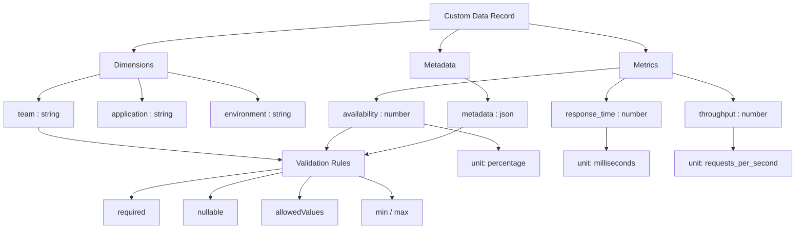

Custom data ingestion allows you to bring data from your systems into SEI 2.0 by describing its structure, meaning, and characteristics.

Whether you're working with metrics, events, test results, or operational data, defining a clear schema ensures that everyone understands what the data represents and how it can be used in queries, dashboards, and insights. A well-designed schema improves data quality, query reliability, and discoverability for other users.

A custom ingestion schema defines the structure of the data records sent to SEI 2.0. Each record contains fields (or columns) that describe dimensions, metrics, and contextual metadata.

The following diagram shows how a schema is structured and how fields relate to validation rules and metadata.



<br />

A schema typically contains three types of fields:

import Tabs from '@theme/Tabs';
import TabItem from '@theme/TabItem';

<Tabs queryString="schema-field">
<TabItem value="dimension" label="Dimensions">

Dimensions are descriptive fields used for filtering or grouping data (for example, by `team`, `application`, or `environment`).

Dimensions provide context for the metrics that you want to analyze.

</TabItem>
<TabItem value="metric" label="Metrics">

Metrics are numeric values that represent measurements (for example, `availability`, `response_time`, or `throughput`).

Metrics are typically aggregated or analyzed in dashboards and Canvas queries.

</TabItem>
<TabItem value="metadata" label="Metadata">

Metadata contains additional contextual information stored as JSON.

Metadata is useful for drill-down analysis, debugging, or storing information that doesn't need to be filtered directly.

</TabItem>
</Tabs>

## Essential fields

Every custom data ingestion schema should include at least one column definition with the following required field.

### `name` (required)

A clear, descriptive identifier for the data field. 

Use descriptive names that clearly communicate what the field represents. 

For example:

- `availability`
- `response_time`
- `test_pass_rate`

Each column in the schema defines characteristics of the data field.

### `type` (required)

Specifies what kind of data the column contains.

The following types are most common:

| Type | Description |
|-----|-------------|
| string | Text values (for example: `"success"`, `"checkout"`) |
| number | Decimal numbers (for example: `99.5`, `123.45`) |
| integer | Whole numbers (for example: `42`, `1000`) |
| boolean | True/false values |
| timestamp | Date and time values |
| json | Nested data structures |

:::info
Filtering is **not currently supported** for columns with the `json` type.

Use JSON fields for additional metadata, drill-down details, or contextual information that does not need to be filtered.
:::

### `unit`

Defines how numeric values are measured. Use units whenever possible for numeric fields so values are interpreted correctly. 

| Unit | Description |
|-----|-------------|
| percentage | Percentage values representing a proportion out of 100 (for example: `99.5`). |
| milliseconds | Time duration measured in milliseconds (for example: request latency or response time). |
| seconds | Time duration measured in seconds. |
| requests_per_second | Throughput measured as the number of requests processed per second. |
| count | A simple count or tally of occurrences (for example: number of errors, events, or requests). |
| megabytes | Data size or memory usage measured in megabytes. |
| errors/min | Error rate measured as the number of errors occurring per minute. |

### `required`

Specifies whether the column must appear in every data record.

| Value | Meaning |
|------|--------|
| true | Field must always be present |
| false | Field is optional |

### `nullable`

Specifies whether the column can contain a null or empty value.

| Value | Meaning |
|------|--------|
| true | Value may be null or empty |
| false | Value must be populated when present |

A column can be `required: false` and `nullable: false`, meaning that the column is optional, but if included, it must contain a value.

## Column fields and dimensions

Columns describe the different aspects of your data. You can think of them as:

* Columns in a table
* Fields in a structured dataset
* Properties of an object

Each column defines constraints, validation rules, and metadata that determine how the data behaves in queries and custom Canvas dashboards.

:::info Required and Optional Columns
For `required: true`, the column must be present in every data record. Use this when the data would be meaningless without the field or when the field identifies the context of the data (for example: `team` or `application`).

For `required: false`, the column is optional and may not appear in all records. Use this when the field provides additional context or is only relevant in certain situations, or when the field supports filtering or drill-downs (for example: `region`, `endpoint`, or `metadata`).
:::

## Validate the data schema

Validation rules help ensure data quality and consistency. However, avoid over-constraining schemas unless necessary.

### `allowedValues`

Defines a fixed set of acceptable values for string columns.

For example:

```json
"allowedValues": ["production", "staging", "development"]
```

Use this when:

- The field has a known set of options
- Values must remain consistent across systems
- The field represents categories or classifications

Applies to: **string columns**

### Range Constraints (`min` / `max`)

Define acceptable numeric ranges.

For example:

```json
"min": 0
"max": 100
```

Common use cases include the following:

- Percentages (0–100)
- Values that cannot be negative
- Metrics with logical limits

Applies to: **number** and **integer**

### `mustBeGreaterThan`

Ensures a numeric value must be greater than a specified value.

For example:

```json
"mustBeGreaterThan": 0
```

A common use case is preventing denominators from being zero.

### `mustBeGreaterThanOrEqual`

Ensures a value must be greater than or equal to another column.

For example:

```json
"mustBeGreaterThanOrEqual": "error_count"
```

This ensure that the `total_requests >= error_count`.

Applies to: **number** and **integer**

### `requiredWith`

Creates conditional relationships between columns.

For example, the following column must appear when team and application are present: 

```json
"requiredWith": ["team", "application"]
```

Use this when:

- Fields logically belong together
- Metrics require dimension context
- Related fields should appear as a group

## Additional properties

### `description`

A human-readable explanation of the column. Always include descriptions so other users can understand the data.

For example:

```json
"description": "Application availability percentage"
```

<details>
<summary>Example JSON File</summary>

The following code snippet demonstrates how data records might look after ingestion.

```json
{
  "data": [
    {
      "timestamp": "2024-01-15T10:00:00Z",
      "product": "checkout",
      "team": "payments",
      "application": "payment-service",
      "environment": "production",
      "availability": 99.999,
      "numerator": 3599.96,
      "denominator": 3600,
      "metadata": {
        "region": "us-east-1",
        "version": "v2.1.0"
      }
    }
  ]
}
```

Filtering is not available for JSON-type columns at this time.

</details>

## Best practices

Follow these best practices when designing custom ingestion schemas.

- Begin with a minimal schema and add optional columns as your data model evolves. Avoid over-engineering the schema initially.
- Use descriptive names, follow consistent naming conventions (e.g., `snake_case`), include descriptions for all fields, and use appropriate units for numeric values.
- Only set `required: true` for essential field.
- Add validation where data quality is critical and avoid unnecessary constraints.

## Schema design checklist

Before finalizing your schema, review the following:

- Does each column have a clear, descriptive name?
- Is the type specified?
- Is required set appropriately?
- Is nullable set correctly?
- Are validation rules necessary?
- Are numeric fields using correct units?
- Does every column include a description?
- Are relationships between fields correct?
- Would someone unfamiliar with the system understand this schema?