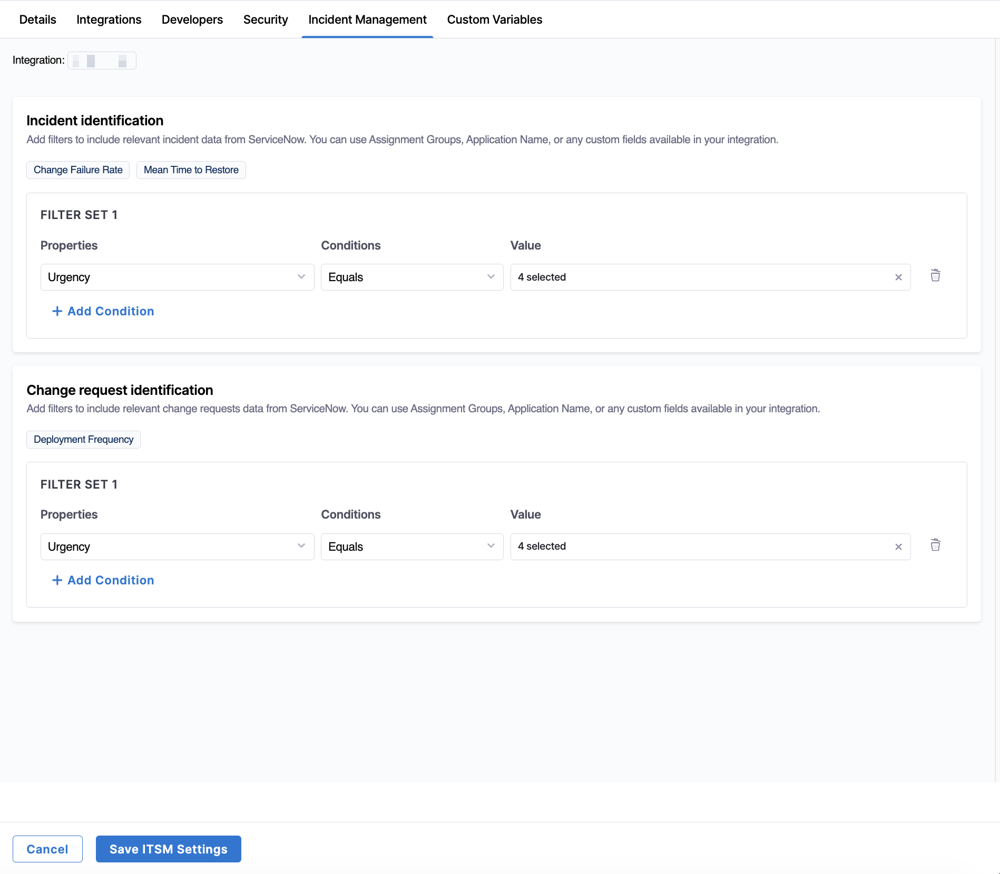

import Tabs from '@theme/Tabs';
import TabItem from '@theme/TabItem';

:::tip
The ServiceNow integration is in beta. To request access, contact [Harness Support](/docs/software-engineering-insights/sei-support).
:::

The ServiceNow integration enables SEI 2.0 to ingest incident and change management (ITSM) data from ServiceNow. This data can be used to track operational performance and correlate incidents and changes with engineering metrics in SEI dashboards.

### Prerequisites

Before you get started, ensure you have the required credentials to connect to ServiceNow:

- A ServiceNow instance URL
- Admin access to your ServiceNow account

Depending on the authentication method you choose, ensure you have the following:

* For API key or Username/password authentication, a ServiceNow API key with permissions to read ServiceNow data or a ServiceNow username and password with sufficient access.
* For OAuth authentication, a ServiceNow client ID and client secret.

To configure OAuth in ServiceNow:

1. Create a new application in the Application Registry.
1. Assign the required scopes (for example, `table_read`) to allow access to ITSM data.
1. After creating the application, copy the Client ID and Client Secret for use during setup.

## Setup

To configure the ServiceNow integration:

1. From the SEI navigation menu, click **Account Management**.
1. From the **Integrations** page, navigate to the **Available Integrations** tab.
1. Locate the ServiceNow integration tile under `Incident Management` and click **Add Integration**.
1. Select an installation option: **ServiceNow Cloud** or **ServiceNow On-Prem**.

   <Tabs queryString="installation-type">
   <TabItem value="cloud" label="ServiceNow Cloud">
   
   Once you've selected **ServiceNow Cloud**, click **Using Cloud Credentials** (prerequisites include ServiceNow account with Admin access and a ServiceNow account with username and password) or **Using OAuth** (prerequisites include ServiceNow account with Admin access, ServiceNow client ID, and ServiceNow client secret).

   If you are using **Cloud Credentials**:

   1. In the **Overview** section, enter a name for the integration. Optionally, add a description or tags.
   1. In the **Credentials** section, enter your ServiceNow URL and select an authentication method: **API Key** or **Username**.
      
      - For **API Key**, enter your API token in the `API Token` field.
      - For **Username**, enter a username and password in the `Username` and `Password` fields.

   1. Enter a timezone in the `Timezone` field.
   1. Click **Continue**.
   1. Once validation succeeds, click **Validate and Create Integration**.
   
   If you are using **OAuth**:

   1. In the **Overview** section, enter a name for the integration. Optionally, add a description or tags.
   1. In the **Credentials** section, enter your ServiceNow URL and copy the generated redirect URL.
   1. In ServiceNow, configure your [Application Registry](https://www.servicenow.com/docs/r/zurich/security-management/security-incident-response/configure-application-registry-splunk.html) to include the redirect URL.
   1. Enter a client ID and client secret.
   1. Enter a timezone in the `Timezone` field.
   1. Click **Connect ServiceNow**.
   1. Once validation succeeds, click **Validate and Create Integration**.

   </TabItem>
   <TabItem value="onprem" label="ServiceNow On-Prem">
   
   Once you've selected **ServiceNow On-Prem**:

   1. In the **Overview** section, enter a name for the integration. Optionally, add a description or tags.
   1. In the **Provide ServiceNow Details** section, enter your ServiceNow URL and provide a username and password.
   1. Enter a timezone in the `Timezone` field.
   1. Click **Download YAML File**. This `satellite.yml` file contains the metadata and configurations for establishing the connection and data ingestions from ServiceNow.
   1. [Deploy the `satellite.yml` file](/docs/software-engineering-insights/harness-sei/setup-sei/ingestion-satellite/container) to your on-premises infrastructure. 
   1. Click **Done**.

   </TabItem>
   </Tabs>

Once the integration is configured, Harness SEI begins ingesting ITSM data from ServiceNow.

## Custom fields

The **Custom Fields** tab allows you to map additional ServiceNow fields to SEI. You can use custom fields to include organization-specific metadata (such as priority, assignment group, or custom attributes) in your SEI dashboards and reports. 

You can map custom fields by defining filter sets for incident and change request identification on the **Incident Management** tab in [**Team Settings**](/docs/software-engineering-insights/harness-sei/setup-sei/setup-teams/#configure-team-tool-settings).

Once configured, these fields are included in data ingestion and become available for filtering and analysis in SEI 2.0.

## Integration monitoring

To monitor the status of the ServiceNow integration, navigate to the **Monitoring** tab. This page displays ingestion logs that provide visibility into data synchronization.

You can click the **Filters** icon to filter logs by **Status** (`Success`, `Failed`, `Pending`, or `Scheduled`).

Each ingestion log includes the following fields:

| Field | Description |
|------|-------------|
| **Scan Range Time** | The time window of data retrieved from ServiceNow during the ingestion task. |
| **Data Retrieval Process** | The ingestion job responsible for fetching data from ServiceNow. |
| **Task Start Time** | The timestamp when the ingestion task began running. |
| **Status** | The current state of the ingestion task (for example, Success, Failed, Pending, or Scheduled). |
| **Time to Complete** | The total duration required for the ingestion task to complete. |
| **Retries** | The number of times the ingestion task was retried after a failure. |