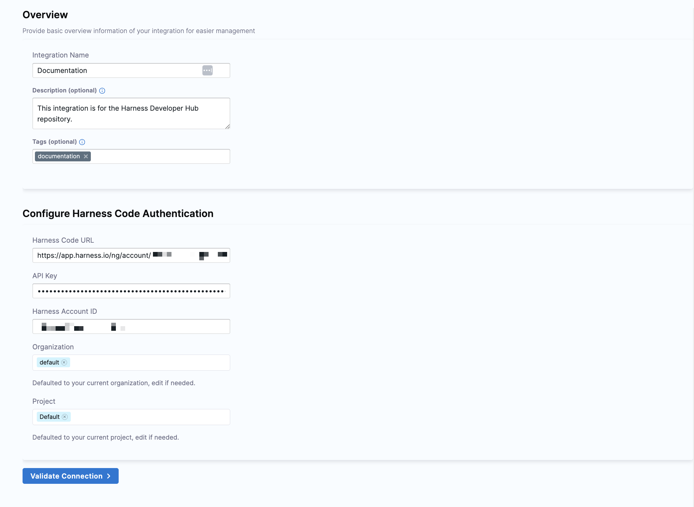
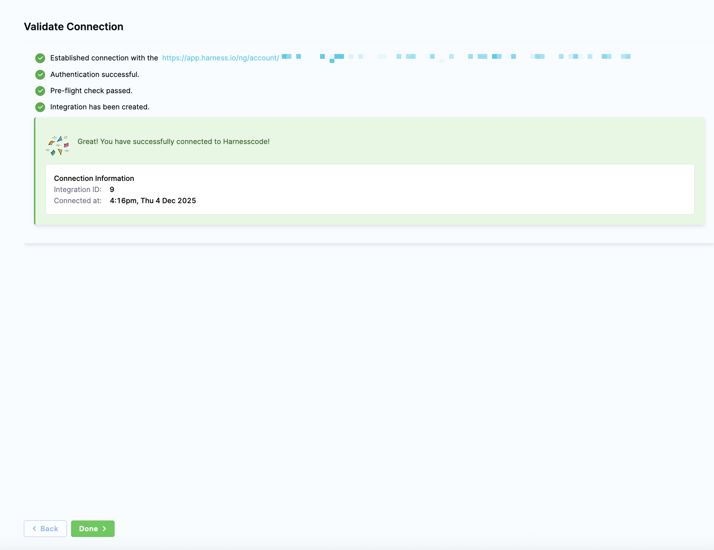
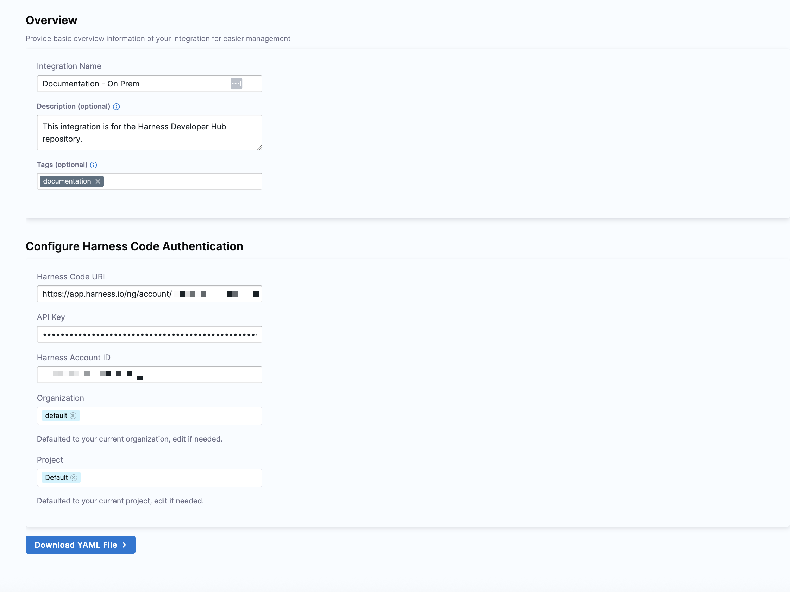
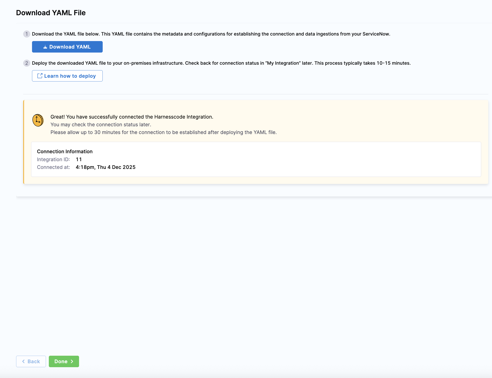

:::tip 
The Harness Code integration with SEI 2.0 is in beta. To request access, contact [Harness Support](/docs/software-engineering-insights/sei-support).
:::

Use the Harness Code integration to integrate Software Engineering Insights (SEI) with the [Harness Code Repository module](/docs/code-repository).

### Requirements

To configure the Harness Code integration, you need:

- Your Harness Code URL
- A [Harness API key and token](/docs/platform/automation/api/add-and-manage-api-keys)

### Add the integration

import Tabs from '@theme/Tabs';
import TabItem from '@theme/TabItem';

1. In your Harness project, navigate to the SEI module and select **Account Management**.
1. Select **Integrations** under **Data Settings**.
1. Select **Available Integrations** and click **Add Integration** under **Harness Code**.
1. Select between **Cloud** and **On-Prem** installation options.

   <Tabs queryString="setup-type">
   <TabItem value="cloud" label="Cloud">

   * In the **Overview** section, enter a name for the integration. Optionally, include a description and add tags.
   * In the **Configure Harness Code Authentication** section, enter the following details:
      
      * Your Harness Code URL
      * Your Harness API key
      * Your Harness Account ID (pre-defined by default)
   
   * The organization and project fields default to your current organization and project, which you can customize.

     

   * Click **Validate Connection** to test the integration configuration.

     

   </TabItem>
   <TabItem value="prem" label="On-Prem">

   * In the **Overview** section, enter a name for the integration. Optionally, include a description and add tags.
   * In the **Configure Harness Code Authentication** section, enter the following details:
      
      * Your Harness Code URL
      * Your Harness API key
      * Your Harness Account ID (pre-defined by default)
   
   * The organization and project fields default to your current organization and project, which you can customize.

     

   * Click **Download YAML File** to establish the connection and data ingestion for the [Harness Ingestion Satellite](/docs/software-engineering-insights/harness-sei/setup-sei/ingestion-satellite/overview). If a YAML file hasn't been downloaded already, click **Download YAML**.

     

   * Deploy this YAML file in your on-premises infrastructure. For more information, see [Run the Satellite Container](/docs/software-engineering-insights/harness-sei/setup-sei/ingestion-satellite/container).

   </TabItem>
   </Tabs>

1. Click **Done** to complete your integration setup.