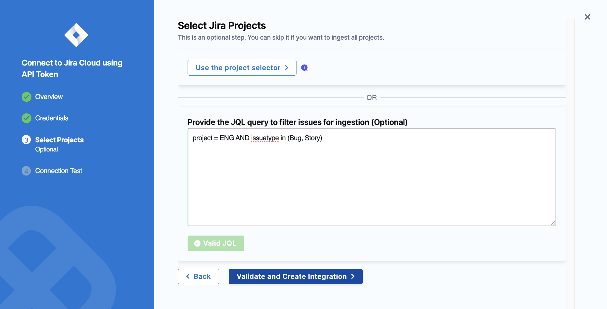
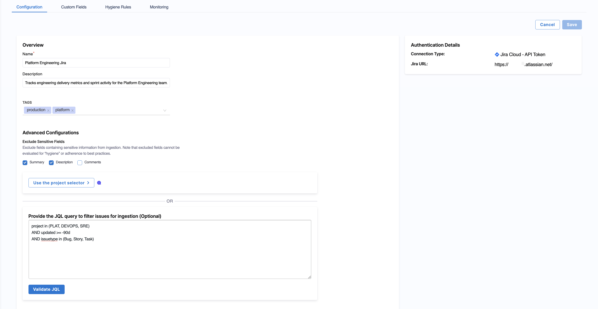

import JiraCustomHygiene from '@site/docs/software-engineering-insights/shared/integrations/jira-hygiene.mdx';
import Tabs from '@theme/Tabs';
import TabItem from '@theme/TabItem';

The Jira integration enables SEI 2.0 to ingest issue management data from Atlassian Jira. This data can be used to track operational performance and correlate incidents and changes with DORA metrics in SEI 2.0 dashboards.

### Prerequisites

Before you can configure the Jira integration, ensure you have the following requirements:

- Create a [classic API token without scopes](https://id.atlassian.com/manage-profile/security/api-tokens) for a Jira Cloud user account. 

   :::tip Use a Jira user account
   The user creating the token must have the **Browse Projects**, **View Aggregated Data**, **Browse Users**, and **User Picker** [permissions](https://support.atlassian.com/jira/kb/how-to-determine-project-visibility-in-jira-cloud-using-user-permissions/) for all projects that you want SEI 2.0 to track and search issues within relevant projects.

   Use a Jira user account with a classic API token without scopes. Scoped API tokens are not supported.

   Service accounts cannot be used to authenticate the SEI Jira integration. The API token must be generated from a standard Jira user account with the required permissions.
   :::

- Make sure to copy the [token](https://support.atlassian.com/atlassian-account/docs/manage-api-tokens-for-your-atlassian-account/) somewhere that you can retrieve it when you configure the integration.

   :::info Allowlist Configuration
   If you have enabled an allow list in your Atlassian account, certain Harness IP addresses must be added to it in order to allow communication between the Harness Platform and Atlassian. If the necessary IPs are not whitelisted, the integration may fail to authenticate or sync data properly.

   To ensure your integration can work correctly, refer to the list of [Harness Platform IPs](/docs/platform/references/allowlist-harness-domains-and-ips) that may need to be whitelisted in your firewall.
   :::

## Setup

To configure the Jira integration:

1. From the SEI navigation menu, click **Account Management**.
1. From the **Integrations** page, navigate to the **Available Integrations** tab.
1. Locate the Jira integration tile under `Issue Management` and click **Add Integration**.
1. Select an installation option: **Jira Software Cloud** or [**Jira Software Data Center**](/docs/software-engineering-insights/harness-sei/setup-sei/configure-integrations/jira/jira-data-center).
1. If you select **Jira Software Cloud**, you can click **Using Jira API Token** (recommended) or **Using Jira Connect App** (deprecated).
   
   :::info Using Jira API Token
   Harness recommends using token-based authentication to integrate Jira Cloud with SEI 2.0. The Jira Connect App–based integration has been deprecated and should only be used for existing setups.
   :::

<Tabs queryString="installation-type">
<TabItem value="api" label="Jira API Token">

:::warning Reauthenticate Jira Cloud Using a Token-based Integration
The **Using Jira Connect App** method is no longer supported. You can re-authenticate the Jira Cloud integration by using a [classic unscoped API token](#prerequisites). Scoped API tokens are not supported.

The token must be created for a Jira user account. The user account must have the **Browse Projects**, **View Aggregated Data**, **Browse Users**, and **User Picker** [permissions](https://support.atlassian.com/jira/kb/how-to-determine-project-visibility-in-jira-cloud-using-user-permissions/) to be able to read/search issues and access all Jira projects you want SEI 2.0 to track. Service accounts are not supported.
:::

To set up the integration using a Jira API token:

1. Add a name for the integration.
1. Optionally, add a description and tags for the integration.
1. Click **Next**.
1. Provide your Jira Cloud credentials in the **Configure Jira Authentication** section:
   
   * Add the URL of your Jira instance, for example: `"https://organization.atlassian.net"`. 
   * Enter the email address associated with your Atlassian user account.
   * Provide the API token generated for that account.

1. Click **Validate Credentials**. Then, click **Next**.
1. Optionally, select Jira projects by clicking **Use the project selector** or entering a JQL query to filter issues for ingestion. For example, to ingest only bugs and stories from a project:

     ```sql
     project = ENG AND issuetype in (Bug, Story)
     ```

   Then, click **Validate JQL**. 

   

   You can also click **Validate and Create Integration** to skip filtering and ingest all accessible projects.

1. Click **Done**.

</TabItem>
<TabItem value="connect" label="Jira Connect App">

:::danger Use Jira API Token Instead
[Jira Connect App](https://www.atlassian.com/blog/developer/announcing-connect-end-of-support-timeline-and-next-steps) is no longer supported. For existing organizations using the Jira Connect App method, see the **Using Jira API Token** tab to re-authenticate Jira Cloud with a token-based integration.
:::

The Jira Connect App facilitates a seamless connection to Jira projects with minimal user intervention, requiring Jira admin configuration for the app.

Using the Jira Connect App allows you to retrieve all user emails from Jira, making it faster and easier to connect and manage the integration.

The following permissions are required to configure the **Jira Connect App** integration:

* **View email addresses of users:** This permission allows the integration to access and view the email addresses of users within the Atlassian account.
* **Read data from the application:** This permission allows the integration to read data from the Atlassian account, such as data from Jira tickets, Jira projects etc.

To set up the integration using the **Jira Connect App**:

1. Select the **Jira Connect App** tile to set up the connection with Jira.
1. In the Jira Connect App settings page, add the basic overview information:

   * **Integration Name:** Name for your integration.
   * **Description (optional):** Add a description for the integration.
   * **Tags (optional):** Add tags for the integration if required.

1. Install the Jira Connect App. To do this, follow these steps:

   * Verify that you are an owner of the Jira account where you track issues. An easy way to check is to visit your organization page and verify that the organization is listed.
   * Go to the **Atlassian Marketplace** to install the app and configure the [SEI app](https://marketplace.atlassian.com/apps/1231375/harness-software-engineering-insights-sei?tab=overview\&hosting=cloud) to access the Jira projects.
   * **Install** the App.
   * Generate and copy the **Jira Connect App key** in the SEI integration configuration settings.
   * Go back to the **Jira Connect App** you just installed.
   * Select **Apps** on the header (beside Create button)
   * Select **Harness SEI Atlassian Connect configuration** from the dropdown menu.
   * Paste the Harness SEI OTP key.

     :::tip
     The key expires after 10 minutes, so generate a new key if the current one expires.
     :::

1. Click **Validate Connection** to validate the connection, and once successful, you'll have the integration set up under the **Your Integrations** tab.

</TabItem>
</Tabs>

Once enabled, Jira data is ingested into SEI 2.0.

### Edit configuration

Navigate to the **Configuration** tab to click **Edit Configuration**. 



In the **Advanced Configurations** section, you can control what Jira data is ingested into Harness SEI 2.0 by either excluding sensitive fields or defining a JQL filter.

### Exclude sensitive fields

You can exclude specific Jira issue fields from ingestion:

- **Summary**  
- **Description**  
- **Comments**

:::tip
Use this option to prevent sensitive or unnecessary text fields from being ingested while still capturing issue metadata and activity signals.
:::

### Filter issues using JQL

Alternatively, you can define a JQL query to control which Jira issues are ingested. Only issues matching the query will be included in SEI 2.0.

Use JQL filtering to limit ingestion to active projects, specific teams, or relevant issue types to reduce noise in downstream analytics. For example:

```sql
project in (PLAT, DEVOPS, SRE)
AND updated >= -90d
AND issuetype in (Bug, Story, Task)
```

## Custom fields

The **Custom Fields** tab allows you to map additional Jira fields to SEI. You can use custom fields to include organization-specific metadata (such as priority, assignment group, or custom attributes) in your SEI dashboards and reports. 

You can map custom fields by defining filter sets for incident and change request identification on the **Incident Management** tab in [**Team Settings**](/docs/software-engineering-insights/harness-sei/setup-sei/setup-teams/#work-type).


Once configured, these fields are included in data ingestion and become available for filtering and analysis in SEI 2.0.

## Hygiene rules

<JiraCustomHygiene />

## Integration monitoring

To monitor the status of the Jira integration, navigate to the **Monitoring** tab. This page provides visibility into data ingestion, availability, and overall integration health. 

The following health indicators are displayed: **Healthy**, **Unhealthy**, **Pending**, or **No Data**. These indicators help ensure data freshness and identify issues impacting Jira-based reporting in SEI 2.0. 

You can use the time range selector to switch between **Last 7 Days** and **Last 30 Days**. Changing the time range updates both the **New Projects Onboarded** and **Tickets** sections, along with their associated charts.

### New Projects Onboarded

The **New Projects Onboarded** section shows the number of Jira projects discovered and ingested during the selected time range.

- **Onboarded in Last 30 Days**: The number of Jira projects onboarded during the selected time range.
- **Total Onboarded**: The cumulative number of Jira projects onboarded since the integration was configured.

:::tip
Use this view to confirm that Jira projects are being successfully discovered and synced in Harness SEI.
:::

### Tickets

The **Tickets** section shows Jira issue ingestion activity during the selected time range.

- **Ingested in Last 30 Days**: The number of Jira issues ingested during the selected time range.
- **Total Ingested**: The cumulative number of Jira issues ingested since the integration was configured.

:::tip
Use this view to confirm that Jira issue data is being continuously ingested into Harness SEI.
:::

### Data Availability

The **Data Availability** timeline visualizes the health of data ingestion during the selected time range. Each segment reflects the integration status at a given point in time:

- **Healthy**: Data was successfully ingested
- **Unhealthy**: Ingestion failed or encountered errors
- **Pending**: Ingestion is in progress
- **No Data**: No data was received for the time window

:::tip
Use this view to identify ingestion gaps, delays, or outages that may impact DORA Insights reporting.
:::

## Troubleshooting

<details>
<summary>What happens to Jira tickets that are deleted after being synced to Harness SEI?</summary>

If you delete a Jira ticket, it will still appear in Harness SEI and continue to count toward metrics until you request that it be manually hidden or removed. To remove or hide deleted tickets, contact [Harness Support](/docs/software-engineering-insights/sei-support).

</details>
