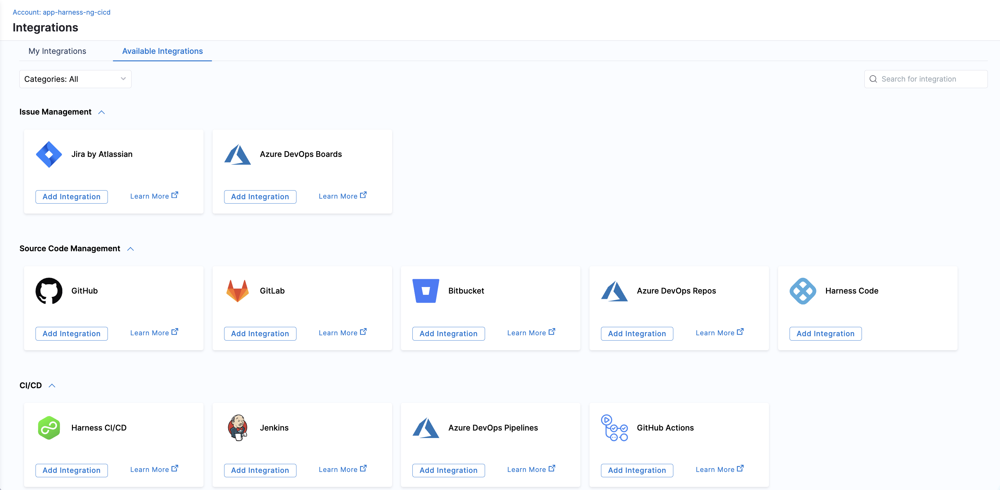

You can configure integrations in Harness SEI 2.0 with your issue management systems, codebase, CI/CD, and collaboration and monitoring tools. In order to calculate metrics, you must integrate your software delivery lifecycle (SDLC) tools with SEI 2.0.

Interactions with third-party systems on Harness SEI are managed through the SEI 2.0 integrations. For example, an SEI GitHub integration authenticates through a GitHub account to collect data about activity in your teams' GitHub repositories (such as PRs, commits, and merges).

You can use any application-specific integration supported by Harness SEI to integrate your tool with SEI 2.0. If you need to connect a CI/CD tool that currently lacks integration support from SEI 2.0, you have the option to create a custom CI/CD integration separately.

:::info
After adding an integration, it may take up to 24-72 hours for data to fully sync to SEI 2.0. During this time, any widgets you set up in dashboards may not display data until the sync is complete.
:::

## Setting up integrations

Configuring integrations allows SEI 2.0 to pull data from a variety of development tools.

To set up an integration:

1. From the left-hand navigation pane, click **Integrations**.
1. Navigate to **Available Integrations** and select the desired tool.

   

The **My Integrations** tab displays a list of your configured integrations which you can use to search or filter them.

## Integration Mapping

Integration mapping refers to the process of associating existing or new integrations with your current project. After creating the project, you can proceed to set up and map integrations to it. It's important to associate the integrations correctly with the project in order to ensure that the widgets on the Insights 2.0 page display accurate data.

1. To map integrations, go to **Integration Mapping** in your Harness project within the SEI 2.0 module.
   
   

1. Click **+ Map Integrations** and select any existing integrations or create new ones as per the requirement.

   

## Harness SEI supported platforms and technologies

Harness SEI supports a variety of platforms, repos, tools, and related technologies. The following sections list entities or providers with first-class support in Harness SEI.

### Issue Management Platform

* [Azure Boards](/docs/software-engineering-insights/propelo-sei/setup-sei/configure-integrations/azure-devops/sei-integration-azure-devops)
* [Jira](/docs/software-engineering-insights/propelo-sei/setup-sei/configure-integrations/jira/sei-jira-integration)

### Source Code Management (SCM)

* [Azure Repos](/docs/software-engineering-insights/propelo-sei/setup-sei/configure-integrations/azure-devops/sei-integration-azure-devops)
* [Bitbucket](/docs/software-engineering-insights/propelo-sei/setup-sei/configure-integrations/bitbucket/sei-bitbucket-cloud)
* [GitHub](/docs/software-engineering-insights/propelo-sei/setup-sei/configure-integrations/github/sei-github-integration)
* [GitLab Cloud](/docs/software-engineering-insights/propelo-sei/setup-sei/configure-integrations/gitlab/sei-integration-gitlab)
* [GitLab Enterprise](/docs/software-engineering-insights/propelo-sei/setup-sei/configure-integrations/gitlab/sei-integration-gitlab)

### CI/CD

* [Jenkins](/docs/software-engineering-insights/propelo-sei/setup-sei/configure-integrations/jenkins/jenkins-plugin)
* [Harness Continuous Delivery & GitOps and Continuous Integration](/docs/software-engineering-insights/propelo-sei/setup-sei/configure-integrations/harness-cicd/sei-integration-harnesscicd)
* [Azure Pipelines](/docs/software-engineering-insights/propelo-sei/setup-sei/configure-integrations/azure-devops/sei-integration-azure-devops)
* [GitHub Actions](/docs/software-engineering-insights/propelo-sei/setup-sei/configure-integrations/github-actions/sei-github-actions)

### BETA

* [SonarQube](/docs/software-engineering-insights/propelo-sei/setup-sei/configure-integrations/beta-integrations/sonarqube/sei-integration-sonarqube)
* [PagerDuty](/docs/software-engineering-insights/propelo-sei/setup-sei/configure-integrations/beta-integrations/sei-integration-pagerduty)
* [ServiceNow](/docs/software-engineering-insights/propelo-sei/setup-sei/configure-integrations/beta-integrations/servicenow/sei-servicenow)

Use the [Ingestion Satellites](/docs/software-engineering-insights/propelo-sei/setup-sei/sei-ingestion-satellite/satellite-overview) service within your local network or VPC to connect your artifacts, issue management, collaboration tools, source code managers, and other providers to Harness SEI.

:::info
Some SEI 2.0 integrations require whitelisting certain Harness IP addresses in order to allow communication between the Harness Platform and the integrated third-party system. If the necessary IPs are not whitelisted, the integration may fail to authenticate or sync data properly.

To ensure your integrations can work correctly, please refer to the list of [Harness Platform IPs](/docs/platform/references/allowlist-harness-domains-and-ips) that may need to be whitelisted in your firewall depending on the specific integration.
:::

## Custom CI/CD integrations

SEI 2.0 supports custom CI/CD integrations through webhooks. You can use this for CI/CD tools that don't have a dedicated SEI 2.0 integration. For information about custom CI/CD, go to [Custom CI/CD Integrations](/docs/software-engineering-insights/propelo-sei/setup-sei/configure-integrations/custom-cicd/sei-custom-cicd-integration).

:::tip

In addition to SEI 2.0 integrations, you can [import CSV files](/docs/software-engineering-insights/propelo-sei/setup-sei/sei-propels-scripts/tables) and display the data in [Table reports](/docs/software-engineering-insights/propelo-sei/setup-sei/sei-propels-scripts/table-reports).

:::

## Integration Monitoring

To monitor and track the health status of an integration, you can go to **Integration Monitoring**.

Here's how you can verify the integration status:

1. Go to the **Integrations** tab under the **Data Settings** and select **My Integrations**.

   

2. Click on the Integration for which you want to verify the status.
3. Select the **Monitoring** tab.
   
   

This page allows you to monitor the integration's current status, which could be either **HEALTHY**, **UNKNOWN**, or **FAILED**. 

You can review previous ingestion activities in the **Ingestion Logs** section and view their respective statuses.
You can also access additional details such as the Ingestion Task Start Time, Time taken to Complete the Ingestion Task, and Number of Retries for the Ingestion Scan.

## Delete an integration

To delete an integration:

* Go to the **Integrations** tab under the **Data Settings** and select **Available Integrations**.

* Click on the delete icon next to the integration you want to remove.

  

* A confirmation dialog box will appear. Click **Yes** to proceed.
  
  

The integration status will change to Deleting. The deletion process is scheduled, and once complete, the integration will no longer be listed in the **Available Integrations** tab.

  

:::warning
Deleting an integration will impact all collections and profiles associated with it.
:::

## Data Backfill

Data Backfill is the process of picking up older changes once the integration is completed. Some older data may be necessary to pull proper creation times and other information from your integration. 

By default, backfill operations are dependent on the integration that customers have set up. Depth of the backfill and frequency are each independently controlled by each integration and its source material /integration process.

In an example, Jira's data backfill may be **x # of days**, every **a # of days**, whereas GitHub would be **y # of weeks** every **b # of days**. 

This would mean that Jira would have a history of **x days**, and would refresh that data rolling forward every **a # of days**. This means historical data rolling forward would not be updated if it exceeds **x+1 days** (e.g., changes made to Jira objects older than that time frame may not make it to Harness).

This affects data in Collections and elsewhere in SEI 2.0. If a customer requires a backfill of data that is custom to their needs, they are encouraged to open a ticket with our support team and we would be happy to assist in helping getting that information updated.
