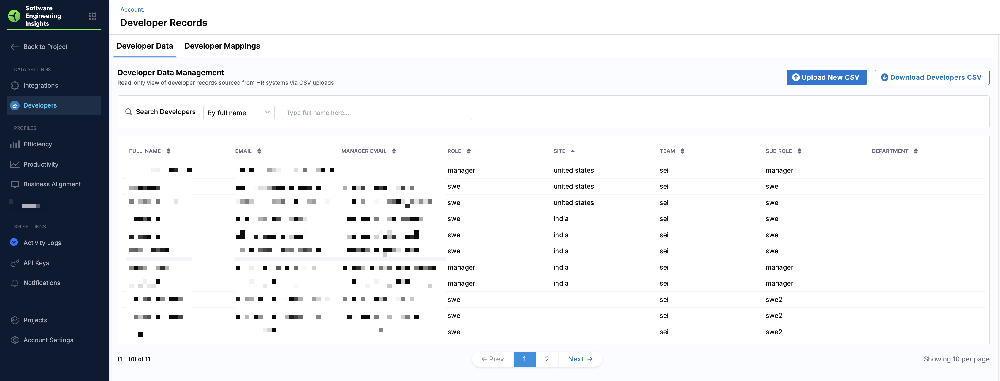
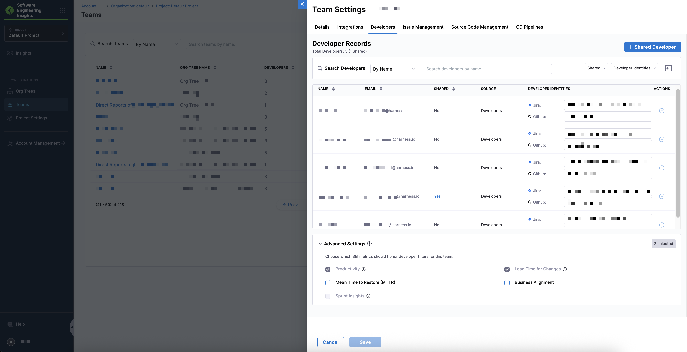
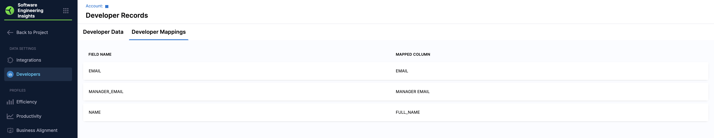

Developers are the fundamental unit of measurement in SEI 2.0. Every insight, metric, and analysis ultimately ties back to individual contributors, the people writing code, completing work items, and deploying software. 

Managing developer records ensures that each individual is accurately represented, mapped to the right teams, roles, and organization hierarchies. Properly managed developer data is essential for reliable metrics across SEI dashboards.

SEI 2.0 supports two approaches for maintaining developer data:

* [CSV Upload](#upload-developer-records-using-a-csv): Recommended for initial setup using an HRIS export that aligns with Harness SEI’s schema.
* [Developer CRUD APIs](#sync-developer-records-programmatically): Recommended for ongoing programmatic updates or integration with internal systems.

Both approaches support the same data schema and enable full lifecycle management of developer records. Once added, SEI 2.0 automatically correlates each developer’s data across source systems like GitHub, GitLab, Jira, or Azure DevOps. 

:::info Auto Identity Discovery

Each developer is associated with one or more identities, which may include:

* Usernames (e.g., @johndoe)
* Account IDs
* Emails used across connected source systems

SEI 2.0 automatically links contributions to developer identities using [Auto Identity Discovery](/docs/software-engineering-insights/harness-sei/manage/automatch-developers), which matches email addresses and other identifiers to ensure accurate metric attribution. Ensure that the email addresses used in the **Developers** tab in **Team Settings** matches the emails your developers use across source systems. Incorrect or mismatched emails may result in missing or fragmented identity mappings in SEI 2.0.
:::

The **Developers** page provides a searchable list of all developers in your organization. You can search by `Full Name`, `Email`, `Manager Email`, `Role`, `Site`, `Team`, `Sub Role`, or `Department`.

The list contains the following data columns:

| Column | Description |
|--------|-------------|
| **Full Name** | Developer’s full name |
| **Email** | Developer’s email |
| **Manager Email** | Developer’s manager email |
| **Role** | Developer role |
| **Site** | Site or location |
| **Team** | Assigned team |
| **Sub Role** | Optional sub-role |
| **Department** | Department name |

### Prepare the developer records

Before uploading or syncing developer data, ensure your source records meets the following standards:

| **Requirement**                            | **Description**                                                                                                                                                                                              |
| ------------------------------------------ | ------------------------------------------------------------------------------------------------------------------------------------------------------------------------------------------------------------ |
| Managers must also exist as developers     | Every email listed as a `Manager Email` must also appear as a separate developer record. This ensures SEI 2.0 can construct an accurate reporting hierarchy.                                                   |
| No cyclic relationships                     | Avoid circular manager-reportee chains (e.g., A → B → A). These relationships will break hierarchy creation.                                                                                                 |
| Unique developer emails                     | Each developer record must have a unique email address. Duplicate emails will cause ingestion errors or incorrect identity attribution.                                                                      |
| Required columns                            | Each record must include the following columns: `full_name`, `email`, `manager email`, `role`, `sub role`, `team`, `department`, and `site`. These columns ensure SEI 2.0 can properly map developers to teams and metrics. |
| No missing values                           | Ensure all required columns are populated for every record. Missing values will cause failure.                                                                                                               |
| Email correctness                           | Use the same email IDs that developers use across your source systems (GitHub, Jira, etc.). A mismatch will prevent SEI 2.0 from linking identities correctly.                                               |
| No blank column names                        | Every column in your CSV should have a valid header. Blank column headers will cause validation errors.                                                                                                      |

## Upload developer records using a CSV

The CSV upload method is ideal for initial setup or periodic manual updates.

To upload developer records:

1. From the Harness SEI navigation menu, navigate to **Account Management** > **Developers**.
2. Click **Upload New CSV** to add a developer dataset.
   
   

3. Click **Choose File** or drop your CSV file containing developer data.
4. Review the **Developer Preview** screen and map each column from your CSV to the corresponding SEI field.

   

   - **Display Name**: Select the column containing the developer's name.
   - **Email**: Select the column containing the developer's email.
   - **Manager Email**: Select the column containing the manager's email.
   - **Role**: Optionally, select the column containing the developer's role.

5. Click **Save**. 

:::tip
After upload, review your hierarchy on the **Developer Data** and **Developer Mappings** tabs to ensure all records are processed correctly.
:::

## Sync developer records programmatically

For automated or large-scale synchronization, you can manage developer records programmatically using the Developer CRUD APIs. These APIs allow you to sync developer data as part of your integration or HRIS sync workflow, ensuring your developer data remains up to date without manual uploads. 

For detailed request and response formats, go to [Using CRUD APIs to update developer records](/docs/software-engineering-insights/harness-sei/api/developer-records). 

## Configure developer settings per team

To ensure metrics reflect actual contributions in **Team Settings**:

1. From the Harness SEI navigation menu, click **Teams** and select a team.
1. Navigate to the **Developers** tab.
1. Configure the following:
   
   * [Shared Developers](/docs/software-engineering-insights/harness-sei/setup-sei/setup-teams#managing-shared-developers): Contributors who work across multiple engineering teams.
   * [Developer Identifiers](/docs/software-engineering-insights/harness-sei/setup-sei/setup-teams#review--update-developer-identifiers): Map developers to Issue Management, SCM, and CD accounts. Developer identifiers must be correct to ensure metrics are attributed accurately.
   * [Developer Filters](/docs/software-engineering-insights/harness-sei/setup-sei/setup-teams#applying-metric-level-developer-filters): Control which developers are included in specific metrics.

These settings allow SEI 2.0 to calculate metrics like Productivity, Lead Time for Changes, and Business Alignment accurately at the team level, even for cross-team contributors.

## Managing developer records

Accurate mappings are essential for ensuring developer records are correctly associated with roles, managers, and team assignments. To ensure that the fields from the uploaded CSV file are correctly mapped to Harness SEI's schema, navigate to the **Developer Mappings** tab in the **Developers** page

To review or export existing developer data:

1. Navigate to the **Developer Data** tab to view all developer records in SEI 2.0.
1. Click **Download Developers CSV** to export the data. This provides a snapshot of the current records in CSV format for auditing or offline review.

   | Email                     | Manager Email            | Full Name       | Role       | Site         | Team | Sub Role | Department |
   | ------------------------- | ----------------------- | --------------- | ---------- | ------------ | ---- | -------- | ----------  |
   | `frank@example.com`         | `eve.manager@example.com`  | Frank Castle    | SWE        | USA          | SEI  | SWE      |            |
   | `grace@example.com`         | `eve.manager@example.com`  | Grace Hopper    | SWE        | USA          | SEI  | SWE      |            |
   | `heidi@example.com`         | `frank.manager@example.com`| Heidi Klum      | Manager    | USA          | SEI  | Manager  |            |
   | `ivan@example.com`          | `frank.manager@example.com`| Ivan Petrov     | Manager    | India        | SEI  | Manager  |            |
   | `judy@example.com`          | `heidi.manager@example.com`| Judy Garland    | SWE        | India        | SEI  | SWE      |            |
