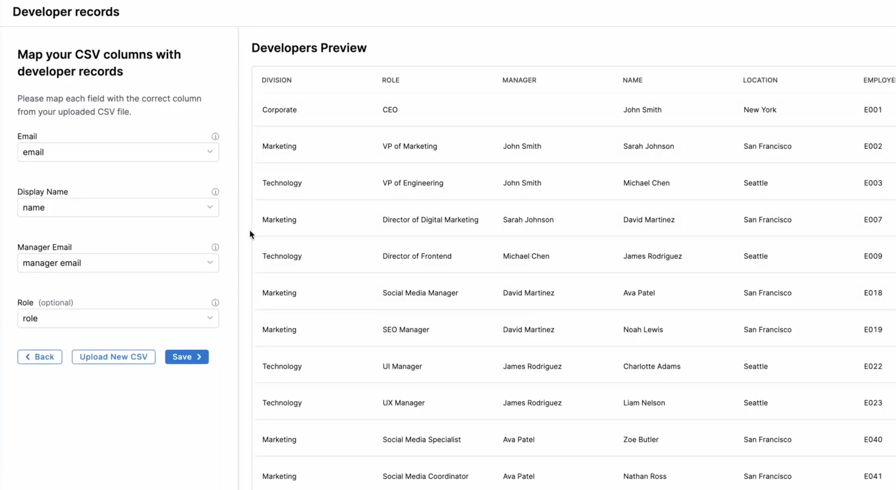

## Overview

Managing developer records in SEI 2.0 ensures accurate mapping of individuals to their respective [teams](./setup-teams), roles, and reporting structures. This includes uploading new developer records, reviewing records sourced from HR systems, and mapping relevant fields to SEI's schema.

The **Developers** page includes the **Developer Data** tab, which is a read-only view of your developer records ingested from CSV uploads, and the **Developer Mappings** tab, which is a mapping interface that links raw data fields (such as `EMAIL` AND `MANAGER_EMAIL_ADDRESS`) to SEI-specific fields (such as `EMAIL`, `MANAGER_EMAIL`, `DISPLAYNAME`, and `ROLE`).

## Uploading developer records

To add developer records:

1. From the left-hand navigation pane, click **Developers** under **Configuration**.
1. Upload a CSV file by clicking the **Upload New CSV** button.
   
   

1. Browse and select your CSV file containing developer data.
1. On the **Developer Preview** screen, map the columns from your uploaded CSV to the corresponding SEI fields:

   

   - **Display Name**: Select the column containing the developer's name.
   - **Email**: Select the column containing the developer's email.
   - **Manager Email**: Select the column containing the manager's email.
   - **Role**: Select the column containing the developer's role.

1. Click **Save.** A **Developer records saved successfully** message will appear.

## Managing developer records

Accurate mappings are essential for ensuring developer records are correctly associated with roles, managers, and team assignments. Field mappings are available on the **Developer Mappings** tab. You can access these mappings to ensure that the fields from the uploaded CSV file are correctly mapped to SEI's schema.

To review or export existing developer data:

1. Navigate to the **Developer Data** tab to view all developer records in SEI 2.0.
1. Click **Download Developers CSV** to export the data. This provides a snapshot of the current records in CSV format for auditing or offline review.

   