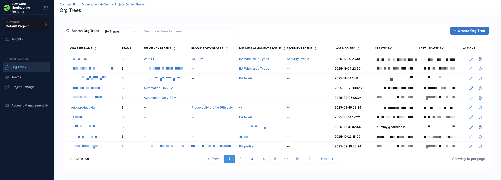
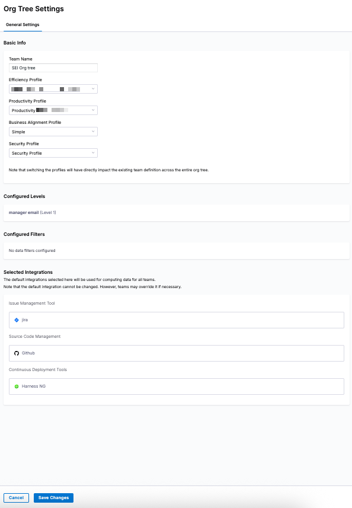

import Tabs from '@theme/Tabs';
import TabItem from '@theme/TabItem';

Org Trees define the organizational structure that SEI 2.0 uses to group developers, derive teams, and calculate metrics across Efficiency, Productivity, and Business Alignment insights. Each Org Tree represents a complete reporting hierarchy built from your developer records, and serves as the source of truth for how [teams](/docs/software-engineering-insights/harness-sei/setup-sei/setup-teams) are created and measured in SEI 2.0. Teams are automatically derived as leaf nodes within an Org Tree. 

You can model complex organizational structures by defining multiple hierarchy levels and applying data filters using attributes such as `Role`, `Site`, and `Team`. Levels determine how teams are grouped in the hierarchy, while data filters limit which developer records are included in the Org Tree.

The **Org Tree** page provides a centralized view of all Org Trees configured in your account and their associated profiles and metadata. To create an Org Tree, click **+ Create Org Tree**.

Use the **Search Org Trees** dropdown menu and search bar to search for Org Trees by associated profile or by name. The following information is available for each Org Tree: 

| Column                         | Description                               |
| ------------------------------ | ----------------------------------------- |
| **Org Tree Name**              | Name of the Org Tree                      |
| **Teams**                      | Number of teams derived from the Org Tree |
| **Efficiency Profile**         | Associated Efficiency Profile             |
| **Productivity Profile**       | Associated Productivity Profile           |
| **Business Alignment Profile** | Associated Business Alignment Profile     |
| **Last Modified**              | Timestamp of the most recent update       |
| **Created By**                 | User who created the Org Tree             |
| **Last Updated By**            | User who last modified the Org Tree       |
| **Actions**                    | Edit or delete the Org Tree               |

Click on an Org Tree in the list to review or update its configuration in the **Org Tree Settings** side panel. If you update any profiles, click **Save Changes** to apply the update.

:::info
Changing a profile impacts all teams within the Org Tree. Teams inherit these profiles by default, so switching profiles can affect how metrics are calculated and how existing team data is interpreted across the entire hierarchy. 
:::

While Org Trees are constructed automatically from your developer records, they must be configured correctly to ensure teams are derived accurately and metrics reflect real reporting lines, ownership, and delivery scope across your organization. 

### Prerequisites

Before setting up your Org Tree, ensure the following:

* You have [uploaded your developer records via a CSV driven export from your HRIS system](/docs/software-engineering-insights/harness-sei/setup-sei/manage-developers#add-developer-records-via-csv-upload). 
  The CSV file must follow the required structure:
  * Each row represents a developer.
  * Must include at least `Name`, `Email`, and `Manager Email`. Optionally, include `Site`, `Role`, or `Team`.
* You have created the relevant [Profiles](/docs/category/set-up-profiles).
* You have configured Issue Management (e.g. Jira, Azure Boards), Source Code Management (e.g. GitHub, GitLab), and CI/CD (e.g. Harness) integrations, if applicable

How Org Trees Work in SEI 2.0

Org Trees are automatically generated from your organization's developer records, which are typically sourced from an HRIS system such as Workday or BambooHR and uploaded as a CSV file.

To construct the Org Tree, SEI 2.0 uses two primary fields from the developer records:

* **Developer identifier:** A unique identifier for each developer, most commonly their email address.
* **Reporting field:** A reference to the developer's manager (for example, `Manager Email`).

Using these fields, SEI 2.0 builds a hierarchical structure that reflects your organization's reporting relationships where:

* Each manager is represented as a node in the Org Tree.
* Direct reports are grouped beneath their manager.
* This process continues recursively until the top-level manager (the root node) is reached.

The result is a complete manager-reportee tree that mirrors your real-world organizational structure.

Org Trees are kept in sync with your organization through ongoing developer record uploads. When you upload an updated CSV from your HRIS system, SEI 2.0 automatically detects changes such as new hires, reporting line updates, or team changes and rebuilds the Org Tree accordingly.

If new teams are introduced or developers move between teams, you may need to review and update [**Team Settings**](/docs/software-engineering-insights/harness-sei/setup-sei/setup-teams) to ensure insights and metrics are attributed correctly.

Org Trees form the foundation for team-based analysis in SEI 2.0, allowing you to:

* Automatically group developers into teams based on real reporting structures
* Calculate metrics and surface insights at the team, manager, or organizational level
* Analyze performance across departments, business units, or leadership

By grounding insights in your actual organizational structure, SEI 2.0 ensures that metrics reflect how work is owned, delivered, and managed across your organization.

## Multi-level hierarchies

You can define **multi-level hierarchies** for your Org Tree in SEI 2.0. In addition to manager-reportee relationships, you can group developers by custom attributes such as `Email`, `Manager Email`, `Name`, `Role`, `Site`, and `Team`.

This flexibility allows you to:

* Model complex org structures that don’t strictly follow a single reporting line.
* Create alternative views of the same developer data (for example, grouping by department within a region).
* Enable cross-sectional analysis across business units, geographies, and lines of business.

## Create an Org Tree

1. From the Harness SEI navigation menu, click **Org Trees**.  
1. Click **+ Create Org Tree**.  
1. Enter a name for your Org Tree and click **Next**.  

   

1. Define team structure by selecting levels. The Org Tree preview updates as you add levels and filters.

   * Choose one or more fields to group your developers. Available options include `Email`, `Manager Email`, `Full Name`, `Role`, `Site`, and `Team`.
     
     

   * If you choose `Manager Email` at any level, no additional levels can be added after that.

1. Apply data filters so you can narrow down the Org Tree to focus on specific teams, roles, or locations. Multiple filters can be added and are applied with `AND` logic.

   * Click **+ Add Filter** to limit the developer records displayed. 

     

   * Each filter includes the following fields:

     - **Column**: Select `Full Name`, `Role`, `Site`, or `Team`.  
     - **Condition**: Select `Equals` or `Not equals`.
     - **Value(s)**: Values are populated dynamically based on the selected column.  

1. Review the **Developer Records** preview to confirm that the data matches your expectations. To switch to a detailed summary, click the **Table** view. 

   <Tabs queryString="org-tree-views">
   <TabItem value="tree-view" label="Tree View">

   Interact with the preview and navigate relationships and reporting lines in the **Tree View**.

   

   </TabItem>
   <TabItem value="table-view" label="Table View">

   See summaries of total teams, team size, and any missing or unmapped data in the **Table View**.

   

   </TabItem>
   </Tabs>

1. Click **Next** to proceed to profile selection.  
1. Select the relevant profiles that will power your insights:

   

   * Under **Efficiency Profiles**, choose the profile that you had configured previously for measuring software delivery performance metrics such as DORA.
   * Under **Productivity Profiles**, choose the profile that you had configured previously for measuring developer activity and output.
   * Under **Business Alignment Profiles**, choose the BA profile that you had configured for measuring Business Alignment metrics.

1. Click **Next**.  
1. Configure default integrations for all teams in this Org Tree. These can be customized later at the team level:  
    
    

    * Under **Issue Management**, select the default IM type integration that apply to all teams in your organization.  
    * Under **Source Code Management**, select the default SCM integration.
    * Under **Continuous Delivery**, select the default CD integration. 

1. Click **Save Org Tree** to complete setup. You will see a confirmation message: `Org tree created successfully`.

After you save an Org Tree, it becomes active across SEI 2.0 and available for analysis. Engineering leaders and managers can start exploring insights at different levels of the organization: by team, manager, or business unit, based on the structure you defined.

Each team in the Org Tree automatically inherits the selected profiles and default integrations. These inherited settings provide a baseline configuration that ensures metrics are calculated consistently across the organization, while still allowing teams to override specific settings when needed.

The Org Tree serves as a foundational layer in SEI 2.0, enabling dashboards on the **Insights** page to be organized around real teams, improving visibility into developer performance, and supporting meaningful comparisons across teams and business units.

Once your Org Tree(s) are in place, you can configure [team-specific settings](/docs/software-engineering-insights/harness-sei/setup-sei/setup-teams) and review [developer records](/docs/software-engineering-insights/harness-sei/setup-sei/manage-developers).