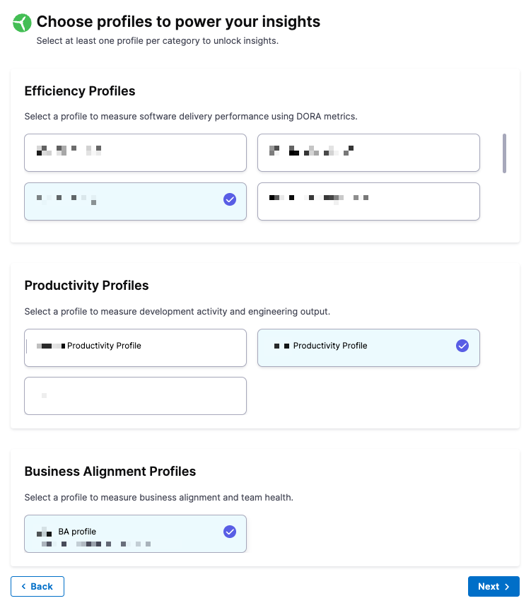

import Tabs from '@theme/Tabs';
import TabItem from '@theme/TabItem';

## Overview

The Org Tree in SEI 2.0 mirrors your organization’s internal reporting structure, serving as the backbone for grouping developers and analyzing performance in the context of real-world teams and reporting lines.

SEI 2.0 supports multiple Org Trees per account, enabling you to model different business units, geographies, or alternative reporting structures. You can also create multi-level groupings based on custom attributes such as `Role`, `Site`, and `Team`, giving you more flexibility to model complex organizational structures.

By replicating your org hierarchy within SEI, the Org Tree enables team-based insights for engineering leaders, allowing them to assess productivity, efficiency, and delivery performance across various levels of the organization, from individual contributors to entire departments.

### Prerequisites

Before setting up your Org Tree, ensure the following:

* You have uploaded your developer records via a CSV driven export from your HRIS system. 

  The CSV file must follow the required structure:
  * Each row represents a developer.
  * Must include at least `Name`, `Email`, and `Manager Email`. Optionally, include `Site`, `Role`, or `Team`.
* You have created the relevant [Efficiency](/docs/software-engineering-insights/harness-sei/setup-sei/setup-profiles/efficiency-profile) and [Productivity Profiles](/docs/software-engineering-insights/harness-sei/setup-sei/setup-profiles/productivity-profile).
* You have connected your integrations for:
  * Issue Management (e.g. Jira, Azure Boards)
  * Source Code Management (e.g. GitHub, GitLab)
  * CI/CD (e.g. Harness) (if applicable)

### How Org Trees work in SEI 2.0

The Org Tree in SEI 2.0 is automatically constructed using your organization's developer records (typically managed as a CSV driven export from your HRIS system like Workday or BambooHR)

To build the Org Tree, SEI reads two key fields from the uploaded developer records:

* **Developer Identifier:** Usually the developer’s email address
* **Reporting Field:** A reference to their manager (e.g., Manager Email)

Using this data, SEI automatically builds your organizational hierarchy:

* Each manager is represented as a node.
* Their direct reports are placed underneath them.
* This hierarchy continues recursively up to the root of the organization.

The result is a complete manager-reportee tree that mirrors your real-world structure.

#### What this enables

The Org Tree powers many key capabilities in SEI:

* Groups developers into actual teams without manual setup
* Assigns metrics, insights, and goals at every team or manager level
* Supports reporting by team, department, manager, or business unit

#### Ways to view your Org Tree

You can explore your Org Tree in two formats:

<Tabs queryString="org-tree-views">
<TabItem value="tree-view" label="Tree View">

Interact with the preview and navigate relationships and reporting lines in the **Tree View**.

</TabItem>
<TabItem value="table-view" label="Table View">

See summaries of total teams, team size, and any missing or unmapped data in the **Table View**.

</TabItem>
</Tabs>

## Multi-level hierarchies

You can define **multi-level hierarchies** for your Org Tree in SEI 2.0. In addition to manager-reportee relationships, you can group developers by custom attributes such as `Email`, `Manager Email`, `Name`, `Role`, `Site`, and `Team`.

This flexibility allows you to:

* Model complex org structures that don’t strictly follow a single reporting line.
* Create alternative views of the same developer data (for example, grouping by department within a region).
* Enable cross-sectional analysis across business units, geographies, and lines of business.

## Set up an Org Tree

1. In your Harness Account, go the SEI project and click **Org Tree**.  
1. Click the **+ Create Org Tree** button.  
1. Enter a name for your Org Tree and click **Next**.  

   

1. Define team structure by selecting levels. The Org Tree preview updates as you add levels and filters.
   
   * Choose one or more fields to group your developers. Available options include `Email`, `Manager Email`, `Full Name`, `Role`, `Site`, and `Team`.
     
     

   * If you choose `Manager Email` at any level, no additional levels can be added after that.

1. Apply data filters so you can narrow down the Org Tree to focus on specific teams, roles, or locations. Multiple filters can be added and are applied with `AND` logic.

   * Click **+ Add Filter** to limit the developer records displayed. 

     

   * Each filter includes the following fields:

     - **Column**: Select `Full Name`, `Role`, `Site`, or `Team`.  
     - **Condition**: Select `Equals` or `Not equals`.
     - **Value(s)**: Values are populated dynamically based on the selected column.  

1. Review the **Developer Records** preview to confirm that the data matches your expectations. To switch to a detailed summary, click the **Table** tab. Here, you can see stats like total teams, root teams, total developers, and any missing or unmatched records.
1. Click **Next** to proceed to profile selection.  
1. Select the relevant profiles that will power your insights:

   

   * Under **Efficiency Profiles**, choose the profile that you had configured previously for measuring software delivery performance metrics such as DORA.
   * Under **Productivity Profiles**, choose the profile that you had configured previously for measuring developer activity and output.
   * Under **Business Alignment Profiles**, choose the BA profile that you had configured for measuring Business Alignment metrics.

1. Click **Next**.  
1. Configure default integrations for all teams in this Org Tree. These can be customized later at the team level:  
    
    

    * Under **Issue Management**, select the default IM type integration that apply to all teams in your organization.  
    * Under **Source Code Management**, select the default SCM integration.
    * Under **Continuous Delivery**, select the default CD integration. 

1. Click **Save Org Tree** to complete setup. You will see a confirmation message: `Org tree created successfully`.

## What happens next?

Once saved, your Org Tree will be available for use across SEI 2.0. Engineering Managers can begin analyzing metrics per team, manager, or function based on the tree structure.

Each team inherits the assigned profiles and integrations unless overridden at the team level. The tree becomes a foundational layer to:

* Power dashboards and insights per team
* Group developers for performance visibility
* Drive organizational benchmarking

## FAQs

### Can I create multiple Org Trees?

Yes. SEI 2.0 supports multiple Org Trees per account, allowing you to model different business units, geographies, or experimental reporting structures. Each Org Tree has its own profiles, integrations, and hierarchy definitions, but all use the same underlying developer records.

### Can I update the Org Tree later?

Yes. Org Tree updates are tied to your regular developer records upload. When you upload a new CSV (exported from your HRIS system), SEI will automatically detect changes and restructure the Org Tree accordingly.

For newly added teams or existing teams with new developers, you’ll need to update the team settings to view insights correctly.

## Next steps

* [Set up Teams](/docs/software-engineering-insights/harness-sei/setup-sei/setup-teams)
* [Manage developers](/docs/software-engineering-insights/harness-sei/setup-sei/setup-teams)