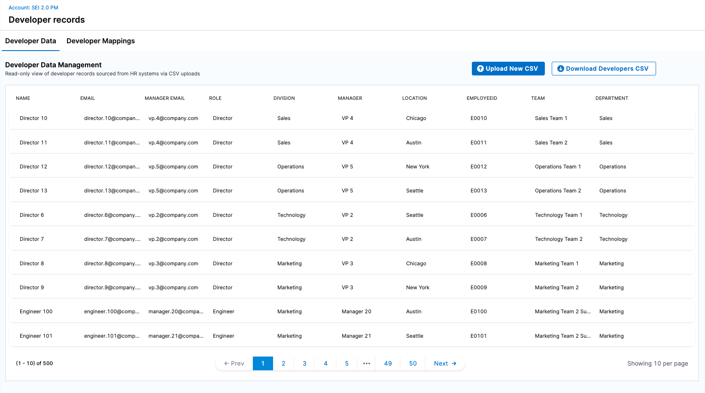
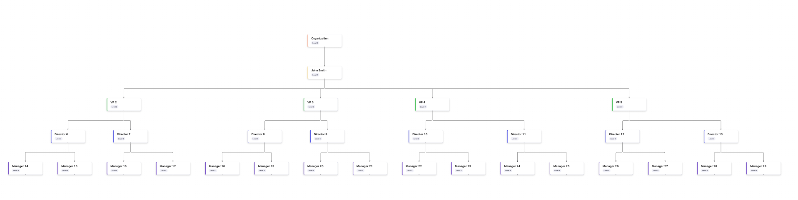
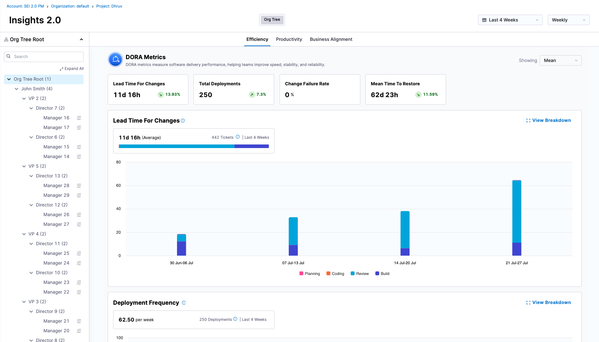

This page walks you through the essential steps to configure Software Engineering Insights (SEI) 2.0 for your organization, from setting up integrations and defining your org structure to uploading developer records and exploring insights.

Follow these steps to get started and customize SEI 2.0 to your team's structure and goals.

### Step 1: Set up integrations

Start by connecting SEI 2.0 to your engineering systems:

* Source Control Management Systems (e.g., GitHub, GitLab, Bitbucket)
* CI/CD Tools (e.g., Harness, GitHub Actions, Jenkins)
* Ticketing Systems (e.g., Jira, Azure Boards)
* ITSM Tools (e.g., ServiceNow etc)

These integrations power the insights you’ll see in SEI.

### Step 2: Set up profiles

**Profiles** control **what SEI 2.0 measures** and **how it measures it** by enabling or disabling specific metrics and defining which event types power those metrics. They provide a flexible way to customize SEI 2.0 insights to your organization’s goals and workflows.

Each Profile includes which **metrics** are enabled or disabled (e.g., Deployment Frequency, Lead Time, Change Failure Rate) and the **events and signals** that power those metrics.

#### Types of Profiles

SEI 2.0 supports three main types of Profiles, each optimized for different measurement objectives:

| Type of profile      | Purpose                                  | Metrics                                                  |
|---------------------|---------------------------------------------|-----------------------------------------------------------------|
| [Efficiency](/docs/software-engineering-insights/harness-sei/setup-sei/setup-profiles/efficiency-profile)      | Delivery performance (DORA metrics) & sprint insights (coming soon) | Deployment Frequency, Lead Time for Changes, Change Failure Rate, MTTR |
| [Productivity](/docs/software-engineering-insights/harness-sei/setup-sei/setup-profiles/productivity-profile)    | Developer productivity and collaboration     | PR Velocity per Dev, PR Cycle Time,  Work Completed Per Dev, Coding Days Per Dev, Number of Comments Per PR, Average Time to First Comment  |
| [Business Alignment](/docs/software-engineering-insights/harness-sei/setup-sei/setup-profiles/business-alignment-profile) | Alignment of engineering output to business goals | Business Alignment  |

### Step 3: Upload your developer records & build the organization hierarchy

#### Developers

Developers are the foundational unit in SEI 2.0. Every insight, metric, and trend in the platform starts with accurate identification and attribution of developer activity across your toolchain.

#### Org Tree

The Org Tree represents your organizational hierarchy and structure in SEI 2.0. It provides the foundation for grouping developers and replicating the org hierarchy into SEI 2.0.
At present, the Org Tree is powered by CSV-based imports from your HRIS system (e.g., Workday, BambooHR). The CSV must include a contributor attribute (such as ManagerEmail or ManagerID) that defines the reporting relationship between individuals.

:::tip
You can download a sample CSV format directly from the UI before uploading your HRIS export.
:::

#### Set up resources

* [Manage developers](/docs/software-engineering-insights/harness-sei/setup-sei/manage-developers)
* [Set up a Org Tree](/docs/software-engineering-insights/harness-sei/setup-sei/setup-org-tree)

### Set up teams & explore insights

With your org tree in place, configure Teams and begin tracking insights. You can:

* Review & update the developers integration identifiers in the specific teams.
* Customize & define the performance parameters using the [team settings](/docs/software-engineering-insights/harness-sei/setup-sei/setup-teams).
* Once setup is complete, you can [view insights at the org tree level](./view-insights/insights) to understand how your organization is performing overall, or [view insights for a specific team](./view-insights/granular-insights) to dive deeper into team-level performance data.

### Next steps

* [Set up integrations](/docs/software-engineering-insights/harness-sei/setup-sei/configure-integrations/overview)
* [Set up profiles](/docs/software-engineering-insights/harness-sei/setup-sei/setup-profiles/efficiency-profile)
* [Upload the developer records](/docs/software-engineering-insights/harness-sei/setup-sei/upload-developer-records)
* [Set up Org Tree](/docs/software-engineering-insights/harness-sei/setup-sei/setup-org-tree)
* [Set up & define team settings](/docs/software-engineering-insights/harness-sei/setup-sei/setup-teams)
* [View insights](/docs/software-engineering-insights/harness-sei/setup-sei/view-insights/insights)