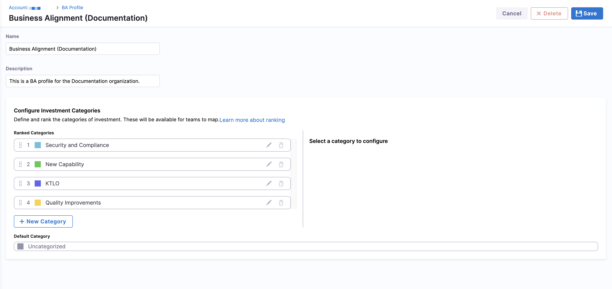
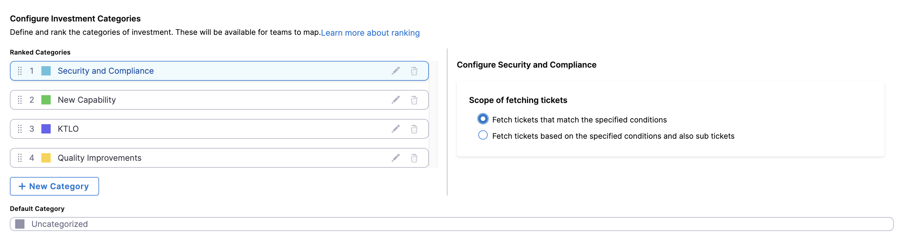
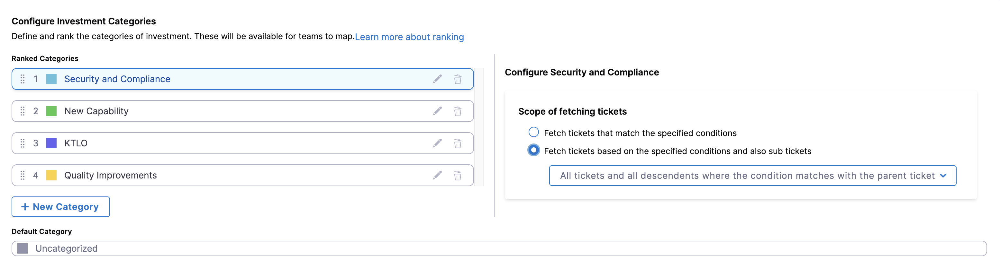
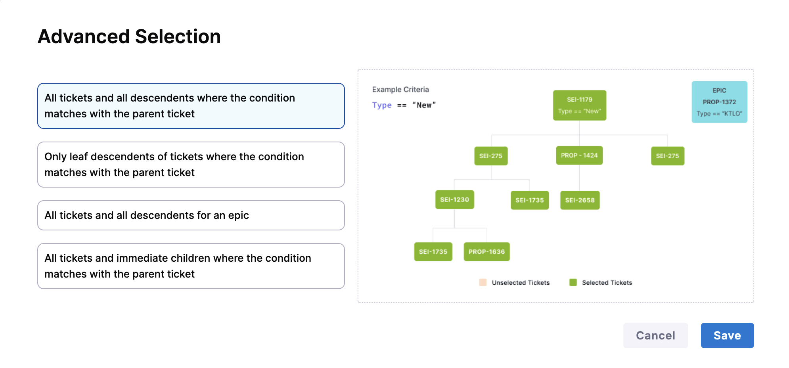
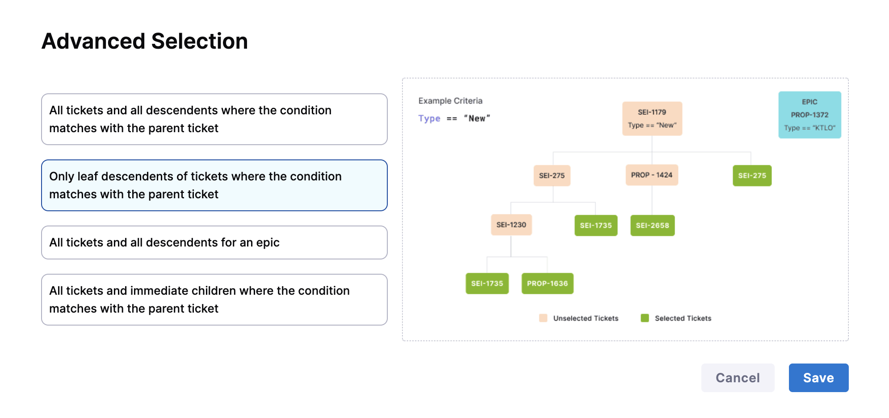
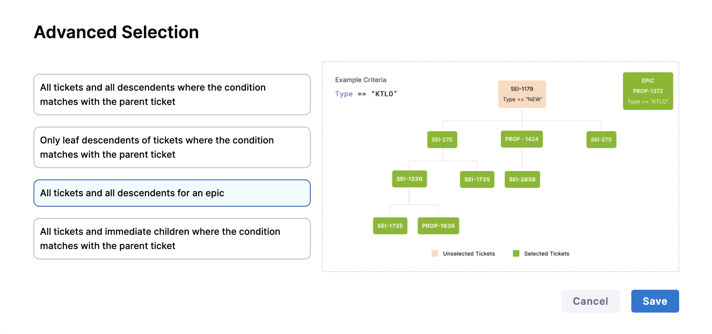
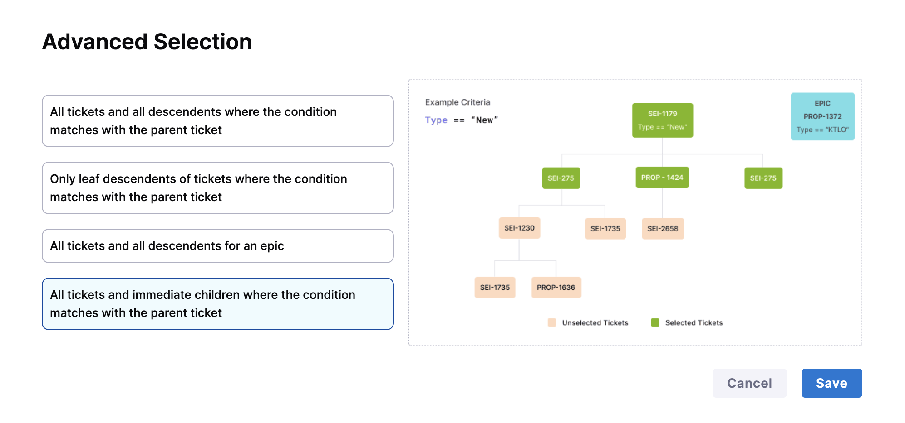

## Overview

A Business Alignment profile defines the structure for tracking how engineering work aligns with business priorities. It establishes the investment categories to be used across the organization and specifies the scope and rules for fetching work items relevant to Business Alignment metrics.

At the profile level, you can:

* Define the set of Investment Categories (e.g., Features, Tech Debt, Customer Commitments).
* Configure the fetch scope to determine which work items should be considered for each category (e.g., by project, integration, or work type).

Investment Categories represent the different strategic areas where engineering effort is invested. These categories are defined at the profile level and shared across all teams. However, each team can define its own logic for classifying work items into these categories using metadata-based filters (Filter Sets) like labels, issue types, and components in **Team Settings**.

Common examples include:

* Feature Development
* Technical Debt
* Customer Commitments
* Maintenance
* Bugs or Incidents

This two-level setup ensures consistency in reporting across the organization while giving teams the flexibility to define category logic that reflects their specific context.

## Set up the profile

To create a business alignment profile:

1. In your **Harness project**, navigate to **Software Engineering Insights** and click **Account Management**.
1. Under **Profiles**, select **Business Alignment**.

1. To create a profile, click **Create**. To edit an existing profile, click the **Edit Profile** icon in the profiles list.

1. Enter a name and add an optional description for the profile.

   

1. Define and rank investment categories your organization wants to track.

   

   * In the **Scope of fetching tickets** section, select the relevant scope type and apply filters to narrow the computation scope. For advanced configuration, see [Scoping of fetching tickets](#scope-of-fetching-tickets).
   * To edit an investment category, click the **Edit Category** icon. 
   * To delete an investment category, click the **Delete** icon.

### Scope of fetching tickets

Each Investment Category in the Business Alignment profile defines how tickets should be fetched based on specific criteria and hierarchy rules. This ensures that effort is correctly attributed even in nested work structures like epics, stories, and sub-tasks.

You have two options:

* **Fetch tickets that match the specified conditions:** Only tickets that directly match the conditions are included.
* **Fetch tickets based on the specified conditions and also sub-tickets:** Includes tickets that match the conditions *and* their related sub-tickets.

#### Advanced selection options

If you select **Fetch tickets based on the specified conditions and also sub-tickets** (hierarchical fetching), you can select from the following options:

import Tabs from '@theme/Tabs';
import TabItem from '@theme/TabItem';

<Tabs>
<TabItem value="parents" label="Parent + All Descendents">
    

**All tickets and all descendents where the condition matches with the parent ticket:** Includes the parent ticket and all levels of child tickets (e.g., epics to stories to sub-tasks).

</TabItem>
<TabItem value="leafs" label="Leaf Descendents Only">
    

**Only leaf descendents of tickets where the condition matches with the parent ticket:** Includes only the terminal (leaf) child tickets from matched parent tickets. Useful when work is primarily tracked at the leaf level.

</TabItem>
<TabItem value="epic" label="Epic + All Descendents">
    

**All tickets and all descendents for an epic:** Includes all work items under an epic, regardless of whether the epic itself meets the condition.

</TabItem>
<TabItem value="children" label="Parent + Immediate Children">
    

**All tickets and immediate children where the condition matches with the parent ticket:** Includes the matched parent ticket and its immediate children (but not deeper levels).

</TabItem>
</Tabs>

This granularity gives teams flexibility to define fetching logic that aligns with how work is structured and tracked in systems like Jira or Azure Boards, ensuring accurate effort attribution across complex ticket hierarchies.

Relationship between Ranking Categories and Business Alignment metric calculations

The ranking of categories plays a significant role in determining how tickets are allocated to different categories, and subsequently, how Business Alignment calculations are made.

1. **Ticket Metadata for Categories:** Categories in the Business Alignment profile are defined based on certain attributes or metadata of tickets. These attributes can include Labels, Components, Priorities, Issue Types, or any other relevant information associated with the tickets in your Issue Management System (e.g., Jira or Azure).     Example Ticket Metadata:   `Ticket 1:` Labels: (`abc`, `def`) Priority: (P1)   `Ticket 2:` Labels: (`abc`, `def`, `ghi`) with Components: (`text`, `value`)
2. **Defining Categories:** Categories are defined based on specific criteria related to ticket metadata. In the provided example, let's say you define two categories:
   1. `Category 1:` Based on the label being `abc`
   2. `Category 2:` Based on the component being `text`
3. **Ticket Allocation to Categories:** Now, when you have tickets in your system, they are allocated to categories based on whether they meet the criteria defined for each category. For example:
   1. Ticket 1 belongs to `Category 1` because it has the label `abc`
   2. Ticket 2 can potentially belong to both `Category 1` and `Category 2` because it meets the criteria for both categories.
4. **Ranking Categories:** This is where the ranking of categories comes into play. When a ticket is eligible for multiple categories, the ranking helps determine which category takes precedence or priority. In the provided example:
   1. If `Category 1` is ranked higher (e.g., ranked 1), then Ticket 2 will also be allocated to `Category 1 `
   2. If `Category 2` is ranked higher, then Ticket 2 will be allocated to `Category 2` and it won't be included in `Category 1`
5. **Allocation Goals and Calculations:** After tickets are allocated to Categories, you can set Allocation Goals for each Category. To learn more, see [Allocation Goals](#allocation-goals).
6. **Business Alignment Calculations:** Once Allocation goals are set, Harness SEI calculates the Business Alignment metric value based on the actual allocation of tickets to categories and the progress made in each category.

Once you have completed the profile configuration, click **Save** to finalize your changes. The Business Alignment profile must be associated with one or more [Org Trees](/docs/software-engineering-insights/harness-sei/setup-sei/setup-org-tree/) in your organization. This association determines which teams can access and use the profile.

After association, engineering managers within those Org Trees can define category filters at the team level, using their own set of work-item filters based on metadata such as labels, components, or issue types. From here, you can define Business Alignment settings for a team or view the [Business Alignment dashboard](/docs/software-engineering-insights/harness-sei/analytics-and-reporting/business-alignment).