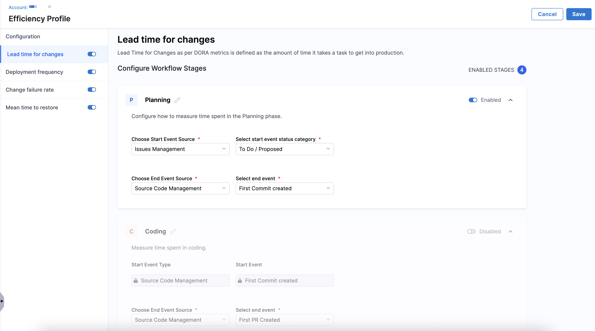
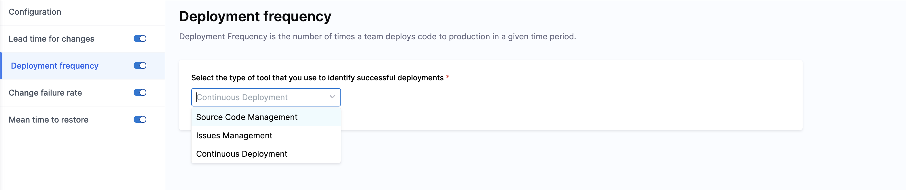
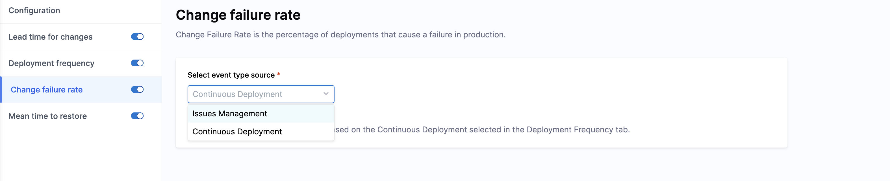

import Tabs from '@theme/Tabs';
import TabItem from '@theme/TabItem';

## Overview

An Efficiency Profile defines how your team’s work is measured across each phase of the software delivery lifecycle. Once configured, these profiles power the core [DORA metrics](https://dora.dev/guides/dora-metrics-four-keys/) that help track delivery performance over time.

You can set up Lead Time tracking down to each engineering phase from planning all the way to deployment and configure the key signals used for Deployment Frequency, Change Failure Rate, and MTTR.

In addition to DORA metrics, Efficiency Profiles also define how sprint metrics are calculated and reported across your organization. Sprint configuration controls how work is measured, analyzed, and displayed for sprint-based delivery insights.

## Prerequisites

Before you set up an Efficiency Profile in SEI 2.0, make sure the following are in place:

* The SEI 2.0 module is enabled for your Harness account.
* You must have the **SEI Admin** role to create or manage Efficiency Profiles.
* At least one Issue Management (like Jira or Azure Boards) or a Source Code Management (like GitHub or GitLab) integration should be present in the account.

:::info
If you’re not sure about your access or integration status, check with your Account Admin or reach out to [Harness Support](/docs/software-engineering-insights/sei-support).
:::

## Set up the profile

To create an efficiency profile:

1. In your **Harness project**, navigate to **Software Engineering Insights** and click **Account Management**.
1. Under **Profiles**, select **Efficiency**.
1. To create a profile, click **Create**. To edit an existing profile, click the **Edit Profile** icon in the profiles list.
1. In the **Overview** tab, enter a name, add an optional description for the profile, and define maturity levels. Maturity levels help categorize delivery performance across your organization. These maturity levels are used across DORA and sprint reporting and dashboards. 

   

   By default, SEI 2.0 includes four maturity levels: **Elite**, **High**, **Medium**, and **Low**. Each maturity level represents a performance band that your teams are evaluated against. These levels are used across DORA and sprint maturity assessments. 
   
1. Navigate to the **DORA** and **Sprints** tabs to configure the individual metrics for the profile:

   * DORA metrics such as Lead Time for Changes, Deployment Frequency, Change Failure Rate, and Mean Time to Restore

     
  
   * Sprint-based delivery metrics, analysis, and reporting behavior

     

## Set up DORA metrics

### Lead Time for Changes

Lead Time for Changes (LTTC) measures how long it takes for a task to move from development to production. Setting up LTTC in your Efficiency Profile involves mapping the phases of your delivery workflow and selecting events that signal the start and end of each phase.

#### Configuration overview

Here's what you need to know before setting up LTTC:

* You can define up to five sequential workflow phases. These phases reflect your delivery lifecycle from Planning through Deployment.
* Each phase is marked by a Start Event and an End Event, pulled from real signals in your tools. Event Sources include:
  * Issue Management System
  * Source Code Manager
  * Continuous Integration
  * Continuous Delivery
  * ITSM
* **Start event source:** This is the tool or system where the signal that starts the phase originates.
* **Start event:** This is the specific signal or event that marks the beginning of the phase.
  * A ticket status moving to “In Progress” status category
  * A developer pushing the first commit
  * A pull request being opened
* **End event source:** This is the tool or system where the end signal of the phase is recorded. It could be a different tool than the start source. For example, a phase might start in Jira and end in GitHub.
* **End event:** This is the specific signal or milestone that marks the completion of the phase. Common examples:
  * First commit created
  * Last pull request merged
  * Time to complete the first CI build etc
* SEI 2.0 comes with five default phases: **Planning**, **Coding**, **Review**, **Build**, and **Deployment**.
* These phases are sequential i.e. the end of one phase automatically becomes the start of the next. You can enable or disable these as needed.

#### Configuration steps

For each enabled phase, you’ll:

* **Choose Start Event Source**: The system where the phase begins (e.g., Jira).
* **Select Start Event Status Category**: The trigger that signals the phase has started (e.g., ticket status changes to `In Progress`).
* **Choose End Event Source**: The system where the phase ends (can be different).
* **Select End Event**: The trigger that indicates the phase has ended (e.g., `first commit created`).

#### Default Phases

SEI 2.0 provides the following default phase structure for LTTC. These reflect common engineering workflows but are fully customizable:

   <Tabs queryString="phase">
    <TabItem value="planning" label="Planning">

    Tracks how long it takes to move work from the idea stage to active development.

    * **Start Event Source**: Issue Management (e.g., Jira)
    * **Start Event**: Ticket transitions to To Do or Proposed
    * **End Event Source**: Issue Management
    * **End Event**: Ticket transitions to In Progress

    </TabItem>

    <TabItem value="coding" label="Coding">

    Captures the time taken to start actual development work and make the code changes.
    
    * **Start Event Source**: Issue Management
    * **Start Event**: Ticket transitions to In Progress
    * **End Event Source**: Source Code Management
    * **End Event**: First commit pushed to a repository

    </TabItem>

    <TabItem value="review" label="Review">

    Tracks the time between first code being committed and the code being approved and merged.
    
    * **Start Event Source**: Source Code Management
    * **Start Event**: First commit created
    * **End Event Source**: Source Code Management
    * **End Event**: Last pull request merged

    </TabItem>

    <TabItem value="build" label="Build">

    Measures the time between PR merge and a successful CI build.
    
    * **Start Event Source**: Source Code Management
    * **Start Event**: Last pull request merged
    * **End Event Source**: Continuous Integration
    * **End Event**: Last CI pipeline execution completed

    </TabItem>

    <TabItem value="deployment" label="Deployment">

    Captures time between successful build and deployment to production.
    
    * **Start Event Source**: Continuous Integration
    * **Start Event**: First CI build completed
    * **End Event Source**: Continuous Deployment
    * **End Event**: Last CD pipeline execution to production

    </TabItem>
    </Tabs>

:::info 
Event correlation such as linking tickets to commits or builds is automatically inferred and derived by the SEI Correlation Engine.
:::

### Deployment Frequency

Deployment Frequency measures how often code changes are successfully deployed to production. It helps you understand how quickly your teams are delivering value to users.

#### Select a deployment source

Choose where deployment signals will come from. You can measure deployments using one of the following systems:

* **Continuous Deployment**
* **Issue Management**
* **Source Code Management**

#### Event Detection & Success Criteria

SEI automatically detects deployment events from your selected source. The definition of what counts as a successful deployment is configured at the team level, giving each team flexibility to reflect their actual deployment processes. Here’s how it works across sources:

* **Continuous Deployment**
  * **What SEI detects:** All completed pipeline executions.
  * **How success is defined:** In Team Settings > CD settings, each team specifies:
    * Pipeline identifiers or names
    * Target environments (e.g., production only)
    * Stage/job status (e.g., “Succeeded”)
* **Issue Management (Applies only if you are using Jira)**
  * **What SEI detects:** Jira version marked as Released.
  * **How success is defined:** In Team Settings, teams specify relevant Jira projects and SEI tracks the resolution of all release versions in the specific project
* **Source Code Management (SCM)**
  * **What SEI detects:** Pull Request merges into designated release branches (e.g., main, prod).
  * **How success is defined:** In Team Settings, teams configure:
    * Which branches represent production (e.g., main, release/*)
    * Additional conditions such as repository filters or PR labels

This unified model allows each team to define deployment success on their own terms while still rolling up consistent Deployment Frequency metrics at the org level.

### Change Failure Rate

Change Failure Rate measures the percentage of deployments that result in a failure, such as a rollback, incident, or hotfix. Tracking this metric helps your teams understand deployment quality and identify areas that need improvement.

#### Select a Failure Detection Source

Choose the system from which SEI will detect failure events related to deployments. You can measure change failures using one of the following sources:

* **Continuous Deployment**
* **Issue Management** (e.g., Jira)

#### Event Detection & Failure Criteria

SEI automatically detects failure events from your selected source. The definition of what counts as a failure is configured at the team level, allowing teams to tailor failure signals based on their processes.

Here’s how it works across sources:

* **Continuous Deployment**
  * **What SEI detects:** All pipeline executions.
  * **How failure is defined:** In Team Settings > CD settings, each team specifies:
    * Pipeline identifiers or names
    * Target environments (e.g., production only)
    * Failure statuses or stage outcomes (e.g., “Failed,” “Rolled Back”)
* **Issue Management (Applies only if you are using Jira)**
  * **What SEI detects:** Tickets or issues linked to deployments that are marked as incidents or bugs caused by a deployment.
  * **How failure is defined:** Teams specify which Jira projects and issue types represent deployment failures under Team Settings. SEI tracks these issues to correlate with deployment events.

This flexible setup enables teams to define failure signals in a way that reflects their operational realities, while delivering a consistent, enterprise-wide view of Change Failure Rate.

### Mean Time to Restore

Mean Time to Restore (MTTR) measures the average time it takes for your teams to restore service after a failure or incident. This metric helps you understand how quickly your teams respond to and resolve production issues.

#### Select an Incident/Failure Detection Source

Harness SEI supports MTTR measurement using:

* **Issue Management** (e.g., Jira)

#### Event Detection & Recovery Criteria

SEI automatically detects recovery events from your selected source. The definition of what counts as an incident is configured at the team level, allowing flexibility to reflect your team’s workflows.

* Incident creation marks the start of the downtime.
* Only the incident resolution event is considered the recovery point — no other status or transition counts as resolution.
* Teams specify relevant Jira projects, issue types, and a combination of various other filter criteria under **Team Settings** to ensure accurate MTTR calculation.

## Set up Sprint metrics

:::tip
Sprint Metrics is in beta. To request access, contact [Harness Support](/docs/software-engineering-insights/sei-support).
:::

The **Sprints** tab lets you configure how sprint-based work is measured, analyzed, and displayed across SEI 2.0. Sprint configuration includes computation mode, summary cards, delivery analysis, and sprint boundary grace periods.

### Computation Mode

Choose how your team measures work in sprints. This setting determines the units used across sprint maturity definitions.

* **Story Points**: Measures work using story point estimates.
* **Work Item Count**: Measures work by counting work items or issues.

All sprint maturity thresholds are evaluated using the maturity levels defined in the **Overview** tab.

### Summary Cards

Summary Cards control which sprint metrics appear in sprint dashboards. 

You can enable or disable the entire section, enable or disable individual metrics, and customize the display name for each metric. 

:::tip
Harness recommends enabling the following metrics to get a strong baseline view of sprint health, delivery efficiency, and predictability: 

* **Work:** Average Sprint Size, Scope Creep
* **Delivery:** Work Delivered, Sprint Velocity, Total Delivered Work vs Committed Work
* **Analysis:** Churn Rate, Predictability (Delivery Consistency)

These metrics provide the most actionable view of sprint planning accuracy, execution efficiency, and delivery reliability.
:::

#### Work

* Sprint Commit
* Sprint Creep
* Sprint Size
* Average Sprint Size
* Scope Creep %

#### Delivery

* Delivered Commit
* Missed Commit
* Delivered Creep
* Missed Creep
* Work Delivered
* Sprint Velocity
* Total Delivered Work vs Committed Work

#### Analysis

* Churn Rate
* Predictability (Delivery Consistency)
* Predictability % (Reliability of Commitment)

### Delivery Analysis

Delivery Analysis controls how sprint delivery performance is evaluated. 

You can enable or disable the entire section or individual metrics, and customize the display names.

* Committed Work Delivered (%)
* Creep Work Delivered (%)
* Total Work Delivered (%)

### Sprint Boundary Grace Periods

Sprint Boundary Grace Periods define time buffers around sprint start and end dates.

A grace period allows you to include work completed slightly before the sprint starts or slightly after it ends. Define the number of days before a sprint starts in the **Sprint Start Grace Period** field. 

Work completed within this window is counted towards planned sprint work. For example, if you set the grace period to 2 days and the sprint starts on January 1, work completed on December 30-31 is included.

Once you have completed the DORA and Sprints configurations, click **Save** in the top right corner. A confirmation message appears when the profile is successfully created.
