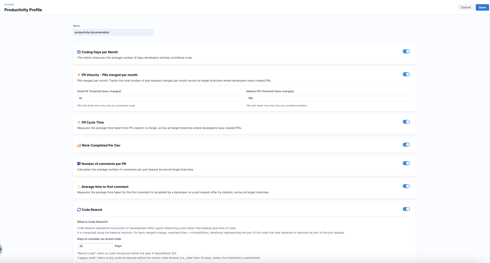
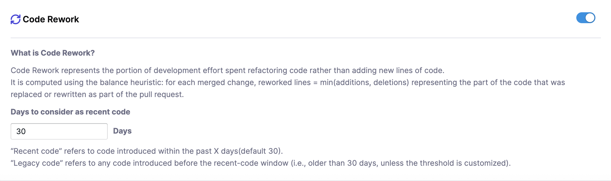

A Productivity Profile helps you define how developer activity and contribution metrics are calculated in SEI 2.0. These profiles surface key insights such as coding frequency, pull request behavior, work completed per developer, and code rework, without requiring any manual resource definitions.

The Harness SEI system automatically derives these metrics from your connected **Source Code Management (SCM)** and **Issue Management (IM)** systems data, based on where developer contributions are detected. For Code Rework, SEI 2.0 analyzes file changes within pull requests to identify where rework is coming from and which developers are introducing that rework, rather than relying solely on high-level SCM or IM activity signals.

To ensure attribution is accurate, make sure each developer has their SCM usernames and IM account IDs added on the **Developers** tab in [Team Settings](/docs/software-engineering-insights/harness-sei/setup-sei/setup-teams).

## Prerequisites

Before you begin:

* The SEI 2.0 module is enabled for your Harness account.
* You must have the **SEI Admin** role to create or manage Productivity Profiles.
* At least one Source Code Manager or Issue Management type integration should be present in the account.

## Set up the profile

To create a productivity profile:

1. In your **Harness project**, navigate to **Software Engineering Insights** and click **Account Management**.
1. Under **Profiles**, select **Productivity**.
1. To create a profile, click **Create**. To edit an existing profile, click the **Edit Profile** icon in the profiles list.

   

1. Enter a name and add an optional description for the profile.
1. Enable the metrics you want to track and customize your configuration.

## Set up Productivity metrics

You can choose which metrics to enable in the profile and configure their thresholds or categorization logic where applicable.

| Metric                                 | Description                                                                 |
| -------------------------------------- | --------------------------------------------------------------------------- |
| **Coding Days per Month**              | Tracks the average number of days developers actively push code.            |
| **PR Velocity – PRs Merged per Month** | Counts the number of PRs merged per month across target branches.           |
| **PR Cycle Time**                      | Measures the average time from PR creation to merge.                        |
| **Work Completed Per Dev**             | Tracks work items (features, bugs) completed by each developer.             |
| **Number of Comments per PR**          | Averages the number of review comments on each PR.                          |
| **Time to First Comment**              | Measures the average time from PR creation to first review comment.         |
| **Code Rework**                        | Measures the portion of development effort spent rewriting or replacing existing code instead of adding entirely new code. |

### PR Velocity

These thresholds help categorize pull requests for size-based analysis in metrics like PR Velocity.

* **Small Pull Request Threshold** (default: 10 lines changed)
* **Medium Pull Request Threshold** (default: 100 lines changed)

Pull requests are classified as Small, Medium, and Large based on configured thresholds: PRs below the small threshold are `Small`, PRs between the small and medium thresholds are `Medium`, and PRs above the medium threshold are `Large`.

### Code Rework

:::tip
Code Rework is in beta. To request access, contact [Harness Support](/docs/software-engineering-insights/sei-support).
:::

Use Code Rework to measure how much development effort is spent rewriting or replacing existing code instead of introducing new code. Code Rework is file-driven, not lines-of-code driven, meaning the metric tracks the files being modified rather than raw line counts.

You can customize how SEI 2.0 classifies recent and legacy code to analyze where rework is coming from and who is introducing it. Set the number of days to consider as recent code to define the time window. By default, this is set to 30 days.

* **Recent Code**: Code introduced within the past 30 days (by default)
* **Legacy Code**: Code introduced before the recent-code window (older than 30 days)

For each merged pull request, SEI 2.0 computes reworked lines using the balance heuristic:

$$
\text{Reworked Lines} = \min(\text{Lines Added}, \text{Lines Deleted})
$$

Once you have completed the Productivity metrics configuration, click **Save** in the top right corner. Metrics will automatically be computed based on SCM and IM data, and you can associate the profile with one or more [Org Trees](/docs/software-engineering-insights/harness-sei/setup-sei/setup-org-tree#set-up-an-org-tree) to apply the logic across developers.

## Configure team-level settings

Once you have created and configured an Productivity Profile, you can configure [team-level settings](/docs/software-engineering-insights/harness-sei/setup-sei/setup-teams#configure-team-tool-settings) to calculate the Productivity metrics enabled in the profile. Productivity profiles define the organization-wide metric definitions, while **Team Settings** ensure that each team's tools and workflows are correctly connected to produce accurate metrics within that framework.