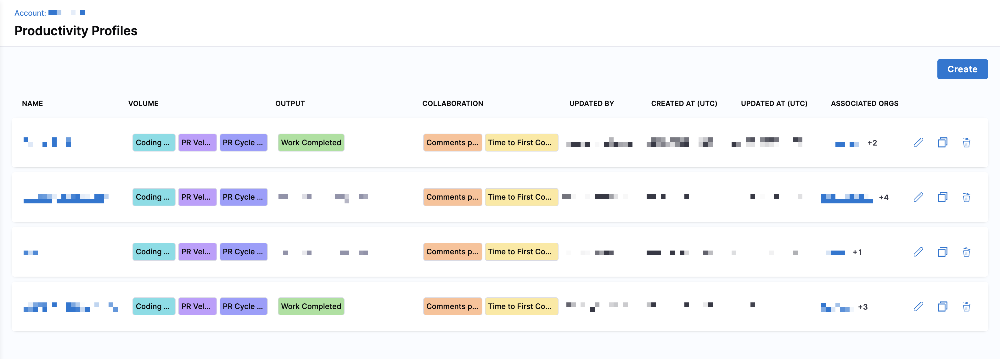
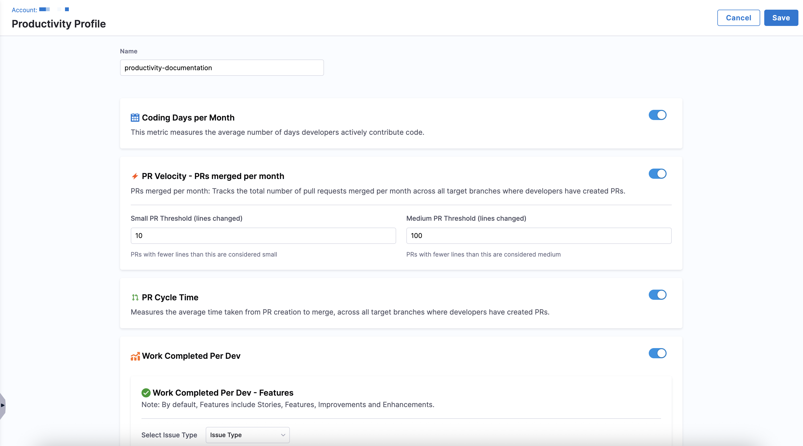
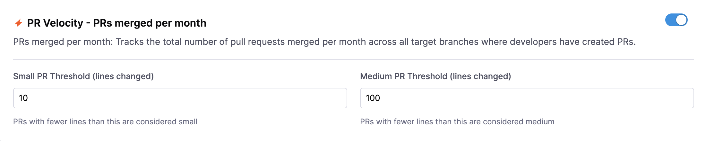
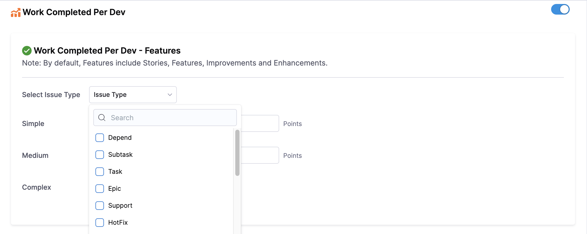
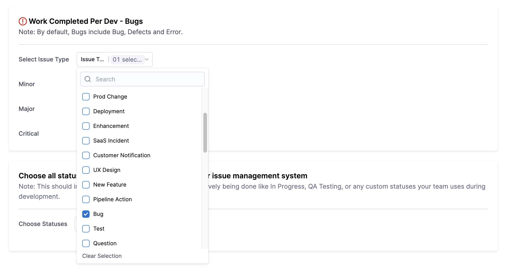
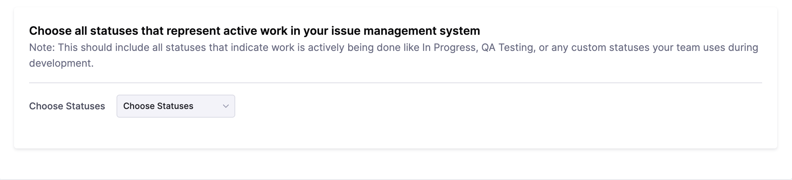

## Overview

A Productivity Profile helps you define how developer activity and contribution metrics are calculated in SEI 2.0. These profiles surface key insights such as coding frequency, pull request behavior, and work completed per developer without requiring any manual resource definitions.

The SEI system automatically derives these metrics from your connected **Source Code Management (SCM)** and **Issue Management (IM)** systems data, based on where developer contributions are detected. To ensure attribution is accurate, make sure each developer has their SCM usernames and IM account IDs added on the **Developers** tab in [Team Settings](/docs/software-engineering-insights/harness-sei/setup-sei/setup-teams).

## Prerequisites

Before you begin:

* The SEI 2.0 module is enabled for your Harness account.
* You must have the SEI Admin role to create or manage Productivity Profiles.
* At least one Source Code Manager or Issue Management type integration should be present in the account.

## Set up the profile

To create a productivity profile:

1. In your **Harness project**, navigate to **Software Engineering Insights** and click **Account Management**.
1. Under **Profiles**, select **Productivity**.
   
   

1. To create a profile, click **Create**. To edit an existing profile, click the **Edit Profile** icon in the profiles list.
1. Enter a name and add an optional description for the profile.
1. Enable the metrics you want to track and configure them using the sections below.

### Enable or disable metrics

You can choose which metrics to enable in the profile and configure their thresholds or categorization logic where applicable.

| Metric                                 | Description                                                                 |
| -------------------------------------- | --------------------------------------------------------------------------- |
| **Coding Days per Month**              | Tracks the average number of days developers actively push code.            |
| **PR Velocity – PRs Merged per Month** | Counts the number of PRs merged per month across target branches.           |
| **PR Cycle Time**                     | Measures the average time from PR creation to merge.                        |
| **Lines of Code**                    | Calculates total lines of code added, modified, or deleted across branches. |
| **Work Completed Per Dev**             | Tracks work items (features, bugs) completed by each developer.             |
| **Comments per PR**                  | Averages the number of review comments on each PR.                          |
| **Time to First Comment**              | Measures the average time from PR creation to first review comment.         |

### PR Velocity

These thresholds help categorize PRs for size based analysis in metrics like PR Velocity.

* Small PR Threshold (default: 10 lines changed)
* Medium PR Threshold (default: 100 lines changed)
* PRs < Small threshold: Small
* PRs between Small and Medium: Medium
* PRs > Medium → Large

### Work Completed Per Developer

This metric tracks completed work items (e.g., Features and Bugs) assigned to each developer.

#### Define how you track features

1. Use the dropdown menu to select an issue type or multiple issue types (e.g. `Story` or `Task`).
1. Define the complexity of a feature based on effort estimation (i.e. story points):
   
   * **Simple**: 1–2 points
   * **Medium**: 3–4 points
   * **Complex**: 5+ points

#### Define how you track bugs

1. Use the dropdown menu to select an issue type or multiple issue types (e.g., `Bug`).
1. Define the severity of a work item using work-item level priority filters:
  
   * **Minor**
   * **Major**
   * **Critical**

#### Define the statuses that represent active work

Select statuses from your issue management system that represent development phases (e.g. `In Progress`, `Dev Testing`, `Ready for QA`). This is used to calculate `Work Completed Per Dev` and contextualize effort timelines in feature delivery for every developer.

After configuring the desired metrics:

* Click **Save** to finalize the profile. Metrics will automatically be computed based on SCM and IM data. 
* Associate the profile with one or more [**Org Trees**](/docs/software-engineering-insights/harness-sei/setup-sei/setup-org-tree) to apply the logic across developers.