import Tabs from '@theme/Tabs';
import TabItem from '@theme/TabItem';

Teams are the core unit of measurement in SEI 2.0. Each team represents a leaf node in your [Org Tree](/docs/software-engineering-insights/harness-sei/setup-sei/setup-org-tree) and serves as the foundation for calculating metrics and surfacing insights across Efficiency, Productivity, and Business Alignment dashboards.

The **Teams** page provides a centralized view of all teams derived from your Org Tree and their configurations. You can search teams by selecting `By Name`, `By Manager Name`, or `By Org Tree Name` in the **Search Teams** dropdown menu.

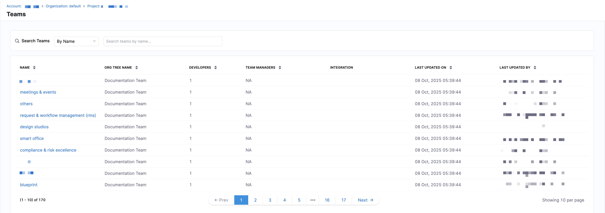

You can see the following details for each team in the **Teams** list:

| Column              | Description                                       |
| ------------------- | ------------------------------------------------- |
| **Name**            | Team name                                         |
| **Org Tree Name**   | Corresponding leaf node in the Org Tree           |
| **Developers**      | Number of developers mapped to the team           |
| **Team Managers**   | Assigned team managers                            |
| **Integrations**    | Connected tools used by the team                  |
| **Last Updated On** | Timestamp of the most recent configuration change |
| **Last Updated By** | User who last modified the team                   |

While teams are automatically derived from your organization's hierarchy, they must be configured to ensure data is attributed correctly and metrics accurately reflect how each team delivers software in SEI 2.0. To access the **Team Settings** side panel, click on a team in the list.

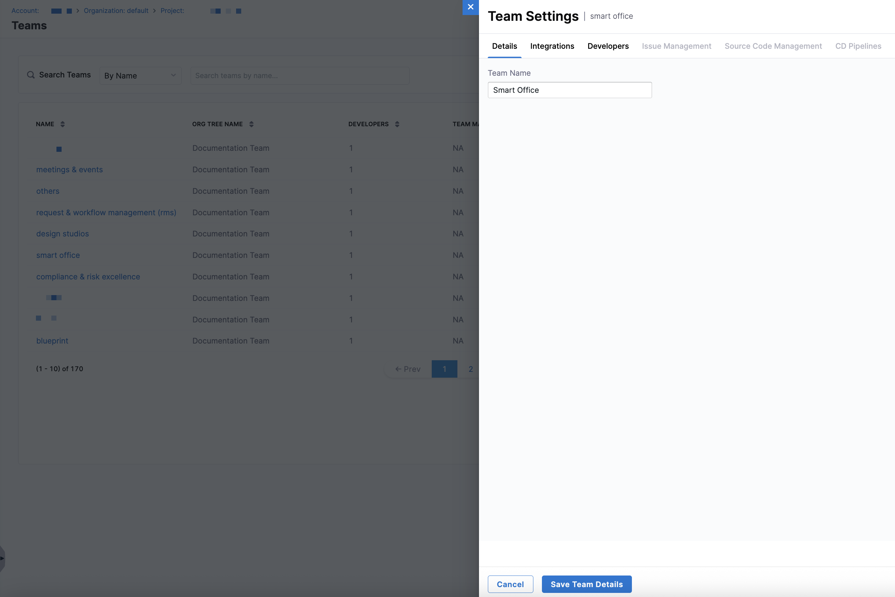

Optionally, you can access the **Team Settings** side panel by navigating to a leaf node (team) in the Org Tree and clicking the **Team Settings** icon on the **Insights** page. Each team has its own configuration that determines how DORA metrics are calculated. 

You can also manage developer records, integrations, repositories, pipelines, and destination branches. Instead of relying on defaults or incomplete mapping, this configuration layer helps ensure metrics reflect the actual scope, ownership, and delivery workflow of each team.

## Configure integrations for a team

Select the tools your team uses for issue management, source code management, and continuous deployment on the **Integrations** tab in **Team Settings**. These integrations power how SEI 2.0 attributes data and calculates metrics for the team.

:::tip
Selecting and saving integrations is required before completing the rest of the team configuration.
:::

The integrations available are determined by the profile applied to the team. For example, an [Efficiency profile](/docs/software-engineering-insights/harness-sei/setup-sei/setup-profiles/efficiency-profile) that measures: 

* **Lead Time to Change (LTTC)** and **Mean Time to Restore (MTTR)** requires an issue management tool.
* **Deployment Frequency** and **Change Failure Rate** requires a continuous deployment integration.

In this situation, a team manager must select and save both issue management and continuous deployment integrations to proceed.

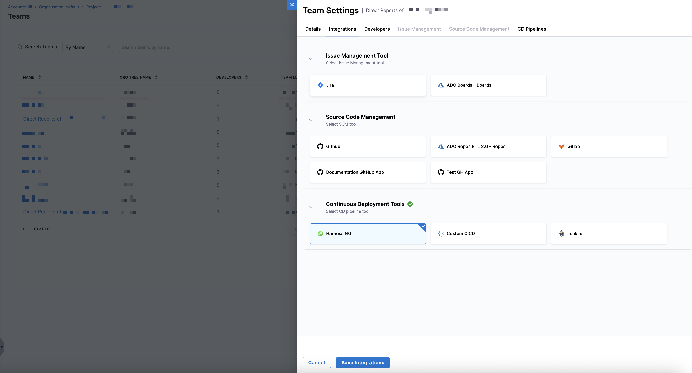

To select and save integrations:

1. Navigate to the **Integrations** tab in **Team Settings**.
1. Select integrations from the following sections: **Issue Management**, **Source Code Management**, and **Continuous Deployment**.
1. Click **Save Integrations**.

Once saved, SEI 2.0 uses these integrations to scope data ingestion, developer activity, and metric calculations for the team.

## Review & update developer identifiers

To measure productivity metrics accurately (e.g., coding days, PR activity), Harness SEI needs to know which developer performed which action in each tool. This is done by mapping each developer's cloud identities across your integrated systems.

The **Developer Records** table on the **Developers** tab in **Team Settings** includes attributes that determine how a developer was added and whether they belong to the selected team: 

* `Source`: Developers added through the [API](/docs/software-engineering-insights/harness-sei/api/cloud-ids) or CSV upload, appear with `Source: Developers`. Developers added in the UI appear with `Source: Manual`.
* `Shared`: Developers inherited from the team's Org Tree leaf node appear with `Shared: No`. Developers who are not from this team (or Org Tree node) but are manually added because they contribute to the team's work appear with `Shared: Yes`. 

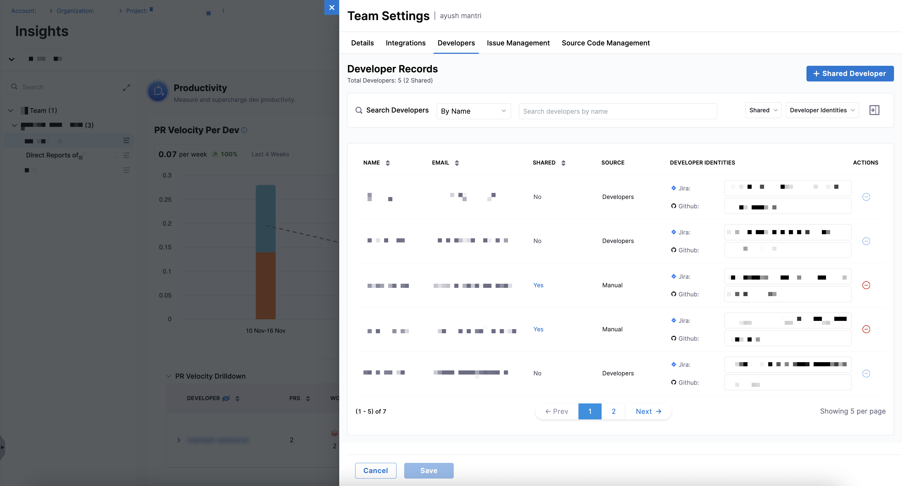

However, some contributors, such as engineering managers or individual developers who regularly contribute across teams, may not belong to the selected team's leaf node in the Org Tree. For these cases, you can add them as shared developers, which appear with `Shared: Yes` and `Source: Manual`.

Both automatically added developers and manually added shared developers must have correct identity mappings to ensure the accuracy of DORA, sprint, and productivity metrics.

### Cloud identifiers by integration

The following table lists each integration along with the type of cloud identifier used and sample values. 

| Integration          | Identifier Type | Example(s)                                            |
| -------------------- | ------------ | -------------------------------------------------------- |
| **Jira**             | Account ID   | `081de7ae-0631-4474-befe-40064cc640ff`, `JIRAUSER208441` |
| **GitHub**           | Username     | `Aaron-Phillips_ver`, `dp1_mca`                          |
| **Azure DevOps**     | Email        | `Anh.McFeely@gmfinancial.com`                            |
| **Bitbucket Cloud**  | Account ID   | `0026fd8b-03fd-47ef-9eb9-13c11c27385f`                   |
| **Bitbucket Server** | Email        | `steve.madden@crowdstrike.com`                           |
| **Harness Code**     | Email        | `lebron.james@harness.io`                                |
| **GitLab**           | Name         | `adithya r`, `aidevops`                                  |

This step is mandatory for productivity metrics, and mapping must be kept up-to-date in **Team Settings** to ensure metrics are accurate. You can automate this step using [Auto Identity Discovery](/docs/software-engineering-insights/harness-sei/manage/automatch-developers/), which reduces manual mapping by correlating developer identities across supported integrations.

### Managing shared developers

In addition to identity mapping, the **Developers** tab in **Team Settings** allows you to add contributors who are not inherited from the Org Tree but still affects the selected team's metrics. While inherited developers appear with `Source: Developers` and `Shared: No`, shared developers appear with `Source: Manual` and `Shared: Yes`.

Shared developers typically include engineering managers, individual contributors who regularly contribute across teams, and contributors whose commits, PRs, or Jira activity influence the team's insights.

To add a shared developer in the **Developers** tab:

1. Click **+ Shared Developer**.
1. Search by name or email, and select one or more developers.
1. Click **Continue**.

   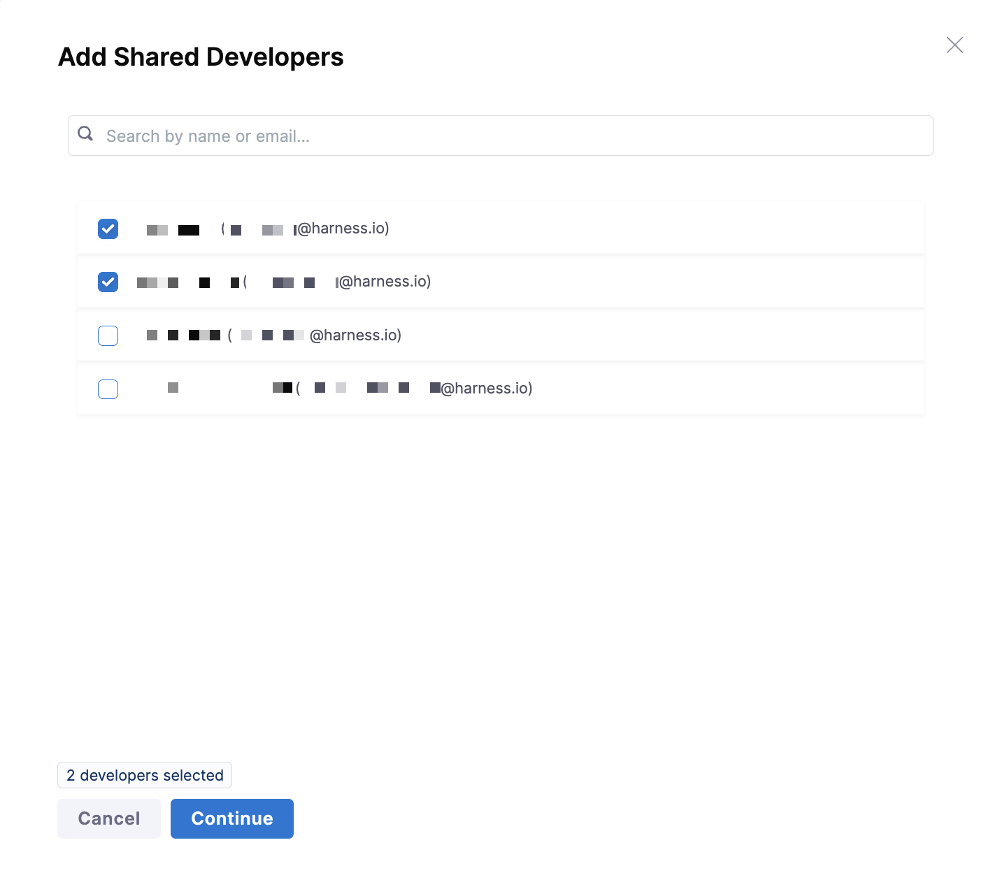

1. After adding the shared developers, the **Developer Records** table updates with the following information:

   | Column                   | Description                                                       |
   | ------------------------ | ----------------------------------------------------------------- |
   | **Name**                 | Developer’s full name                                             |
   | **Email**                | Developer’s email                                                 |
   | **Shared**               | `Yes` (until identities are matched, status may appear `PENDING`) |
   | **Source**               | `Manual`                                                          |
   | **Developer Identities** | `PENDING` until cloud IDs are mapped                              |

1. To remove a shared developer, click the **-** icon in the **Actions** column.

   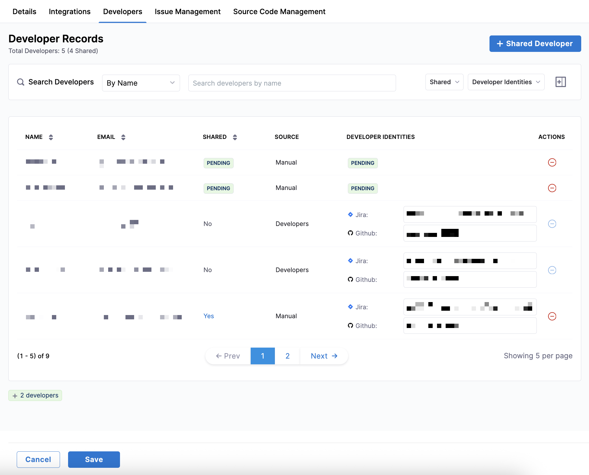

1. Click **Save**.

When browsing the **Developer Records** table, you can search for developers by name or email, filter shared developers using the `Shared` dropdown menu, and use the `Developer Identities` dropdown menu to show only records with missing or present developer identities.

Click the **+** icon next to the `Developer Identities` dropdown menu to add additional columns such as `Added By` (who created the record) and `Last Updated` (the most recent modification timestamp) to the **Developer Records** table.

### Applying metric-level developer filters

The **Advanced Settings** section on the **Developers** tab in **Team Settings** lets you control which Harness SEI metrics should honor developer filters for a team. This is useful when contributors such as managers or [shared developers](#managing-shared-developers) work across multiple teams but should only influence specific insights.

Use this setting to specify which metrics should calculate results **only from activity attributed to the developers included in this team**, based on developer filters and identity mappings.

- **Productivity** and **Lead Time for Changes** metrics always honor developer filters by default.
- Only metrics that are enabled in the team’s active SEI profiles appear in **Advanced Settings**.

To configure metric-level developer filtering:

1. Navigate to **Team Settings → Developers → Advanced Settings**.
1. Select the Harness SEI metrics that should honor developer filters for this team.

   - **Productivity**: Measures individual and team-level development activity, such as code contributions and work item completion, based on data from your integrated SCM and Issue Management systems.
   - **Business Alignment**: Evaluates how development effort is distributed across business priorities and investment categories, helping ensure engineering work aligns with organizational goals.
   - **Lead Time for Changes**: Measures the time it takes for code changes to move from initial commit to deployment in production, helping teams assess delivery efficiency and flow.
   - **Mean Time to Restore**: Measures how quickly teams recover from production incidents or failures, from detection to resolution, indicating operational resilience.

    

   :::tip
   When you select a metric, only work attributed to the developers included in this team based on developer filters and identity mappings is used in that metric’s calculation.

   Metrics that are not selected continue to use their default attribution logic.
   :::

1. Click **Save** to apply your changes.

## Configure team tool settings

After selecting your team's integrations and mapping developer identities, configure tool-specific settings to control how SEI 2.0 interprets data from each system. Proper configuration ensures that metrics on the **Insights** page accurately reflect your team's workflows, tools, and operational context.

SEI 2.0 uses a filter set model to determine which work items should be included and how they are classified. Each filter set consists of:

- **Property**: The issue attribute to evaluate (for example, `Project`, `Issue Type`, or `Label`).
- **Condition**: How the property is matched (for example, `Equals` or `Contains`).
- **Value**: The value from your issue management system (for example, `Docs`, `Bug`, or `P1`).

You can add multiple filter sets by clicking **+ Add Condition**. Each additional filter set is combined using `AND` logic, meaning all filter sets must match for a work item to be included. To remove a filter set, click the **Delete** icon next to it. Depending on the profile applied to the team, this configuration can impact delivery, reliability, productivity, and business alignment metrics. 

To ensure accurate and meaningful metrics, align your filter conditions with your team's actual workflows, standardize labels and conventions for incidents, bugs, and deployments across tools, and regularly review your team settings whenever tools, processes, or team ownership changes. By keeping configurations current, you can ensure the dashboards in SEI 2.0 provide the most relevant and up-to-date insights.

<Tabs queryString="team-settings">
<TabItem value="im-settings" label="Issue Management Settings">

Use the **Issue Management** tab in **Team Settings** to define which work items are relevant to your team and how they should be interpreted for metrics calculation. These settings control how SEI 2.0 scopes work, identifies incidents, categorizes investment, and classifies different types of work.

### Projects

Define the scope of work items that belong to your team by including the projects or code areas where your team manages work.

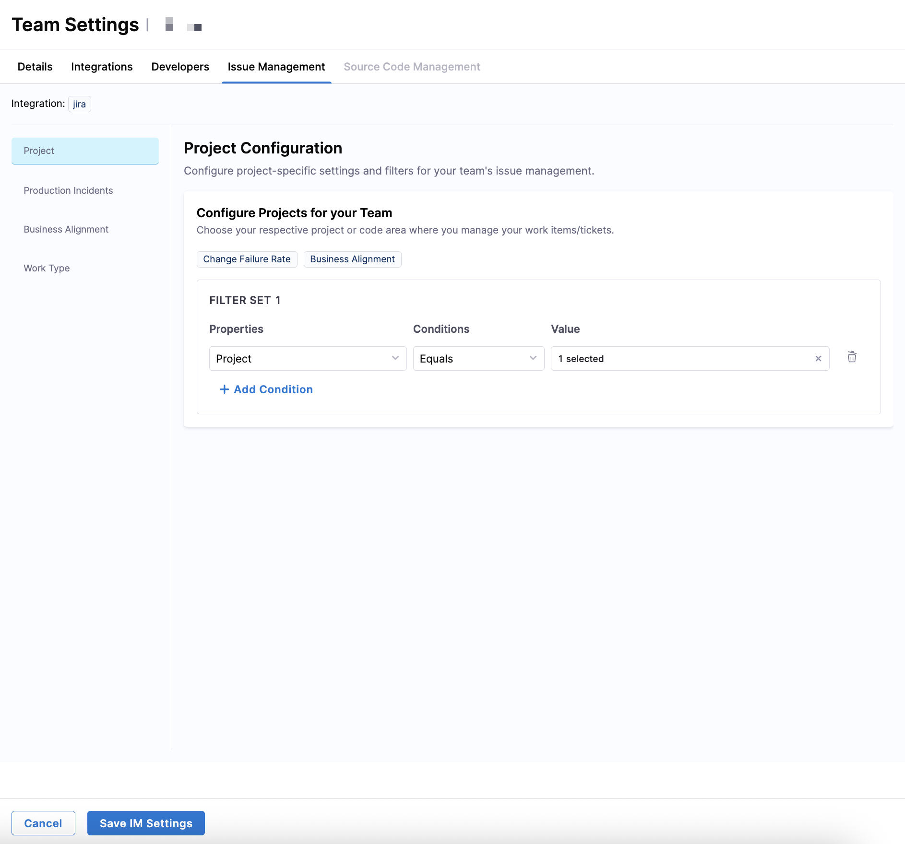

| Filter field   | Available options                                                                              |
| -------------- | ---------------------------------------------------------------------------------------------- |
| **Properties** | Project, Labels, Sprint Name, Components, Parent, Custom Fields                                |
| **Conditions** | Equals, Not Equals, Contains, Does Not Contain, Starts With, Ends With                         |
| **Values**     | Values from your issue management system (for example, Jira projects such as `DOCS`, `PRODUCT`) |

To include work items from a specific Jira project (like `DOCS`), use `Project Equals DOCS`. 

:::tip
Correct production incident classification ensures SEI 2.0 accurately calculates **Change Failure Rate** and [Business Alignment metrics](/docs/software-engineering-insights/harness-sei/analytics-and-reporting/business-alignment).
:::

### Production Incidents

Identify which work items represent production failures or incidents to help SEI 2.0 calculate Change Failure Rate.

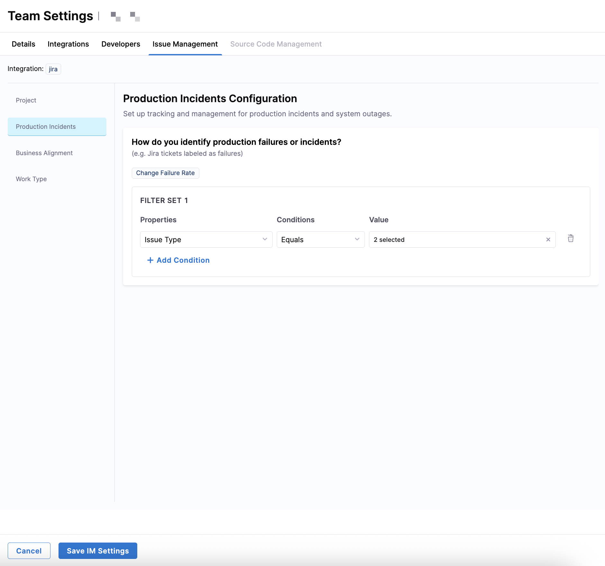

| Filter field   | Available options                                                                       |
| -------------- | --------------------------------------------------------------------------------------- |
| **Properties** | Labels, Issue Type, Priority                                                            |
| **Conditions** | Equals, Not Equals, Contains, Does Not Contain, Starts With, Ends With                  |
| **Values**     | Values from your issue management system (for example, `Incident`, `Bug`, `sev1`, `P0`) |

To identify incidents using labels, use `Labels Contains production-incident`, or by issue type, use `Issue Type Equals Incident`.

:::tip
Correct production incident classification ensures SEI 2.0 accurately calculates **Change Failure Rate**.
:::

### Business Alignment

Business Alignment maps work items to investment categories defined in your [Business Alignment profile](/docs/software-engineering-insights/harness-sei/setup-sei/setup-profiles/business-alignment-profile/) (for example, Epic, Story, and Task). These filters are configured per investment category.

| Filter field   | Available options                                                      |
| -------------- | ---------------------------------------------------------------------- |
| **Properties** | Issue Type, Status, Labels, Priority, Components, Parent, Sprint Name  |
| **Conditions** | Equals, Not Equals, Contains, Does Not Contain, Starts With, Ends With |
| **Values**     | Values from your issue management system                               |

For the Epic category, use `Issue Type Equals Epic`. For the Story category, use `Issue Type Equals Story`. Each category is evaluated independently based on its own filter set.

:::tip
Correct investment category configuration ensures SEI 2.0 accurately calculates [Business Alignment metrics](/docs/software-engineering-insights/harness-sei/analytics-and-reporting/business-alignment).
:::

### Work Type

Define how SEI 2.0 classifies features, bugs, and work status for [Productivity metrics](/docs/software-engineering-insights/harness-sei/analytics-and-reporting/productivity#productivity-insight-widgets) by configuring filter sets, setting feature and bug category thresholds, and specifying which statuses represent active and terminated work.

#### Features

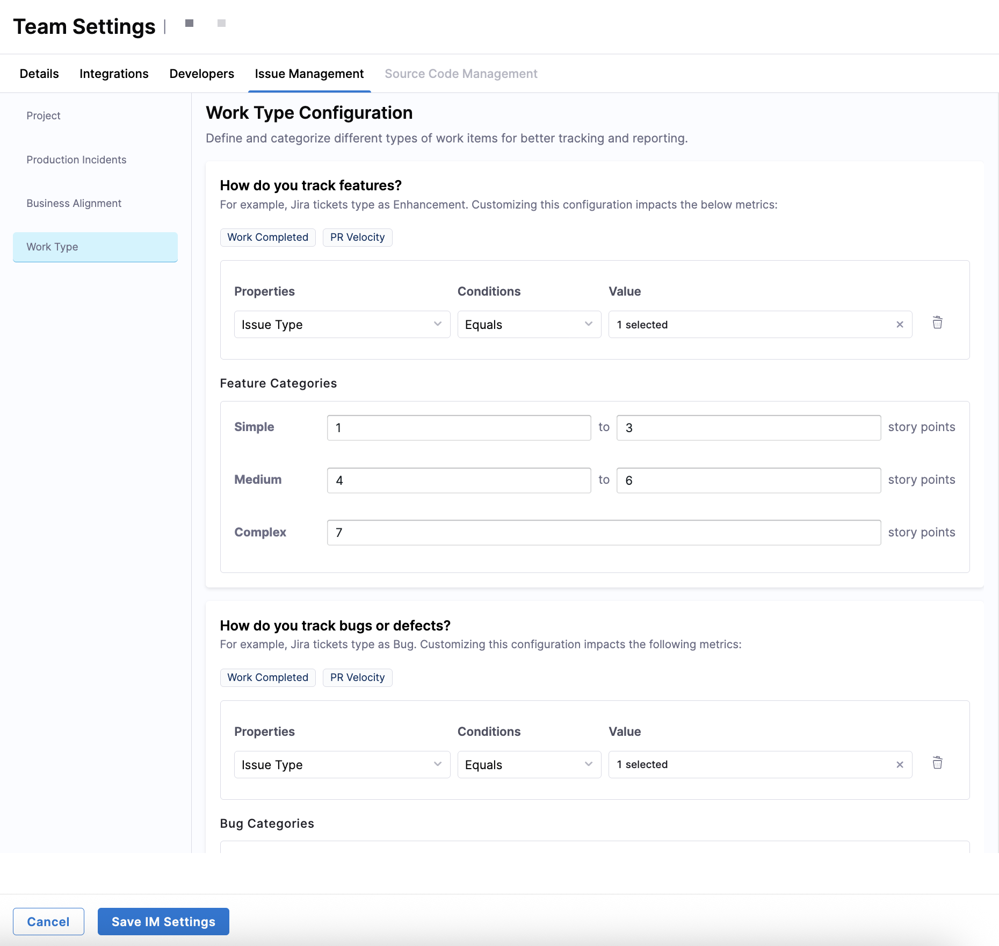

| Filter field   | Available options                                                              |
| -------------- | ------------------------------------------------------------------------------ |
| **Properties** | Issue Type                                                                     |
| **Conditions** | Equals                                                                         |
| **Values**     | Bug-related issue types from your issue management system (for example, `Story`) |

To identify feature work, use `Issue Type Equals Story` or `Issue Type Equals Enhancement`. 

In the **Feature Categories** section, you can further classify features by size using story points.

- **Simple**: Set a minimum and maximum range (for example, 1–3).
- **Medium**: Set a minimum and maximum range (for example, 4–6).
- **Complex**: Set a minimum threshold only (for example, 7+).

:::tip
Correct feature classification ensures SEI 2.0 accurately calculates **Work Completed** and **PR Velocity**.
:::

#### Bugs and defects

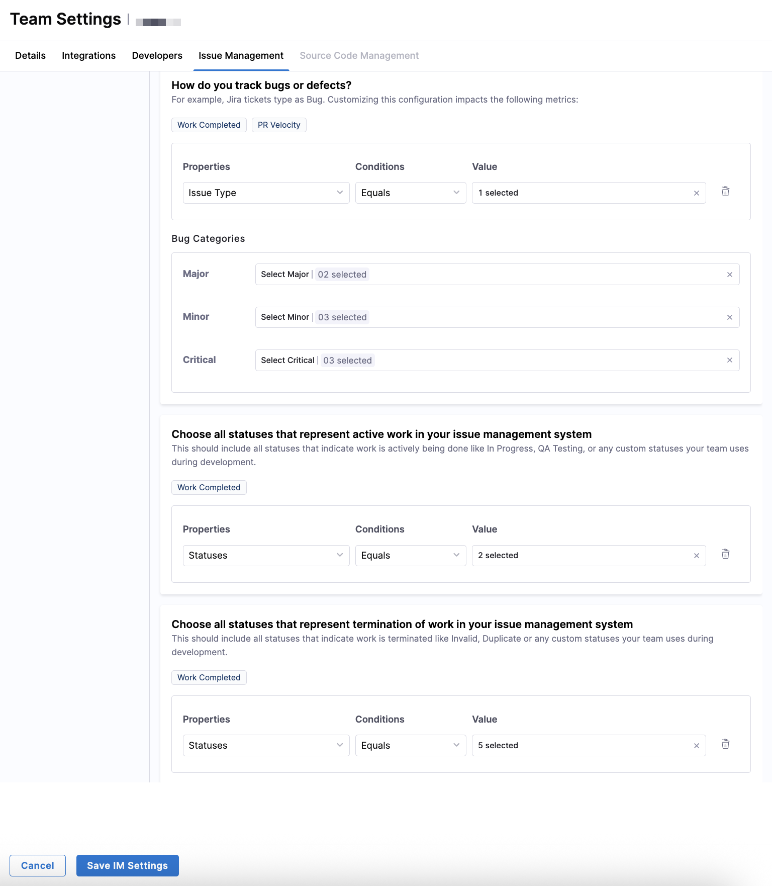

To identify bugs or defects, use `Issue Type Equals Bug`.

In the **Bug Categories** section, you can further classify bugs by severity using values from your issue management system.

- **Critical**: For example, `P0`, `P1`, `Highest`.
- **Major**: For example, `P2` or `P3`.
- **Minor**: For example, `P4`, `Low`, `Lowest`.

:::tip
Correct bug classification ensures SEI 2.0 accurately calculates **Work Completed** and **PR Velocity**.
:::

#### Active and terminated work

Define which statuses represent **active work** (for example, `In Progress` or `QA Testing`) and **terminated work** (for example, `Invalid` or `Duplicate`) in the **Choose all statuses that represent work in your issue management system** sections.

To classify active work, use `Statuses Equals To Do, In Progress, QA Testing`. For terminated work, use `Statuses Equal Invalid, Won't Do, Duplicate`.

:::tip
Correct status classification ensures SEI 2.0 accurately calculates **Work Completed**.
:::

After completing all Issue Management filters, click **Save IM Settings** to apply the configuration to the team.

</TabItem>
<TabItem value="scm-settings" label="Source Code Management Settings">

:::info Auto Identity Mapping
You can either manually configure repositories and target branches, or if your team uses a supported integration with [Auto Identity Discovery](/docs/software-engineering-insights/harness-sei/manage/automatch-developers/), this process is automatic.

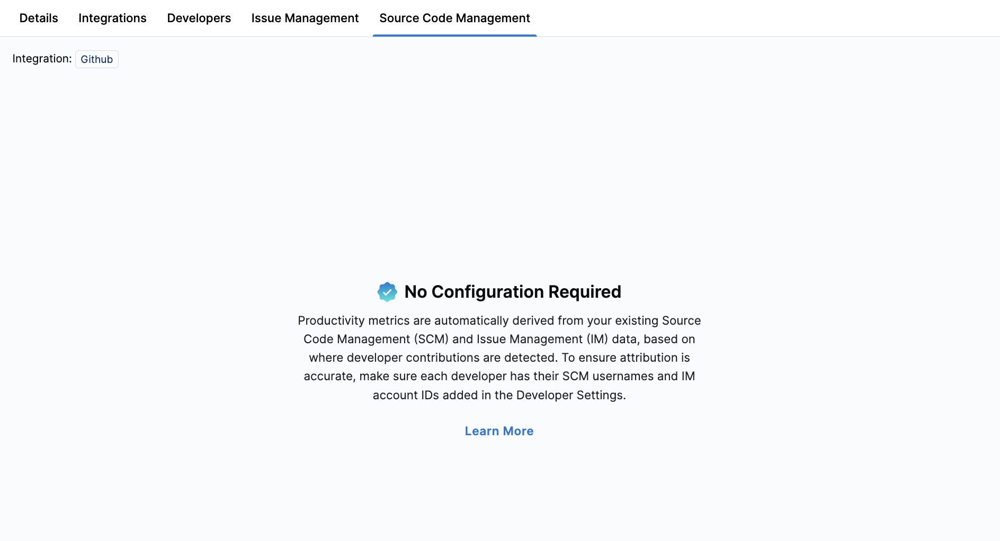
:::

Use the **Source Code Management** tab in **Team Settings** to define which repositories, branches, and commit events are relevant for your team's coding activity and production deployments.

### Repositories

| Filter field   | Available options                                                             |
| -------------- | ----------------------------------------------------------------------------- |
| **Properties** | Repository Name, GitHub Teams                                                 |
| **Conditions** | Equals, Starts With, Contains                                                 |
| **Values**     | Repository names from your SCM system (for example, `team-service`, `FMEPRD`) |

To include a single repository, use `Repository Name Equals team-service`. To include repositories using GitHub Teams, use `GitHub Teams Equals frontend-devs`.

### Destination and target branches

Determine which branches are considered production or deployment targets.

| Filter field   | Available options                                                     |
| -------------- | --------------------------------------------------------------------- |
| **Properties** | Branch Name                                                           |
| **Conditions** | Equals, Starts With, Contains                                         |
| **Values**     | Branch names from your SCM system (for example, `main`, `production`) |

To include the main branch, use `Branch Name Equals main`. To include release branches, use `Branch Name Starts With release/`.

After completing all Source Code Management filters, click **Save SCM Settings** to apply the configuration to the team.

</TabItem>
<TabItem value="cicd-settings" label="Pipeline Settings">

Use the **CD Pipelines** tab in **Team Settings** to define which CD pipelines belong to your team and how SEI 2.0 identifies successful and failed deployments when calculating deployment-related metrics.

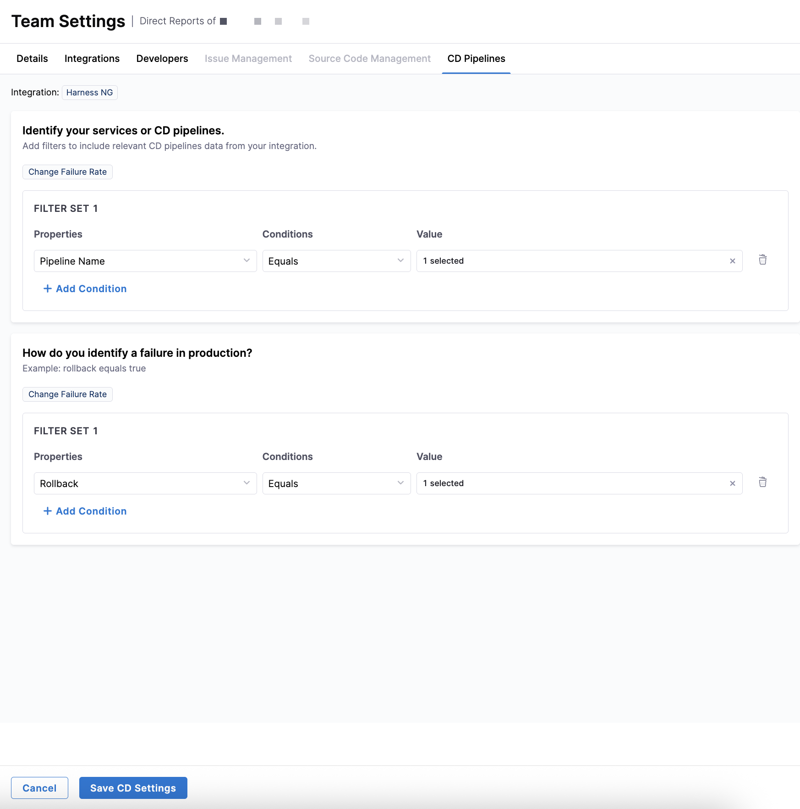

### Services or CD pipelines

Define the scope of CD pipelines by creating one or more filter sets. 

| Filter field   | Available options                                                                           |
| -------------- | ------------------------------------------------------------------------------------------- |
| **Properties** | Service Name, Infrastructure ID, Environment ID, Tags, Pipeline Name, Project, Organization |
| **Conditions** | Equals, Not Equals, Contains, Does Not Contain, Starts With, Ends With                      |
| **Values**     | Values from your CD system (for example, service names, pipeline names, or tags)            |

To include pipelines by name, use `Pipeline Name Contains deploy`. To scope services to a production environment, use `Environment ID Equals prod`.

:::tip
Only services and CD pipelines that match these filters are used to calculate **Change Failure Rate**.
:::

### Failed deployments or rollbacks

Define how SEI 2.0 detects failed deployments or rollbacks in your CD system. These filters determine when a deployment is classified as a failure. 

| Filter field   | Available options                                           |
| -------------- | ----------------------------------------------------------- |
| **Properties** | Pipeline Status, Rollback                                   |
| **Conditions** | Equals, Not Equals                                          |
| **Values**     | Values from your CD system (for example, `Failure`, `true`) |

To identify a rollback, use `Rollback Equals true`. To identify failed executions, use `Pipeline Status Equals Failure`.

:::tip
Correct failure detection ensures SEI 2.0 accurately calculates **Change Failure Rate**.
:::

After completing all CD Pipelines filters, click **Save CD Settings** to apply the configuration to the team.

</TabItem>
</Tabs>

## Access insights

After you save your tool-specific settings, SEI 2.0 automatically attributes data to your team, mapping events and activity from integrated systems based on your filters and developer identifiers. SEI 2.0 calculates all relevant Efficiency, Productivity, and Business Alignment metrics using your defined criteria, and all dashboards on the **Insights** page update reflect these data-driven insights in real time.

Once your settings are configured, you can explore team insights by reviewing metrics and trends for individual teams and organizational insights by analyzing aggregated data across your Org Tree.