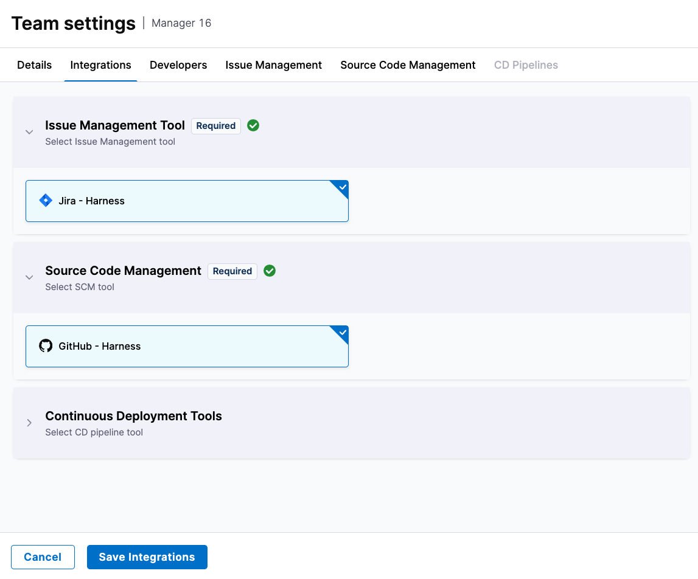
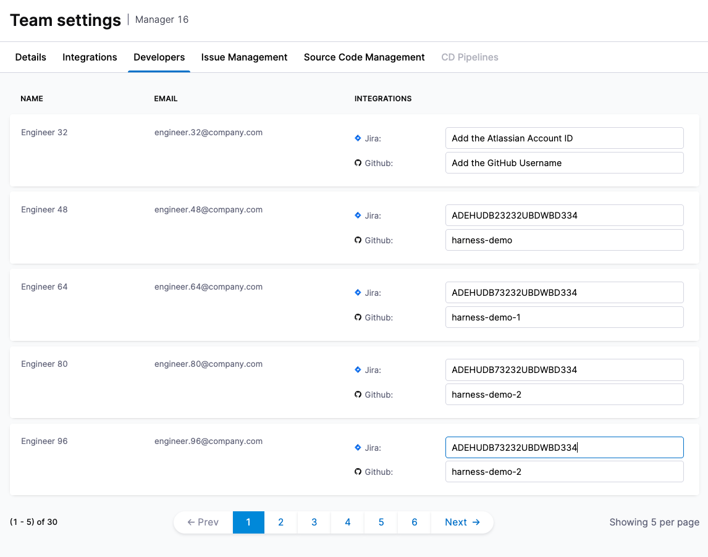
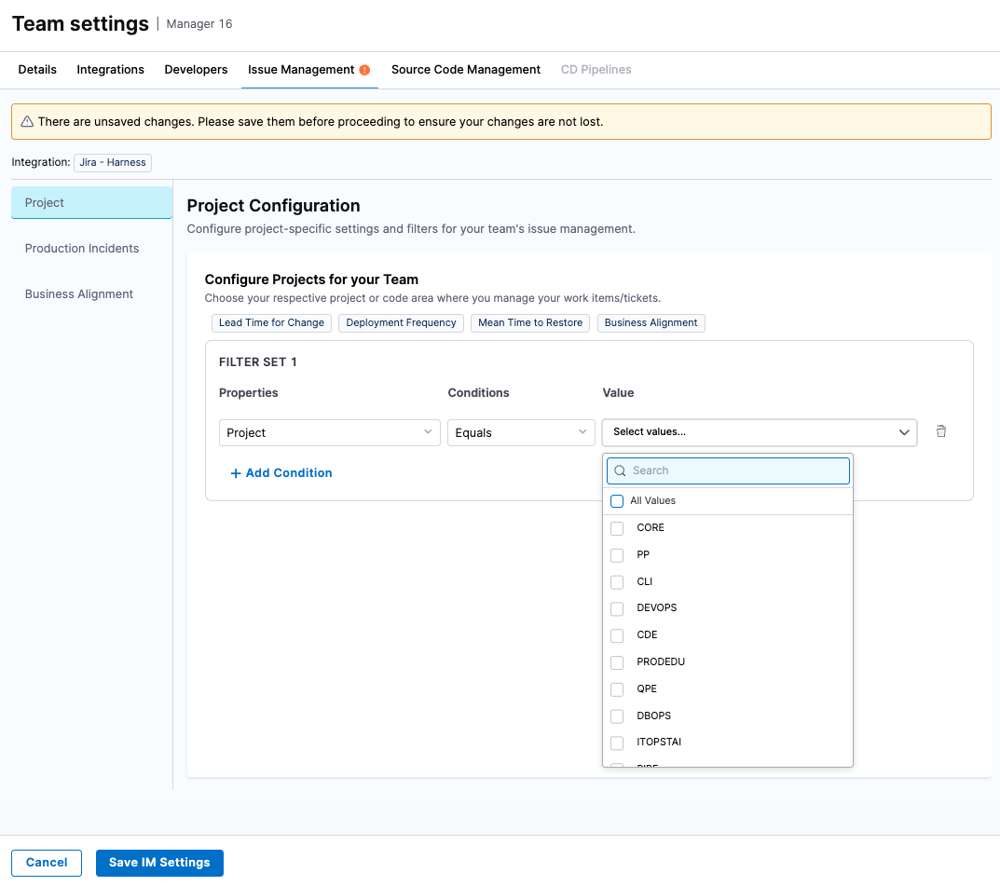
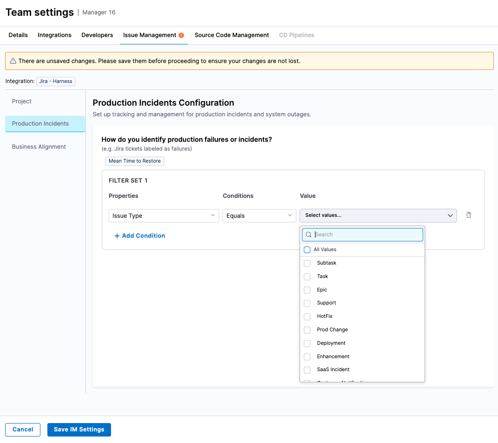
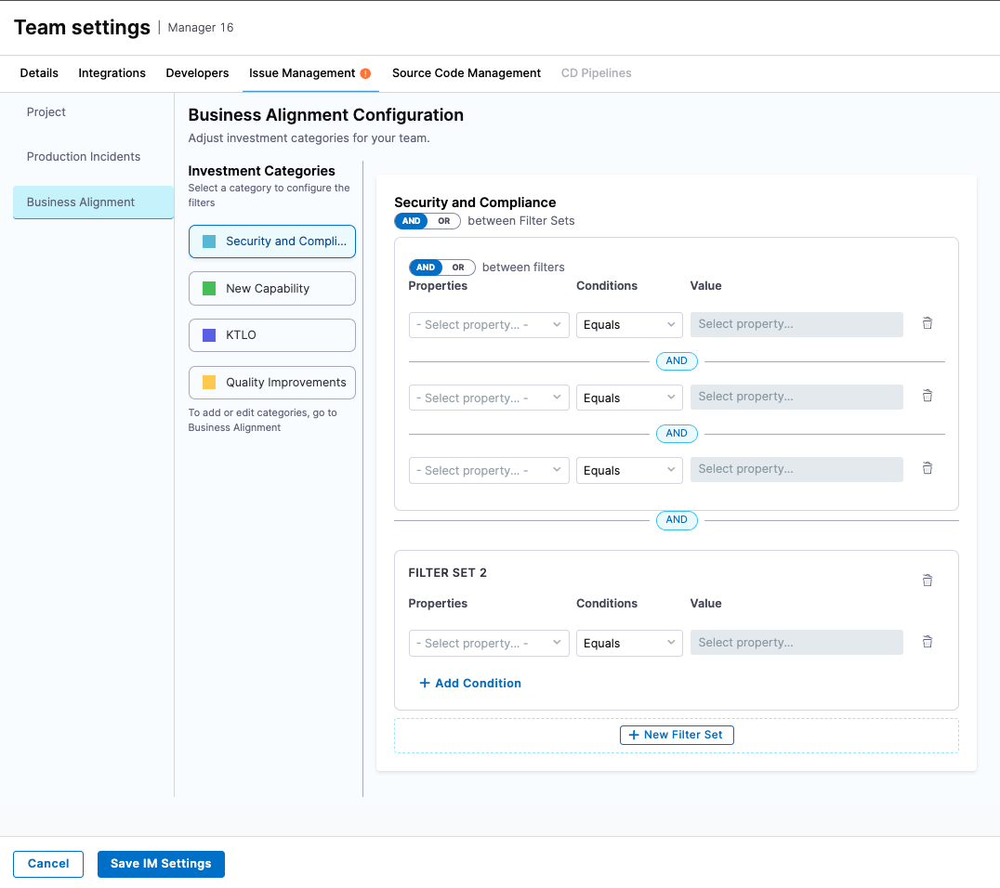
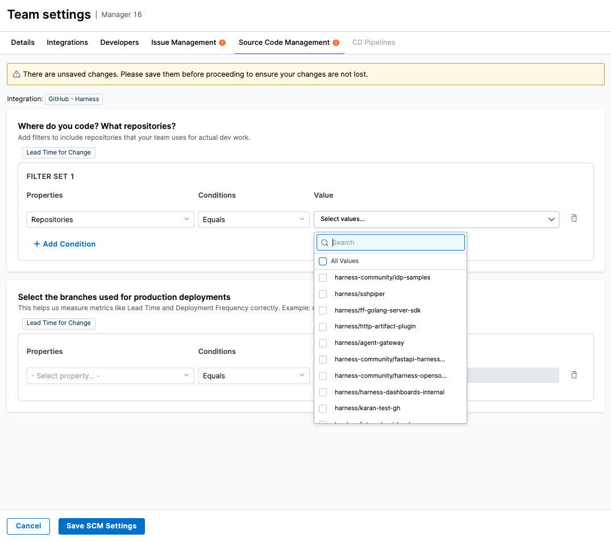

import Tabs from '@theme/Tabs';
import TabItem from '@theme/TabItem';

## Overview

Teams are the core unit of measurement in SEI 2.0. Every leaf node in the Org Tree is treated as a Team, making it the fundamental grouping for surfacing insights, applying goals, and driving accountability.

Each Team represents a group of developers working together within the organizational hierarchy and is automatically derived from the Org Tree structure.

### Key concepts

* **Auto-derived:** Every leaf node in the Org Tree is automatically considered a Team.
* **Configurable:** Each Team has its own configuration to define how metrics are calculated and displayed.
* **Contextualized and metric specific settings:** Teams include metadata such as associated integrations, relevant services, repositories, destination branches, pipelines, environments, etc.

This configuration layer adds precision to how metrics like Deployment Frequency, Lead Time, MTTR, and others are calculated, which ensures each metric reflects the real scope, velocity, and complexity of the team's delivery lifecycle.

### Why team settings matters

Out of the box, SEI builds teams from your organization’s hierarchy. However, each team needs to be contextualized with additional configuration to ensure data is mapped correctly and insights are accurate.

This includes:

* Identifying the right developers and matching them to their work.
* Linking the team to the right integrations across issue management systems, source code managers, continuous delivery and incident monitoring/management systems.
* Defining how metrics like incidents, bugs, and features are recognized in your software delivery workflow.

## Set up Teams

Each team’s configuration includes the following:

### Step 1: Choose the integrations to power insights

In this step, choose the integrations that is used by your team for issue management systems, source code managers & CI/CD systems. Note that it is mandatory to select and save the integrations to continue configuring the rest of the team settings.

The choice of integrations in this page is powered by the profile definition. For example: An Efficiency profile that is configured for using issue management system to measure LTTC & MTTR, CD system to measure deployment frequency & change failure rate will require the team manager to define the issue management system integration & CD system integration.

### Step 2: Review & update developer identifiers

To measure productivity metrics accurately (e.g., coding days, PR activity), SEI needs to know which developer performed which action in each tool.

The team managers must manually update their developer records and the respective system specific user identifiers in the developer settings:

* Jira: User Account ID
* GitHub: Username
* GitLab: Username
* Bitbucket: Username

This step is mandatory for productivity metrics.

:::note
Developer identifier mapping is manual today, but will be automated in the future using email-based correlation to reduce setup time.
:::

### Step 3: Tool or system specific settings

Once you’ve selected your team’s integrations and mapped developer identities, the final step is to configure tool-specific settings. These configurations allow you to fine-tune how SEI interprets data from your tools—ensuring the metrics reflect your team’s actual workflows and tool usage.

Only the tools associated with the team’s linked Efficiency or Business Alignment profile will require configuration. Each team can override global settings to use specific integrations that better reflect their actual tool usage.

<Tabs queryString="team-settings">

<TabItem value="im-settings" label="Issue Management Settings">

Use this section to define which tickets or work items are relevant to your team.

#### Configure Projects for your Team

Define the scope of work items relevant to your team using a combination of filters (such as projects, code area etc)

    
:::info
Impacts the following metrics if the profile was configured to use Issue Management as the source system:
     
* Lead Time for Changes (LTTC)
* Mean Time to Restore (MTTR)
* Change Failure Rate (CFR)
* Deployment Frequency
* Business Alignment

:::

#### How do you identify production failures or incidents?

To calculate Change Failure Rate and MTTR, SEI needs to know which work items represent failures or incidents. Define this using:
    
* Issue Type (e.g., Bug, Incident)
* Labels (e.g., production-incident, sev1)

:::info
Impacts the following metrics if the profile was configured to use Issue Management as the source system:

* DORA MTTR
* DORA Change Failure Rate

:::

#### Business Alignment

If your Org Tree includes Business Alignment, use this section to define how work items map to each category.

Business Alignment categories (e.g., Strategic Work, Tech Debt, Customer Commitments) are centrally defined by the SEI Admin in the profile and apply across the organization. Teams configure how to filter work items into these categories using their own logic.

To set up these filters:

* Define Filter Sets for each category.
  * Use up to three distinct Filter Sets per category.
  * Each Filter Set can contain one or more filter conditions.
* Configure each condition by:
  * Selecting an attribute from the Properties dropdown (e.g., Label, Issue Type)
  * Choosing a matching rule from the Conditions dropdown (e.g., Equals, Contains)
  * Specifying the desired Value
* Set the logical operator between Filter Sets:
  * Use AND if all Filter Sets must match
  * Use OR if any one Filter Set can match

This flexible logic ensures accurate mapping of work items to the correct Business Alignment categories.

</TabItem>

<TabItem value="scm-settings" label="Source Code Management Settings">

This section allows you to define how SEI tracks coding activity, repository scope, and production deployments using your SCM system.

#### Define / Add the repositories

Specify which repositories your team uses for development work. Use filters such as:

* Repository Name: Equals, Starts With, Contains
* GitHub Teams: To auto-include all repos a team contributes

:::info

Impacts the following metrics if the profile was configured to use Source Code Manager as the source system:

* DORA LTTC
* Deployment Frequency

:::

#### Set the destination / target branches

Identify which branches are considered production or deployment targets. This is essential for accurately calculating Lead Time and Deployment Frequency.

:::info

Impacts the following metrics if the profile was configured to use Source Code Manager as the source system:

* DORA LTTC
* Deployment Frequency

:::
    
#### Define the signal to track deployments driven by the SCM system

To calculate Deployment Frequency from SCM activity, SEI needs to understand what constitutes a deployment event.

By default, SEI considers:

* Pull Requests merged to a production branch
* With a specific label (e.g., deploy, release)

You can configure or customize these values as needed.
    
:::info

Impacts the Deployment Frequency metric if the profile was configured to use Source Code Manager as the source system.

:::

</TabItem>

<TabItem value="cicd-settings" label="Pipeline Settings">

Use this section to define which services or pipelines are relevant to your team, and how SEI should identify successful and failed deployments.

#### Identify your services or CD pipelines
    
Use filters (such as pipeline name or tags) to select the pipelines that should be included in SEI’s analysis.

:::info

Impacts the following metrics if the profile was configured to use Continuous Delivery Tool as the source system:

* Deployment Frequency
* Change Failure Rate

:::

#### How do you identify a successful deployment?

Specify the criteria that indicate a successful deployment. For example: `Pipeline Status = Success`

SEI uses this to calculate Deployment Frequency.

#### How do you identify a failure in production?

Specify how SEI should detect failed deployments or rollbacks, using conditions such as: `Pipeline status = Rollback or Failure`

This helps SEI compute the Change Failure Rate metric.

</TabItem>

</Tabs>

## What's next

Once you complete and save your tool-specific settings, SEI will:

* Attribute data to your team: Events and activity from integrated systems will be mapped to the configured team based on your filters and identifiers.
* Start calculating metrics: All relevant Efficiency and Business Alignment metrics will be computed using your defined criteria.
* Update dashboards automatically: Your team’s dashboards will begin reflecting data-driven insights based on the latest configuration.

## Best practices

* Align filters with real workflows: Define filter conditions that mirror how your team actually organizes and tracks work.
* Standardize labels and conventions: Use consistent naming for incidents, bugs, and deployments across tools to improve metric reliability.
* Review settings regularly: Revisit and update your team’s configurations whenever tools, processes, or team ownership changes.

Keeping your configurations current ensures your dashboards always reflect the most meaningful, up-to-date insights.

## Next steps

* View team insights
* View organization insights