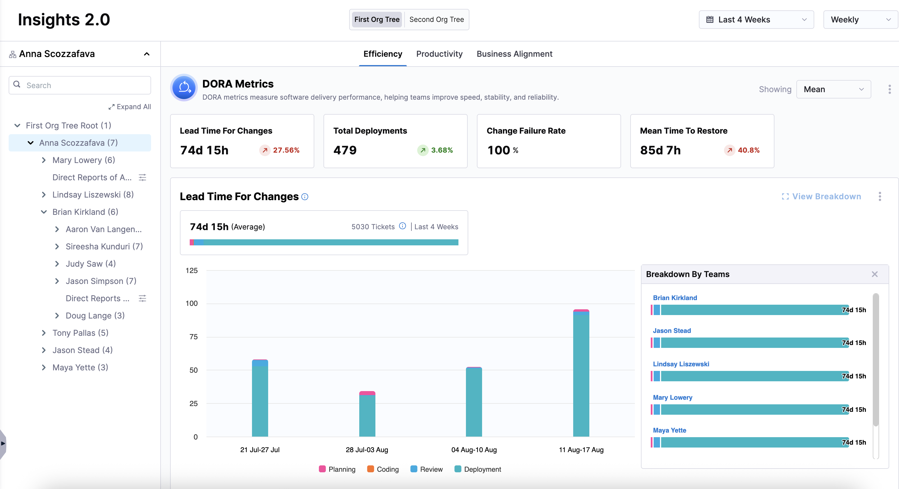
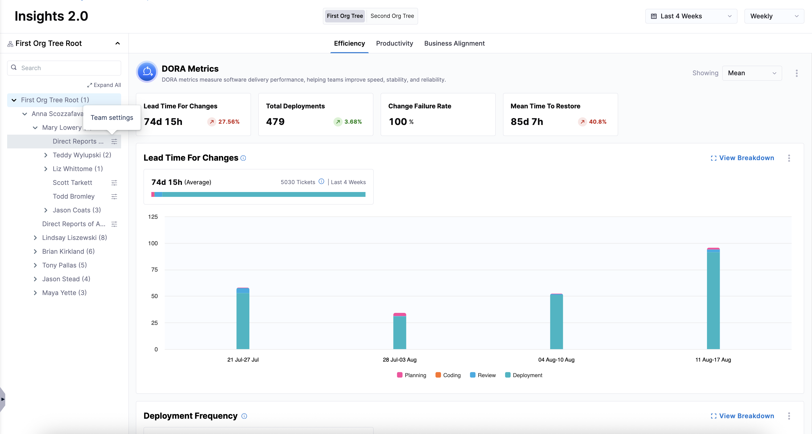
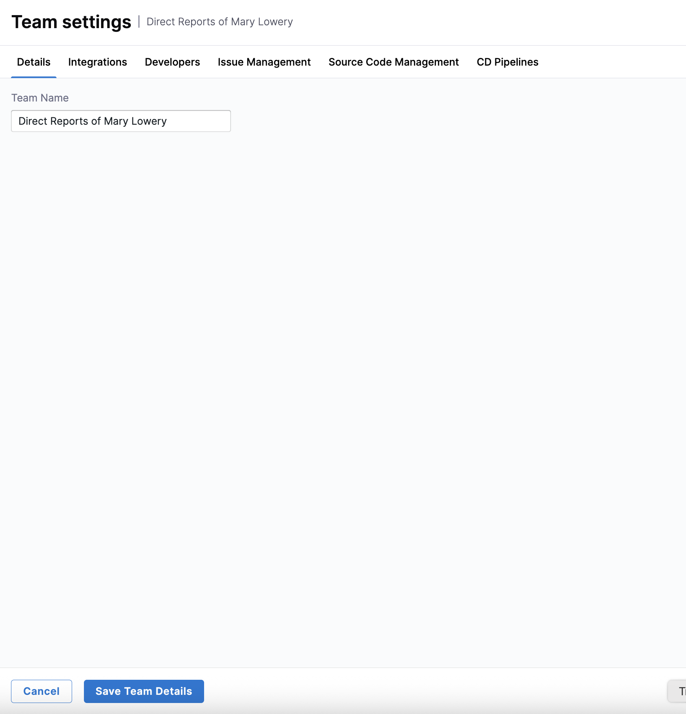
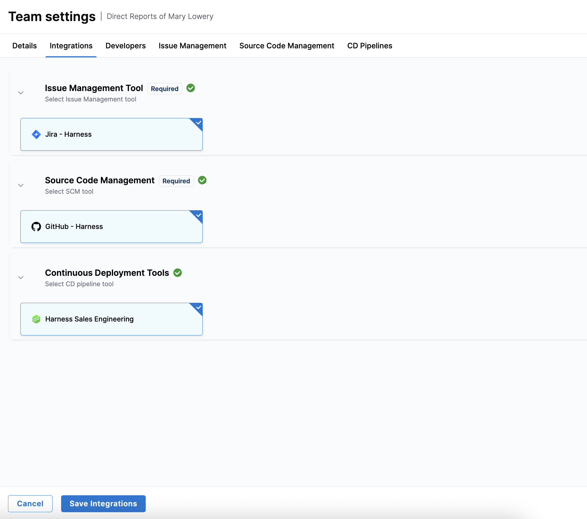
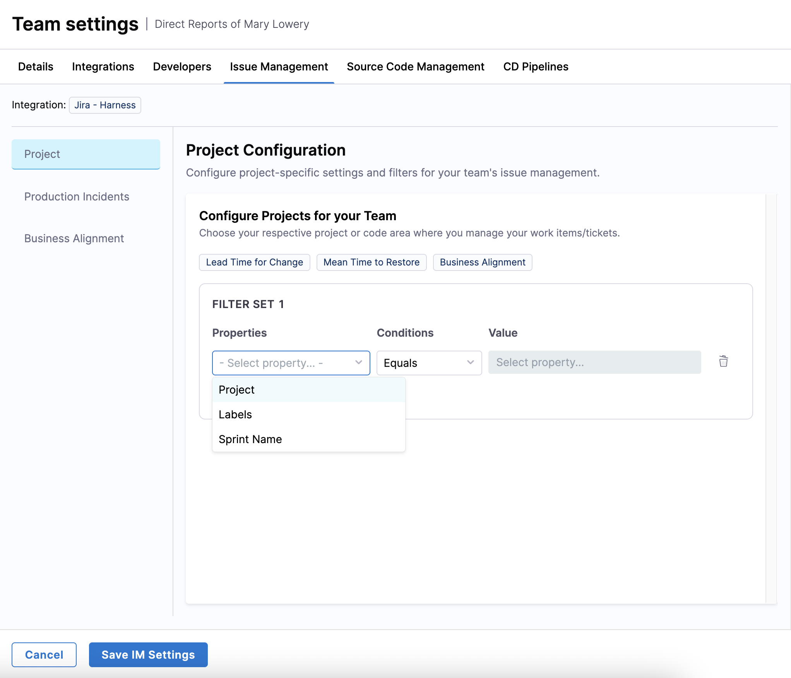
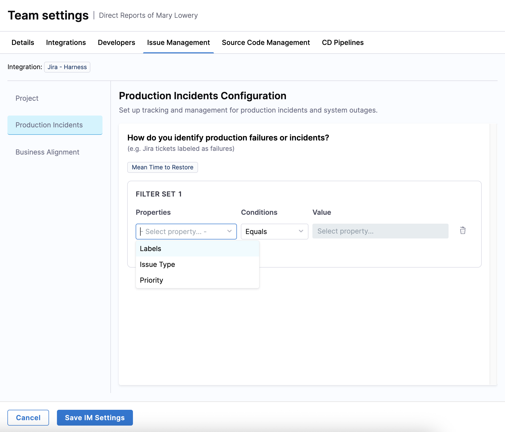
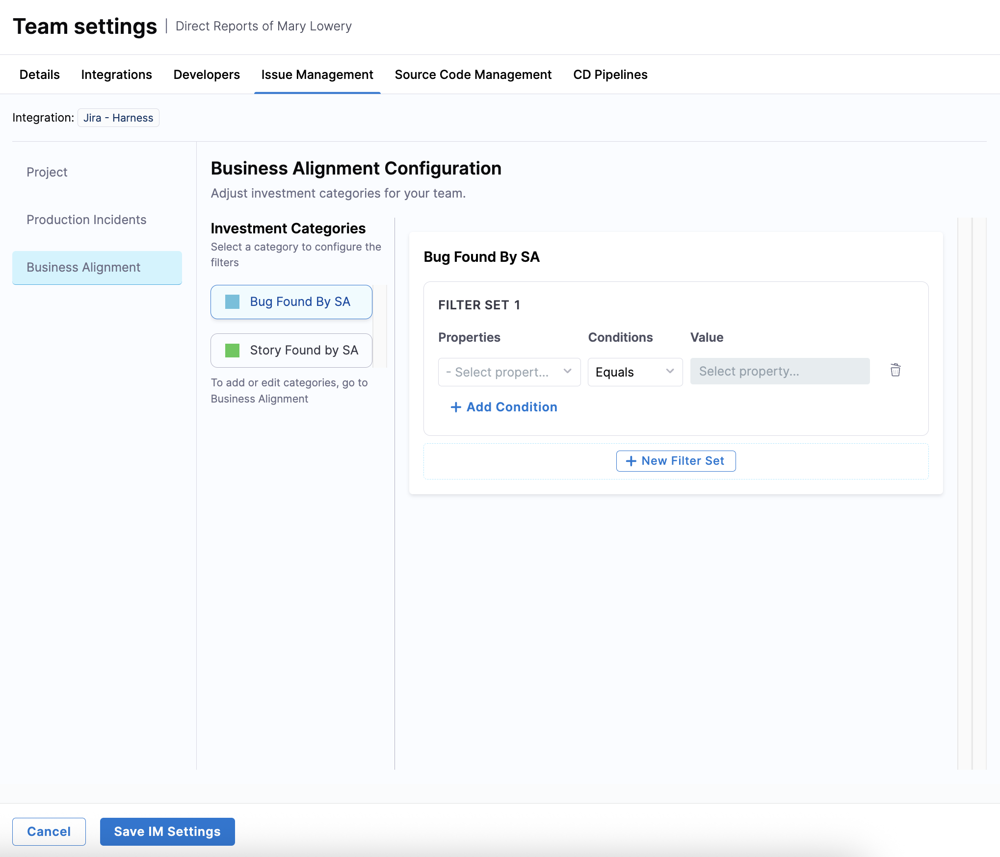
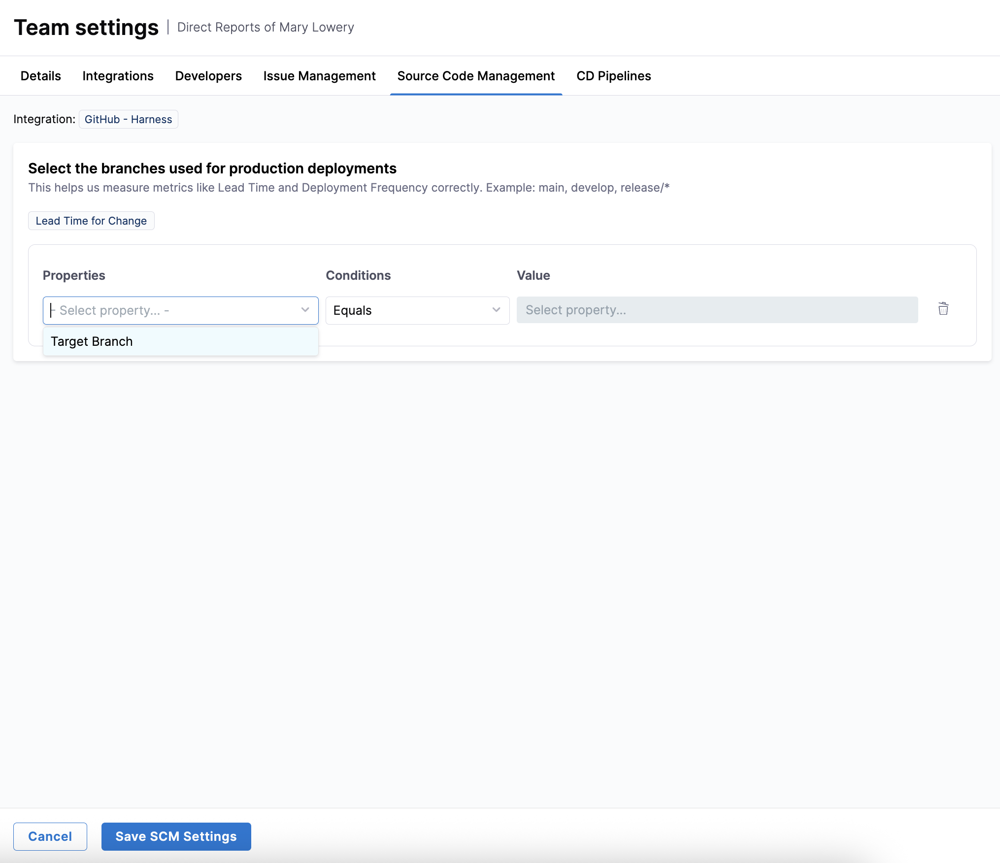
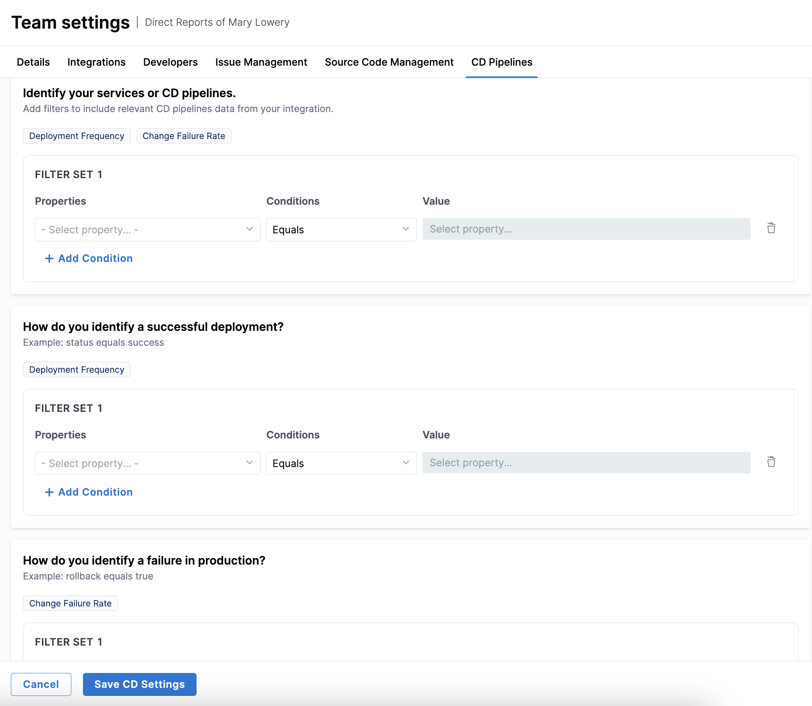

import Tabs from '@theme/Tabs';
import TabItem from '@theme/TabItem';

## Overview

Once you've set up integrations, created profiles, uploaded your developer records, and created an Org Tree, you can view  high-level insights on [Efficiency](../../analytics-and-reporting/efficiency), [Productivity](../../analytics-and-reporting/productivity), and [Business Alignment](../../analytics-and-reporting/business-alignment). To get more granular insights, drill down into specific [teams](../setup-teams) within an [Org Tree](../setup-org-tree) and apply team-specific settings.

## Viewing insights for a specific team after applying team settings

To view insights for a specific team after applying team settings:

1. From the left-hand navigation pane, click **Insights**.
1. In the left-hand panel, expand the Org Tree you want to view insights for.
   
   

1. Click on a specific team and click **View Breakdown**.

   

1. Configure [Team Settings](../setup-teams) (if not already done) by navigating to **Teams** in the left-hand navigation or clicking on the **Team Settings** icon next in an Org Tree.

   

     <Tabs queryString="config-tab">
     <TabItem value="team" label="Details">
     
     Edit the team name on the **Details** tab and click **Save Team Details**.

     

     </TabItem>
     <TabItem value="integrations" label="Integrations">
     
     Select available integrations for this team on the **Integrations** tab and click **Save Integrations**.

     

     </TabItem>

     <TabItem value="issues" label="Issue Management">
     
     Create a filter set by adding conditions to define criteria for your team's issue management system on the **Projects** tab.

     

     Create a filter set to track production failures and incidents on the **Product Incidents** tab.

     

     Create a filter set to define investment categories on the **Business Alignment** tab. 
     
     
     
     Once you've configured these filter sets, click **Save IM Settings**.

     </TabItem>

     <TabItem value="scm" label="Source Code Management">
     
     Create a filter set to define the branches used for production deployments (for example, `main`, `develop`, or `release`) on the **Source Code Management** tab.

     
     
     Once you've set the target branch, click **Save SCM Settings**.
     
     </TabItem>

     <TabItem value="cd" label="CD Pipelines">
     
     Create filter sets to include relevant pipelines or services, define successful deployments (for example, `Status Equals Success`), and identify production failures (for example, `Rollback Equals True`) on the **CD Pipelines** tab.

     
     
     Once you've configured these filter sets, click **Save CD Settings**.

     </TabItem>
     </Tabs>

After applying team settings, the Insights page will refresh to show data for the selected team, reflecting your configurations. You can then explore that team's DORA metrics.

For more information on sharing insights surfaced by Harness SEI, see [Exporting SEI 2.0 Insights](../../analytics-and-reporting/export).