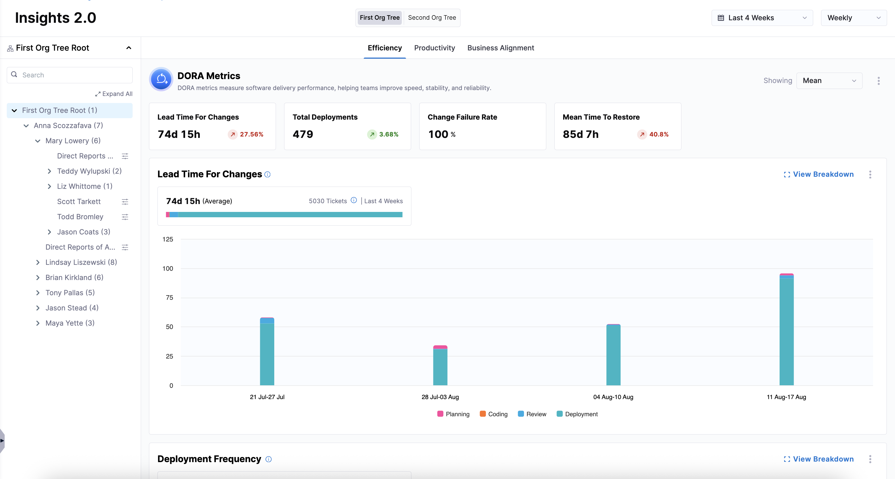
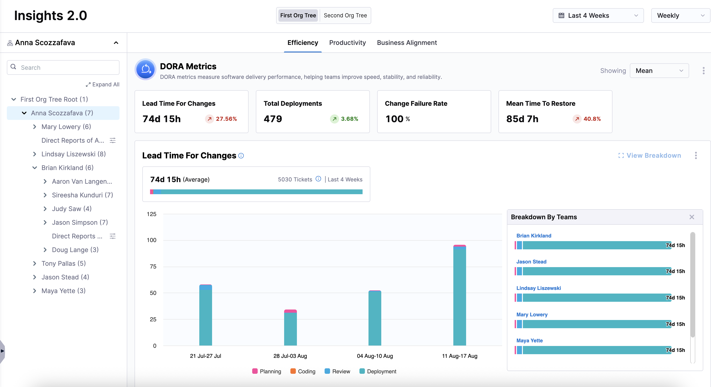
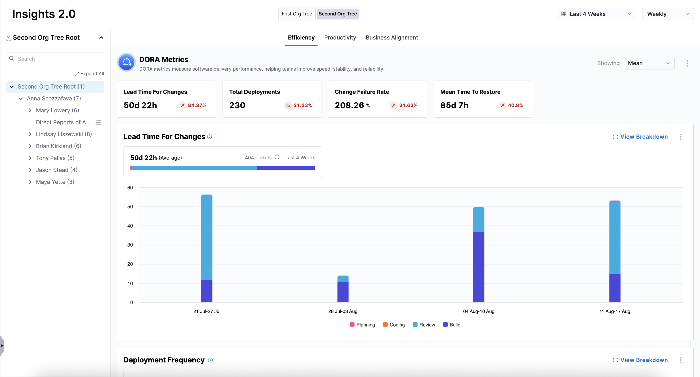

## Overview

Once you've set up integrations, created profiles, uploaded your developer records, and created an [Org Tree](../setup-org-tree), you can view high-level insights such as [Efficiency](../../analytics-and-reporting/efficiency), [Productivity](../../analytics-and-reporting/productivity), and [Business Alignment](../../analytics-and-reporting/business-alignment) for the entire organization.

## Viewing insights at the organization tree level

To view insights at the organization tree level:

1. From the left-hand navigation pane, click **Insights**.
1. From the dropdown menu, select the Org Tree you want to view insights for.
   
   

1. Review the DORA metrics displayed, such as `Lead Time for Changes`, `Deployment Frequency`, `Change Failure Rate`, and `Mean Time to Restore`.

You can interact with the graphs to see breakdowns by stages (`Planning`, `Coding`, `Review`, `Build`, or `Deployment`) or by team.

If your organization uses multiple Org Trees, you can switch between them to view insights by selecting a different Org Tree above the **Efficiency**, **Productivity**, and **Business Alignment** tabs.

For more information on sharing insights surfaced by Harness SEI, see [Exporting SEI 2.0 Insights](../../analytics-and-reporting/export).