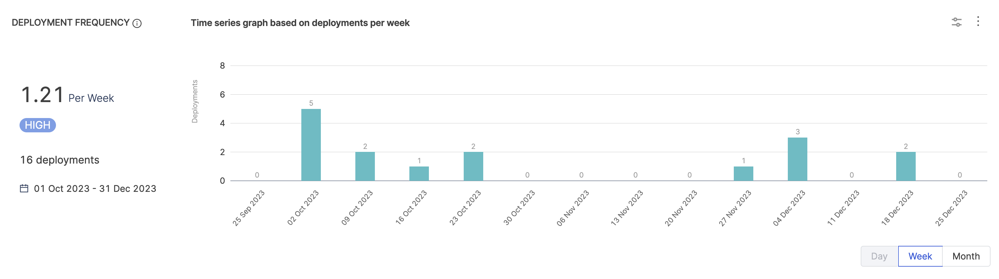
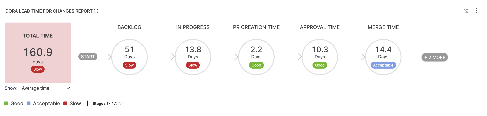
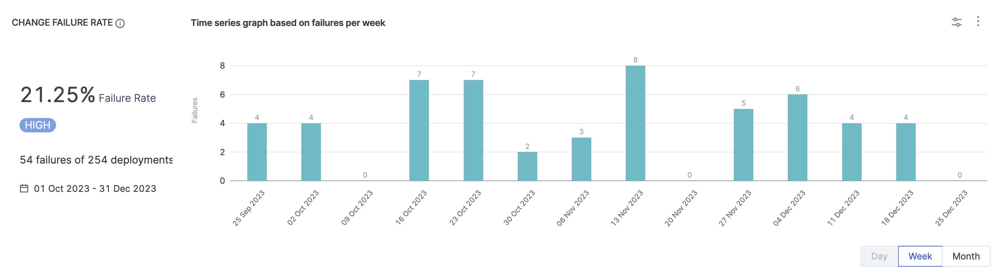
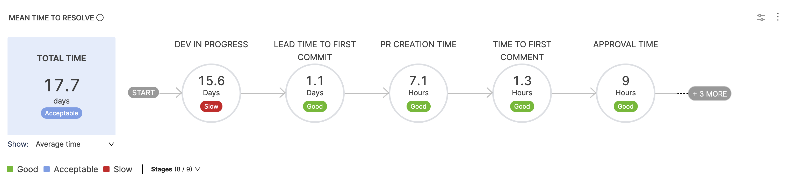

<DocsTag  backgroundColor= "#cbe2f9" text="Tutorial"  textColor="#0b5cad"  />

This tutorial will walk you through the process of setting up a DORA metrics Insight on Harness SEI. To get started, please ensure that you have a DORA profile configured and associated with your Collection. If you haven't done so already, please set up your DORA profile before proceeding.

In this tutorial, we will cover two key topics:

* **Configuring the DORA Profile definition:** We will show you how to set up a DORA profile definition using integrations with Jira, GitHub, and Harness NG.
* **Creating a DORA Insight:** We will demonstrate how to create a DORA insight using a combination of available DORA metrics reports.

## Prerequisites

* Ensure that Harness SEI is enabled for your Account.
* Complete setting up your [Projects and Collection](/docs/software-engineering-insights/get-started/sei-onboarding-guide)
* Setup and configure the Integrations for your Issue Management Platform, Source Code Manager and Deployment Manager.
* DORA Profile (DORA type Workflow Profile)

:::info
If you're using ServiceNow or PagerDuty as your incident management platform, you can configure the integration for it to measure the DORA MTTR metric.
:::

## DORA Profile

The DORA metrics - Lead Time for Changes, Deployment Frequency, Mean Time to Restore, and Change Failure Rate - are calculated based on the software delivery process defined in your DORA profile. This profile serves as the single source of truth for your DORA metrics calculations, allowing you to adjust thresholds and definitions for each metric to suit your organization's needs.

To edit an existing DORA profile or create a new one, follow the step-by-step guide for configuring a [DORA type Workflow Profile](/docs/software-engineering-insights/sei-profiles/workflow-profile#dora-profile).

:::info
To calculate the DORA Metrics, this profile must be associated with the collection under which your DORA Insight is configured.
:::

## DORA Profile Configuration

In this section, we will walk you through the process of configuring your DORA profile. Please note that this is an example configuration, and the actual implementation may vary based on your organization's software delivery process.

### Lead Time for Changes

The Lead Time for Changes defines the settings for measuring the DORA Lead Time metric, which represents the amount of time it takes for a task to get into production.

#### Step 1: Select the Tool

Which tool do you use to track tasks in your team? Note that a task could be a new feature, story, epic, etc. The Lead Time metric is expected to map the time from which a task/ticket was created in the Issue Management System until the time it was actually deployed into production.

For this example, select Jira as the tool.

#### Step 2: Configure Stages

In the Stages configuration, you essentially select the Starting event that will trigger the Lead Time calculation. This can be configured as ticket created, commit created, or any other API event. For this example, we will set this as Ticket Created, considering we are trying to map the exact lead time without missing any stages.

Next, add the stages and replicate your software delivery process for measuring lead time.

#### Ideal Lead Time Profile Workflow

A typical lead time workflow might include the following stages:

1. **Ticket Created:** This is the starting event that triggers the lead time calculation.
2. **To-Do Stage:** The task is moved to the To-Do status, indicating that it's ready for development.
3. **In-Progress Stage:** The task is moved to the In-Progress status, indicating that development has started.
4. **SCM Stages:** The task goes through various SCM stages, such as:
   1. **First Commit:** The first commit is made to the code repository.
   2. **PR Creation:** A pull request is created to review the code changes.
   3. **First Comment on PR:** The first comment is made on the pull request.
   4. **PR Approval:** The pull request is approved, indicating that the code changes are ready for merge.
   5. **PR Merge:** Indicated that the pull request is merged.
5. **CI Build Stage:** The code changes are built and the artifact is generated as part of the continuous integration (CI) process.
6. **CD Stage:** The built artifact is deployed to production as part of the continuous deployment (CD) process.

Keep in mind that this is just a typical example, and you may need to customize your lead time profile to fit your specific software delivery process. You can add or remove stages as needed to ensure that you're accurately measuring the lead time for changes.

For more information on configuring stages for the lead time workflow, refer to the DORA profile configuration documentation. This will provide you with detailed instructions and guidance on setting up your lead time profile.

## Create the Insight

1. Log in to the **Harness Platform** and go to the SEI module.
2. Go the **Project** scope and select your **Project**.
3. If you don't have any existing Insight, then click on the **Create Insight** button on the landing page to create a new Insight.

4. If you already have existing Insights in your selected Project, then go to any Insight. For instructions, go to [View Insights](#view-insights).
5. In the header, select **All Insights**, and then select **Manage Insights**.
6. Select **Create Insight**.

### Insight settings

1. Enter a **Name** for the Insight.
2. Select at least one **Collection category** to associate with this Insight.
3. Select **Create** to save the Insight metadata. From here, you can add reports to this Insight.

## Add DORA metrics reports

You can use a DORA Metrics Insight to examine your organization's DORA metrics. This helps you understand how your organization or team is performing and helps you get an overview of daily, weekly, and monthly trends.

### Deployment Frequency reports

Include **DORA metrics reports** to understand how well your team is doing. The **Deployment Frequency report** tells you how often your team successfully releases software.

To keep track of Deployment Frequency, set up a [Workflow profile](/docs/software-engineering-insights/sei-profiles/workflow-profile). This helps you pick what to monitor like merged pull requests or CI/CD jobs for the associated Collections. You can adjust Workflow profiles to fit your team's way of working, focusing on specific steps like Source Code Management (SCM) or a combination of issue management, SCM, and CI/CD. For more information, go to Workflow profile.

To add the **Deployment Frequency** widget to Insights:

1. Select **Settings**, and then select **Add Widget**.
2. Select the **Deployment Frequency** widget.
3. Adjust the widget settings as needed.

:::info
Modifying the collection filters in the widget settings will direct you to the Edit Collection tab. Changes made here will impact the entire collection, not just the widget.
:::

4. Select **Next: Place Widget**, place the widget on the Insight, and then select **Save Layout**.

The widget automatically detects the relevant Workflow profile based on the Collections associated with the Insight.

### Lead Time For Changes report

DORA calculation for Lead Time is similar to how lead time, in general, is calculated, with the difference being the ability to associate a collection while defining the profile, i.e., at the profile level.

This report represents the amount of time it takes for a commit to get into production.

To add the **Lead Time for Changes** widget to Insights:

1. Select **Settings**, and then select **Add Widget**.
2. Select the **Lead Time for Changes** widget.
3. Configure filters to refine conditions (e.g., `Issue Resolved In` for the last quarter) impacting overall lead time calculations.
4. Select **Average Time in the Stage** as the metric under the metrics tab.
5. Under the **Settings** tab, specify the relevant **Workflow profile**.
6. Select **Next: Place Widget**, place the widget on the Insight and then select **Save Layout**.

For information about other Lead Time reports, go to [Lead time reports](/docs/software-engineering-insights/sei-metrics-and-reports/velocity-metrics-reports/lead-time-reports).

### Change Failure Rate report

Change Failure Rate represents the percentage of deployments that cause a failure in production.
To monitor Change Failure Rate in SEI, you will again need to associate the widget with an existing workflow profile.

To add the **Change Failure Rate** Report widget to Insights:

1. Select **Settings**, and then select **Add Widget**.
2. Select the **Change Failure Rate** widget.
3. Configure the widget settings. Similar to the Deployment Frequency report customizing the **Collection-level Filters** redirects you to the **Edit Collection tab**.
4. Select **Next: Place Widget**, select where you want to place the widget on the Insight, and then select **Save Layout**.

The Change Failure Rate widget is now part of your Insight.

### Mean Time To Restore (MTTR) Report

The Mean Time To Restore (MTTR), also known as Time to Recover, represents the duration it takes for an organization to recover from a production failure. This metric serves as a valuable measure for evaluating the efficiency of the recovery process.

The overall time can be analyzed stage by stage over the organization's failure recovery workflow.

To add the **DORA Mean Time To Restore** report to the Insight:

1. Select **Settings**, and then select **Add Widget**.
2. Select the **Mean Time To Restore** widget.
3. Customize the widget by configuring **Filters**. This step allows you to specify conditions (such as `Issue Created In`/`Resolved In`) that contribute to the overall calculations. In this case, we will add the `Issue Resolved In` filter to restrict our calculation only for the last quarter.
4. Select the metric as `Average Time in Stage` under the **Metrics** tab
5. On the **Settings** tab, select the relevant [Workflow profile](/docs/software-engineering-insights/sei-profiles/workflow-profile).
6. Select **Next: Place Widget**, place the widget on the Insight, and then select **Save Layout**.

## Best Practices

* Ensure that the selected DORA metrics align with your organization's overarching business goals and objectives.
* Standardize workflow profiles across teams to maintain consistency in metric tracking.
* Define workflow profile at a granular level to capture the entire software delivery lifecycle. This includes specifying events such as the exclusion of PRs and commits, events defining what constitutes a deployment or a failure for CI/CD jobs, and other crucial items to provide a comprehensive view of the deployment process.
* Customize collection filters within widgets carefully. These filters impact not only the widget but the collection as a whole. Optimize filters to focus on the specific aspects of your software development process that you want to analyze.
