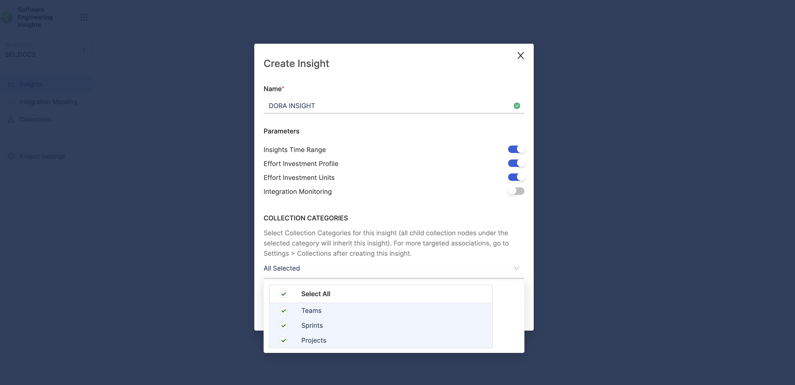
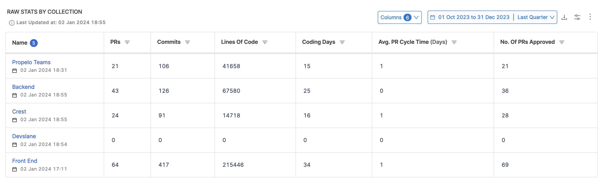

Trellis Scores are a proprietary scoring mechanism from SEI that help you understand your team's productivity. Trellis Scores are calculated from factors such as code quality, code volume, speed, impact, proficiency, and collaboration. You can adjust the weight given to each factor, allowing for tailored assessments based on individual profiles.

This tutorial explains how to create a Trellis Insight with all the supported report configurations to measure Trellis Scores for your engineering team.

## Prerequisites

* Ensure that Harness SEI is enabled for your Account.
* Complete setting up your [Projects and Collection](/docs/software-engineering-insights/get-started/sei-onboarding-guide)
* Setup and configure the Integrations for your Issue Management tool, Source Code Manager and Deployment Manager.
* Trellis Profile on Harness SEI

## Trellis Profile Overview

Trellis Scores are calculated from factors such as code quality, code volume, speed, impact, proficiency, and collaboration. You can adjust the weight given to each factor in the associated Trellis Profile which acts as the single source of truth for your Trellis Score calculations.

To create or edit a **Trellis profile**:

* In your **Harness project**, go to the **SEI** module.
* Select **Account**.
* Select **Trellis** under **Profiles**.
* To create a profile, select **+New Trellis Profile**. To edit an existing profile, select the profile's name in the profiles list.

:::info
To calculate the Trellis Score, this profile must be associated with the collection under which your Trellis Insight is configured.
:::

To learn more about customizing an existing trellis profile or creating a new profile, go to [Trellis Profile](/docs/software-engineering-insights/sei-profiles/trellis-profile).

## Set up your project, integration and collection

Begin by creating a project and collection.

1. In the sidebar of the Harness application, select the **SEI module** from the module selection.
2. Select **Projects** and choose an existing project or create a new one. For information about creating a project, go to [Create organizations and projects](/docs/platform/organizations-and-projects/projects-and-organizations).

:::info
A user can create multiple projects and be part of multiple projects.
:::

Once your project is created, you can set up and map integrations as an admin and set up the collection hierarchy.

## Integration Mapping

**Integration Mapping** is the process of associating available or new integrations with your current project. As an admin, you can set up and map integrations in your project. For more information, go to [Integrations](/docs/software-engineering-insights/sei-integrations/sei-integrations-overview).

1. Go to the **Integration Mapping** tab within the SEI module.
2. Click **Map Integrations** and select existing integrations or create new ones as needed.
3. Ensure you associate the integrations with your current project.
4. Now for configuring a DORA Metrics insight, you'll need to map the [Jira integration (Issue Management Tool)](/docs/software-engineering-insights/sei-integrations/jira/sei-jira-integration), [Github integration (Source Code Manager)](/docs/software-engineering-insights/sei-integrations/github/sei-github-integration), [Harness NG integration (CI/CD Platform)](/docs/software-engineering-insights/sei-integrations/harness-cicd/sei-integration-harnesscicd).

:::info
You can also use [Azure DevOps integration](/docs/software-engineering-insights/sei-integrations/azure-devops/sei-integration-azure-devops) as the Issue Management tool.
:::

You can also create new integrations and associate the integration with the current project by mapping them.

* To create a new Jira integration, go to [Jira integration](/docs/software-engineering-insights/sei-integrations/jira/sei-jira-integration).
* To create a new GitHub integration, go to [GitHub integration](/docs/software-engineering-insights/sei-integrations/github/sei-github-integration).
* To create a new Harness NG integration, go to [Harness NG integration](/docs/software-engineering-insights/sei-integrations/harness-cicd/sei-integration-harnesscicd).

## Create the Insight

1. Log in to the **Harness Platform** and go to the SEI module.
2. Go the **Project** scope and select your **Project**.
3. If you don't have any existing Insight, then click on the **Create Insight** button on the landing page to create a new Insight.

4. If you already have existing Insights in your selected Project, then go to any Insight. For instructions, go to [View Insights](#view-insights).
5. In the header, select **All Insights**, and then select **Manage Insights**.
6. Select **Create Insight**.

### Insight settings

1. Enter a **Name** for the Insight.
2. Select at least one **Collection category** to associate with this Insight.
3. Select **Create** to save the Insight metadata. From here, you can add reports to this Insight.

## Add Trellis reports

You can use these widgets in your Insights to analyze Trellis Scores.

### Trellis Score Report

The Trellis Score Report calculates and displays the Trellis Scores by individual developers. The trellis score can be further divided into the following categories:

* **Quality:** Quality is defined by two metrics: Percentage of rework and percentage of legacy rework.
* **Impact:** Impact is defined by two metrics: High-impact bugs worked on per month and high-impact stories worked on per month. Impact refers to the ticket's perceived significance or priority.
* **Volume:** Volume measures the quantity of code that the developer is working on.
* **Speed:** Speed measures the pace at which developers are writing and submitting code.
* **Proficiency:** Proficiency measures how many projects are currently being worked on. It is based on two metrics: Technical breadth and repo breadth.
* **Leadership and Collaboration:** Leadership and collaboration measures developer teamwork and contribution to peer reviews.

The factors and weight associated with the Trellis Score are essentially defined at the profile level. To learn more, go to [Trellis Profile](/docs/software-engineering-insights/sei-profiles/trellis-profile).

To add the **Trellis Score Report** widget to Insights:

1. Select **Settings**, and then select **Add Widget**.
2. Select the **Trellis Score Report** widget.
3. Under the **Filters** tab add the **Interval** for which you want to calculate the Trellis Score. For this tutorial we'll set this as `Last Quarter`.
4. Select **Next: Place Widget**, place the widget on the Insight, and then select **Save Layout**. For information, go to [Trellis Scores](/docs/category/trellis-scores).

### Trellis Scores by Collection

This report calculates and displays the Trellis Scores organized by Collection.

The factors and associated metrics used while calculating the values are identical to how the Trellis Score is calculated in general with the differentiation on calculating the score for each collection i.e. average of the Trellis score calculated for all users that are part of the collection.

To add the **Trellis Scores by Collection Report** widget to Insights:

1. Select **Settings**, and then select **Add Widget**.
2. Select the **Trellis Scores by Collection** widget.
3. Under the **Filters** tab add the **Interval** for which you want to calculate the Trellis Score. For this tutorial, we'll set this as the `Last Quarter`.

:::info
You can choose to display the scores of the immediate child Collections only.
:::

4. Select **Next: Place Widget**, place the widget on the Insight and then select **Save Layout**. For information, go to [Trellis Scores](/docs/category/trellis-scores).

### Individual Raw Stats

This report displays a table of base values that contribute to Trellis Scores at the contributor level i.e. it calculates and displays the breakdown of the Trellis Scores by individual developers. You can edit the widget to show different values (add/remove columns) or apply filtering.

To add the **Individual Raw Stats Report** widget to Insights:

1. Select **Settings**, and then select **Add Widget**.
2. Select the **Individual Raw Stats** widget.
3. Under the **Filters** tab add the **Interval** for which you want to calculate the Trellis Score. For this tutorial, we'll set this as the `Last Quarter`.
4. Select the custom user attributes if required.
5. Select **Next: Place Widget**, place the widget on the Insight and then select **Save Layout**. For information, go to [Trellis Scores](/docs/category/trellis-scores).

### Raw Stats by Collection

This report displays a table of base values that contribute to Trellis Scores at the collection level i.e. it calculates and displays the breakdown of the Trellis Scores (Base values) organized by Collection. You can edit the widget to show different values (add/remove columns) or apply filtering.

To add the **Raw Stats by Collection Report** widget to Insights:

1. Select **Settings**, and then select **Add Widget**.
2. Select the **Raw Stats by Collection** widget.
3. Under the **Filters** tab add the **Interval** for which you want to calculate the Trellis Score. For this tutorial, we'll set this as the `Last Quarter`.
4. Select **Next: Place Widget**, place the widget on the Insight and then select **Save Layout**. For information, go to [Trellis Scores](/docs/category/trellis-scores).

## Best Practices

* Standardize Trellis profiles across teams to maintain consistency in metric tracking.
* Regularly review and update your Trellis Profile based on changing priorities and evolving organizational goals.
* Choose an interval duration wisely; shorter intervals might provide higher granularity but could lead to noise due to fluctuating results.

By applying these best practices, you can derive meaningful insights from Trellis Scores and make better-informed decisions concerning resource allocation, skill enhancement, and strategic planning.
